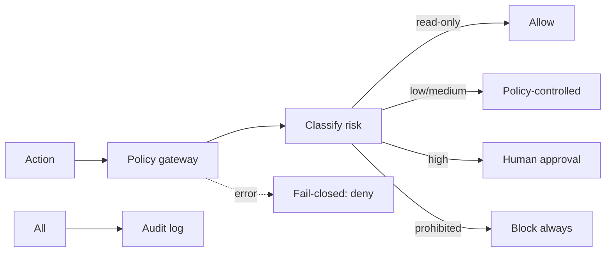
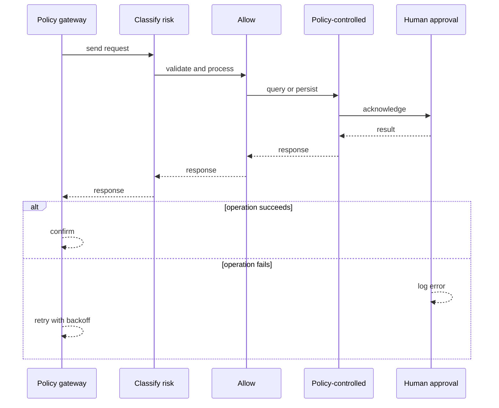
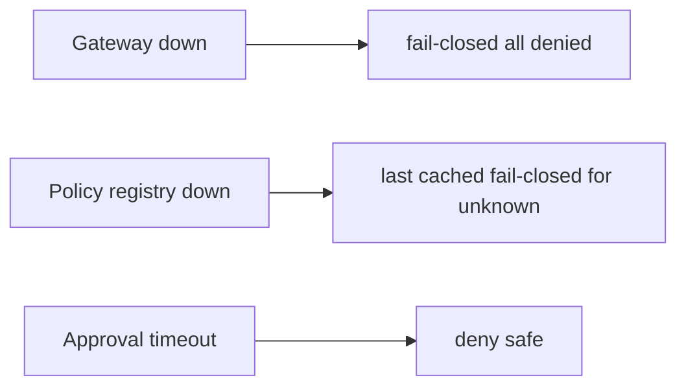
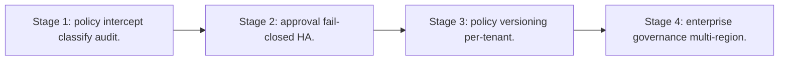

# Case Study: AI Safety and Policy Gateway

> **Tier:** ai-systems · **Status:** complete · Original numbers and diagrams.

## 1. Problem statement
A centralized policy gateway that intercepts every AI action, enforces safety policies (no auto-high-risk, no PII to unapproved models, no secrets), routes high-risk to human approval, and is fail-closed. This is a ai-systems-tier system design challenge because it must handle high availability under peak load while ensuring no single point of failure. The design must be production-grade: observable, debuggable, reversible, and able to survive component failures without data loss or cascading outages.

## 2. Scope
In: policy registry, action interceptor, risk-tier classification, approval workflow, audit, fail-closed. Out: policy authoring UI.

For AI Safety and Policy Gateway, these boundaries keep the first version focused on the core user value. Adding more features would dilute the design and delay shipping. Each excluded item is a scaling stage — a candidate for the next iteration once the baseline is proven.

## 3. Functional requirements
- Intercept every AI action before execution.
- Classify risk (read-only, low, medium, high, prohibited).
- Allow read-only automatically.
- Route high-risk to human approval.
- Block prohibited actions.
- Audit everything.
- Fail-closed on any error.

For AI Safety and Policy Gateway, these requirements drive specific architectural decisions: the read-write ratio determines the caching strategy, the durability target sets the replication mode, and the idempotency requirement shapes the API contract.

## 4. Non-functional requirements
- Policy decision < 10 ms.
- Never allow prohibited.
- Availability 99.95 percent (fail-closed if down).

For AI Safety and Policy Gateway, each non-functional target constrains a specific component: the latency SLO bounds the number of synchronous hops, the availability target forces redundancy across availability zones, and the cost ceiling limits the replication factor and storage tier.

## 5. Explicit assumptions
1. 10k actions/s. 2. 80 percent read-only, 15 percent low/medium, 5 percent high-risk. 3. High-risk approval < 5 min.

For AI Safety and Policy Gateway, if these assumptions are off by an order of magnitude, the architecture must adapt: 10x traffic may require earlier sharding, a different read-write ratio changes the caching strategy, and a higher peak multiplier demands more headroom.

## 6. Traffic estimation
10k actions/s; policy evaluation fast (in-memory rules).

To derive the request rate: divide the daily volume by 86,400 seconds to get the average rate, then multiply by 5-10x for peak. The read-to-write ratio determines whether the system is cache-dominated (read-heavy) or write-path-dominated (write-heavy). For AI Safety and Policy Gateway, this ratio shapes the entire storage and replication strategy.

## 7. Storage estimation
Policies + audit + approvals; small, tamper-evident.

For AI Safety and Policy Gateway, storage growth is projected from the daily write volume and retention policy. Index overhead and compression factors are accounted for in the total.

## 8. Bandwidth estimation
Action metadata small; gateway adds minimal latency.

Bandwidth is request rate multiplied by average payload size for ingress, and response rate multiplied by response size for egress. CDN and edge caching reduce origin egress. Compression reduces bandwidth by 50-80 percent where applicable. For AI Safety and Policy Gateway, bandwidth may or may not be the binding constraint — compare it against compute and storage to find out.

## 9. API design

POST /evaluate (action, context, user) -> allow/pending/deny; POST /approve (action_id, approver) -> approved/denied.

## 10. Data model
policies(id, rule, risk_level, action_patterns); actions(id, user, action, risk, status, ts); approvals(id, action, approver, decision, ts).

For AI Safety and Policy Gateway, the data model follows the access pattern. The primary lookup determines the partition key; secondary lookups determine indexes. Denormalization is used selectively on hot read paths.

## 11. High-level architecture

## 12. Request flow
AI action -> gateway intercepts -> classify risk -> read-only: allow; low/medium: policy-controlled; high: human approval; prohibited: block always -> on error: fail-closed (deny all) -> audit everything.

## 13. Component responsibilities
Policy registry, action interceptor, risk classifier, approval workflow, audit logger, fail-closed handler.

For AI Safety and Policy Gateway, each component has one job. The gateway authenticates and routes. Services are stateless and scale horizontally. The data tier is the stateful core that scales by sharding.

## 14. Database selection
Policy registry (KV, hot-reloaded); actions (append-only); approvals (relational, audited).

For AI Safety and Policy Gateway, the database was chosen by access pattern, not familiarity. The rejected alternatives were wrong for this workload, not bad in general.

## 15. Caching strategy
Policy rules cached in-memory; action decisions cached; approval status cached.

For AI Safety and Policy Gateway, the cache strategy matches the staleness tolerance. Cache-aside for most data, write-through where read-after-write matters, stampede protection on hot keys.

## 16. Partitioning strategy
Actions by tenant; policies global; approvals by status.

For AI Safety and Policy Gateway, the partition key balances query locality with even load distribution. Sharding strategy matters because a poor key creates hot spots under real traffic patterns.

## 17. Replication strategy
Policy registry RF=3; actions append-only; gateway stateless + HA; approvals RF=3.

For AI Safety and Policy Gateway, replication mode is split: synchronous where durability is critical, asynchronous elsewhere for throughput. RF=3 tolerates one failure. Failover is tested regularly.

## 18. Consistency model
Policies strongly consistent (hot-reloaded); actions append-only; approvals strongly consistent.

For AI Safety and Policy Gateway, the consistency level is the weakest users accept. Read-your-writes is provided where needed. Eventual consistency is bounded and monitored, not unbounded and silent.

## 19. Failure scenarios
Gateway down -> fail-closed (all denied). Policy registry down -> last cached (fail-closed for unknown). Approval timeout -> deny (safe).

## 20. Reliability strategy
SLI decision latency, zero-prohibited-allowed; SLO 99.95 percent. Fail-closed on any error.

For AI Safety and Policy Gateway, the SLO makes reliability measurable. The error budget balances feature velocity with stability. Chaos testing validates that resilience claims hold under real failures.

## 21. Security considerations

This IS security. Key policies: never expose passwords/keys, never auto-execute high-risk, never disable firewalls, never modify routing without approval, never send confidential to unapproved models, never upgrade outside maintenance windows.

## 22. Observability strategy
Action rate by risk tier, approval rate, denial rate, prohibited attempts (0), gateway latency, fail-closed events.

For AI Safety and Policy Gateway, observability combines logs, metrics, and traces with correlation IDs. Golden signals drive the first dashboard. Alerts fire on burn rate, not raw thresholds.

## 23. Cost considerations
Gateway cheap (stateless, in-memory rules); value is preventing unsafe actions. Approval workflow is human time.

For AI Safety and Policy Gateway, cost is driven by the binding resource. Caching, tiering, batching, and right-sizing are the levers. Cost per request is tracked and alerted on.

## 24. Scaling stages
Stage 1: policy + intercept + classify + audit. -> Stage 2: approval + fail-closed + HA. -> Stage 3: policy versioning + per-tenant. -> Stage 4: enterprise governance + multi-region.

## 25. Trade-offs
Fail-closed (safe, blocks on error) vs fail-open (available, risky). Strict (safe) vs friction (slow). Centralized (consistent) vs decentralized (fast).

For AI Safety and Policy Gateway, each trade-off lists what was chosen, what was rejected, and why. This makes the design defensible in review — every decision has documented reasoning.

## 26. Alternative designs
No gateway (unguarded). Fail-open (unsafe on error). Per-agent policies (inconsistent). No audit (no accountability).

For AI Safety and Policy Gateway, the alternatives are real architectures that work under different constraints. They were rejected for this workload's specific requirements, not because they are bad designs.

## 27. Interview discussion points
Clarify risk tiers, approval workflow, fail-closed behavior, audit. Surface classification, approval, fail-closed, audit, no-prohibited principle.

For AI Safety and Policy Gateway in an interview: clarify scope first, surface the read-write ratio, design the hot path deeply, discuss failures, and offer an alternative. Weak candidates skip failure modes.

## 28. Original Mermaid diagrams
Standalone sources under `diagrams/case-studies/ai-safety-policy-gateway/`: `context.mmd`, `request-sequence.mmd`, `failure-flow.mmd`, `scaling-evolution.mmd`. The diagrams are embedded in their respective sections: architecture in section 11, request flow in section 12, failure scenarios in section 19, and scaling stages in section 24.

## 29. Further reading
AI security: docs/ai-systems/09-ai-security; templates/ai/ai-threat-model.md; templates/network/network-ai-security-review.md. Sources: `S-CHASH` `S-DYNAMO`.

## 30. Practical exercises

1. Define 5 risk tiers with examples. 2. Fail-closed design. 3. Approval workflow with timeout. 4. Policy hot-reload. 5. Audit replay.

---
Previous: Prompt management · Next: Enterprise agent platform

