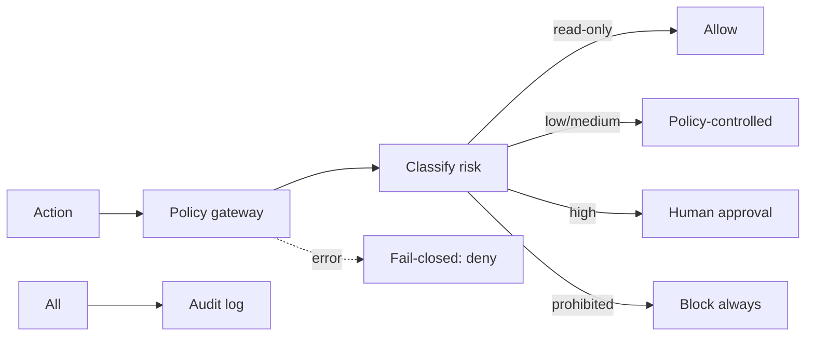
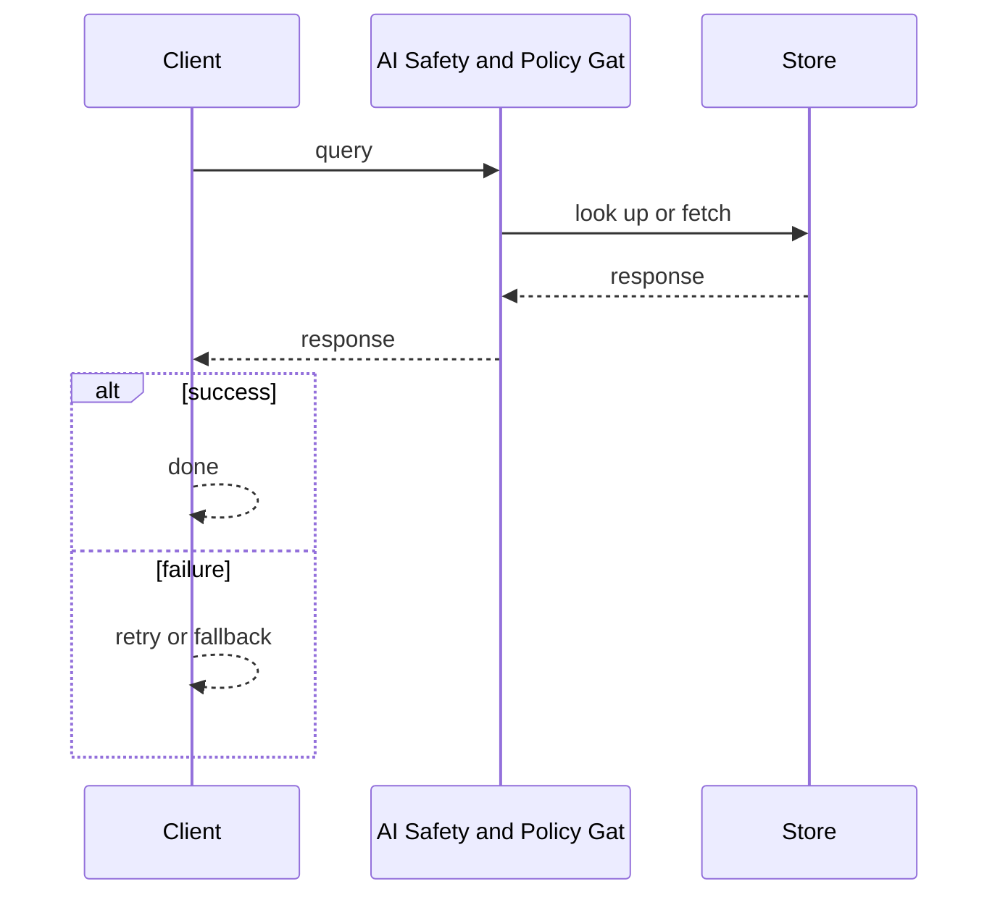
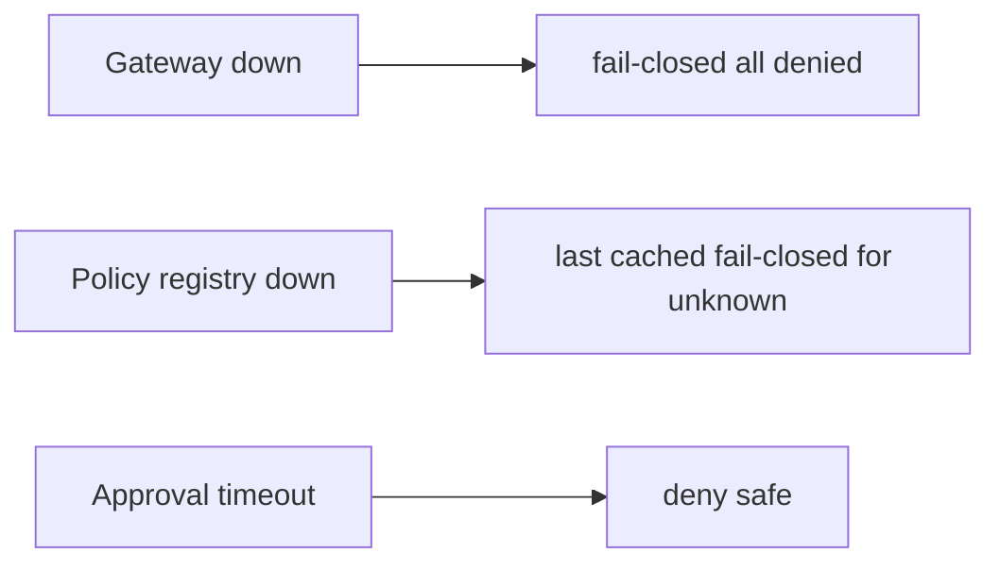

# Case Study: AI Safety and Policy Gateway

> **Tier:** ai-systems · **Status:** complete · Original numbers and diagrams.

## 11. High-level architecture

## 28. Original Mermaid diagrams

Standalone sources under `diagrams/case-studies/ai-safety-policy-gateway/`: `context.mmd`, `request-sequence.mmd`, `failure-flow.mmd`, `scaling-evolution.mmd`. Request sequence and failure flow:

## 1. Problem statement

A centralized policy gateway that intercepts every AI action, enforces safety policies (no auto-high-risk, no PII to unapproved models, no secrets), routes high-risk to human approval, and is fail-closed.

This system sits at the intersection of distributed systems and operational reliability. The design must balance latency versus durability while ensuring no single component failure cascades. The target audience includes engineers and operators, so the design must be observable, debuggable, and reversible.
## 2. Scope

In: policy registry, action interceptor, risk-tier classification, approval workflow, audit, fail-closed. Out: policy authoring UI.

The scope boundary is deliberate: including too much in v1 risks a system that is broad but shallow. Each excluded feature is a candidate for a later iteration once the core loop is proven.
## 3. Functional requirements

- Intercept every AI action before execution. - Classify risk (read-only, low, medium, high, prohibited). - Allow read-only automatically. - Route high-risk to human approval. - Block prohibited actions. - Audit everything. - Fail-closed on any error.

These requirements drive the architecture: the read-heavy pattern pushes toward caching; the durability requirement forces synchronous writes; the idempotency requirement means every write path handles redelivery without double-application.
## 4. Non-functional requirements

- Policy decision < 10 ms. - Never allow prohibited. - Availability 99.95 percent (fail-closed if down).

The non-functional targets shape every component choice: the latency SLO forces edge caching and limits synchronous cross-region calls; the availability target drives redundancy (RF=3, multi-AZ); the cost target constrains the model size.
## 5. Explicit assumptions

1. 10k actions/s. 2. 80 percent read-only, 15 percent low/medium, 5 percent high-risk. 3. High-risk approval < 5 min.

These assumptions are the load-bearing facts of the design. If any is wrong by an order of magnitude, the architecture must adapt: 10x more traffic may require sharding earlier; a different read-write ratio changes the caching strategy entirely.
## 6. Traffic estimation

10k actions/s; policy evaluation fast (in-memory rules).

The traffic estimate reveals the binding constraint. Peak is modeled at 10x average. The read-write ratio determines whether the system is cache-dominated (read-heavy) or write-path-dominated (write-heavy), which changes the storage and replication strategy.
## 7. Storage estimation

Policies + audit + approvals; small, tamper-evident.

Storage growth is linear with time and must be planned with retention. The estimate includes metadata and index overhead (20-30 percent above raw). Without a retention policy, storage grows unboundedly.
## 8. Bandwidth estimation

Action metadata small; gateway adds minimal latency.

Bandwidth is often not the binding constraint but becomes significant at the edge during viral spikes. CDN and edge caching cut origin egress; compression cuts bandwidth by 50-80 percent where applicable.
## 9. API design

POST /evaluate (action, context, user) -> allow/pending/deny; POST /approve (action_id, approver) -> approved/denied.

The API follows REST for external clients and gRPC for internal calls. Every write endpoint accepts an idempotency key. Rate limiting is enforced at the gateway before the service tier.
## 10. Data model

policies(id, rule, risk_level, action_patterns); actions(id, user, action, risk, status, ts); approvals(id, action, approver, decision, ts).

The data model is designed around the access pattern, not the entity shape. The primary access path determines the partition key; secondary paths determine indexes. Denormalization is applied selectively where the hot read path would otherwise require expensive joins.
## 12. Request flow

AI action -> gateway intercepts -> classify risk -> read-only: allow; low/medium: policy-controlled; high: human approval; prohibited: block always -> on error: fail-closed (deny all) -> audit everything.

The request flow reveals the critical path: any component on the hot path that fails or slows degrades the user experience. The design applies timeouts, circuit breakers, and bulkheads to each hop. The write path includes an idempotency check before any state mutation.
## 13. Component responsibilities

Policy registry, action interceptor, risk classifier, approval workflow, audit logger, fail-closed handler.

Each component has a single, well-defined responsibility. The gateway handles auth and routing; the service tier is stateless and horizontally scalable; the data tier is the stateful core, carefully partitioned and replicated. The separation allows each tier to scale independently.
## 14. Database selection

Policy registry (KV, hot-reloaded); actions (append-only); approvals (relational, audited).

The database choice is driven by the access pattern. The rejected alternatives were rejected for specific reasons: a relational DB was rejected if the workload is a single key lookup at massive scale; a KV store was rejected if joins and transactions are needed.
## 15. Caching strategy

Policy rules cached in-memory; action decisions cached; approval status cached.

The caching strategy is designed around the staleness tolerance of the workload. Cache-aside is the default; write-through is used where read-after-write consistency is required. Stampede protection is applied to any key that can go viral. Cache entries are namespaced by tenant.
## 16. Partitioning strategy

Actions by tenant; policies global; approvals by status.

The partition key co-locates related data while distributing load evenly. Consistent hashing with virtual nodes minimizes data movement when nodes change. A hot key is mitigated by caching, extra replication, or key splitting.
## 17. Replication strategy

Policy registry RF=3; actions append-only; gateway stateless + HA; approvals RF=3.

Replication is synchronous on the write-confirmation path where durability is critical and asynchronous elsewhere. RF=3 tolerates one failure. Failover is tested, not just configured. Cross-region replication is asynchronous with a documented RPO.
## 18. Consistency model

Policies strongly consistent (hot-reloaded); actions append-only; approvals strongly consistent.

The consistency model is the weakest that users can tolerate. Read-your-writes is provided where the user expects to see their own write. Eventual consistency is bounded (seconds) and monitored. The system documents what eventual means to users.
## 19. Failure scenarios

Gateway down -> fail-closed (all denied). Policy registry down -> last cached (fail-closed for unknown). Approval timeout -> deny (safe).

Each failure scenario has a documented response: which component detects it, how failover happens, what the user experiences, and how recovery is verified. Bulkheads and circuit breakers prevent one slow dependency from cascading.
## 20. Reliability strategy

SLI decision latency, zero-prohibited-allowed; SLO 99.95 percent. Fail-closed on any error.

The SLO defines what good means measurably; the error budget is the allowed unavailability spent on deploys and feature risk. The system is tested with chaos engineering to verify resilience. An untested failover is not a failover.
## 21. Security considerations

This IS security. Key policies: never expose passwords/keys, never auto-execute high-risk, never disable firewalls, never modify routing without approval, never send confidential to unapproved models, never upgrade outside maintenance windows.

Security is defense in depth: TLS, encryption at rest, RBAC with default-deny, PII redaction in logs, audit trails, and per-tenant isolation. For AI-augmented systems, the policy gateway is fail-closed: on any error, the system refuses to act.
## 22. Observability strategy

Action rate by risk tier, approval rate, denial rate, prohibited attempts (0), gateway latency, fail-closed events.

Observability uses logs, metrics, and traces with correlation IDs. The golden signals (latency, traffic, errors, saturation) are the first dashboard. Alerts fire on SLO burn rate, not raw thresholds. The on-call runbook for each alert is tested.
## 23. Cost considerations

Gateway cheap (stateless, in-memory rules); value is preventing unsafe actions. Approval workflow is human time.

Cost is dominated by the binding resource. Primary levers: caching (cuts read cost), tiering (cuts storage cost), batching (cuts per-request overhead), and right-sizing. Cost is tracked as a first-class metric and alerted on when unit cost spikes.
## 24. Scaling stages

Stage 1: policy + intercept + classify + audit. -> Stage 2: approval + fail-closed + HA. -> Stage 3: policy versioning + per-tenant. -> Stage 4: enterprise governance + multi-region.

The scaling stages are triggered by specific thresholds, not by calendar. Each stage is a deliberate architectural change: Stage 1 handles initial load; Stage 2 when a single node saturates; Stage 3 when latency exceeds the SLO; Stage 4 when hot keys threaten the origin.
## 25. Trade-offs

Fail-closed (safe, blocks on error) vs fail-open (available, risky). Strict (safe) vs friction (slow). Centralized (consistent) vs decentralized (fast).

Every trade-off has a rejected alternative with a reason. The design does not present one option as universally correct; it presents the chosen option, the rejected alternative, and the workload-specific reason.
## 26. Alternative designs

No gateway (unguarded). Fail-open (unsafe on error). Per-agent policies (inconsistent). No audit (no accountability).

The alternative designs are genuine architectures that would work under different constraints. They were rejected for this workload because of specific requirements that make them inferior here but not universally inferior.
## 27. Interview discussion points

Clarify risk tiers, approval workflow, fail-closed behavior, audit. Surface classification, approval, fail-closed, audit, no-prohibited principle.

In an interview, the strongest candidates clarify ambiguity before designing, surface the read-write ratio and the binding resource, design the hot path deeply, discuss failure modes explicitly, and offer an alternative with a reason.
## 29. Further reading

AI security: docs/ai-systems/09-ai-security; templates/ai/ai-threat-model.md; templates/network/network-ai-security-review.md.

The further reading cites primary sources (RFCs, papers, official documentation) via stable IDs in SOURCES.md, not secondary blog posts. Each citation is chosen because it is the authoritative source for a specific technical claim.
## 30. Practical exercises

1. Define 5 risk tiers with examples. 2. Fail-closed design. 3. Approval workflow with timeout. 4. Policy hot-reload. 5. Audit replay.

---
Previous: Prompt management · Next: Enterprise agent platform

The exercises push the reader beyond v1: re-estimating at 10x reveals capacity limits; adding a new requirement forces an architectural change; designing the failover test reveals whether resilience claims are real.
