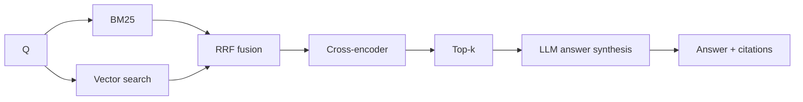
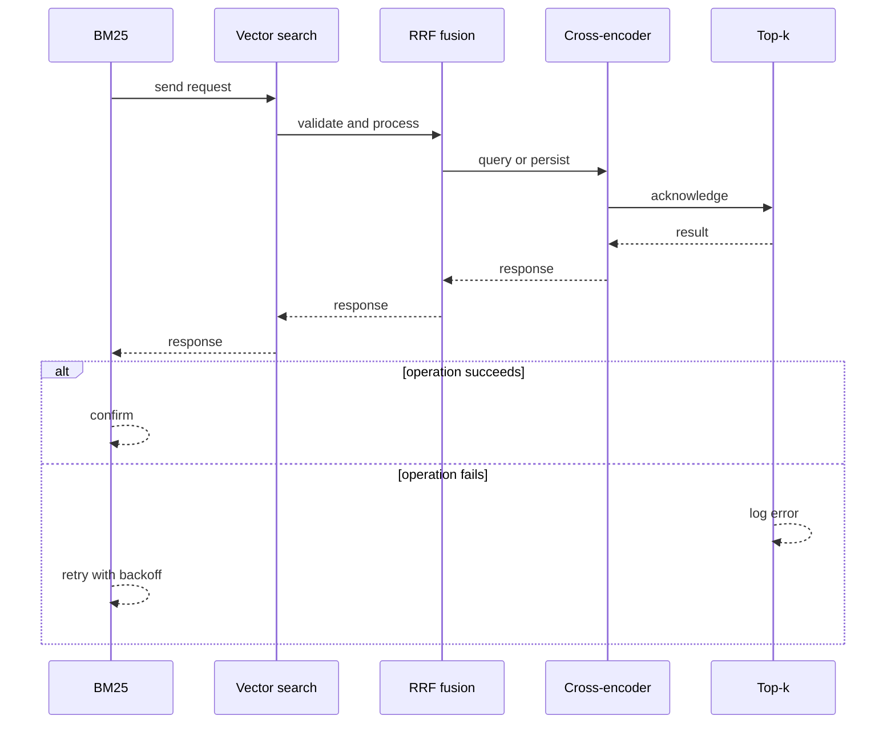
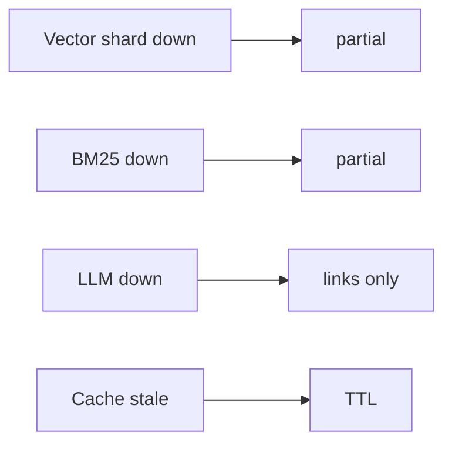
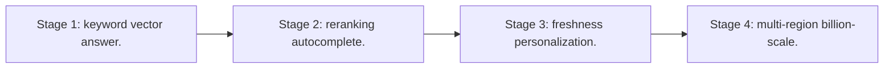

# Case Study: AI Search Engine

> **Tier:** ai-systems · **Status:** complete · Original numbers and diagrams.

## 1. Problem statement

A search engine combining keyword search, vector search, and LLM generation to answer questions with grounded, cited results — not just links, but synthesized answers.

## 2. Scope

In: web-scale indexing, hybrid retrieval, reranking, LLM answer synthesis with citations, autocomplete. Out: personalization.

## 3. Functional requirements

- Index web pages (keyword + embeddings).
- Hybrid search (BM25 + vector).
- Rerank.
- Generate answer with citations.
- Autocomplete.

## 4. Non-functional requirements

- Query p99 < 500 ms.
- Index 1B pages.
- Availability 99.9 percent.
- Freshness < 1 day.

## 5. Explicit assumptions

1. 1B pages, 10k q/s. 2. 10 results per query. 3. 20 percent get LLM answers.

## 6. Traffic estimation
10k q/s; hybrid fan-out; LLM for 20 percent.

## 7. Storage estimation
1B pages x embeddings x metadata = ~10 TB vectors + keyword index.

## 8. Bandwidth estimation
Query results small; LLM answers streamed.

## 9. API design

GET /search (q) -> results + optional answer; GET /suggest (prefix) -> top-k.

## 10. Data model

pages(id, url, text, embedding, meta); inverted_index(term -> pages); answers(q_hash, answer, citations, ttl).

## 11. High-level architecture

## 12. Request flow
Query -> parallel BM25 + vector -> RRF fusion -> cross-encoder rerank -> top-k -> LLM synthesizes answer with citations -> return.

## 13. Component responsibilities

Crawler, indexer (inverted + vector), BM25 engine, vector search, fusion, reranker, LLM, autocomplete.

## 14. Database selection

Inverted index (sharded by term); vector index (sharded by page); answer cache (KV).

## 15. Caching strategy

Hot query results cached; LLM answers cached with TTL; autocomplete prefix cache.

## 16. Partitioning strategy

Inverted index by term; vector index by page; fan-out + merge.

## 17. Replication strategy

Indexes replicated; crawler distributed; answer cache replicated.

## 18. Consistency model

Index eventual with web (freshness < 1 day); answers cached with TTL.

## 19. Failure scenarios
Vector shard down -> partial. BM25 down -> partial. LLM down -> links only. Cache stale -> TTL.

## 20. Reliability strategy

SLI query latency, relevance; SLO 99.9 percent. Partial-results fallback.

## 21. Security considerations

Anti-SEO; safe-search; PII in queries not logged; rate-limit scraping.

## 22. Observability strategy

Query p99, CTR, LLM answer rate, reranker lift, cache hit, freshness.

## 23. Cost considerations

Index storage (TBs) + compute (search + rerank + LLM). Cache hot; tier cold; LLM for 20 percent.

## 24. Scaling stages
Stage 1: keyword + vector + answer. -> Stage 2: reranking + autocomplete. -> Stage 3: freshness + personalization. -> Stage 4: multi-region + billion-scale.

## 25. Trade-offs

Keyword (exact) vs vector (semantic) -> hybrid. Rerank (precision) vs latency. LLM answer vs cost.

## 26. Alternative designs

Keyword only (misses semantic). Vector only (misses exact). No LLM (just links).

## 27. Interview discussion points

Clarify scale, freshness, LLM answer rate, latency. Surface hybrid search, reranking, LLM synthesis, citations.

## 28. Original Mermaid diagrams
Standalone sources under `diagrams/case-studies/ai-search-engine/`: `context.mmd`, `request-sequence.mmd`, `failure-flow.mmd`, `scaling-evolution.mmd`. The diagrams are embedded in their respective sections: architecture in section 11, request flow in section 12, failure scenarios in section 19, and scaling stages in section 24.

## 29. Further reading
Hybrid search: docs/ai-systems/05-hybrid-search-reranking; vector DB: 03-vector-databases; search engine case. Sources: `S-VECTORDB` `S-RAG`.

## 30. Practical exercises

1. BM25 + vector fusion tuning. 2. Reranker cost vs quality. 3. LLM answer freshness. 4. Billion-page sharding. 5. Anti-SEO.

---
Previous: Code assistant · Next: Multimodal document understanding

