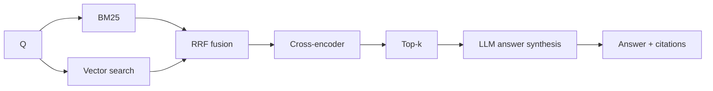
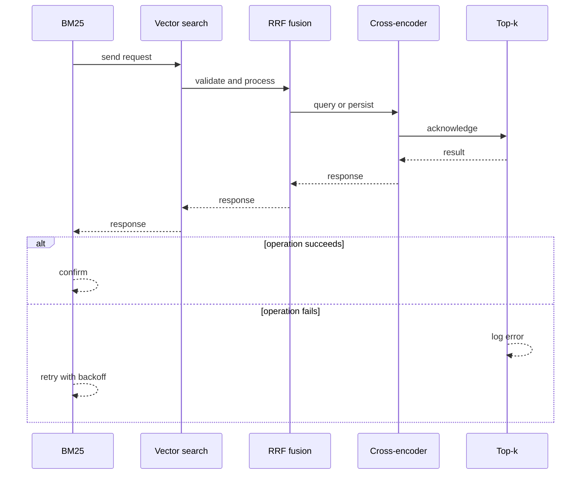
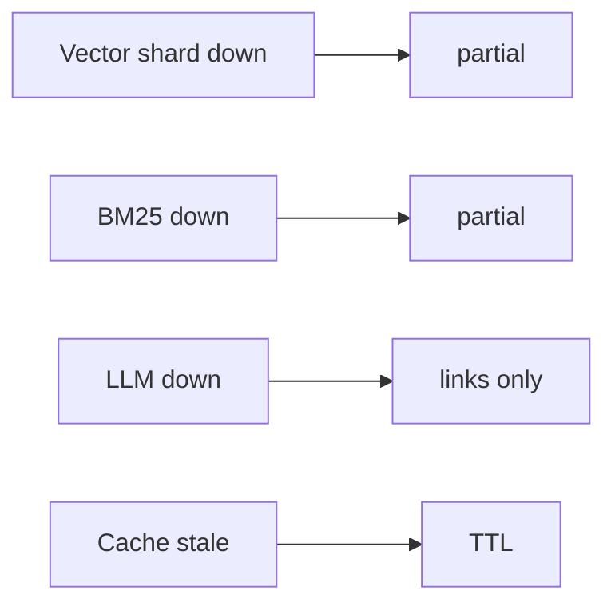
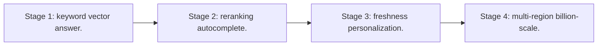

# Case Study: AI Search Engine

> **Tier:** ai-systems · **Status:** complete · Original numbers and diagrams.

## 1. Problem statement
A search engine combining keyword search, vector search, and LLM generation to answer questions with grounded, cited results — not just links, but synthesized answers. This is a ai-systems-tier system design challenge because it must handle millions of reads per second while ensuring grounded, cited, and permission-aware answers. The design must be production-grade: observable, debuggable, reversible, and able to survive component failures without data loss or cascading outages.

## 2. Scope
In: web-scale indexing, hybrid retrieval, reranking, LLM answer synthesis with citations, autocomplete. Out: personalization.

For AI Search Engine, these boundaries keep the first version focused on the core user value. Adding more features would dilute the design and delay shipping. Each excluded item is a scaling stage — a candidate for the next iteration once the baseline is proven.

## 3. Functional requirements
- Index web pages (keyword + embeddings).
- Hybrid search (BM25 + vector).
- Rerank.
- Generate answer with citations.
- Autocomplete.

For AI Search Engine, these requirements drive specific architectural decisions: the read-write ratio determines the caching strategy, the durability target sets the replication mode, and the idempotency requirement shapes the API contract.

## 4. Non-functional requirements
- Query p99 < 500 ms.
- Index 1B pages.
- Availability 99.9 percent.
- Freshness < 1 day.

For AI Search Engine, each non-functional target constrains a specific component: the latency SLO bounds the number of synchronous hops, the availability target forces redundancy across availability zones, and the cost ceiling limits the replication factor and storage tier.

## 5. Explicit assumptions
1. 1B pages, 10k q/s. 2. 10 results per query. 3. 20 percent get LLM answers.

For AI Search Engine, if these assumptions are off by an order of magnitude, the architecture must adapt: 10x traffic may require earlier sharding, a different read-write ratio changes the caching strategy, and a higher peak multiplier demands more headroom.

## 6. Traffic estimation
10k q/s; hybrid fan-out; LLM for 20 percent.

To derive the request rate: divide the daily volume by 86,400 seconds to get the average rate, then multiply by 5-10x for peak. The read-to-write ratio determines whether the system is cache-dominated (read-heavy) or write-path-dominated (write-heavy). For AI Search Engine, this ratio shapes the entire storage and replication strategy.

## 7. Storage estimation
1B pages x embeddings x metadata = ~10 TB vectors + keyword index.

For AI Search Engine, storage growth is projected from the daily write volume and retention policy. Index overhead and compression factors are accounted for in the total.

## 8. Bandwidth estimation
Query results small; LLM answers streamed.

Bandwidth is request rate multiplied by average payload size for ingress, and response rate multiplied by response size for egress. CDN and edge caching reduce origin egress. Compression reduces bandwidth by 50-80 percent where applicable. For AI Search Engine, bandwidth may or may not be the binding constraint — compare it against compute and storage to find out.

## 9. API design

GET /search (q) -> results + optional answer; GET /suggest (prefix) -> top-k.

## 10. Data model
pages(id, url, text, embedding, meta); inverted_index(term -> pages); answers(q_hash, answer, citations, ttl).

For AI Search Engine, the data model follows the access pattern. The primary lookup determines the partition key; secondary lookups determine indexes. Denormalization is used selectively on hot read paths.

## 11. High-level architecture

## 12. Request flow
Query -> parallel BM25 + vector -> RRF fusion -> cross-encoder rerank -> top-k -> LLM synthesizes answer with citations -> return.

## 13. Component responsibilities
Crawler, indexer (inverted + vector), BM25 engine, vector search, fusion, reranker, LLM, autocomplete.

For AI Search Engine, each component has one job. The gateway authenticates and routes. Services are stateless and scale horizontally. The data tier is the stateful core that scales by sharding.

## 14. Database selection
Inverted index (sharded by term); vector index (sharded by page); answer cache (KV).

For AI Search Engine, the database was chosen by access pattern, not familiarity. The rejected alternatives were wrong for this workload, not bad in general.

## 15. Caching strategy
Hot query results cached; LLM answers cached with TTL; autocomplete prefix cache.

For AI Search Engine, the cache strategy matches the staleness tolerance. Cache-aside for most data, write-through where read-after-write matters, stampede protection on hot keys.

## 16. Partitioning strategy
Inverted index by term; vector index by page; fan-out + merge.

For AI Search Engine, the partition key balances query locality with even load distribution. Sharding strategy matters because a poor key creates hot spots under real traffic patterns.

## 17. Replication strategy
Indexes replicated; crawler distributed; answer cache replicated.

For AI Search Engine, replication mode is split: synchronous where durability is critical, asynchronous elsewhere for throughput. RF=3 tolerates one failure. Failover is tested regularly.

## 18. Consistency model
Index eventual with web (freshness < 1 day); answers cached with TTL.

For AI Search Engine, the consistency level is the weakest users accept. Read-your-writes is provided where needed. Eventual consistency is bounded and monitored, not unbounded and silent.

## 19. Failure scenarios
Vector shard down -> partial. BM25 down -> partial. LLM down -> links only. Cache stale -> TTL.

## 20. Reliability strategy
SLI query latency, relevance; SLO 99.9 percent. Partial-results fallback.

For AI Search Engine, the SLO makes reliability measurable. The error budget balances feature velocity with stability. Chaos testing validates that resilience claims hold under real failures.

## 21. Security considerations
Anti-SEO; safe-search; PII in queries not logged; rate-limit scraping.

For AI Search Engine, security layers TLS, encryption at rest, RBAC, PII redaction, and audit. The policy gateway is fail-closed for AI-augmented operations.

## 22. Observability strategy
Query p99, CTR, LLM answer rate, reranker lift, cache hit, freshness.

For AI Search Engine, observability combines logs, metrics, and traces with correlation IDs. Golden signals drive the first dashboard. Alerts fire on burn rate, not raw thresholds.

## 23. Cost considerations
Index storage (TBs) + compute (search + rerank + LLM). Cache hot; tier cold; LLM for 20 percent.

For AI Search Engine, cost is driven by the binding resource. Caching, tiering, batching, and right-sizing are the levers. Cost per request is tracked and alerted on.

## 24. Scaling stages
Stage 1: keyword + vector + answer. -> Stage 2: reranking + autocomplete. -> Stage 3: freshness + personalization. -> Stage 4: multi-region + billion-scale.

## 25. Trade-offs
Keyword (exact) vs vector (semantic) -> hybrid. Rerank (precision) vs latency. LLM answer vs cost.

For AI Search Engine, each trade-off lists what was chosen, what was rejected, and why. This makes the design defensible in review — every decision has documented reasoning.

## 26. Alternative designs
Keyword only (misses semantic). Vector only (misses exact). No LLM (just links).

For AI Search Engine, the alternatives are real architectures that work under different constraints. They were rejected for this workload's specific requirements, not because they are bad designs.

## 27. Interview discussion points
Clarify scale, freshness, LLM answer rate, latency. Surface hybrid search, reranking, LLM synthesis, citations.

For AI Search Engine in an interview: clarify scope first, surface the read-write ratio, design the hot path deeply, discuss failures, and offer an alternative. Weak candidates skip failure modes.

## 28. Original Mermaid diagrams
Standalone sources under `diagrams/case-studies/ai-search-engine/`: `context.mmd`, `request-sequence.mmd`, `failure-flow.mmd`, `scaling-evolution.mmd`. The diagrams are embedded in their respective sections: architecture in section 11, request flow in section 12, failure scenarios in section 19, and scaling stages in section 24.

## 29. Further reading
Hybrid search: docs/ai-systems/05-hybrid-search-reranking; vector DB: 03-vector-databases; search engine case. Sources: `S-VECTORDB` `S-RAG`.

## 30. Practical exercises

1. BM25 + vector fusion tuning. 2. Reranker cost vs quality. 3. LLM answer freshness. 4. Billion-page sharding. 5. Anti-SEO.

---
Previous: Code assistant · Next: Multimodal document understanding

