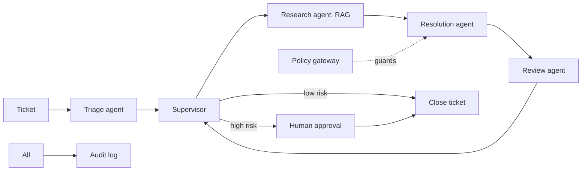
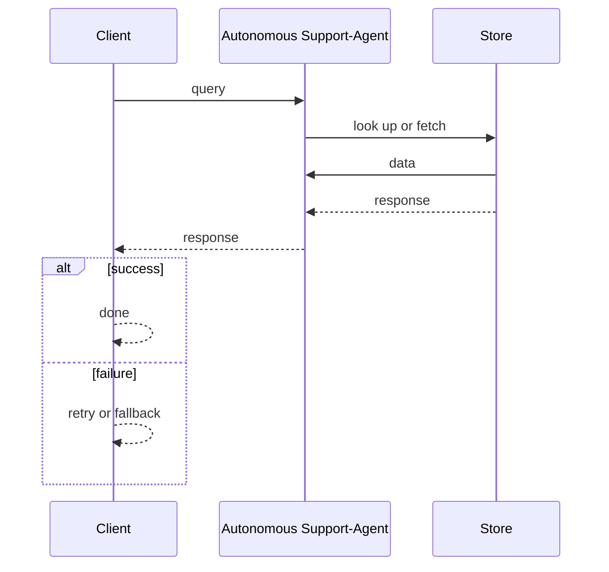
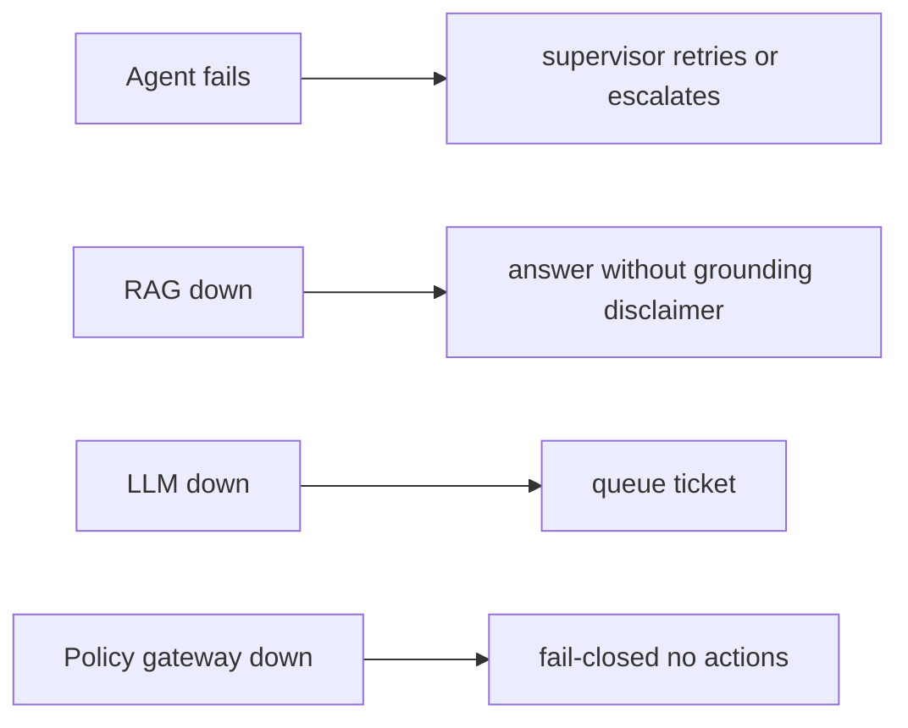

# Case Study: Autonomous Support-Agent Team

> **Tier:** ai-systems · **Status:** complete · Original numbers and diagrams.

## 11. High-level architecture

## 28. Original Mermaid diagrams

Standalone sources under `diagrams/case-studies/autonomous-support-agent-team/`: `context.mmd`, `request-sequence.mmd`, `failure-flow.mmd`, `scaling-evolution.mmd`. Request sequence and failure flow:

## 1. Problem statement

A team of specialized AI agents (triage, research, resolution, review) that handle support tickets end to end, with a supervisor coordinating, a policy gateway approving high-risk actions, and full audit.

## 2. Scope

In (v1): multi-agent ticket handling, RAG for knowledge, tool calling for ticketing systems, supervisor coordination, policy gateway, human approval for high-risk. Out: fully autonomous resolution without any human review (excluded for high-risk).

## 3. Functional requirements

- Triage agent classifies and routes tickets. - Research agent retrieves relevant docs via RAG. - Resolution agent drafts a response or action. - Review agent checks quality and safety. - Supervisor coordinates and approves. - High-risk actions require human approval. - Full audit.

## 4. Non-functional requirements

- Ticket-to-first-response < 30 s. - No unauthorized high-risk action. - Availability 99.9 percent.

## 5. Explicit assumptions

1. 500 tickets/day, ~5 agent steps per ticket. [assumption] 2. 80 percent resolved by agents, 20 percent escalated to humans. [assumption] 3. High-risk = refunds, account changes, data access. [constraint]

## 6. Traffic estimation

Bursty during business hours; each ticket triggers multiple LLM calls (triage + research + resolution + review).

## 7. Storage estimation

Tickets + agent traces + RAG corpus + audit; moderate, must be auditable.

## 8. Bandwidth estimation

Agent-to-tool calls + LLM; moderate.

## 9. API design

POST /tickets (intake) -> agent team processes; GET /tickets/:id/trace; POST /tickets/:id/approve.

## 10. Data model

tickets(id, status, priority, assignee); agent_traces(ticket, agent, steps, tools, results); rag_corpus(chunks, embeddings, ACLs); audit(actor, action, ts, result).

## 12. Request flow

Ticket arrives -> triage classifies -> supervisor routes to research (RAG) -> resolution drafts response or action -> review checks quality/safety -> supervisor: low-risk auto-close, high-risk human approval -> audit all steps.

## 13. Component responsibilities

Triage agent, research agent (RAG), resolution agent, review agent, supervisor, policy gateway, RAG, ticketing integration, audit.

## 14. Database selection

Ticket store (relational); agent traces (append-only); RAG vector DB; audit (append-only, tamper-evident). Rejected: agents with direct unguarded tool execution.

## 15. Caching strategy

RAG results cached (permission-aware); common ticket patterns cached; agent traces not cached (audit).

## 16. Partitioning strategy

Tickets by tenant; RAG by tenant; agents stateless; supervisor per ticket.

## 17. Replication strategy

Ticket store RF=3; audit append-only; RAG replicated; agents stateless.

## 18. Consistency model

Ticket status strongly tracked; agent traces append-only; RAG eventual; audit tamper-evident.

## 19. Failure scenarios

Agent fails -> supervisor retries or escalates. RAG down -> answer without grounding (disclaimer). LLM down -> queue ticket. Policy gateway down -> fail-closed (no actions).

## 20. Reliability strategy

SLI ticket-to-response, resolution rate, zero-unauthorized-action; SLO 99.9 percent. Fail-closed policy gateway. Chaos: kill an agent, assert supervisor handles.

## 21. Security considerations

Policy gateway (no auto-high-risk); per-tenant RAG isolation; PII redaction; full audit; tool risk tiers; RBAC on approvals.

## 22. Observability strategy

Ticket resolution rate, agent step count, cost per ticket, approval rate, unauthorized attempts (0), escalation rate, agent latency.

## 23. Cost considerations

LLM calls per ticket (5+); multi-model routing cuts cost (triage on small model, resolution on large).

## 24. Scaling stages

Stage 1: single agent + RAG. -> Stage 2: multi-agent + supervisor + policy. -> Stage 3: review agent + evaluation + governance. -> Stage 4: enterprise agent platform, multi-region.

## 25. Trade-offs

Autonomy (speed) vs approval (safety). Multi-agent (specialization) vs single (simplicity). Auto-close (fast) vs review (safe).

## 26. Alternative designs

Single agent (no specialization). Full autonomy (unsafe). Human-only (slow).

## 27. Interview discussion points

Clarify risk tiers, approval workflow, agent count. Surface multi-agent coordination, policy gateway, audit, and the human-approval principle.

## 29. Further reading

Agentic systems: docs/ai-systems/08-agentic-systems; AI security: 09-ai-security; RAG: 06-basic-rag.

## 30. Practical exercises

1. Define agent risk tiers. 2. Supervisor escalation logic. 3. Policy gateway fail-closed design. 4. Cost per ticket with multi-model routing. 5. Audit replay for a disputed ticket.

---
Previous: Enterprise RAG platform · Next: LLM API gateway

