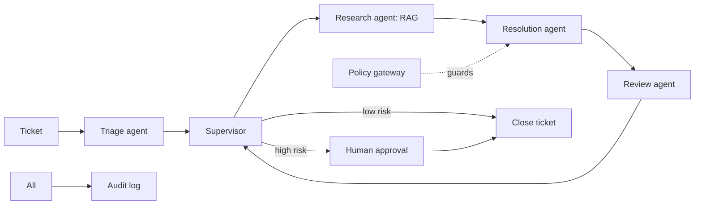
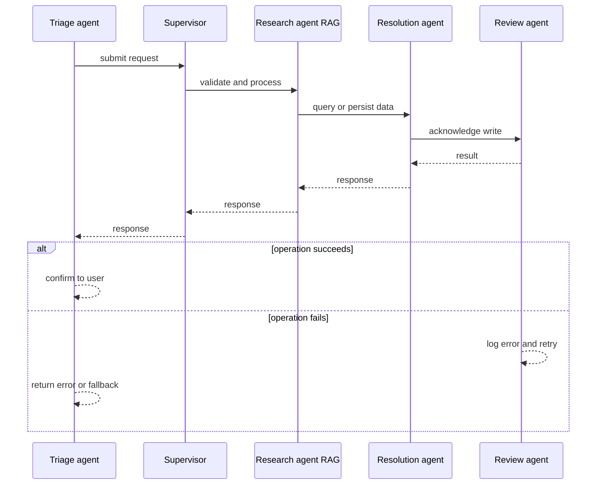
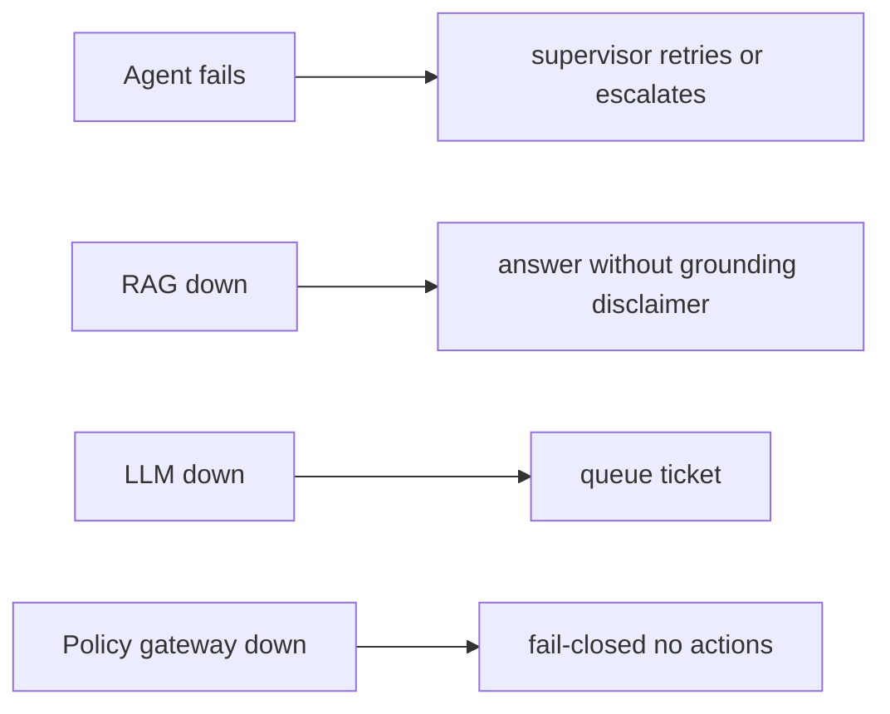
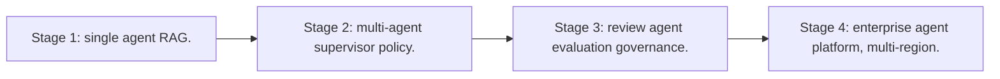

# Case Study: Autonomous Support-Agent Team

> **Tier:** ai-systems · **Status:** complete · Original numbers and diagrams.

## 1. Problem statement
A team of specialized AI agents (triage, research, resolution, review) that handle support tickets end to end, with a supervisor coordinating, a policy gateway approving high-risk actions, and full audit. This is a ai-systems-tier system design challenge because it must handle high availability under peak load while ensuring no single point of failure. The design must be production-grade: observable, debuggable, reversible, and able to survive component failures without data loss or cascading outages.

## 2. Scope
In (v1): multi-agent ticket handling, RAG for knowledge, tool calling for ticketing systems, supervisor coordination, policy gateway, human approval for high-risk. Out: fully autonomous resolution without any human review (excluded for high-risk).

For Autonomous Support-Agent Team, these boundaries keep the first version focused on the core user value. Adding more features would dilute the design and delay shipping. Each excluded item is a scaling stage — a candidate for the next iteration once the baseline is proven.

## 3. Functional requirements
- Triage agent classifies and routes tickets.
- Research agent retrieves relevant docs via RAG.
- Resolution agent drafts a response or action.
- Review agent checks quality and safety.
- Supervisor coordinates and approves.
- High-risk actions require human approval.
- Full audit.

For Autonomous Support-Agent Team, these requirements drive specific architectural decisions: the read-write ratio determines the caching strategy, the durability target sets the replication mode, and the idempotency requirement shapes the API contract.

## 4. Non-functional requirements
- Ticket-to-first-response < 30 s.
- No unauthorized high-risk action.
- Availability 99.9 percent.

For Autonomous Support-Agent Team, each non-functional target constrains a specific component: the latency SLO bounds the number of synchronous hops, the availability target forces redundancy across availability zones, and the cost ceiling limits the replication factor and storage tier.

## 5. Explicit assumptions
1. 500 tickets/day, ~5 agent steps per ticket. [assumption] 2. 80 percent resolved by agents, 20 percent escalated to humans. [assumption] 3. High-risk = refunds, account changes, data access. [constraint]

For Autonomous Support-Agent Team, if these assumptions are off by an order of magnitude, the architecture must adapt: 10x traffic may require earlier sharding, a different read-write ratio changes the caching strategy, and a higher peak multiplier demands more headroom.

## 6. Traffic estimation
Bursty during business hours; each ticket triggers multiple LLM calls (triage + research + resolution + review).

To derive the request rate: divide the daily volume by 86,400 seconds to get the average rate, then multiply by 5-10x for peak. The read-to-write ratio determines whether the system is cache-dominated (read-heavy) or write-path-dominated (write-heavy). For Autonomous Support-Agent Team, this ratio shapes the entire storage and replication strategy.

## 7. Storage estimation
Tickets + agent traces + RAG corpus + audit; moderate, must be auditable.

For Autonomous Support-Agent Team, storage growth is projected from the daily write volume and retention policy. Index overhead and compression factors are accounted for in the total.

## 8. Bandwidth estimation
Agent-to-tool calls + LLM; moderate.

Bandwidth is request rate multiplied by average payload size for ingress, and response rate multiplied by response size for egress. CDN and edge caching reduce origin egress. Compression reduces bandwidth by 50-80 percent where applicable. For Autonomous Support-Agent Team, bandwidth may or may not be the binding constraint — compare it against compute and storage to find out.

## 9. API design

POST /tickets (intake) -> agent team processes; GET /tickets/:id/trace; POST /tickets/:id/approve.

## 10. Data model
tickets(id, status, priority, assignee); agent_traces(ticket, agent, steps, tools, results); rag_corpus(chunks, embeddings, ACLs); audit(actor, action, ts, result).

For Autonomous Support-Agent Team, the data model follows the access pattern. The primary lookup determines the partition key; secondary lookups determine indexes. Denormalization is used selectively on hot read paths.

## 11. High-level architecture

## 12. Request flow
Ticket arrives -> triage classifies -> supervisor routes to research (RAG) -> resolution drafts response or action -> review checks quality/safety -> supervisor: low-risk auto-close, high-risk human approval -> audit all steps.

## 13. Component responsibilities
Triage agent, research agent (RAG), resolution agent, review agent, supervisor, policy gateway, RAG, ticketing integration, audit.

For Autonomous Support-Agent Team, each component has one job. The gateway authenticates and routes. Services are stateless and scale horizontally. The data tier is the stateful core that scales by sharding.

## 14. Database selection
Ticket store (relational); agent traces (append-only); RAG vector DB; audit (append-only, tamper-evident). Rejected: agents with direct unguarded tool execution.

For Autonomous Support-Agent Team, the database was chosen by access pattern, not familiarity. The rejected alternatives were wrong for this workload, not bad in general.

## 15. Caching strategy
RAG results cached (permission-aware); common ticket patterns cached; agent traces not cached (audit).

For Autonomous Support-Agent Team, the cache strategy matches the staleness tolerance. Cache-aside for most data, write-through where read-after-write matters, stampede protection on hot keys.

## 16. Partitioning strategy
Tickets by tenant; RAG by tenant; agents stateless; supervisor per ticket.

For Autonomous Support-Agent Team, the partition key balances query locality with even load distribution. Sharding strategy matters because a poor key creates hot spots under real traffic patterns.

## 17. Replication strategy
Ticket store RF=3; audit append-only; RAG replicated; agents stateless.

For Autonomous Support-Agent Team, replication mode is split: synchronous where durability is critical, asynchronous elsewhere for throughput. RF=3 tolerates one failure. Failover is tested regularly.

## 18. Consistency model
Ticket status strongly tracked; agent traces append-only; RAG eventual; audit tamper-evident.

For Autonomous Support-Agent Team, the consistency level is the weakest users accept. Read-your-writes is provided where needed. Eventual consistency is bounded and monitored, not unbounded and silent.

## 19. Failure scenarios
Agent fails -> supervisor retries or escalates. RAG down -> answer without grounding (disclaimer). LLM down -> queue ticket. Policy gateway down -> fail-closed (no actions).

## 20. Reliability strategy
SLI ticket-to-response, resolution rate, zero-unauthorized-action; SLO 99.9 percent. Fail-closed policy gateway. Chaos: kill an agent, assert supervisor handles.

For Autonomous Support-Agent Team, the SLO makes reliability measurable. The error budget balances feature velocity with stability. Chaos testing validates that resilience claims hold under real failures.

## 21. Security considerations
Policy gateway (no auto-high-risk); per-tenant RAG isolation; PII redaction; full audit; tool risk tiers; RBAC on approvals.

For Autonomous Support-Agent Team, security layers TLS, encryption at rest, RBAC, PII redaction, and audit. The policy gateway is fail-closed for AI-augmented operations.

## 22. Observability strategy
Ticket resolution rate, agent step count, cost per ticket, approval rate, unauthorized attempts (0), escalation rate, agent latency.

For Autonomous Support-Agent Team, observability combines logs, metrics, and traces with correlation IDs. Golden signals drive the first dashboard. Alerts fire on burn rate, not raw thresholds.

## 23. Cost considerations
LLM calls per ticket (5+); multi-model routing cuts cost (triage on small model, resolution on large).

For Autonomous Support-Agent Team, cost is driven by the binding resource. Caching, tiering, batching, and right-sizing are the levers. Cost per request is tracked and alerted on.

## 24. Scaling stages
Stage 1: single agent + RAG. -> Stage 2: multi-agent + supervisor + policy. -> Stage 3: review agent + evaluation + governance. -> Stage 4: enterprise agent platform, multi-region.

## 25. Trade-offs
Autonomy (speed) vs approval (safety). Multi-agent (specialization) vs single (simplicity). Auto-close (fast) vs review (safe).

For Autonomous Support-Agent Team, each trade-off lists what was chosen, what was rejected, and why. This makes the design defensible in review — every decision has documented reasoning.

## 26. Alternative designs
Single agent (no specialization). Full autonomy (unsafe). Human-only (slow).

For Autonomous Support-Agent Team, the alternatives are real architectures that work under different constraints. They were rejected for this workload's specific requirements, not because they are bad designs.

## 27. Interview discussion points
Clarify risk tiers, approval workflow, agent count. Surface multi-agent coordination, policy gateway, audit, and the human-approval principle.

For Autonomous Support-Agent Team in an interview: clarify scope first, surface the read-write ratio, design the hot path deeply, discuss failures, and offer an alternative. Weak candidates skip failure modes.

## 28. Original Mermaid diagrams
Standalone sources under `diagrams/case-studies/autonomous-support-agent-team/`: `context.mmd`, `request-sequence.mmd`, `failure-flow.mmd`, `scaling-evolution.mmd`. The diagrams are embedded in their respective sections: architecture in section 11, request flow in section 12, failure scenarios in section 19, and scaling stages in section 24.

## 29. Further reading
Agentic systems: docs/ai-systems/08-agentic-systems; AI security: 09-ai-security; RAG: 06-basic-rag. Sources: `S-RAG` `S-VECTORDB`.

## 30. Practical exercises

1. Define agent risk tiers. 2. Supervisor escalation logic. 3. Policy gateway fail-closed design. 4. Cost per ticket with multi-model routing. 5. Audit replay for a disputed ticket.

---
Previous: Enterprise RAG platform · Next: LLM API gateway

