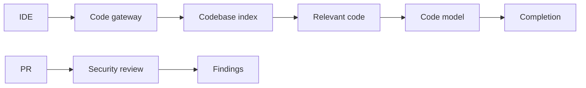
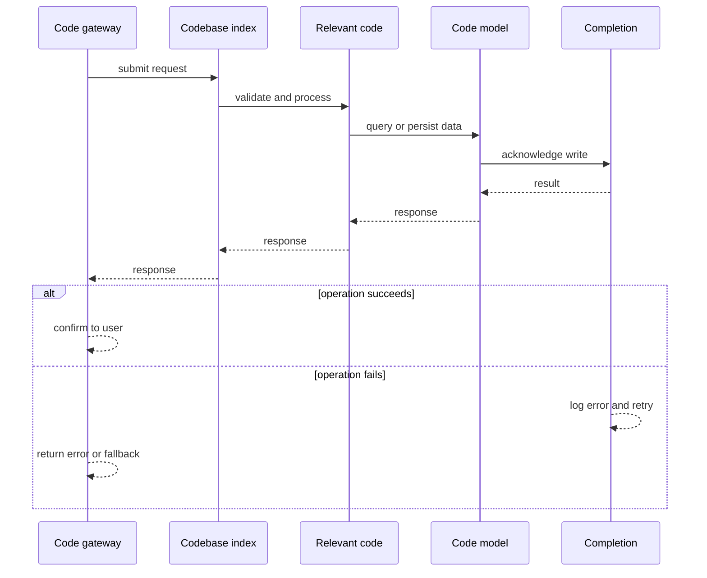
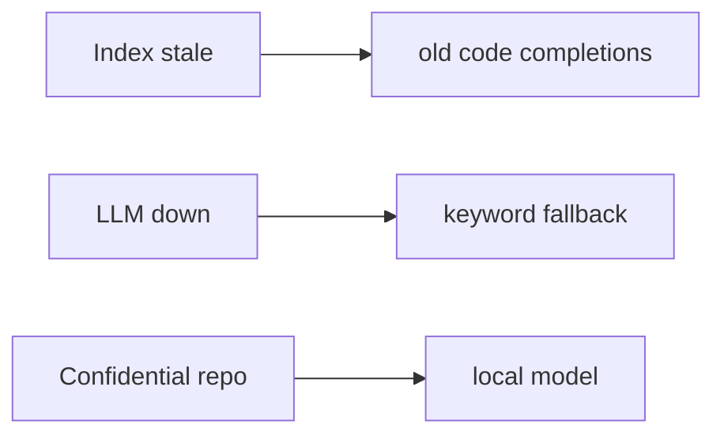
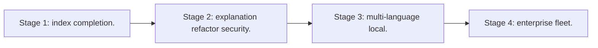

# Case Study: Code-Assistant Platform

> **Tier:** ai-systems · **Status:** complete · Original numbers and diagrams.

## 1. Problem statement
A platform providing code completion, explanation, refactoring, and security review using LLMs with codebase indexing and security controls. This is a ai-systems-tier system design challenge because it must handle high availability under peak load while ensuring no single point of failure. The design must be production-grade: observable, debuggable, reversible, and able to survive component failures without data loss or cascading outages.

## 2. Scope
In: codebase indexing, code completion, explanation, refactoring suggestions, security review. Out: autonomous code execution.

For Code-Assistant Platform, these boundaries keep the first version focused on the core user value. Adding more features would dilute the design and delay shipping. Each excluded item is a scaling stage — a candidate for the next iteration once the baseline is proven.

## 3. Functional requirements
- Index codebase (functions, classes, imports).
- Suggest completions in context.
- Explain code.
- Suggest refactors.
- Flag security issues.
- Never execute code.

For Code-Assistant Platform, these requirements drive specific architectural decisions: the read-write ratio determines the caching strategy, the durability target sets the replication mode, and the idempotency requirement shapes the API contract.

## 4. Non-functional requirements
- Completion latency < 500 ms.
- Context uses relevant code.
- Availability 99.9 percent.

For Code-Assistant Platform, each non-functional target constrains a specific component: the latency SLO bounds the number of synchronous hops, the availability target forces redundancy across availability zones, and the cost ceiling limits the replication factor and storage tier.

## 5. Explicit assumptions
1. 1000 repos, avg 100k LOC. 2. 10k completions/s. 3. Confidential repos use local model.

For Code-Assistant Platform, if these assumptions are off by an order of magnitude, the architecture must adapt: 10x traffic may require earlier sharding, a different read-write ratio changes the caching strategy, and a higher peak multiplier demands more headroom.

## 6. Traffic estimation
10k completions/s; bursty during dev hours.

To derive the request rate: divide the daily volume by 86,400 seconds to get the average rate, then multiply by 5-10x for peak. The read-to-write ratio determines whether the system is cache-dominated (read-heavy) or write-path-dominated (write-heavy). For Code-Assistant Platform, this ratio shapes the entire storage and replication strategy.

## 7. Storage estimation
1000 repos x 100k LOC x ~50 bytes = ~5 GB code + index + embeddings.

For Code-Assistant Platform, storage growth is projected from the daily write volume and retention policy. Index overhead and compression factors are accounted for in the total.

## 8. Bandwidth estimation
Code context small (KBs); completions streamed.

Bandwidth is request rate multiplied by average payload size for ingress, and response rate multiplied by response size for egress. CDN and edge caching reduce origin egress. Compression reduces bandwidth by 50-80 percent where applicable. For Code-Assistant Platform, bandwidth may or may not be the binding constraint — compare it against compute and storage to find out.

## 9. API design

POST /complete (repo, file, cursor) -> completion; POST /review (PR diff) -> review.

## 10. Data model
repos(id, url, lang); functions(id, repo, signature, body, embedding); reviews(id, pr, findings).

For Code-Assistant Platform, the data model follows the access pattern. The primary lookup determines the partition key; secondary lookups determine indexes. Denormalization is used selectively on hot read paths.

## 11. High-level architecture

## 12. Request flow
IDE requests completion -> gateway auth -> retrieve relevant code from index -> send to code model -> stream completion; PR review: diff -> security model -> findings.

## 13. Component responsibilities
Code gateway, codebase indexer, context retriever, code LLM, security reviewer, IDE plugin.

For Code-Assistant Platform, each component has one job. The gateway authenticates and routes. Services are stateless and scale horizontally. The data tier is the stateful core that scales by sharding.

## 14. Database selection
Codebase index (vector + AST); function store; review findings; audit.

For Code-Assistant Platform, the database was chosen by access pattern, not familiarity. The rejected alternatives were wrong for this workload, not bad in general.

## 15. Caching strategy
Common completions cached; repo index cached; signatures cached.

For Code-Assistant Platform, the cache strategy matches the staleness tolerance. Cache-aside for most data, write-through where read-after-write matters, stampede protection on hot keys.

## 16. Partitioning strategy
Index by repo; completions by repo; reviews by PR.

For Code-Assistant Platform, the partition key balances query locality with even load distribution. Sharding strategy matters because a poor key creates hot spots under real traffic patterns.

## 17. Replication strategy
Index RF=3; gateway stateless; reviews durable.

For Code-Assistant Platform, replication mode is split: synchronous where durability is critical, asynchronous elsewhere for throughput. RF=3 tolerates one failure. Failover is tested regularly.

## 18. Consistency model
Index eventual with commits; completions deterministic on snapshot; reviews advisory.

For Code-Assistant Platform, the consistency level is the weakest users accept. Read-your-writes is provided where needed. Eventual consistency is bounded and monitored, not unbounded and silent.

## 19. Failure scenarios
Index stale -> old code completions. LLM down -> keyword fallback. Confidential repo -> local model.

For Code-Assistant Platform, each failure has a specific response plan. The design principle is degrade-don't-cascade: bulkheads isolate dependencies, circuit breakers stop calls to failing services, and timeouts bound every outbound call.

## 20. Reliability strategy
SLI completion latency, accuracy; SLO 99.9 percent. Fallback to keyword.

For Code-Assistant Platform, the SLO makes reliability measurable. The error budget balances feature velocity with stability. Chaos testing validates that resilience claims hold under real failures.

## 21. Security considerations
Confidential repos use local model only; code never to unapproved external APIs; PII redacted; audit; no auto-execution.

For Code-Assistant Platform, security layers TLS, encryption at rest, RBAC, PII redaction, and audit. The policy gateway is fail-closed for AI-augmented operations.

## 22. Observability strategy
Completion latency, accuracy, index freshness, local-vs-external routing, security findings rate.

For Code-Assistant Platform, observability combines logs, metrics, and traces with correlation IDs. Golden signals drive the first dashboard. Alerts fire on burn rate, not raw thresholds.

## 23. Cost considerations
LLM inference dominates; cache completions; route confidential to local (cheaper + safer).

For Code-Assistant Platform, cost is driven by the binding resource. Caching, tiering, batching, and right-sizing are the levers. Cost per request is tracked and alerted on.

## 24. Scaling stages
Stage 1: index + completion. -> Stage 2: explanation + refactor + security. -> Stage 3: multi-language + local. -> Stage 4: enterprise fleet.

## 25. Trade-offs
Local (privacy, cost) vs external (quality). Full-context (accuracy) vs latency. Auto-complete (fast) vs review (thorough).

For Code-Assistant Platform, each trade-off lists what was chosen, what was rejected, and why. This makes the design defensible in review — every decision has documented reasoning.

## 26. Alternative designs
Blind LLM (hallucinated APIs). External-only (security risk). Keyword-only (no understanding).

For Code-Assistant Platform, the alternatives are real architectures that work under different constraints. They were rejected for this workload's specific requirements, not because they are bad designs.

## 27. Interview discussion points
Clarify repo count, confidentiality, languages, latency. Surface codebase indexing, context retrieval, local routing, security review.

For Code-Assistant Platform in an interview: clarify scope first, surface the read-write ratio, design the hot path deeply, discuss failures, and offer an alternative. Weak candidates skip failure modes.

## 28. Original Mermaid diagrams
Standalone sources under `diagrams/case-studies/code-assistant-platform/`: `context.mmd`, `request-sequence.mmd`, `failure-flow.mmd`, `scaling-evolution.mmd`. The diagrams are embedded in their respective sections: architecture in section 11, request flow in section 12, failure scenarios in section 19, and scaling stages in section 24.

## 29. Further reading
Code LLM refs; docs/ai-systems/08-agentic-systems; security: 09-ai-security; local: 12-ai-extreme-scale. Sources: `S-CHASH` `S-DYNAMO`.

## 30. Practical exercises

1. Index a repo for context-aware completion. 2. Route confidential to local. 3. Security review pipeline. 4. Multi-language. 5. Eval completion accuracy.

---
Previous: GraphRAG research · Next: AI search engine

