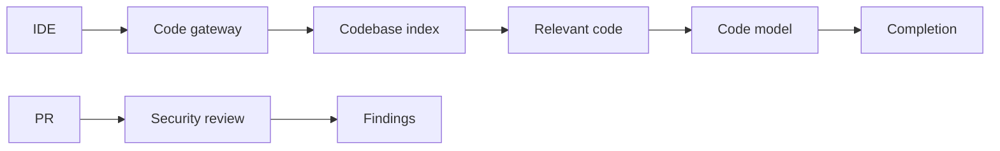
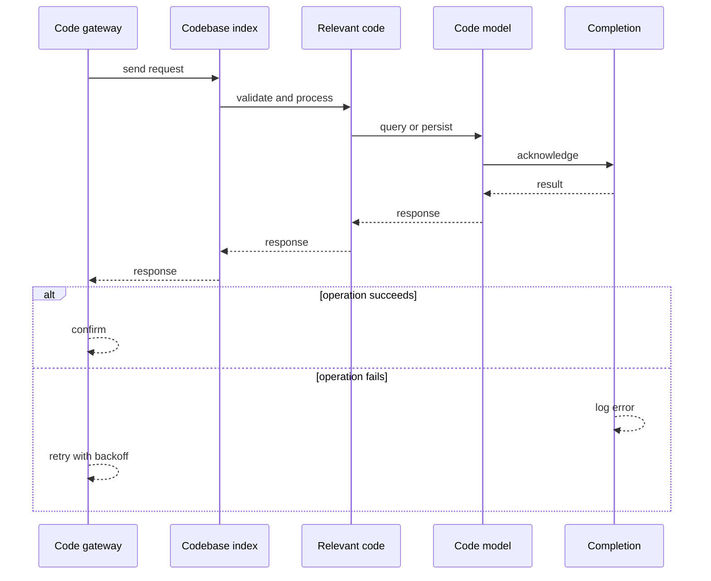
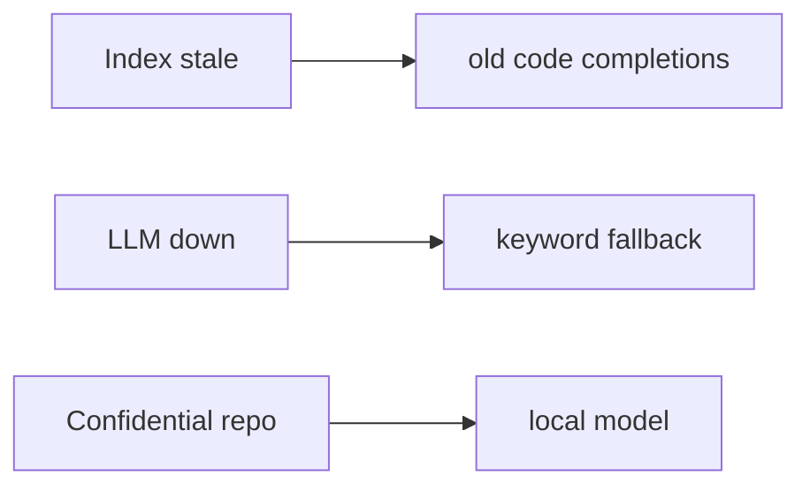
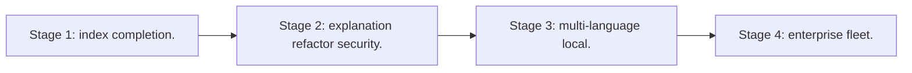

# Case Study: Code-Assistant Platform

> **Tier:** ai-systems · **Status:** complete · Original numbers and diagrams.

## 1. Problem statement

A platform providing code completion, explanation, refactoring, and security review using LLMs with codebase indexing and security controls.

## 2. Scope

In: codebase indexing, code completion, explanation, refactoring suggestions, security review. Out: autonomous code execution.

## 3. Functional requirements

- Index codebase (functions, classes, imports).
- Suggest completions in context.
- Explain code.
- Suggest refactors.
- Flag security issues.
- Never execute code.

## 4. Non-functional requirements

- Completion latency < 500 ms.
- Context uses relevant code.
- Availability 99.9 percent.

## 5. Explicit assumptions

1. 1000 repos, avg 100k LOC. 2. 10k completions/s. 3. Confidential repos use local model.

## 6. Traffic estimation
10k completions/s; bursty during dev hours.

## 7. Storage estimation
1000 repos x 100k LOC x ~50 bytes = ~5 GB code + index + embeddings.

## 8. Bandwidth estimation
Code context small (KBs); completions streamed.

## 9. API design

POST /complete (repo, file, cursor) -> completion; POST /review (PR diff) -> review.

## 10. Data model

repos(id, url, lang); functions(id, repo, signature, body, embedding); reviews(id, pr, findings).

## 11. High-level architecture

## 12. Request flow
IDE requests completion -> gateway auth -> retrieve relevant code from index -> send to code model -> stream completion; PR review: diff -> security model -> findings.

## 13. Component responsibilities

Code gateway, codebase indexer, context retriever, code LLM, security reviewer, IDE plugin.

## 14. Database selection

Codebase index (vector + AST); function store; review findings; audit.

## 15. Caching strategy

Common completions cached; repo index cached; signatures cached.

## 16. Partitioning strategy

Index by repo; completions by repo; reviews by PR.

## 17. Replication strategy

Index RF=3; gateway stateless; reviews durable.

## 18. Consistency model

Index eventual with commits; completions deterministic on snapshot; reviews advisory.

## 19. Failure scenarios
Index stale -> old code completions. LLM down -> keyword fallback. Confidential repo -> local model.

## 20. Reliability strategy

SLI completion latency, accuracy; SLO 99.9 percent. Fallback to keyword.

## 21. Security considerations

Confidential repos use local model only; code never to unapproved external APIs; PII redacted; audit; no auto-execution.

## 22. Observability strategy

Completion latency, accuracy, index freshness, local-vs-external routing, security findings rate.

## 23. Cost considerations

LLM inference dominates; cache completions; route confidential to local (cheaper + safer).

## 24. Scaling stages
Stage 1: index + completion. -> Stage 2: explanation + refactor + security. -> Stage 3: multi-language + local. -> Stage 4: enterprise fleet.

## 25. Trade-offs

Local (privacy, cost) vs external (quality). Full-context (accuracy) vs latency. Auto-complete (fast) vs review (thorough).

## 26. Alternative designs

Blind LLM (hallucinated APIs). External-only (security risk). Keyword-only (no understanding).

## 27. Interview discussion points

Clarify repo count, confidentiality, languages, latency. Surface codebase indexing, context retrieval, local routing, security review.

## 28. Original Mermaid diagrams
Standalone sources under `diagrams/case-studies/code-assistant-platform/`: `context.mmd`, `request-sequence.mmd`, `failure-flow.mmd`, `scaling-evolution.mmd`. The diagrams are embedded in their respective sections: architecture in section 11, request flow in section 12, failure scenarios in section 19, and scaling stages in section 24.

## 29. Further reading
Code LLM refs; docs/ai-systems/08-agentic-systems; security: 09-ai-security; local: 12-ai-extreme-scale. Sources: `S-CHASH` `S-DYNAMO`.

## 30. Practical exercises

1. Index a repo for context-aware completion. 2. Route confidential to local. 3. Security review pipeline. 4. Multi-language. 5. Eval completion accuracy.

---
Previous: GraphRAG research · Next: AI search engine

