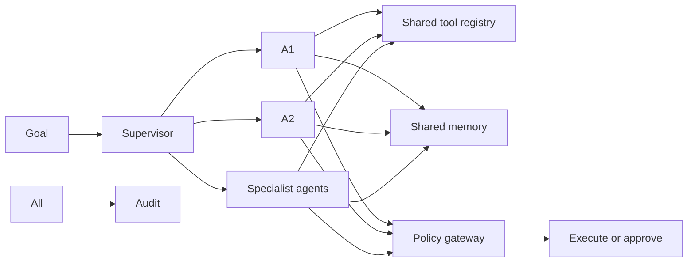
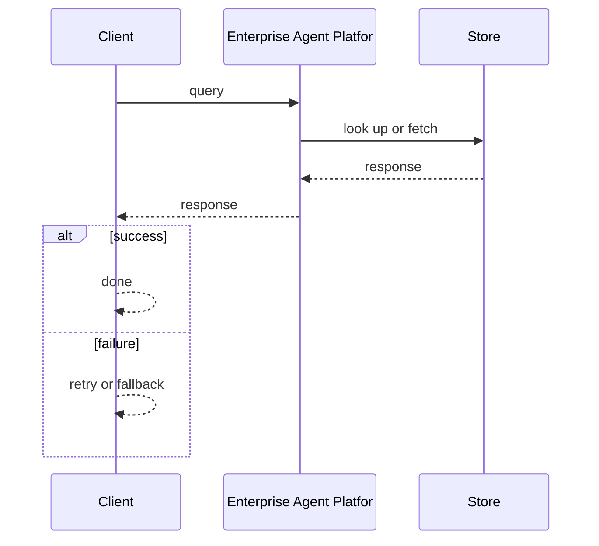
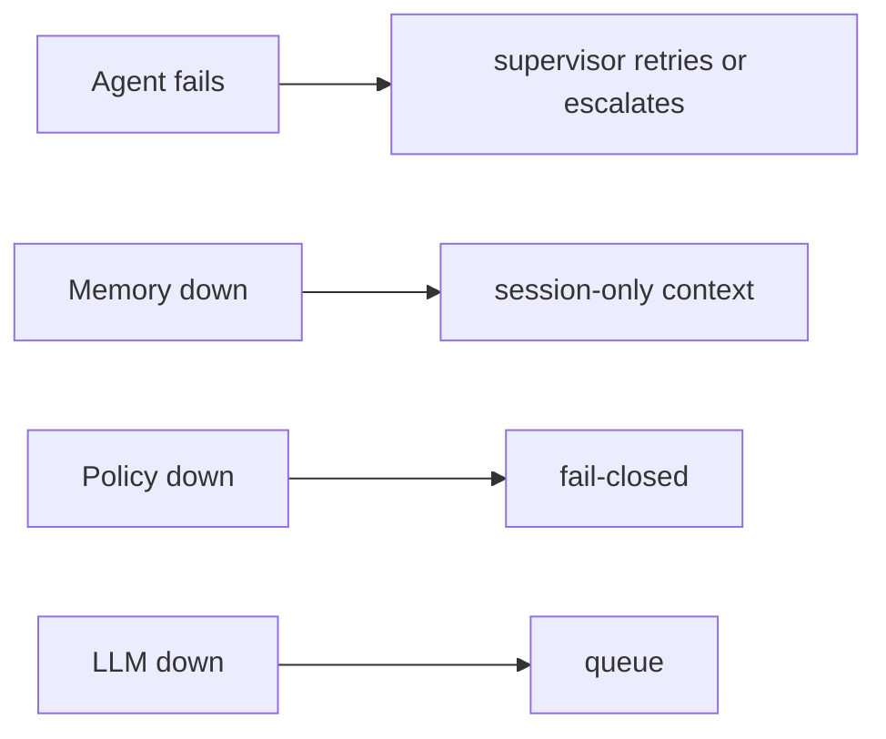

# Case Study: Enterprise Agent Platform

> **Tier:** ai-systems · **Status:** complete · Original numbers and diagrams.

## 11. High-level architecture

## 28. Original Mermaid diagrams

Standalone sources under `diagrams/case-studies/enterprise-agent-platform/`: `context.mmd`, `request-sequence.mmd`, `failure-flow.mmd`, `scaling-evolution.mmd`. Request sequence and failure flow:

## 1. Problem statement

A platform for building, deploying, and managing multiple specialized AI agents across an enterprise, with shared memory, tool registry, supervisor coordination, policy gateway, and full audit.

This system sits at the intersection of distributed systems and operational reliability. The design must balance latency versus durability while ensuring no single component failure cascades. The target audience includes engineers and operators, so the design must be observable, debuggable, and reversible.
## 2. Scope

In: agent builder, tool registry with risk tiers, shared memory, supervisor coordination, policy gateway, multi-tenant, audit. Out: autonomous cross-agent execution without approval.

The scope boundary is deliberate: including too much in v1 risks a system that is broad but shallow. Each excluded feature is a candidate for a later iteration once the core loop is proven.
## 3. Functional requirements

- Build and deploy specialized agents (monitoring, config, incident, compliance). - Share a tool registry with risk tiers. - Coordinate agents via a supervisor. - Enforce policy gateway on every action. - Per-tenant isolation. - Full audit.

These requirements drive the architecture: the read-heavy pattern pushes toward caching; the durability requirement forces synchronous writes; the idempotency requirement means every write path handles redelivery without double-application.
## 4. Non-functional requirements

- Agent step latency < 2 s. - No unauthorized high-risk action. - Availability 99.9 percent.

The non-functional targets shape every component choice: the latency SLO forces edge caching and limits synchronous cross-region calls; the availability target drives redundancy (RF=3, multi-AZ); the cost target constrains the model size.
## 5. Explicit assumptions

1. 10 agent types, 50 concurrent sessions. 2. 80 percent read/draft, 20 percent approval-gated. 3. Policy fail-closed.

These assumptions are the load-bearing facts of the design. If any is wrong by an order of magnitude, the architecture must adapt: 10x more traffic may require sharding earlier; a different read-write ratio changes the caching strategy entirely.
## 6. Traffic estimation

50 concurrent sessions; each session has multiple steps (LLM + tool calls).

The traffic estimate reveals the binding constraint. Peak is modeled at 10x average. The read-write ratio determines whether the system is cache-dominated (read-heavy) or write-path-dominated (write-heavy), which changes the storage and replication strategy.
## 7. Storage estimation

Agent sessions + shared memory + tool results + approvals + audit; moderate, auditable.

Storage growth is linear with time and must be planned with retention. The estimate includes metadata and index overhead (20-30 percent above raw). Without a retention policy, storage grows unboundedly.
## 8. Bandwidth estimation

Agent-to-tool calls + LLM; moderate.

Bandwidth is often not the binding constraint but becomes significant at the edge during viral spikes. CDN and edge caching cut origin egress; compression cuts bandwidth by 50-80 percent where applicable.
## 9. API design

POST /agents (type, config) -> agent id; POST /agents/:id/run (goal) -> session; WS /agents/:id/stream; GET /agents/:id/trace.

The API follows REST for external clients and gRPC for internal calls. Every write endpoint accepts an idempotency key. Rate limiting is enforced at the gateway before the service tier.
## 10. Data model

agents(id, type, config, tools[]); sessions(id, agent, goal, state, steps[]); memory(id, namespace, key, value, embedding); audit(actor, action, ts, result).

The data model is designed around the access pattern, not the entity shape. The primary access path determines the partition key; secondary paths determine indexes. Denormalization is applied selectively where the hot read path would otherwise require expensive joins.
## 12. Request flow

Goal -> supervisor decomposes -> routes to specialists -> each calls tools from shared registry -> policy gateway: read-only allowed, high-risk to approval -> shared memory provides cross-agent context -> audit all.

The request flow reveals the critical path: any component on the hot path that fails or slows degrades the user experience. The design applies timeouts, circuit breakers, and bulkheads to each hop. The write path includes an idempotency check before any state mutation.
## 13. Component responsibilities

Agent builder, supervisor, specialist agents, shared tool registry, shared memory (vector + KV), policy gateway, approval workflow, audit.

Each component has a single, well-defined responsibility. The gateway handles auth and routing; the service tier is stateless and horizontally scalable; the data tier is the stateful core, carefully partitioned and replicated. The separation allows each tier to scale independently.
## 14. Database selection

Session store (relational); shared memory (vector + KV); tool registry (KV, hot-reloaded); audit (append-only, tamper-evident).

The database choice is driven by the access pattern. The rejected alternatives were rejected for specific reasons: a relational DB was rejected if the workload is a single key lookup at massive scale; a KV store was rejected if joins and transactions are needed.
## 15. Caching strategy

Session state cached; tool results cached (permission-aware); common patterns cached; memory lookups cached.

The caching strategy is designed around the staleness tolerance of the workload. Cache-aside is the default; write-through is used where read-after-write consistency is required. Stampede protection is applied to any key that can go viral. Cache entries are namespaced by tenant.
## 16. Partitioning strategy

Sessions by tenant; memory by namespace; audit by date; tools global.

The partition key co-locates related data while distributing load evenly. Consistent hashing with virtual nodes minimizes data movement when nodes change. A hot key is mitigated by caching, extra replication, or key splitting.
## 17. Replication strategy

Session RF=3; memory replicated; audit append-only; gateway stateless + HA.

Replication is synchronous on the write-confirmation path where durability is critical and asynchronous elsewhere. RF=3 tolerates one failure. Failover is tested, not just configured. Cross-region replication is asynchronous with a documented RPO.
## 18. Consistency model

Session state per session; memory eventually consistent; approvals strongly consistent; audit tamper-evident.

The consistency model is the weakest that users can tolerate. Read-your-writes is provided where the user expects to see their own write. Eventual consistency is bounded (seconds) and monitored. The system documents what eventual means to users.
## 19. Failure scenarios

Agent fails -> supervisor retries or escalates. Memory down -> session-only context. Policy down -> fail-closed. LLM down -> queue.

Each failure scenario has a documented response: which component detects it, how failover happens, what the user experiences, and how recovery is verified. Bulkheads and circuit breakers prevent one slow dependency from cascading.
## 20. Reliability strategy

SLI agent step latency, zero-unauthorized; SLO 99.9 percent. Fail-closed policy.

The SLO defines what good means measurably; the error budget is the allowed unavailability spent on deploys and feature risk. The system is tested with chaos engineering to verify resilience. An untested failover is not a failover.
## 21. Security considerations

Policy gateway (no auto-high-risk); per-tenant isolation; PII redaction; tool risk tiers; RBAC on approvals; full audit; air-gapped option.

Security is defense in depth: TLS, encryption at rest, RBAC with default-deny, PII redaction in logs, audit trails, and per-tenant isolation. For AI-augmented systems, the policy gateway is fail-closed: on any error, the system refuses to act.
## 22. Observability strategy

Agent step count, tool call rate, approval rate, policy denials, unauthorized (0), memory hit rate, cost per session.

Observability uses logs, metrics, and traces with correlation IDs. The golden signals (latency, traffic, errors, saturation) are the first dashboard. Alerts fire on SLO burn rate, not raw thresholds. The on-call runbook for each alert is tested.
## 23. Cost considerations

LLM inference per step; multi-model routing cuts cost (supervisor on small, specialists on appropriate model); memory reduces repeated LLM calls.

Cost is dominated by the binding resource. Primary levers: caching (cuts read cost), tiering (cuts storage cost), batching (cuts per-request overhead), and right-sizing. Cost is tracked as a first-class metric and alerted on when unit cost spikes.
## 24. Scaling stages

Stage 1: single agent + tools + policy. -> Stage 2: supervisor + shared memory + multi-agent. -> Stage 3: multi-tenant + governance + evaluation. -> Stage 4: enterprise fleet, multi-region, air-gapped.

The scaling stages are triggered by specific thresholds, not by calendar. Each stage is a deliberate architectural change: Stage 1 handles initial load; Stage 2 when a single node saturates; Stage 3 when latency exceeds the SLO; Stage 4 when hot keys threaten the origin.
## 25. Trade-offs

Multi-agent (specialization) vs single (simplicity). Shared memory (efficiency) vs isolation (safety). Autonomy (speed) vs approval (safety). Centralized tools (consistency) vs per-agent (flexibility).

Every trade-off has a rejected alternative with a reason. The design does not present one option as universally correct; it presents the chosen option, the rejected alternative, and the workload-specific reason.
## 26. Alternative designs

Single agent (no specialization). No policy (unsafe). No memory (repeated work). No supervisor (no coordination). Full autonomy (unsafe).

The alternative designs are genuine architectures that would work under different constraints. They were rejected for this workload because of specific requirements that make them inferior here but not universally inferior.
## 27. Interview discussion points

Clarify agent count, tool risk tiers, approval workflow, memory sharing. Surface supervisor, tool registry, shared memory, policy gateway, audit.

In an interview, the strongest candidates clarify ambiguity before designing, surface the read-write ratio and the binding resource, design the hot path deeply, discuss failure modes explicitly, and offer an alternative with a reason.
## 29. Further reading

Agentic systems: docs/ai-systems/08-agentic-systems; AI security: 09-ai-security; AI safety gateway case; secure network agent case.

The further reading cites primary sources (RFCs, papers, official documentation) via stable IDs in SOURCES.md, not secondary blog posts. Each citation is chosen because it is the authoritative source for a specific technical claim.
## 30. Practical exercises

1. 3-agent team with supervisor. 2. Tool risk tiers. 3. Shared memory with per-tenant isolation. 4. Policy gateway fail-closed. 5. Audit replay.

---
Previous: AI safety and policy gateway · Next: Offline air-gapped RAG platform

The exercises push the reader beyond v1: re-estimating at 10x reveals capacity limits; adding a new requirement forces an architectural change; designing the failover test reveals whether resilience claims are real.
