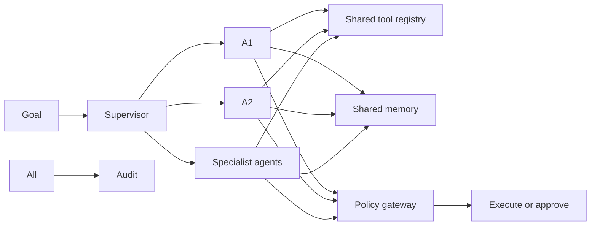
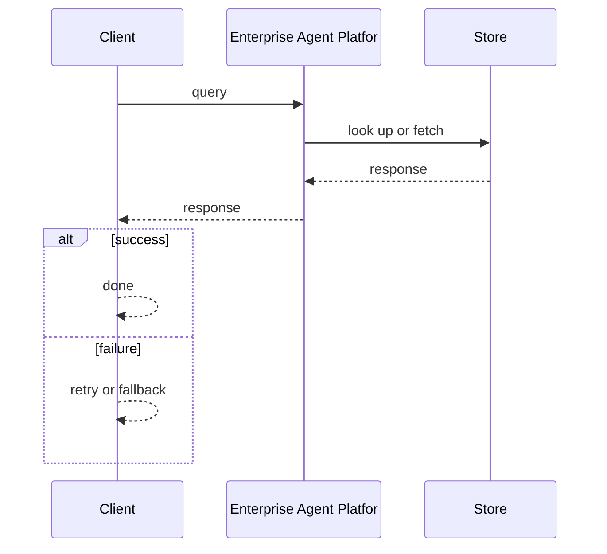
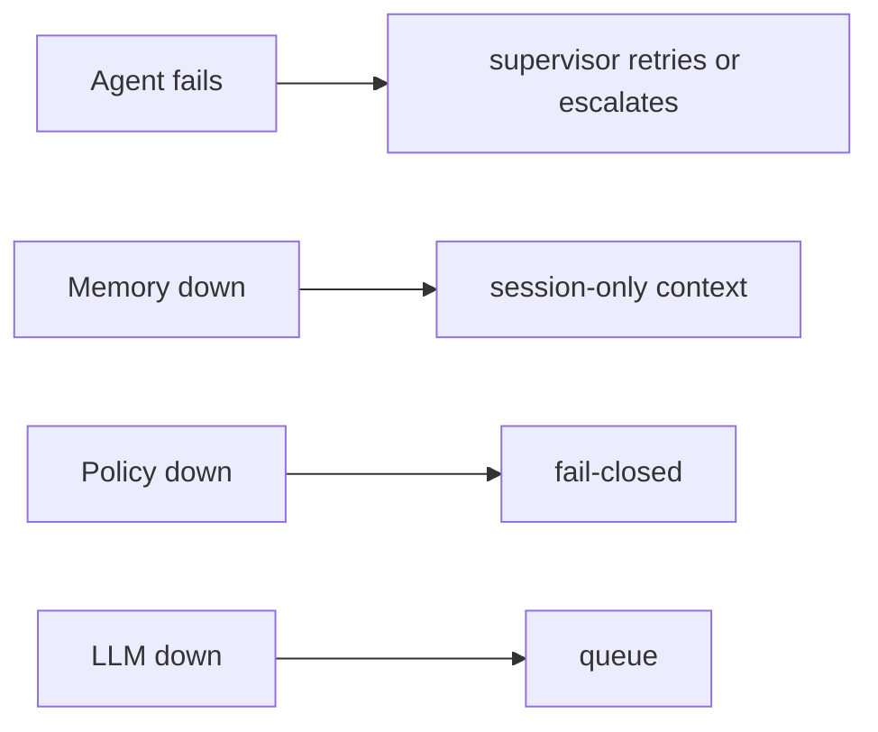

# Case Study: Enterprise Agent Platform

> **Tier:** ai-systems · **Status:** complete · Original numbers and diagrams.

## 11. High-level architecture

## 28. Original Mermaid diagrams
Standalone sources under `diagrams/case-studies/enterprise-agent-platform/`: `context.mmd`, `request-sequence.mmd`, `failure-flow.mmd`, `scaling-evolution.mmd`. The diagrams are embedded in their respective sections: architecture in section 11, request flow in section 12, failure scenarios in section 19, and scaling stages in section 24.

## 1. Problem statement

A platform for building, deploying, and managing multiple specialized AI agents across an enterprise, with shared memory, tool registry, supervisor coordination, policy gateway, and full audit.

## 2. Scope

In: agent builder, tool registry with risk tiers, shared memory, supervisor coordination, policy gateway, multi-tenant, audit. Out: autonomous cross-agent execution without approval.

## 3. Functional requirements

- Build and deploy specialized agents (monitoring, config, incident, compliance).
- Share a tool registry with risk tiers.
- Coordinate agents via a supervisor.
- Enforce policy gateway on every action.
- Per-tenant isolation.
- Full audit.

## 4. Non-functional requirements

- Agent step latency < 2 s.
- No unauthorized high-risk action.
- Availability 99.9 percent.

## 5. Explicit assumptions

1. 10 agent types, 50 concurrent sessions. 2. 80 percent read/draft, 20 percent approval-gated. 3. Policy fail-closed.

## 6. Traffic estimation

50 concurrent sessions; each session has multiple steps (LLM + tool calls).

## 7. Storage estimation

Agent sessions + shared memory + tool results + approvals + audit; moderate, auditable.

## 8. Bandwidth estimation

Agent-to-tool calls + LLM; moderate.

## 9. API design

POST /agents (type, config) -> agent id; POST /agents/:id/run (goal) -> session; WS /agents/:id/stream; GET /agents/:id/trace.

## 10. Data model

agents(id, type, config, tools[]); sessions(id, agent, goal, state, steps[]); memory(id, namespace, key, value, embedding); audit(actor, action, ts, result).

## 12. Request flow
Goal -> supervisor decomposes -> routes to specialists -> each calls tools from shared registry -> policy gateway: read-only allowed, high-risk to approval -> shared memory provides cross-agent context -> audit all.

## 13. Component responsibilities

Agent builder, supervisor, specialist agents, shared tool registry, shared memory (vector + KV), policy gateway, approval workflow, audit.

## 14. Database selection

Session store (relational); shared memory (vector + KV); tool registry (KV, hot-reloaded); audit (append-only, tamper-evident).

## 15. Caching strategy

Session state cached; tool results cached (permission-aware); common patterns cached; memory lookups cached.

## 16. Partitioning strategy

Sessions by tenant; memory by namespace; audit by date; tools global.

## 17. Replication strategy

Session RF=3; memory replicated; audit append-only; gateway stateless + HA.

## 18. Consistency model

Session state per session; memory eventually consistent; approvals strongly consistent; audit tamper-evident.

## 19. Failure scenarios
Agent fails -> supervisor retries or escalates. Memory down -> session-only context. Policy down -> fail-closed. LLM down -> queue.

## 20. Reliability strategy

SLI agent step latency, zero-unauthorized; SLO 99.9 percent. Fail-closed policy.

## 21. Security considerations

Policy gateway (no auto-high-risk); per-tenant isolation; PII redaction; tool risk tiers; RBAC on approvals; full audit; air-gapped option.

## 22. Observability strategy

Agent step count, tool call rate, approval rate, policy denials, unauthorized (0), memory hit rate, cost per session.

## 23. Cost considerations

LLM inference per step; multi-model routing cuts cost (supervisor on small, specialists on appropriate model); memory reduces repeated LLM calls.

## 24. Scaling stages

Stage 1: single agent + tools + policy. -> Stage 2: supervisor + shared memory + multi-agent. -> Stage 3: multi-tenant + governance + evaluation. -> Stage 4: enterprise fleet, multi-region, air-gapped.

## 25. Trade-offs

Multi-agent (specialization) vs single (simplicity). Shared memory (efficiency) vs isolation (safety). Autonomy (speed) vs approval (safety). Centralized tools (consistency) vs per-agent (flexibility).

## 26. Alternative designs

Single agent (no specialization). No policy (unsafe). No memory (repeated work). No supervisor (no coordination). Full autonomy (unsafe).

## 27. Interview discussion points

Clarify agent count, tool risk tiers, approval workflow, memory sharing. Surface supervisor, tool registry, shared memory, policy gateway, audit.

## 29. Further reading

Agentic systems: docs/ai-systems/08-agentic-systems; AI security: 09-ai-security; AI safety gateway case; secure network agent case.

## 30. Practical exercises

1. 3-agent team with supervisor. 2. Tool risk tiers. 3. Shared memory with per-tenant isolation. 4. Policy gateway fail-closed. 5. Audit replay.

---
Previous: AI safety and policy gateway · Next: Offline air-gapped RAG platform

