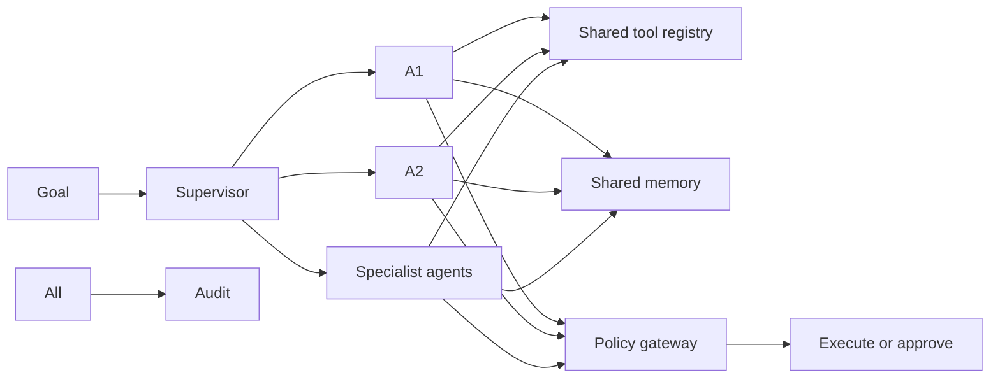
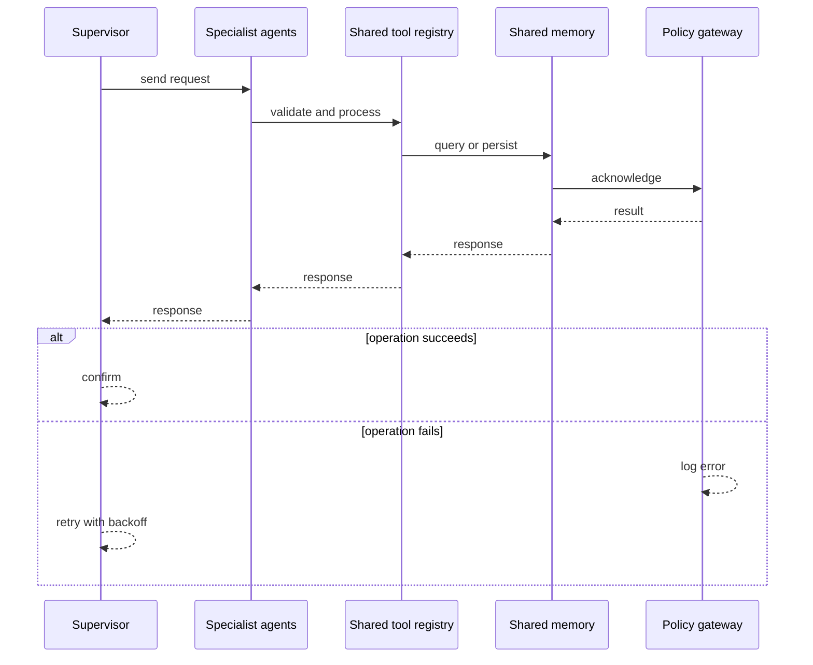
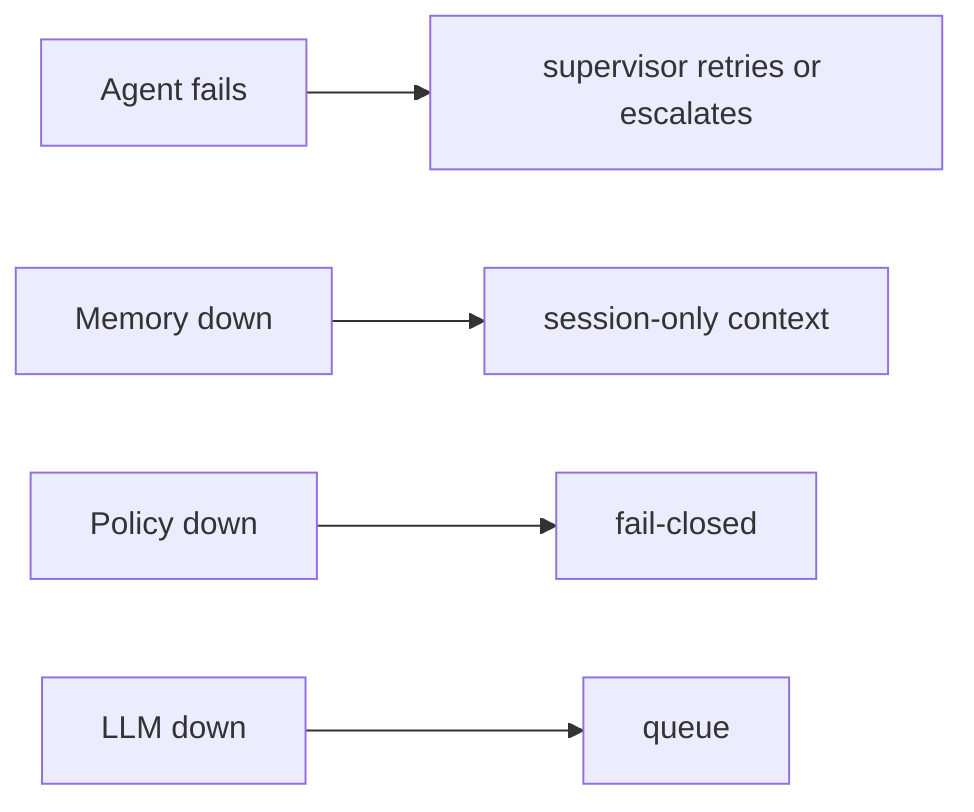
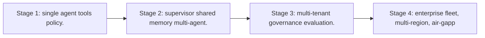

# Case Study: Enterprise Agent Platform

> **Tier:** ai-systems · **Status:** complete · Original numbers and diagrams.

## 1. Problem statement
A platform for building, deploying, and managing multiple specialized AI agents across an enterprise, with shared memory, tool registry, supervisor coordination, policy gateway, and full audit. This is a ai-systems-tier system design challenge because it must handle high availability under peak load while ensuring no single point of failure. The design must be production-grade: observable, debuggable, reversible, and able to survive component failures without data loss or cascading outages.

## 2. Scope
In: agent builder, tool registry with risk tiers, shared memory, supervisor coordination, policy gateway, multi-tenant, audit. Out: autonomous cross-agent execution without approval.

For Enterprise Agent Platform, these boundaries keep the first version focused on the core user value. Adding more features would dilute the design and delay shipping. Each excluded item is a scaling stage — a candidate for the next iteration once the baseline is proven.

## 3. Functional requirements
- Build and deploy specialized agents (monitoring, config, incident, compliance).
- Share a tool registry with risk tiers.
- Coordinate agents via a supervisor.
- Enforce policy gateway on every action.
- Per-tenant isolation.
- Full audit.

For Enterprise Agent Platform, these requirements drive specific architectural decisions: the read-write ratio determines the caching strategy, the durability target sets the replication mode, and the idempotency requirement shapes the API contract.

## 4. Non-functional requirements
- Agent step latency < 2 s.
- No unauthorized high-risk action.
- Availability 99.9 percent.

For Enterprise Agent Platform, each non-functional target constrains a specific component: the latency SLO bounds the number of synchronous hops, the availability target forces redundancy across availability zones, and the cost ceiling limits the replication factor and storage tier.

## 5. Explicit assumptions
1. 10 agent types, 50 concurrent sessions. 2. 80 percent read/draft, 20 percent approval-gated. 3. Policy fail-closed.

For Enterprise Agent Platform, if these assumptions are off by an order of magnitude, the architecture must adapt: 10x traffic may require earlier sharding, a different read-write ratio changes the caching strategy, and a higher peak multiplier demands more headroom.

## 6. Traffic estimation
50 concurrent sessions; each session has multiple steps (LLM + tool calls).

To derive the request rate: divide the daily volume by 86,400 seconds to get the average rate, then multiply by 5-10x for peak. The read-to-write ratio determines whether the system is cache-dominated (read-heavy) or write-path-dominated (write-heavy). For Enterprise Agent Platform, this ratio shapes the entire storage and replication strategy.

## 7. Storage estimation
Agent sessions + shared memory + tool results + approvals + audit; moderate, auditable.

For Enterprise Agent Platform, storage growth is projected from the daily write volume and retention policy. Index overhead and compression factors are accounted for in the total.

## 8. Bandwidth estimation
Agent-to-tool calls + LLM; moderate.

Bandwidth is request rate multiplied by average payload size for ingress, and response rate multiplied by response size for egress. CDN and edge caching reduce origin egress. Compression reduces bandwidth by 50-80 percent where applicable. For Enterprise Agent Platform, bandwidth may or may not be the binding constraint — compare it against compute and storage to find out.

## 9. API design

POST /agents (type, config) -> agent id; POST /agents/:id/run (goal) -> session; WS /agents/:id/stream; GET /agents/:id/trace.

## 10. Data model
agents(id, type, config, tools[]); sessions(id, agent, goal, state, steps[]); memory(id, namespace, key, value, embedding); audit(actor, action, ts, result).

For Enterprise Agent Platform, the data model follows the access pattern. The primary lookup determines the partition key; secondary lookups determine indexes. Denormalization is used selectively on hot read paths.

## 11. High-level architecture

## 12. Request flow
Goal -> supervisor decomposes -> routes to specialists -> each calls tools from shared registry -> policy gateway: read-only allowed, high-risk to approval -> shared memory provides cross-agent context -> audit all.

## 13. Component responsibilities
Agent builder, supervisor, specialist agents, shared tool registry, shared memory (vector + KV), policy gateway, approval workflow, audit.

For Enterprise Agent Platform, each component has one job. The gateway authenticates and routes. Services are stateless and scale horizontally. The data tier is the stateful core that scales by sharding.

## 14. Database selection
Session store (relational); shared memory (vector + KV); tool registry (KV, hot-reloaded); audit (append-only, tamper-evident).

For Enterprise Agent Platform, the database was chosen by access pattern, not familiarity. The rejected alternatives were wrong for this workload, not bad in general.

## 15. Caching strategy
Session state cached; tool results cached (permission-aware); common patterns cached; memory lookups cached.

For Enterprise Agent Platform, the cache strategy matches the staleness tolerance. Cache-aside for most data, write-through where read-after-write matters, stampede protection on hot keys.

## 16. Partitioning strategy
Sessions by tenant; memory by namespace; audit by date; tools global.

For Enterprise Agent Platform, the partition key balances query locality with even load distribution. Sharding strategy matters because a poor key creates hot spots under real traffic patterns.

## 17. Replication strategy
Session RF=3; memory replicated; audit append-only; gateway stateless + HA.

For Enterprise Agent Platform, replication mode is split: synchronous where durability is critical, asynchronous elsewhere for throughput. RF=3 tolerates one failure. Failover is tested regularly.

## 18. Consistency model
Session state per session; memory eventually consistent; approvals strongly consistent; audit tamper-evident.

For Enterprise Agent Platform, the consistency level is the weakest users accept. Read-your-writes is provided where needed. Eventual consistency is bounded and monitored, not unbounded and silent.

## 19. Failure scenarios
Agent fails -> supervisor retries or escalates. Memory down -> session-only context. Policy down -> fail-closed. LLM down -> queue.

## 20. Reliability strategy
SLI agent step latency, zero-unauthorized; SLO 99.9 percent. Fail-closed policy.

For Enterprise Agent Platform, the SLO makes reliability measurable. The error budget balances feature velocity with stability. Chaos testing validates that resilience claims hold under real failures.

## 21. Security considerations
Policy gateway (no auto-high-risk); per-tenant isolation; PII redaction; tool risk tiers; RBAC on approvals; full audit; air-gapped option.

For Enterprise Agent Platform, security layers TLS, encryption at rest, RBAC, PII redaction, and audit. The policy gateway is fail-closed for AI-augmented operations.

## 22. Observability strategy
Agent step count, tool call rate, approval rate, policy denials, unauthorized (0), memory hit rate, cost per session.

For Enterprise Agent Platform, observability combines logs, metrics, and traces with correlation IDs. Golden signals drive the first dashboard. Alerts fire on burn rate, not raw thresholds.

## 23. Cost considerations
LLM inference per step; multi-model routing cuts cost (supervisor on small, specialists on appropriate model); memory reduces repeated LLM calls.

For Enterprise Agent Platform, cost is driven by the binding resource. Caching, tiering, batching, and right-sizing are the levers. Cost per request is tracked and alerted on.

## 24. Scaling stages
Stage 1: single agent + tools + policy. -> Stage 2: supervisor + shared memory + multi-agent. -> Stage 3: multi-tenant + governance + evaluation. -> Stage 4: enterprise fleet, multi-region, air-gapped.

## 25. Trade-offs
Multi-agent (specialization) vs single (simplicity). Shared memory (efficiency) vs isolation (safety). Autonomy (speed) vs approval (safety). Centralized tools (consistency) vs per-agent (flexibility).

For Enterprise Agent Platform, each trade-off lists what was chosen, what was rejected, and why. This makes the design defensible in review — every decision has documented reasoning.

## 26. Alternative designs
Single agent (no specialization). No policy (unsafe). No memory (repeated work). No supervisor (no coordination). Full autonomy (unsafe).

For Enterprise Agent Platform, the alternatives are real architectures that work under different constraints. They were rejected for this workload's specific requirements, not because they are bad designs.

## 27. Interview discussion points
Clarify agent count, tool risk tiers, approval workflow, memory sharing. Surface supervisor, tool registry, shared memory, policy gateway, audit.

For Enterprise Agent Platform in an interview: clarify scope first, surface the read-write ratio, design the hot path deeply, discuss failures, and offer an alternative. Weak candidates skip failure modes.

## 28. Original Mermaid diagrams
Standalone sources under `diagrams/case-studies/enterprise-agent-platform/`: `context.mmd`, `request-sequence.mmd`, `failure-flow.mmd`, `scaling-evolution.mmd`. The diagrams are embedded in their respective sections: architecture in section 11, request flow in section 12, failure scenarios in section 19, and scaling stages in section 24.

## 29. Further reading
Agentic systems: docs/ai-systems/08-agentic-systems; AI security: 09-ai-security; AI safety gateway case; secure network agent case. Sources: `S-RAG` `S-VECTORDB`.

## 30. Practical exercises

1. 3-agent team with supervisor. 2. Tool risk tiers. 3. Shared memory with per-tenant isolation. 4. Policy gateway fail-closed. 5. Audit replay.

---
Previous: AI safety and policy gateway · Next: Offline air-gapped RAG platform

