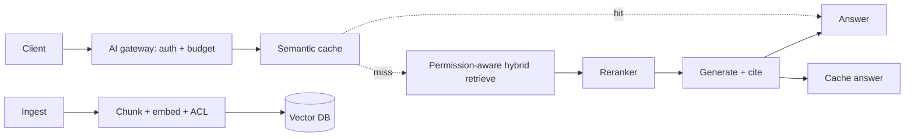
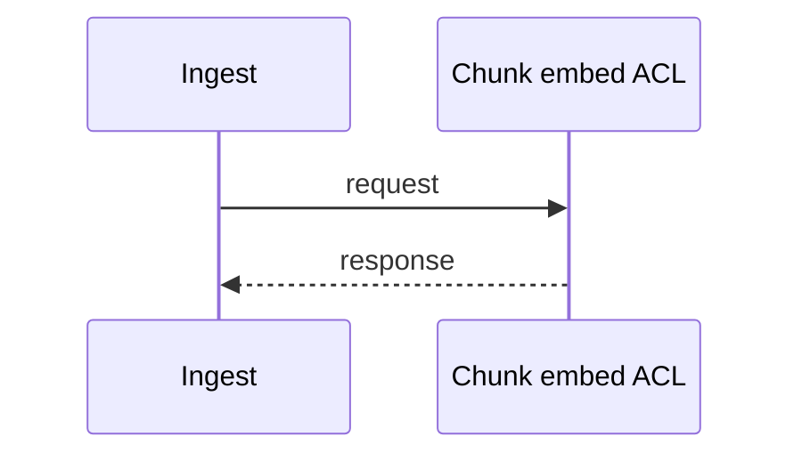
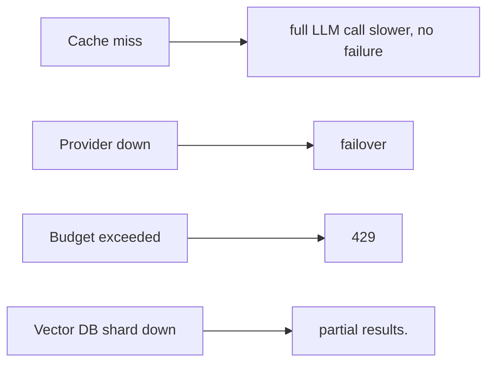
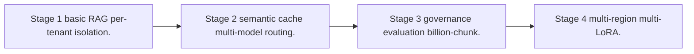

# Case Study: Enterprise RAG Platform

> **Tier:** ai-systems · **Status:** beta · Original numbers and diagrams.

## 11. High-level architecture

## 28. Original Mermaid diagrams

Standalone sources under `diagrams/case-studies/enterprise-rag-platform/`: `context.mmd`, `request-sequence.mmd`, `failure-flow.mmd`, `scaling-evolution.mmd`. Additional diagrams:

## 1. Problem statement

An enterprise RAG platform serving thousands of tenants, each with private corpora, permission-aware retrieval, per-tenant token budgets, semantic caching, multi-model routing, and AI governance.

## 2. Scope

In (v1): multi-tenant ingestion, permission-aware hybrid retrieval, reranking, grounded generation with citations, semantic caching, multi-model routing, per-tenant quotas, audit. Out: autonomous action (excluded).

## 3. Functional requirements

- Ingest per-tenant corpora with ACLs. - Retrieve with permission filtering. - Generate grounded answers with citations. - Cache semantically equivalent queries (safe ones only). - Route by task complexity to the cheapest capable model. - Enforce per-tenant token budgets. - Full audit.

## 4. Non-functional requirements

- Answer p99 < 3 s. - No cross-tenant retrieval leakage. - Availability 99.9 percent. - Cost capped per tenant.

## 5. Explicit assumptions

1. 1k tenants, 10M chunks total, 100 queries/s peak. [assumption] 2. 20 percent cache hit rate. [assumption] 3. Permission filtering before generation. [constraint]

## 6. Traffic estimation

100 queries/s peak; bursts during business hours; cache hits skip LLM.

## 7. Storage estimation

10M chunks x embeddings x metadata = ~30 TB vectors + index; per-tenant namespace isolation.

## 8. Bandwidth estimation

Queries small; retrieval results small; generation streamed.

## 9. API design

POST /ask (tenant, question) -> streamed answer + citations; POST /ingest (tenant, docs).

## 10. Data model

chunks(tenant, id, text, embedding, acl, metadata); cache(query_hash, tenant, answer, ttl); usage(tenant, tokens, cost, budget).

## 12. Request flow

Client asks -> gateway auth + budget check -> semantic cache lookup (safe + same tenant) -> hit returns; miss -> permission-aware hybrid retrieve + rerank -> generate with citations -> cache safe answer -> return; audit all.

## 13. Component responsibilities

AI gateway, semantic cache, permission-aware retrieval, reranker, LLM serving, ingestion pipeline, usage/budget tracker, audit.

## 14. Database selection

Vector DB (per-tenant namespaces); semantic cache (embedding index + KV); usage store (relational); audit (append-only). Rejected: shared cache across tenants (leakage).

## 15. Caching strategy

Semantic cache namespaced by tenant + model + prompt version; unsafe for time-sensitive or user-specific queries; TTL for freshness.

## 16. Partitioning strategy

Vector index sharded by tenant; cache by tenant; gateway stateless; usage by tenant.

## 17. Replication strategy

Vector DB RF=3; cache replicated; gateway stateless + provider failover.

## 18. Consistency model

Retrieval eventually consistent with ingest; cache versioned to model/corpus; budget strongly tracked.

## 19. Failure scenarios

Cache miss -> full LLM call (slower, no failure). Provider down -> failover. Budget exceeded -> 429. Vector DB shard down -> partial results.

## 20. Reliability strategy

SLI answer latency, groundedness, zero-cross-tenant-leak; SLO 99.9 percent. Failover + budget enforcement. Chaos: kill a provider, assert failover.

## 21. Security considerations

Permission-aware retrieval (filter before generation); per-tenant isolation; PII redaction; no confidential data to unapproved external models; full audit; AI safety gateway.

## 22. Observability strategy

Answer p99, cache hit ratio, cost per tenant, cross-tenant leakage attempts (0), groundedness score, provider failover rate.

## 23. Cost considerations

LLM calls dominate; cache + routing cut cost. Per-tenant budgets cap spend; small models for simple queries.

## 24. Scaling stages

Stage 1: basic RAG + per-tenant isolation. -> Stage 2: semantic cache + multi-model routing. -> Stage 3: governance + evaluation + billion-chunk. -> Stage 4: multi-region + multi-LoRA.

## 25. Trade-offs

Cache (cost) vs freshness/safety. Routing (cost) vs quality. Permission pre-filter (safe) vs post-filter (fast). Multi-tenant shared (efficient) vs isolated (safe).

## 26. Alternative designs

Single model (cost). Shared cache (leakage). No permission filter (unauthorized access). Post-filter (leaks to model).

## 27. Interview discussion points

Clarify tenant count, permission model, cache safety, budget enforcement. Surface permission-aware retrieval, semantic caching, multi-model routing, and governance.

## 29. Further reading

RAG: docs/ai-systems/06-basic-rag and 07-advanced-rag; semantic caching: 14-semantic-caching; LLM gateway: 13-llm-gateway; security: 09-ai-security.

## 30. Practical exercises

1. Design permission-aware retrieval with ACLs. 2. Safe vs unsafe cache categories. 3. Multi-model routing policy. 4. Per-tenant budget enforcement. 5. Cross-tenant leak test.

---
Previous: (AI case studies start) · Next: Autonomous support-agent team
