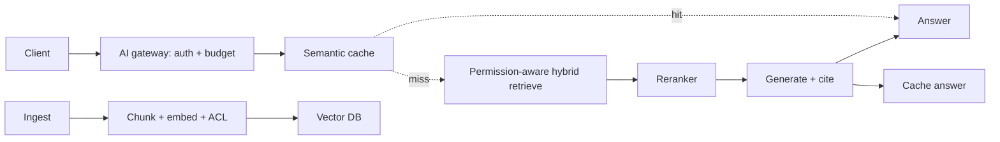
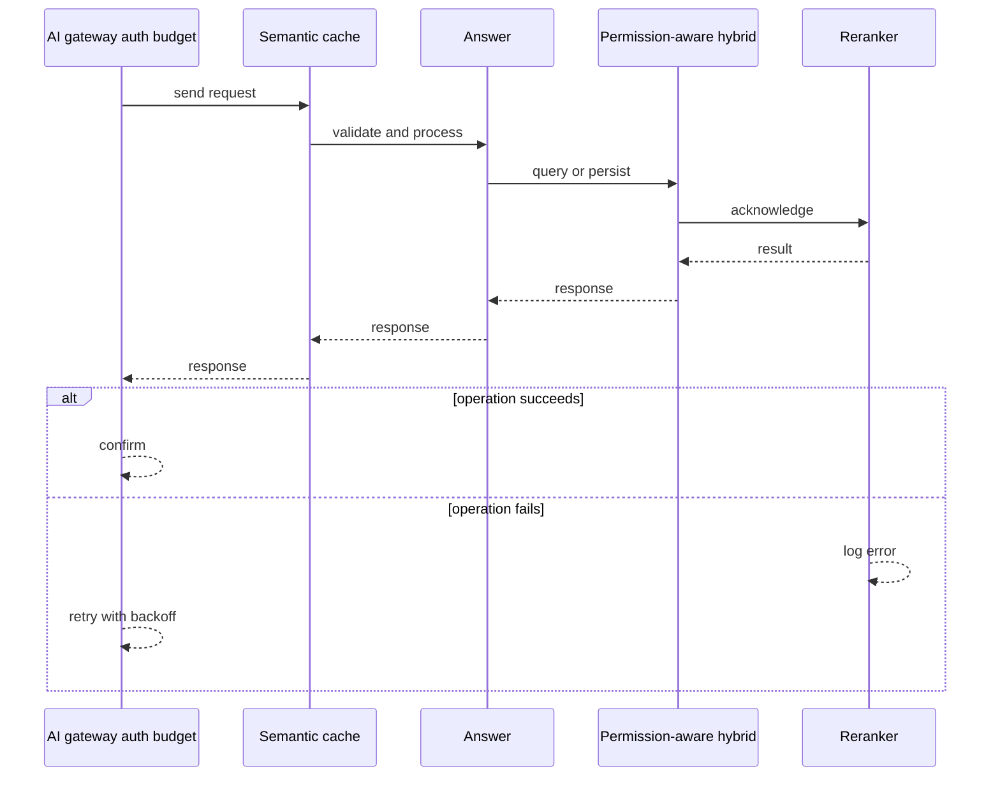
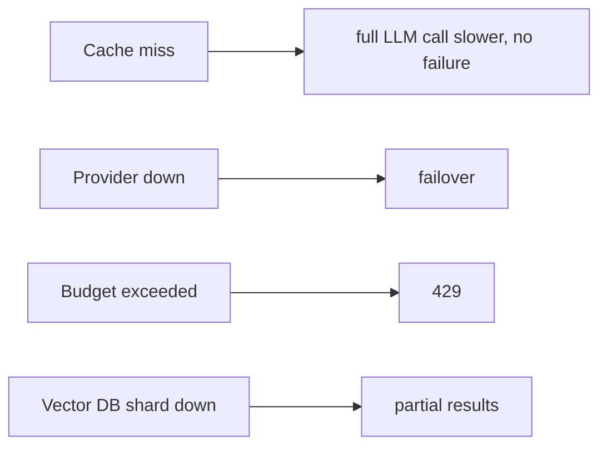
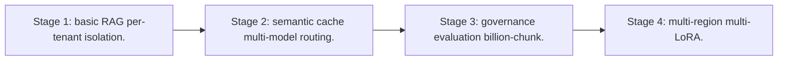

# Case Study: Enterprise RAG Platform

> **Tier:** ai-systems · **Status:** complete · Original numbers and diagrams.

## 1. Problem statement
An enterprise RAG platform serving thousands of tenants, each with private corpora, permission-aware retrieval, per-tenant token budgets, semantic caching, multi-model routing, and AI governance. This is a ai-systems-tier system design challenge because it must handle GPU-bound inference at scale while ensuring grounded, cited, and permission-aware answers. The design must be production-grade: observable, debuggable, reversible, and able to survive component failures without data loss or cascading outages.

## 2. Scope
In (v1): multi-tenant ingestion, permission-aware hybrid retrieval, reranking, grounded generation with citations, semantic caching, multi-model routing, per-tenant quotas, audit. Out: autonomous action (excluded).

For Enterprise RAG Platform, these boundaries keep the first version focused on the core user value. Adding more features would dilute the design and delay shipping. Each excluded item is a scaling stage — a candidate for the next iteration once the baseline is proven.

## 3. Functional requirements
- Ingest per-tenant corpora with ACLs.
- Retrieve with permission filtering.
- Generate grounded answers with citations.
- Cache semantically equivalent queries (safe ones only).
- Route by task complexity to the cheapest capable model.
- Enforce per-tenant token budgets.
- Full audit.

For Enterprise RAG Platform, these requirements drive specific architectural decisions: the read-write ratio determines the caching strategy, the durability target sets the replication mode, and the idempotency requirement shapes the API contract.

## 4. Non-functional requirements
- Answer p99 < 3 s.
- No cross-tenant retrieval leakage.
- Availability 99.9 percent.
- Cost capped per tenant.

For Enterprise RAG Platform, each non-functional target constrains a specific component: the latency SLO bounds the number of synchronous hops, the availability target forces redundancy across availability zones, and the cost ceiling limits the replication factor and storage tier.

## 5. Explicit assumptions
1. 1k tenants, 10M chunks total, 100 queries/s peak. [assumption] 2. 20 percent cache hit rate. [assumption] 3. Permission filtering before generation. [constraint]

For Enterprise RAG Platform, if these assumptions are off by an order of magnitude, the architecture must adapt: 10x traffic may require earlier sharding, a different read-write ratio changes the caching strategy, and a higher peak multiplier demands more headroom.

## 6. Traffic estimation
100 queries/s peak; bursts during business hours; cache hits skip LLM.

To derive the request rate: divide the daily volume by 86,400 seconds to get the average rate, then multiply by 5-10x for peak. The read-to-write ratio determines whether the system is cache-dominated (read-heavy) or write-path-dominated (write-heavy). For Enterprise RAG Platform, this ratio shapes the entire storage and replication strategy.

## 7. Storage estimation
10M chunks x embeddings x metadata = ~30 TB vectors + index; per-tenant namespace isolation.

For Enterprise RAG Platform, storage growth is projected from the daily write volume and retention policy. Index overhead and compression factors are accounted for in the total.

## 8. Bandwidth estimation
Queries small; retrieval results small; generation streamed.

Bandwidth is request rate multiplied by average payload size for ingress, and response rate multiplied by response size for egress. CDN and edge caching reduce origin egress. Compression reduces bandwidth by 50-80 percent where applicable. For Enterprise RAG Platform, bandwidth may or may not be the binding constraint — compare it against compute and storage to find out.

## 9. API design

POST /ask (tenant, question) -> streamed answer + citations; POST /ingest (tenant, docs).

## 10. Data model
chunks(tenant, id, text, embedding, acl, metadata); cache(query_hash, tenant, answer, ttl); usage(tenant, tokens, cost, budget).

For Enterprise RAG Platform, the data model follows the access pattern. The primary lookup determines the partition key; secondary lookups determine indexes. Denormalization is used selectively on hot read paths.

## 11. High-level architecture

## 12. Request flow
Client asks -> gateway auth + budget check -> semantic cache lookup (safe + same tenant) -> hit returns; miss -> permission-aware hybrid retrieve + rerank -> generate with citations -> cache safe answer -> return; audit all.

## 13. Component responsibilities
AI gateway, semantic cache, permission-aware retrieval, reranker, LLM serving, ingestion pipeline, usage/budget tracker, audit.

For Enterprise RAG Platform, each component has one job. The gateway authenticates and routes. Services are stateless and scale horizontally. The data tier is the stateful core that scales by sharding.

## 14. Database selection
Vector DB (per-tenant namespaces); semantic cache (embedding index + KV); usage store (relational); audit (append-only). Rejected: shared cache across tenants (leakage).

For Enterprise RAG Platform, the database was chosen by access pattern, not familiarity. The rejected alternatives were wrong for this workload, not bad in general.

## 15. Caching strategy
Semantic cache namespaced by tenant + model + prompt version; unsafe for time-sensitive or user-specific queries; TTL for freshness.

For Enterprise RAG Platform, the cache strategy matches the staleness tolerance. Cache-aside for most data, write-through where read-after-write matters, stampede protection on hot keys.

## 16. Partitioning strategy
Vector index sharded by tenant; cache by tenant; gateway stateless; usage by tenant.

For Enterprise RAG Platform, the partition key balances query locality with even load distribution. Sharding strategy matters because a poor key creates hot spots under real traffic patterns.

## 17. Replication strategy
Vector DB RF=3; cache replicated; gateway stateless + provider failover.

For Enterprise RAG Platform, replication mode is split: synchronous where durability is critical, asynchronous elsewhere for throughput. RF=3 tolerates one failure. Failover is tested regularly.

## 18. Consistency model
Retrieval eventually consistent with ingest; cache versioned to model/corpus; budget strongly tracked.

For Enterprise RAG Platform, the consistency level is the weakest users accept. Read-your-writes is provided where needed. Eventual consistency is bounded and monitored, not unbounded and silent.

## 19. Failure scenarios
Cache miss -> full LLM call (slower, no failure). Provider down -> failover. Budget exceeded -> 429. Vector DB shard down -> partial results.

## 20. Reliability strategy
SLI answer latency, groundedness, zero-cross-tenant-leak; SLO 99.9 percent. Failover + budget enforcement. Chaos: kill a provider, assert failover.

For Enterprise RAG Platform, the SLO makes reliability measurable. The error budget balances feature velocity with stability. Chaos testing validates that resilience claims hold under real failures.

## 21. Security considerations
Permission-aware retrieval (filter before generation); per-tenant isolation; PII redaction; no confidential data to unapproved external models; full audit; AI safety gateway.

For Enterprise RAG Platform, security layers TLS, encryption at rest, RBAC, PII redaction, and audit. The policy gateway is fail-closed for AI-augmented operations.

## 22. Observability strategy
Answer p99, cache hit ratio, cost per tenant, cross-tenant leakage attempts (0), groundedness score, provider failover rate.

For Enterprise RAG Platform, observability combines logs, metrics, and traces with correlation IDs. Golden signals drive the first dashboard. Alerts fire on burn rate, not raw thresholds.

## 23. Cost considerations
LLM calls dominate; cache + routing cut cost. Per-tenant budgets cap spend; small models for simple queries.

For Enterprise RAG Platform, cost is driven by the binding resource. Caching, tiering, batching, and right-sizing are the levers. Cost per request is tracked and alerted on.

## 24. Scaling stages
Stage 1: basic RAG + per-tenant isolation. -> Stage 2: semantic cache + multi-model routing. -> Stage 3: governance + evaluation + billion-chunk. -> Stage 4: multi-region + multi-LoRA.

## 25. Trade-offs
Cache (cost) vs freshness/safety. Routing (cost) vs quality. Permission pre-filter (safe) vs post-filter (fast). Multi-tenant shared (efficient) vs isolated (safe).

For Enterprise RAG Platform, each trade-off lists what was chosen, what was rejected, and why. This makes the design defensible in review — every decision has documented reasoning.

## 26. Alternative designs
Single model (cost). Shared cache (leakage). No permission filter (unauthorized access). Post-filter (leaks to model).

For Enterprise RAG Platform, the alternatives are real architectures that work under different constraints. They were rejected for this workload's specific requirements, not because they are bad designs.

## 27. Interview discussion points
Clarify tenant count, permission model, cache safety, budget enforcement. Surface permission-aware retrieval, semantic caching, multi-model routing, and governance.

For Enterprise RAG Platform in an interview: clarify scope first, surface the read-write ratio, design the hot path deeply, discuss failures, and offer an alternative. Weak candidates skip failure modes.

## 28. Original Mermaid diagrams
Standalone sources under `diagrams/case-studies/enterprise-rag-platform/`: `context.mmd`, `request-sequence.mmd`, `failure-flow.mmd`, `scaling-evolution.mmd`. The diagrams are embedded in their respective sections: architecture in section 11, request flow in section 12, failure scenarios in section 19, and scaling stages in section 24.

## 29. Further reading
RAG: docs/ai-systems/06-basic-rag and 07-advanced-rag; semantic caching: 14-semantic-caching; LLM gateway: 13-llm-gateway; security: 09-ai-security. Sources: `S-VECTORDB` `S-RAG`.

## 30. Practical exercises

1. Design permission-aware retrieval with ACLs. 2. Safe vs unsafe cache categories. 3. Multi-model routing policy. 4. Per-tenant budget enforcement. 5. Cross-tenant leak test.

---
Previous: (AI case studies start) · Next: Autonomous support-agent team

