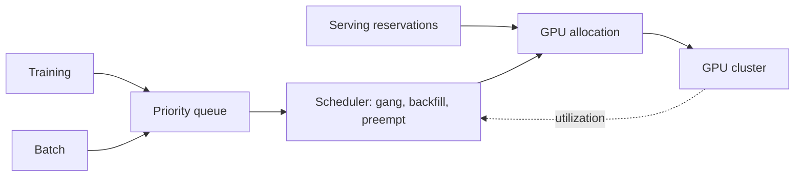
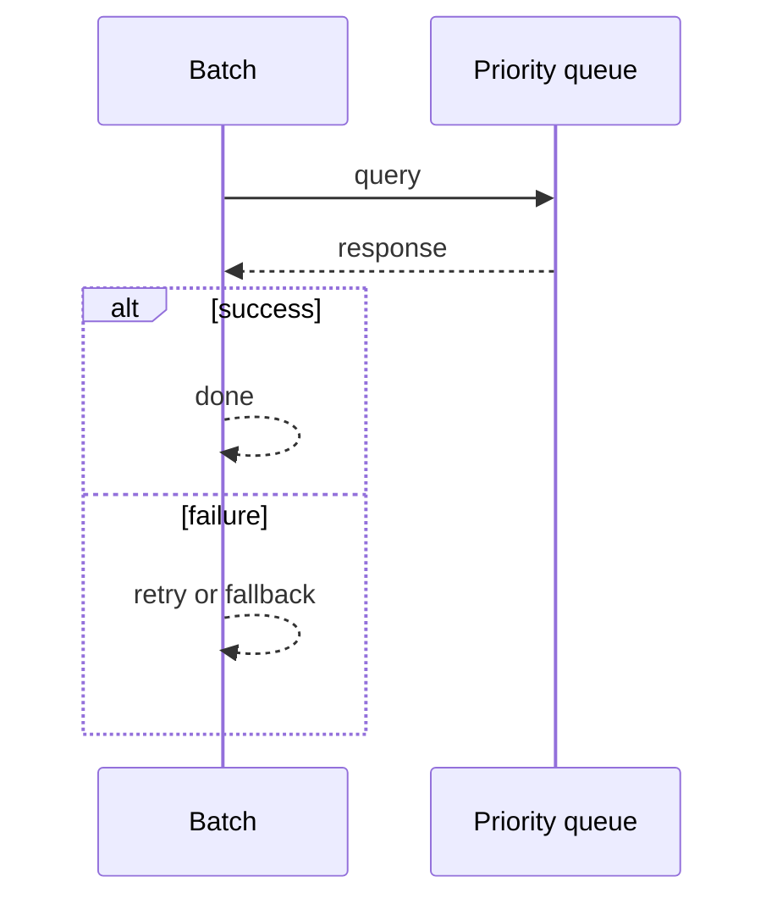
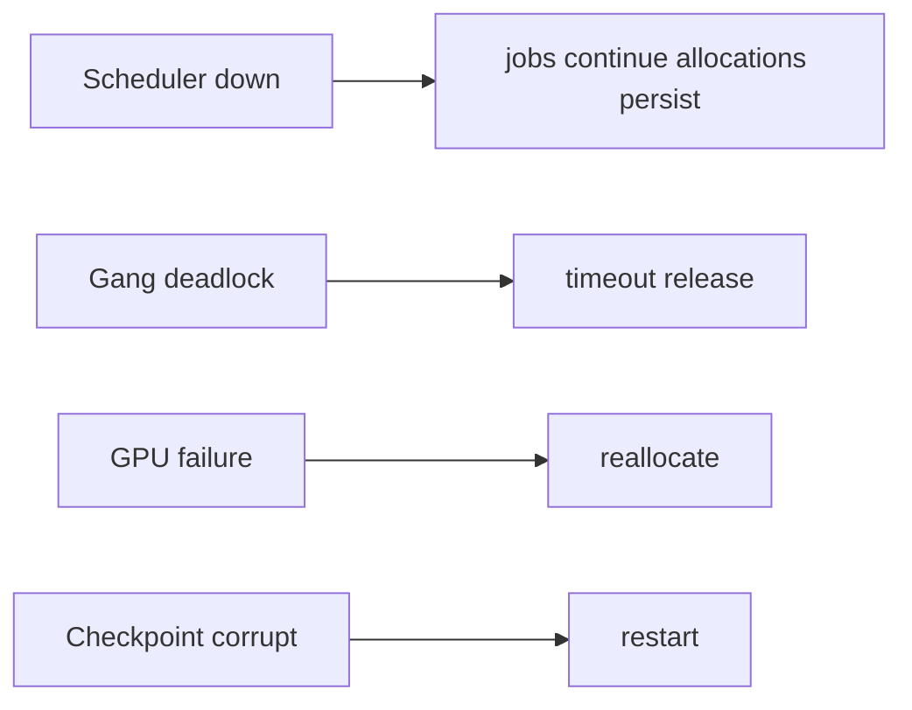

# Case Study: GPU Workload Scheduler

> **Tier:** ai-systems · **Status:** complete · Original numbers and diagrams.

## 11. High-level architecture

## 28. Original Mermaid diagrams
Standalone sources under `diagrams/case-studies/gpu-workload-scheduler/`: `context.mmd`, `request-sequence.mmd`, `failure-flow.mmd`, `scaling-evolution.mmd`. The diagrams are embedded in their respective sections: architecture in section 11, request flow in section 12, failure scenarios in section 19, and scaling stages in section 24.

## 1. Problem statement

A scheduler managing a GPU cluster for mixed workloads (serving, training, batch) with gang scheduling, priorities, preemption, and utilization optimization.

## 2. Scope

In: GPU pool, workload queues, gang scheduling, priorities, preemption, utilization. Out: multi-cluster federation.

## 3. Functional requirements

- Queue workloads by type.
- Allocate GPUs with gang scheduling for distributed training.
- Prioritize serving over batch.
- Preempt and checkpoint long jobs.
- Report utilization.
- Backfill spare capacity.

## 4. Non-functional requirements

- GPU utilization > 70 percent.
- Serving not impacted by batch.
- No deadlock from partial gang.

## 5. Explicit assumptions

1. 1000 GPUs, 50 percent serving, 30 percent training, 20 percent batch. 2. Training 1-24h. 3. Serving autoscaled.

## 6. Traffic estimation

Serving continuous; training/batch queued; scheduler low-QPS.

## 7. Storage estimation

Job state + checkpoints + metrics; checkpoints large (GBs per model).

## 8. Bandwidth estimation

Model loading (GBs); checkpoint save/restore (GBs).

## 9. API design

POST /jobs (type, gpu_req, priority) -> job id; GET /jobs/:id/status; POST /jobs/:id/preempt.

## 10. Data model

jobs(id, type, gpu_count, status, priority, checkpoint_ref); gpus(id, node, memory, status); allocations(job, gpus[]).

## 12. Request flow
Training and batch queued -> scheduler gang-schedules (all GPUs or none) -> serving reserved -> batch backfills spare -> long jobs preempted for priority -> checkpoints saved -> utilization reported.

## 13. Component responsibilities

Job queue, gang scheduler, GPU allocator, preemption manager, checkpoint manager, utilization monitor.

## 14. Database selection

Job state (transactional); GPU registry; checkpoints (object storage).

## 15. Caching strategy

Hot job metadata cached; GPU status cached; model weights cached on GPU.

## 16. Partitioning strategy

Scheduler per cluster; jobs by priority; GPUs by node.

## 17. Replication strategy

Job state RF=3; checkpoints durable; scheduler HA (leader-elected).

## 18. Consistency model

Job state strongly consistent; GPU allocation atomic; checkpoints versioned.

## 19. Failure scenarios
Scheduler down -> jobs continue (allocations persist). Gang deadlock -> timeout + release. GPU failure -> reallocate. Checkpoint corrupt -> restart.

## 20. Reliability strategy

SLI utilization, serving latency, no-deadlock; SLO 99.9 percent. Checkpoint recovery.

## 21. Security considerations

Per-team GPU quotas; job isolation (container); no cross-team access; audit.

## 22. Observability strategy

GPU utilization, job latency, queue depth, preemption rate, gang success rate, checkpoint time.

## 23. Cost considerations

GPU-seconds dominate; utilization is the lever. Backfill + gang + priority maximize utilization.

## 24. Scaling stages

Stage 1: queue + allocate. -> Stage 2: gang + preempt + backfill. -> Stage 3: multi-cluster + spot. -> Stage 4: multi-region.

## 25. Trade-offs

Serving (latency) vs batch (throughput). Gang (no deadlock) vs packing (utilization). Preempt (utilization) vs wasted compute.

## 26. Alternative designs

No gang (deadlock). No preempt (low utilization). No backfill (idle). Static (inflexible).

## 27. Interview discussion points

Clarify GPU count, workload mix, serving SLA, training duration. Surface gang, preemption, backfill, utilization.

## 29. Further reading

GPU scheduling: docs/10-extreme-scale/08-gpu-batch-scheduling; model serving: docs/ai-systems/11-model-serving.

## 30. Practical exercises

1. Gang schedule 4-GPU training. 2. Preempt with checkpoint. 3. Backfill batch into spare. 4. Utilization > 80 percent. 5. Multi-cluster federation.

---
Previous: Real-time voice agent · Next: Multi-model routing platform

