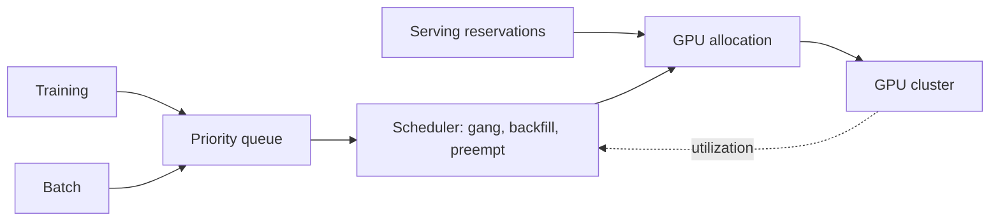
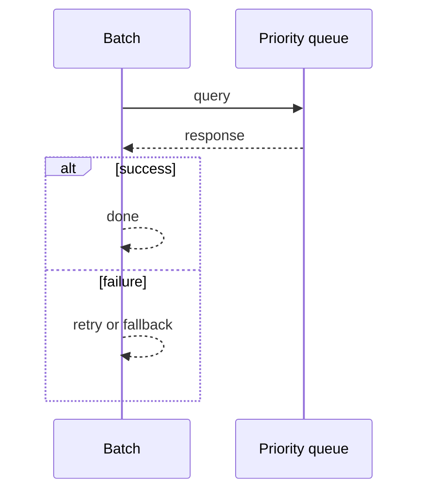
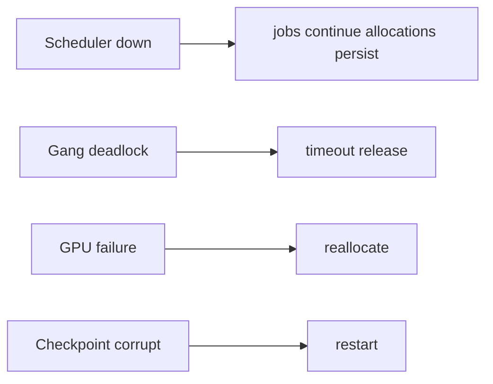

# Case Study: GPU Workload Scheduler

> **Tier:** ai-systems · **Status:** complete · Original numbers and diagrams.

## 11. High-level architecture

## 28. Original Mermaid diagrams

Standalone sources under `diagrams/case-studies/gpu-workload-scheduler/`: `context.mmd`, `request-sequence.mmd`, `failure-flow.mmd`, `scaling-evolution.mmd`. Request sequence and failure flow:

## 1. Problem statement

A scheduler managing a GPU cluster for mixed workloads (serving, training, batch) with gang scheduling, priorities, preemption, and utilization optimization.

This system sits at the intersection of distributed systems and operational reliability. The design must balance latency versus durability while ensuring no single component failure cascades. The target audience includes engineers and operators, so the design must be observable, debuggable, and reversible.
## 2. Scope

In: GPU pool, workload queues, gang scheduling, priorities, preemption, utilization. Out: multi-cluster federation.

The scope boundary is deliberate: including too much in v1 risks a system that is broad but shallow. Each excluded feature is a candidate for a later iteration once the core loop is proven.
## 3. Functional requirements

- Queue workloads by type. - Allocate GPUs with gang scheduling for distributed training. - Prioritize serving over batch. - Preempt and checkpoint long jobs. - Report utilization. - Backfill spare capacity.

These requirements drive the architecture: the read-heavy pattern pushes toward caching; the durability requirement forces synchronous writes; the idempotency requirement means every write path handles redelivery without double-application.
## 4. Non-functional requirements

- GPU utilization > 70 percent. - Serving not impacted by batch. - No deadlock from partial gang.

The non-functional targets shape every component choice: the latency SLO forces edge caching and limits synchronous cross-region calls; the availability target drives redundancy (RF=3, multi-AZ); the cost target constrains the model size.
## 5. Explicit assumptions

1. 1000 GPUs, 50 percent serving, 30 percent training, 20 percent batch. 2. Training 1-24h. 3. Serving autoscaled.

These assumptions are the load-bearing facts of the design. If any is wrong by an order of magnitude, the architecture must adapt: 10x more traffic may require sharding earlier; a different read-write ratio changes the caching strategy entirely.
## 6. Traffic estimation

Serving continuous; training/batch queued; scheduler low-QPS.

The traffic estimate reveals the binding constraint. Peak is modeled at 10x average. The read-write ratio determines whether the system is cache-dominated (read-heavy) or write-path-dominated (write-heavy), which changes the storage and replication strategy.
## 7. Storage estimation

Job state + checkpoints + metrics; checkpoints large (GBs per model).

Storage growth is linear with time and must be planned with retention. The estimate includes metadata and index overhead (20-30 percent above raw). Without a retention policy, storage grows unboundedly.
## 8. Bandwidth estimation

Model loading (GBs); checkpoint save/restore (GBs).

Bandwidth is often not the binding constraint but becomes significant at the edge during viral spikes. CDN and edge caching cut origin egress; compression cuts bandwidth by 50-80 percent where applicable.
## 9. API design

POST /jobs (type, gpu_req, priority) -> job id; GET /jobs/:id/status; POST /jobs/:id/preempt.

The API follows REST for external clients and gRPC for internal calls. Every write endpoint accepts an idempotency key. Rate limiting is enforced at the gateway before the service tier.
## 10. Data model

jobs(id, type, gpu_count, status, priority, checkpoint_ref); gpus(id, node, memory, status); allocations(job, gpus[]).

The data model is designed around the access pattern, not the entity shape. The primary access path determines the partition key; secondary paths determine indexes. Denormalization is applied selectively where the hot read path would otherwise require expensive joins.
## 12. Request flow

Training and batch queued -> scheduler gang-schedules (all GPUs or none) -> serving reserved -> batch backfills spare -> long jobs preempted for priority -> checkpoints saved -> utilization reported.

The request flow reveals the critical path: any component on the hot path that fails or slows degrades the user experience. The design applies timeouts, circuit breakers, and bulkheads to each hop. The write path includes an idempotency check before any state mutation.
## 13. Component responsibilities

Job queue, gang scheduler, GPU allocator, preemption manager, checkpoint manager, utilization monitor.

Each component has a single, well-defined responsibility. The gateway handles auth and routing; the service tier is stateless and horizontally scalable; the data tier is the stateful core, carefully partitioned and replicated. The separation allows each tier to scale independently.
## 14. Database selection

Job state (transactional); GPU registry; checkpoints (object storage).

The database choice is driven by the access pattern. The rejected alternatives were rejected for specific reasons: a relational DB was rejected if the workload is a single key lookup at massive scale; a KV store was rejected if joins and transactions are needed.
## 15. Caching strategy

Hot job metadata cached; GPU status cached; model weights cached on GPU.

The caching strategy is designed around the staleness tolerance of the workload. Cache-aside is the default; write-through is used where read-after-write consistency is required. Stampede protection is applied to any key that can go viral. Cache entries are namespaced by tenant.
## 16. Partitioning strategy

Scheduler per cluster; jobs by priority; GPUs by node.

The partition key co-locates related data while distributing load evenly. Consistent hashing with virtual nodes minimizes data movement when nodes change. A hot key is mitigated by caching, extra replication, or key splitting.
## 17. Replication strategy

Job state RF=3; checkpoints durable; scheduler HA (leader-elected).

Replication is synchronous on the write-confirmation path where durability is critical and asynchronous elsewhere. RF=3 tolerates one failure. Failover is tested, not just configured. Cross-region replication is asynchronous with a documented RPO.
## 18. Consistency model

Job state strongly consistent; GPU allocation atomic; checkpoints versioned.

The consistency model is the weakest that users can tolerate. Read-your-writes is provided where the user expects to see their own write. Eventual consistency is bounded (seconds) and monitored. The system documents what eventual means to users.
## 19. Failure scenarios

Scheduler down -> jobs continue (allocations persist). Gang deadlock -> timeout + release. GPU failure -> reallocate. Checkpoint corrupt -> restart.

Each failure scenario has a documented response: which component detects it, how failover happens, what the user experiences, and how recovery is verified. Bulkheads and circuit breakers prevent one slow dependency from cascading.
## 20. Reliability strategy

SLI utilization, serving latency, no-deadlock; SLO 99.9 percent. Checkpoint recovery.

The SLO defines what good means measurably; the error budget is the allowed unavailability spent on deploys and feature risk. The system is tested with chaos engineering to verify resilience. An untested failover is not a failover.
## 21. Security considerations

Per-team GPU quotas; job isolation (container); no cross-team access; audit.

Security is defense in depth: TLS, encryption at rest, RBAC with default-deny, PII redaction in logs, audit trails, and per-tenant isolation. For AI-augmented systems, the policy gateway is fail-closed: on any error, the system refuses to act.
## 22. Observability strategy

GPU utilization, job latency, queue depth, preemption rate, gang success rate, checkpoint time.

Observability uses logs, metrics, and traces with correlation IDs. The golden signals (latency, traffic, errors, saturation) are the first dashboard. Alerts fire on SLO burn rate, not raw thresholds. The on-call runbook for each alert is tested.
## 23. Cost considerations

GPU-seconds dominate; utilization is the lever. Backfill + gang + priority maximize utilization.

Cost is dominated by the binding resource. Primary levers: caching (cuts read cost), tiering (cuts storage cost), batching (cuts per-request overhead), and right-sizing. Cost is tracked as a first-class metric and alerted on when unit cost spikes.
## 24. Scaling stages

Stage 1: queue + allocate. -> Stage 2: gang + preempt + backfill. -> Stage 3: multi-cluster + spot. -> Stage 4: multi-region.

The scaling stages are triggered by specific thresholds, not by calendar. Each stage is a deliberate architectural change: Stage 1 handles initial load; Stage 2 when a single node saturates; Stage 3 when latency exceeds the SLO; Stage 4 when hot keys threaten the origin.
## 25. Trade-offs

Serving (latency) vs batch (throughput). Gang (no deadlock) vs packing (utilization). Preempt (utilization) vs wasted compute.

Every trade-off has a rejected alternative with a reason. The design does not present one option as universally correct; it presents the chosen option, the rejected alternative, and the workload-specific reason.
## 26. Alternative designs

No gang (deadlock). No preempt (low utilization). No backfill (idle). Static (inflexible).

The alternative designs are genuine architectures that would work under different constraints. They were rejected for this workload because of specific requirements that make them inferior here but not universally inferior.
## 27. Interview discussion points

Clarify GPU count, workload mix, serving SLA, training duration. Surface gang, preemption, backfill, utilization.

In an interview, the strongest candidates clarify ambiguity before designing, surface the read-write ratio and the binding resource, design the hot path deeply, discuss failure modes explicitly, and offer an alternative with a reason.
## 29. Further reading

GPU scheduling: docs/10-extreme-scale/08-gpu-batch-scheduling; model serving: docs/ai-systems/11-model-serving.

The further reading cites primary sources (RFCs, papers, official documentation) via stable IDs in SOURCES.md, not secondary blog posts. Each citation is chosen because it is the authoritative source for a specific technical claim.
## 30. Practical exercises

1. Gang schedule 4-GPU training. 2. Preempt with checkpoint. 3. Backfill batch into spare. 4. Utilization > 80 percent. 5. Multi-cluster federation.

---
Previous: Real-time voice agent · Next: Multi-model routing platform

The exercises push the reader beyond v1: re-estimating at 10x reveals capacity limits; adding a new requirement forces an architectural change; designing the failover test reveals whether resilience claims are real.
