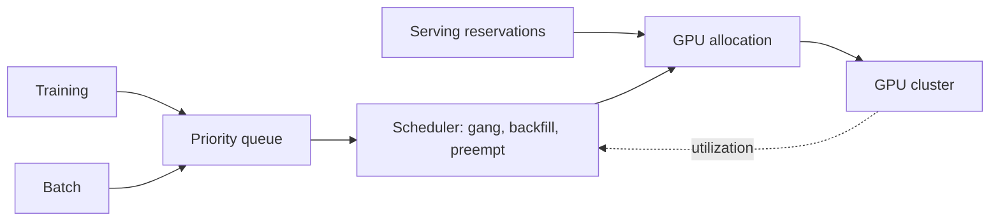
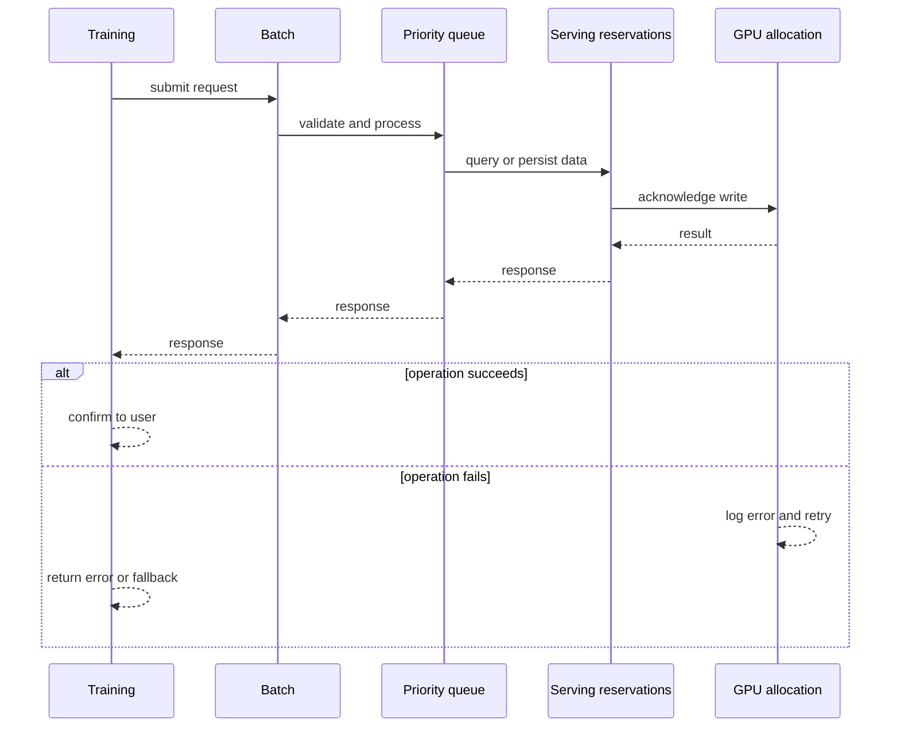
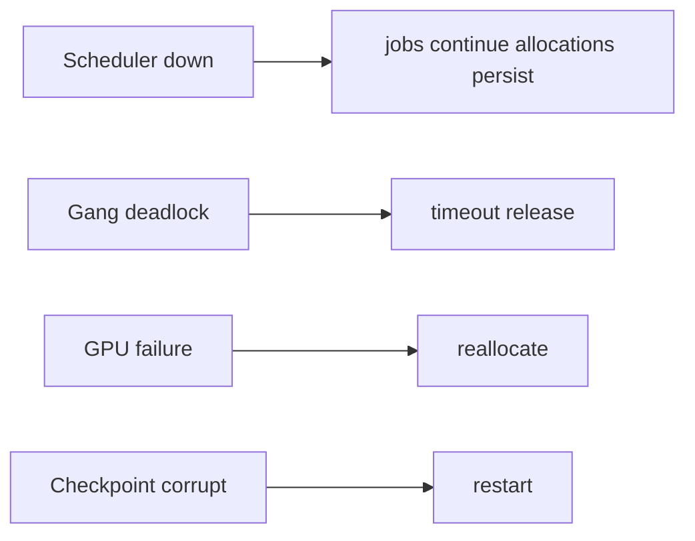
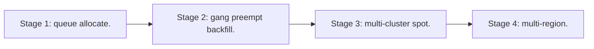

# Case Study: GPU Workload Scheduler

> **Tier:** ai-systems · **Status:** complete · Original numbers and diagrams.

## 1. Problem statement
A scheduler managing a GPU cluster for mixed workloads (serving, training, batch) with gang scheduling, priorities, preemption, and utilization optimization. This is a ai-systems-tier system design challenge because it must handle high availability under peak load while ensuring no single point of failure. The design must be production-grade: observable, debuggable, reversible, and able to survive component failures without data loss or cascading outages.

## 2. Scope
In: GPU pool, workload queues, gang scheduling, priorities, preemption, utilization. Out: multi-cluster federation.

For GPU Workload Scheduler, these boundaries keep the first version focused on the core user value. Adding more features would dilute the design and delay shipping. Each excluded item is a scaling stage — a candidate for the next iteration once the baseline is proven.

## 3. Functional requirements
- Queue workloads by type.
- Allocate GPUs with gang scheduling for distributed training.
- Prioritize serving over batch.
- Preempt and checkpoint long jobs.
- Report utilization.
- Backfill spare capacity.

For GPU Workload Scheduler, these requirements drive specific architectural decisions: the read-write ratio determines the caching strategy, the durability target sets the replication mode, and the idempotency requirement shapes the API contract.

## 4. Non-functional requirements
- GPU utilization > 70 percent.
- Serving not impacted by batch.
- No deadlock from partial gang.

For GPU Workload Scheduler, each non-functional target constrains a specific component: the latency SLO bounds the number of synchronous hops, the availability target forces redundancy across availability zones, and the cost ceiling limits the replication factor and storage tier.

## 5. Explicit assumptions
1. 1000 GPUs, 50 percent serving, 30 percent training, 20 percent batch. 2. Training 1-24h. 3. Serving autoscaled.

For GPU Workload Scheduler, if these assumptions are off by an order of magnitude, the architecture must adapt: 10x traffic may require earlier sharding, a different read-write ratio changes the caching strategy, and a higher peak multiplier demands more headroom.

## 6. Traffic estimation
Serving continuous; training/batch queued; scheduler low-QPS.

To derive the request rate: divide the daily volume by 86,400 seconds to get the average rate, then multiply by 5-10x for peak. The read-to-write ratio determines whether the system is cache-dominated (read-heavy) or write-path-dominated (write-heavy). For GPU Workload Scheduler, this ratio shapes the entire storage and replication strategy.

## 7. Storage estimation
Job state + checkpoints + metrics; checkpoints large (GBs per model).

For GPU Workload Scheduler, storage growth is projected from the daily write volume and retention policy. Index overhead and compression factors are accounted for in the total.

## 8. Bandwidth estimation
Model loading (GBs); checkpoint save/restore (GBs).

Bandwidth is request rate multiplied by average payload size for ingress, and response rate multiplied by response size for egress. CDN and edge caching reduce origin egress. Compression reduces bandwidth by 50-80 percent where applicable. For GPU Workload Scheduler, bandwidth may or may not be the binding constraint — compare it against compute and storage to find out.

## 9. API design

POST /jobs (type, gpu_req, priority) -> job id; GET /jobs/:id/status; POST /jobs/:id/preempt.

## 10. Data model
jobs(id, type, gpu_count, status, priority, checkpoint_ref); gpus(id, node, memory, status); allocations(job, gpus[]).

For GPU Workload Scheduler, the data model follows the access pattern. The primary lookup determines the partition key; secondary lookups determine indexes. Denormalization is used selectively on hot read paths.

## 11. High-level architecture

## 12. Request flow
Training and batch queued -> scheduler gang-schedules (all GPUs or none) -> serving reserved -> batch backfills spare -> long jobs preempted for priority -> checkpoints saved -> utilization reported.

## 13. Component responsibilities
Job queue, gang scheduler, GPU allocator, preemption manager, checkpoint manager, utilization monitor.

For GPU Workload Scheduler, each component has one job. The gateway authenticates and routes. Services are stateless and scale horizontally. The data tier is the stateful core that scales by sharding.

## 14. Database selection
Job state (transactional); GPU registry; checkpoints (object storage).

For GPU Workload Scheduler, the database was chosen by access pattern, not familiarity. The rejected alternatives were wrong for this workload, not bad in general.

## 15. Caching strategy
Hot job metadata cached; GPU status cached; model weights cached on GPU.

For GPU Workload Scheduler, the cache strategy matches the staleness tolerance. Cache-aside for most data, write-through where read-after-write matters, stampede protection on hot keys.

## 16. Partitioning strategy
Scheduler per cluster; jobs by priority; GPUs by node.

For GPU Workload Scheduler, the partition key balances query locality with even load distribution. Sharding strategy matters because a poor key creates hot spots under real traffic patterns.

## 17. Replication strategy
Job state RF=3; checkpoints durable; scheduler HA (leader-elected).

For GPU Workload Scheduler, replication mode is split: synchronous where durability is critical, asynchronous elsewhere for throughput. RF=3 tolerates one failure. Failover is tested regularly.

## 18. Consistency model
Job state strongly consistent; GPU allocation atomic; checkpoints versioned.

For GPU Workload Scheduler, the consistency level is the weakest users accept. Read-your-writes is provided where needed. Eventual consistency is bounded and monitored, not unbounded and silent.

## 19. Failure scenarios
Scheduler down -> jobs continue (allocations persist). Gang deadlock -> timeout + release. GPU failure -> reallocate. Checkpoint corrupt -> restart.

## 20. Reliability strategy
SLI utilization, serving latency, no-deadlock; SLO 99.9 percent. Checkpoint recovery.

For GPU Workload Scheduler, the SLO makes reliability measurable. The error budget balances feature velocity with stability. Chaos testing validates that resilience claims hold under real failures.

## 21. Security considerations
Per-team GPU quotas; job isolation (container); no cross-team access; audit.

For GPU Workload Scheduler, security layers TLS, encryption at rest, RBAC, PII redaction, and audit. The policy gateway is fail-closed for AI-augmented operations.

## 22. Observability strategy
GPU utilization, job latency, queue depth, preemption rate, gang success rate, checkpoint time.

For GPU Workload Scheduler, observability combines logs, metrics, and traces with correlation IDs. Golden signals drive the first dashboard. Alerts fire on burn rate, not raw thresholds.

## 23. Cost considerations
GPU-seconds dominate; utilization is the lever. Backfill + gang + priority maximize utilization.

For GPU Workload Scheduler, cost is driven by the binding resource. Caching, tiering, batching, and right-sizing are the levers. Cost per request is tracked and alerted on.

## 24. Scaling stages
Stage 1: queue + allocate. -> Stage 2: gang + preempt + backfill. -> Stage 3: multi-cluster + spot. -> Stage 4: multi-region.

## 25. Trade-offs
Serving (latency) vs batch (throughput). Gang (no deadlock) vs packing (utilization). Preempt (utilization) vs wasted compute.

For GPU Workload Scheduler, each trade-off lists what was chosen, what was rejected, and why. This makes the design defensible in review — every decision has documented reasoning.

## 26. Alternative designs
No gang (deadlock). No preempt (low utilization). No backfill (idle). Static (inflexible).

For GPU Workload Scheduler, the alternatives are real architectures that work under different constraints. They were rejected for this workload's specific requirements, not because they are bad designs.

## 27. Interview discussion points
Clarify GPU count, workload mix, serving SLA, training duration. Surface gang, preemption, backfill, utilization.

For GPU Workload Scheduler in an interview: clarify scope first, surface the read-write ratio, design the hot path deeply, discuss failures, and offer an alternative. Weak candidates skip failure modes.

## 28. Original Mermaid diagrams
Standalone sources under `diagrams/case-studies/gpu-workload-scheduler/`: `context.mmd`, `request-sequence.mmd`, `failure-flow.mmd`, `scaling-evolution.mmd`. The diagrams are embedded in their respective sections: architecture in section 11, request flow in section 12, failure scenarios in section 19, and scaling stages in section 24.

## 29. Further reading
GPU scheduling: docs/10-extreme-scale/08-gpu-batch-scheduling; model serving: docs/ai-systems/11-model-serving. Sources: `S-VECTORDB` `S-RAG`.

## 30. Practical exercises

1. Gang schedule 4-GPU training. 2. Preempt with checkpoint. 3. Backfill batch into spare. 4. Utilization > 80 percent. 5. Multi-cluster federation.

---
Previous: Real-time voice agent · Next: Multi-model routing platform

