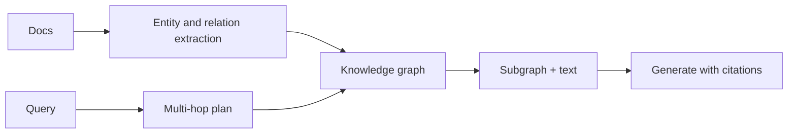
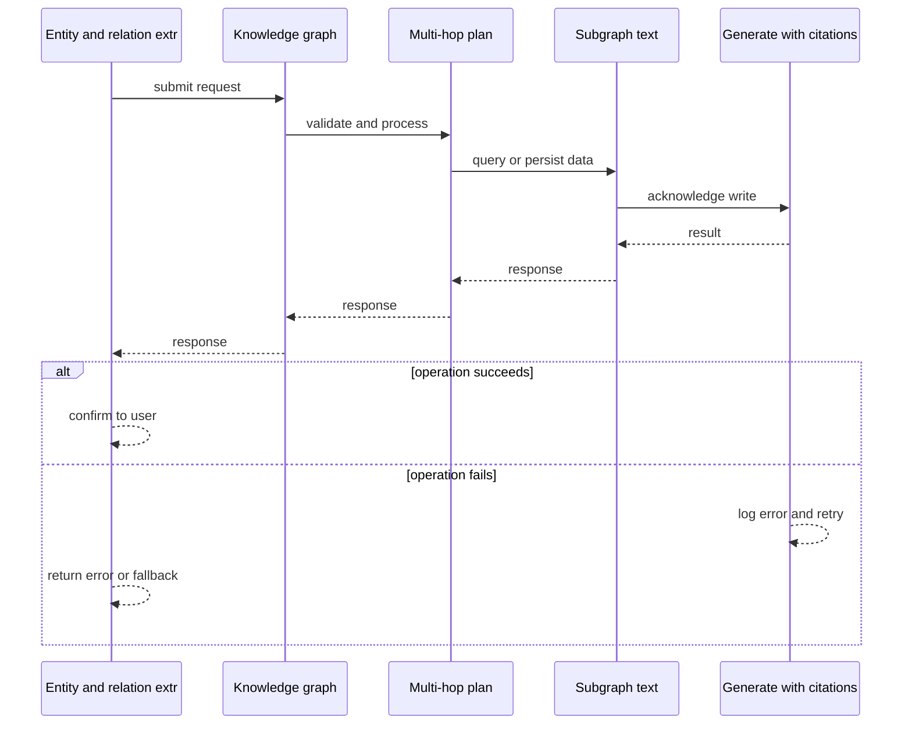
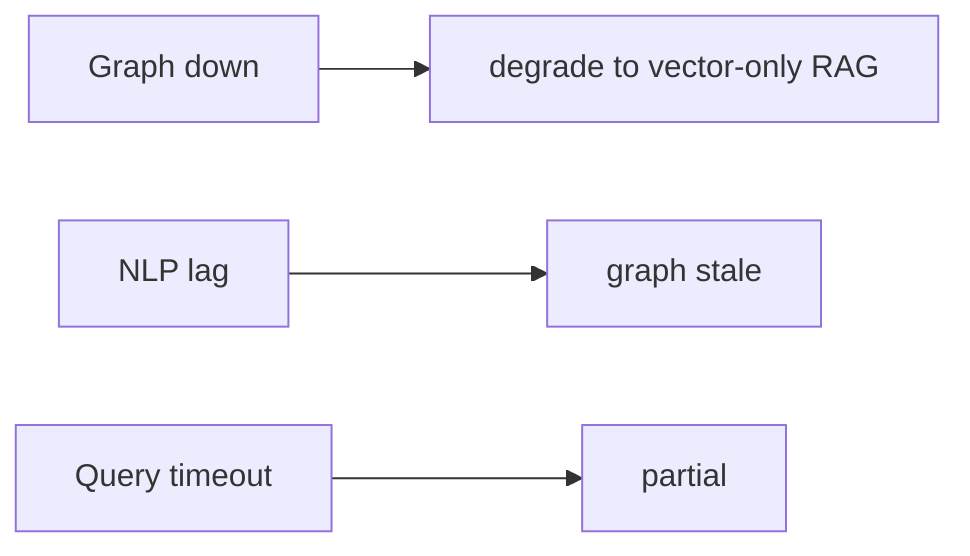
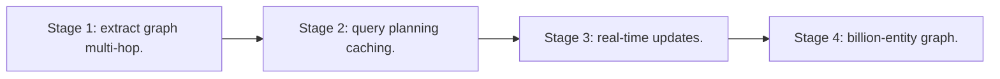

# Case Study: GraphRAG Research Platform

> **Tier:** ai-systems · **Status:** complete · Original numbers and diagrams.

## 1. Problem statement
A RAG platform that retrieves from a knowledge graph for multi-hop reasoning, enabling answers that require traversing relationships. This is a ai-systems-tier system design challenge because it must handle millions of reads per second while ensuring grounded, cited, and permission-aware answers. The design must be production-grade: observable, debuggable, reversible, and able to survive component failures without data loss or cascading outages.

## 2. Scope
In: graph ingestion, entity extraction, relationship indexing, multi-hop retrieval, grounded generation. Out: real-time graph updates.

For GraphRAG Research Platform, these boundaries keep the first version focused on the core user value. Adding more features would dilute the design and delay shipping. Each excluded item is a scaling stage — a candidate for the next iteration once the baseline is proven.

## 3. Functional requirements
- Ingest documents and extract entities and relationships.
- Build a knowledge graph.
- Multi-hop retrieval.
- Generate answers with graph context and citations.

For GraphRAG Research Platform, these requirements drive specific architectural decisions: the read-write ratio determines the caching strategy, the durability target sets the replication mode, and the idempotency requirement shapes the API contract.

## 4. Non-functional requirements
- Multi-hop query p99 < 5 s.
- Graph freshness < 1 hour.
- Availability 99.9 percent.

For GraphRAG Research Platform, each non-functional target constrains a specific component: the latency SLO bounds the number of synchronous hops, the availability target forces redundancy across availability zones, and the cost ceiling limits the replication factor and storage tier.

## 5. Explicit assumptions
1. 1M entities, 10M relationships, 100k docs. 2. Avg 2-3 hops. 3. NLP extraction pipeline.

For GraphRAG Research Platform, if these assumptions are off by an order of magnitude, the architecture must adapt: 10x traffic may require earlier sharding, a different read-write ratio changes the caching strategy, and a higher peak multiplier demands more headroom.

## 6. Traffic estimation
10 q/s; multi-hop queries are more complex.

To derive the request rate: divide the daily volume by 86,400 seconds to get the average rate, then multiply by 5-10x for peak. The read-to-write ratio determines whether the system is cache-dominated (read-heavy) or write-path-dominated (write-heavy). For GraphRAG Research Platform, this ratio shapes the entire storage and replication strategy.

## 7. Storage estimation
1M entities + 10M edges + 100k docs = ~50 GB graph + text + embeddings.

For GraphRAG Research Platform, storage growth is projected from the daily write volume and retention policy. Index overhead and compression factors are accounted for in the total.

## 8. Bandwidth estimation
Query results moderate (subgraphs); generation streamed.

Bandwidth is request rate multiplied by average payload size for ingress, and response rate multiplied by response size for egress. CDN and edge caching reduce origin egress. Compression reduces bandwidth by 50-80 percent where applicable. For GraphRAG Research Platform, bandwidth may or may not be the binding constraint — compare it against compute and storage to find out.

## 9. API design

POST /ask -> answer + graph path citations; POST /ingest (docs) -> extract + index.

## 10. Data model
entities(id, type, attrs); relationships(src, dst, type, weight); documents(id, text, entities[]).

For GraphRAG Research Platform, the data model follows the access pattern. The primary lookup determines the partition key; secondary lookups determine indexes. Denormalization is used selectively on hot read paths.

## 11. High-level architecture

## 12. Request flow
Documents -> NLP extracts entities and relationships -> knowledge graph built -> query plans multi-hop -> retrieves subgraph + text -> LLM generates with graph-path citations.

## 13. Component responsibilities
NLP extraction, graph store, query planner, multi-hop retriever, LLM, citation builder.

For GraphRAG Research Platform, each component has one job. The gateway authenticates and routes. Services are stateless and scale horizontally. The data tier is the stateful core that scales by sharding.

## 14. Database selection
Graph store for entities and relationships; vector DB for entity embeddings; doc store for text.

For GraphRAG Research Platform, the database was chosen by access pattern, not familiarity. The rejected alternatives were wrong for this workload, not bad in general.

## 15. Caching strategy
Common query plans cached; graph subgraphs cached; entity lookups cached.

For GraphRAG Research Platform, the cache strategy matches the staleness tolerance. Cache-aside for most data, write-through where read-after-write matters, stampede protection on hot keys.

## 16. Partitioning strategy
Graph sharded by entity community; queries fan out.

For GraphRAG Research Platform, the partition key balances query locality with even load distribution. Sharding strategy matters because a poor key creates hot spots under real traffic patterns.

## 17. Replication strategy
Graph store RF=3; doc store replicated; extraction stateless.

For GraphRAG Research Platform, replication mode is split: synchronous where durability is critical, asynchronous elsewhere for throughput. RF=3 tolerates one failure. Failover is tested regularly.

## 18. Consistency model
Graph eventual with ingestion; queries deterministic on snapshot.

For GraphRAG Research Platform, the consistency level is the weakest users accept. Read-your-writes is provided where needed. Eventual consistency is bounded and monitored, not unbounded and silent.

## 19. Failure scenarios
Graph down -> degrade to vector-only RAG. NLP lag -> graph stale. Query timeout -> partial.

For GraphRAG Research Platform, each failure has a specific response plan. The design principle is degrade-don't-cascade: bulkheads isolate dependencies, circuit breakers stop calls to failing services, and timeouts bound every outbound call.

## 20. Reliability strategy
SLI multi-hop accuracy, query latency; SLO 99.9 percent. Fallback to vector RAG.

For GraphRAG Research Platform, the SLO makes reliability measurable. The error budget balances feature velocity with stability. Chaos testing validates that resilience claims hold under real failures.

## 21. Security considerations
Graph may contain PII -> RBAC; per-tenant isolation; PII redaction; audit.

For GraphRAG Research Platform, security layers TLS, encryption at rest, RBAC, PII redaction, and audit. The policy gateway is fail-closed for AI-augmented operations.

## 22. Observability strategy
Extraction lag, query latency, multi-hop accuracy, graph freshness.

For GraphRAG Research Platform, observability combines logs, metrics, and traces with correlation IDs. Golden signals drive the first dashboard. Alerts fire on burn rate, not raw thresholds.

## 23. Cost considerations
Graph store (memory) + NLP (compute) + LLM (tokens). Cache common queries.

For GraphRAG Research Platform, cost is driven by the binding resource. Caching, tiering, batching, and right-sizing are the levers. Cost per request is tracked and alerted on.

## 24. Scaling stages
Stage 1: extract + graph + multi-hop. -> Stage 2: query planning + caching. -> Stage 3: real-time updates. -> Stage 4: billion-entity graph.

## 25. Trade-offs
Graph (multi-hop) vs vector (semantic, fast). Real-time (fresh) vs batch (cost). Deep traversal vs latency.

For GraphRAG Research Platform, each trade-off lists what was chosen, what was rejected, and why. This makes the design defensible in review — every decision has documented reasoning.

## 26. Alternative designs
Vector-only (misses multi-hop). Manual graph (no scale). Full graph DB (wrong access pattern).

For GraphRAG Research Platform, the alternatives are real architectures that work under different constraints. They were rejected for this workload's specific requirements, not because they are bad designs.

## 27. Interview discussion points
Clarify entity count, hop depth, freshness, latency. Surface extraction, graph, multi-hop retrieval, citations.

For GraphRAG Research Platform in an interview: clarify scope first, surface the read-write ratio, design the hot path deeply, discuss failures, and offer an alternative. Weak candidates skip failure modes.

## 28. Original Mermaid diagrams
Standalone sources under `diagrams/case-studies/graphrag-research-platform/`: `context.mmd`, `request-sequence.mmd`, `failure-flow.mmd`, `scaling-evolution.mmd`. The diagrams are embedded in their respective sections: architecture in section 11, request flow in section 12, failure scenarios in section 19, and scaling stages in section 24.

## 29. Further reading
GraphRAG papers; knowledge graph refs; docs/ai-systems/07-advanced-rag; graph: Level 10. Sources: `S-VECTORDB` `S-RAG`.

## 30. Practical exercises

1. 3-hop query plan. 2. Entity resolution. 3. Graph staleness budget. 4. Fallback to vector. 5. Multi-hop accuracy eval.

---
Previous: Multi-tenant RAG service · Next: Code-assistant platform

