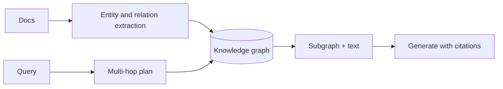
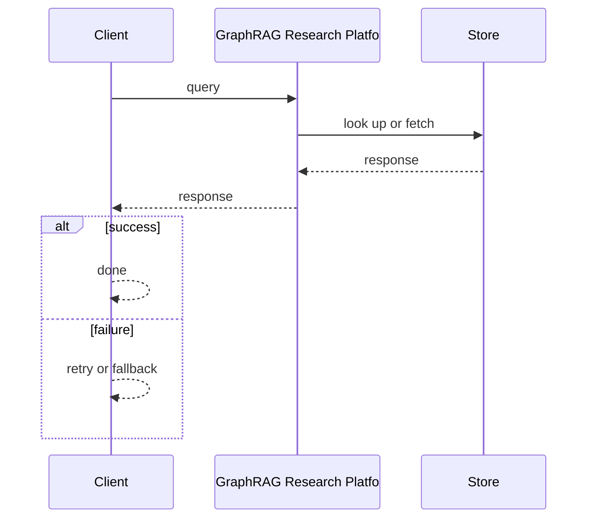
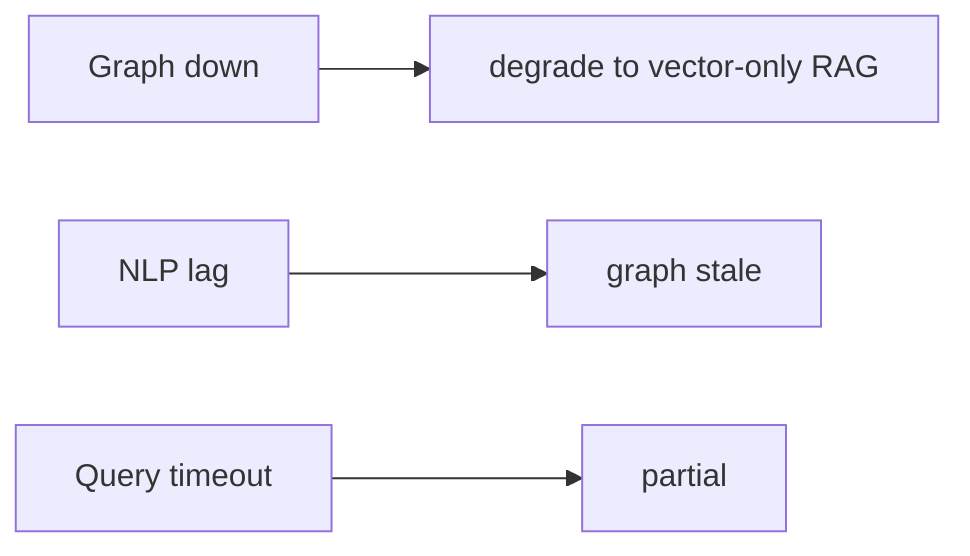

# Case Study: GraphRAG Research Platform

> **Tier:** ai-systems · **Status:** complete · Original numbers and diagrams.

## 11. High-level architecture

## 28. Original Mermaid diagrams

Standalone sources under `diagrams/case-studies/graphrag-research-platform/`: `context.mmd`, `request-sequence.mmd`, `failure-flow.mmd`, `scaling-evolution.mmd`. Request sequence and failure flow:

## 1. Problem statement

A RAG platform that retrieves from a knowledge graph for multi-hop reasoning, enabling answers that require traversing relationships.

## 2. Scope

In: graph ingestion, entity extraction, relationship indexing, multi-hop retrieval, grounded generation. Out: real-time graph updates.

## 3. Functional requirements

- Ingest documents and extract entities and relationships.
- Build a knowledge graph.
- Multi-hop retrieval.
- Generate answers with graph context and citations.

## 4. Non-functional requirements

- Multi-hop query p99 < 5 s.
- Graph freshness < 1 hour.
- Availability 99.9 percent.

## 5. Explicit assumptions

1. 1M entities, 10M relationships, 100k docs. 2. Avg 2-3 hops. 3. NLP extraction pipeline.

## 6. Traffic estimation

10 q/s; multi-hop queries are more complex.

## 7. Storage estimation

1M entities + 10M edges + 100k docs = ~50 GB graph + text + embeddings.

## 8. Bandwidth estimation

Query results moderate (subgraphs); generation streamed.

## 9. API design

POST /ask -> answer + graph path citations; POST /ingest (docs) -> extract + index.

## 10. Data model

entities(id, type, attrs); relationships(src, dst, type, weight); documents(id, text, entities[]).

## 12. Request flow

Documents -> NLP extracts entities and relationships -> knowledge graph built -> query plans multi-hop -> retrieves subgraph + text -> LLM generates with graph-path citations.

## 13. Component responsibilities

NLP extraction, graph store, query planner, multi-hop retriever, LLM, citation builder.

## 14. Database selection

Graph store for entities and relationships; vector DB for entity embeddings; doc store for text.

## 15. Caching strategy

Common query plans cached; graph subgraphs cached; entity lookups cached.

## 16. Partitioning strategy

Graph sharded by entity community; queries fan out.

## 17. Replication strategy

Graph store RF=3; doc store replicated; extraction stateless.

## 18. Consistency model

Graph eventual with ingestion; queries deterministic on snapshot.

## 19. Failure scenarios

Graph down -> degrade to vector-only RAG. NLP lag -> graph stale. Query timeout -> partial.

## 20. Reliability strategy

SLI multi-hop accuracy, query latency; SLO 99.9 percent. Fallback to vector RAG.

## 21. Security considerations

Graph may contain PII -> RBAC; per-tenant isolation; PII redaction; audit.

## 22. Observability strategy

Extraction lag, query latency, multi-hop accuracy, graph freshness.

## 23. Cost considerations

Graph store (memory) + NLP (compute) + LLM (tokens). Cache common queries.

## 24. Scaling stages

Stage 1: extract + graph + multi-hop. -> Stage 2: query planning + caching. -> Stage 3: real-time updates. -> Stage 4: billion-entity graph.

## 25. Trade-offs

Graph (multi-hop) vs vector (semantic, fast). Real-time (fresh) vs batch (cost). Deep traversal vs latency.

## 26. Alternative designs

Vector-only (misses multi-hop). Manual graph (no scale). Full graph DB (wrong access pattern).

## 27. Interview discussion points

Clarify entity count, hop depth, freshness, latency. Surface extraction, graph, multi-hop retrieval, citations.

## 29. Further reading

GraphRAG papers; knowledge graph refs; docs/ai-systems/07-advanced-rag; graph: Level 10.

## 30. Practical exercises

1. 3-hop query plan. 2. Entity resolution. 3. Graph staleness budget. 4. Fallback to vector. 5. Multi-hop accuracy eval.

---
Previous: Multi-tenant RAG service · Next: Code-assistant platform

