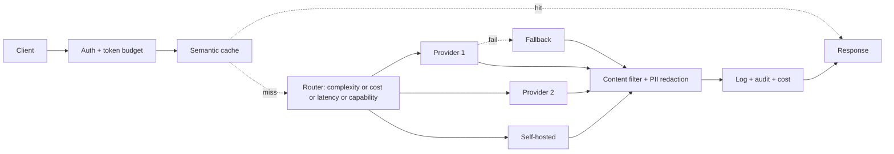

# Case Study: LLM API Gateway

> **Tier:** ai-systems · **Status:** draft · Original numbers and diagrams.

## 11. High-level architecture

## 28. Original Mermaid diagrams

`diagrams/case-studies/llm-api-gateway/context.mmd`; key diagram inline above.

## 1. Problem statement

An enterprise LLM API gateway that provides a unified model API across providers (external and self-hosted), with complexity/cost/latency routing, per-tenant token budgets, failover, semantic caching, content filtering, PII redaction, and full audit.

## 2. Scope

In (v1): unified API, provider abstraction, multi-model routing (complexity, cost, latency, capability), token-based rate limiting and budgets, provider failover, semantic caching, content filtering, PII redaction, logging, audit. Out: model hosting (uses providers).

## 3. Functional requirements

- Accept a unified API call. - Authenticate and check token budget. - Route to the best model for the task. - Fail over on provider failure. - Cache semantically equivalent safe queries. - Filter content and redact PII. - Log and audit all calls. - Enforce per-tenant token budgets.

## 4. Non-functional requirements

- Gateway overhead p99 < 20 ms. - Availability 99.95 percent. - No PII in logs. - No cost overrun (budgets enforced).

## 5. Explicit assumptions

1. 100 tenants, 10k requests/s peak. [assumption] 2. Token distribution: 80 percent short, 20 percent long-context. [assumption] 3. 3 providers + 1 self-hosted. [constraint]

## 6. Traffic estimation

10k req/s peak; each request carries input tokens (budget by tokens, not RPS).

## 7. Storage estimation

Usage logs + audit + cache; moderate, must be auditable.

## 8. Bandwidth estimation

Pass-through (input + output tokens); gateway adds minimal.

## 9. API design

POST /v1/completions (unified) -> streamed response; GET /v1/usage/:tenant.

## 10. Data model

usage(tenant, req_id, model, input_tokens, output_tokens, cost, ts); cache(query_hash, tenant, answer, ttl); providers(name, endpoint, key_ref, models, cost_per_1M).

## 12. Request flow

Client calls unified API -> auth + token budget check -> semantic cache (safe + same tenant) -> hit returns; miss -> router picks best model (complexity/cost/latency/capability) -> provider call -> on fail, failover -> content filter + PII redaction -> log + audit + cost -> return.

## 13. Component responsibilities

Auth, token budget store, semantic cache, router, provider connectors, failover, content filter, PII redaction, logger/auditor, cost tracker.

## 14. Database selection

Usage/audit (relational, append-only); semantic cache (embedding index + KV); provider registry (secret manager). Rejected: RPS-based rate limiting (insufficient for LLMs).

## 15. Caching strategy

Semantic cache namespaced by tenant + model + prompt version; unsafe for time-sensitive or user-specific; TTL.

## 16. Partitioning strategy

Usage by tenant; cache by tenant; gateway stateless; router stateless.

## 17. Replication strategy

Gateway stateless RF=many; usage store RF=3; cache replicated; provider credentials in secret manager.

## 18. Consistency model

Usage/cost strongly tracked; cache versioned; budget strongly enforced.

## 19. Failure scenarios

Provider down -> failover. Budget store down -> fail-open with cap + reconcile (or fail-closed). Cache stale -> TTL. Router down -> default model.

## 20. Reliability strategy

SLI overhead latency, availability; SLO 99.95 percent. Failover + budget enforcement. Chaos: kill a provider, assert failover.

## 21. Security considerations

API key management + rotation; PII redaction before logging; content filtering; no confidential data to unapproved external models; per-tenant isolation; full audit; mTLS to providers.

## 22. Observability strategy

Requests/s, tokens/s, routing distribution, cache hit ratio, cost per tenant, failover rate, content-filter blocks, PII redaction count, p99 overhead.

## 23. Cost considerations

Gateway compute (stateless, cheap) + cache (saves LLM cost). Routing to cheaper models cuts cost; budgets cap spend.

## 24. Scaling stages

Stage 1: unified API + routing + budgets. -> Stage 2: semantic cache + failover + PII redaction. -> Stage 3: multi-region + governance + evaluation. -> Stage 4: enterprise AI gateway at scale.

## 25. Trade-offs

Centralized (policy consistency) vs SPOF. Routing (cost) vs latency overhead. Token budgets (fairness) vs flexibility. Cache (cost) vs freshness/safety.

## 26. Alternative designs

Direct provider calls (no control, no budget, no audit). RPS limits (wrong unit). Single provider (SPOF). No cache (full cost).

## 27. Interview discussion points

Clarify provider count, token distribution, budget enforcement, cache safety. Surface routing, token-based budgets, failover, PII redaction, audit.

## 29. Further reading

LLM gateways: docs/ai-systems/13-llm-gateway; semantic caching: 14-semantic-caching; AI security: 09-ai-security; API gateway: Level 2.

## 30. Practical exercises

1. Routing policy for 4 models. 2. Token budget enforcement with concurrency. 3. Safe vs unsafe cache categories. 4. Failover with 3 providers. 5. PII redaction pipeline.

---
Previous: Autonomous support-agent team · Next: (end of AI case studies)
