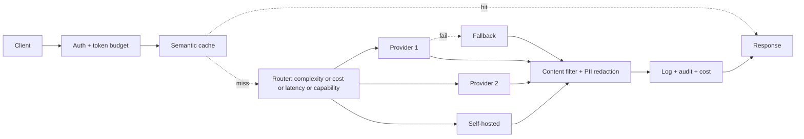
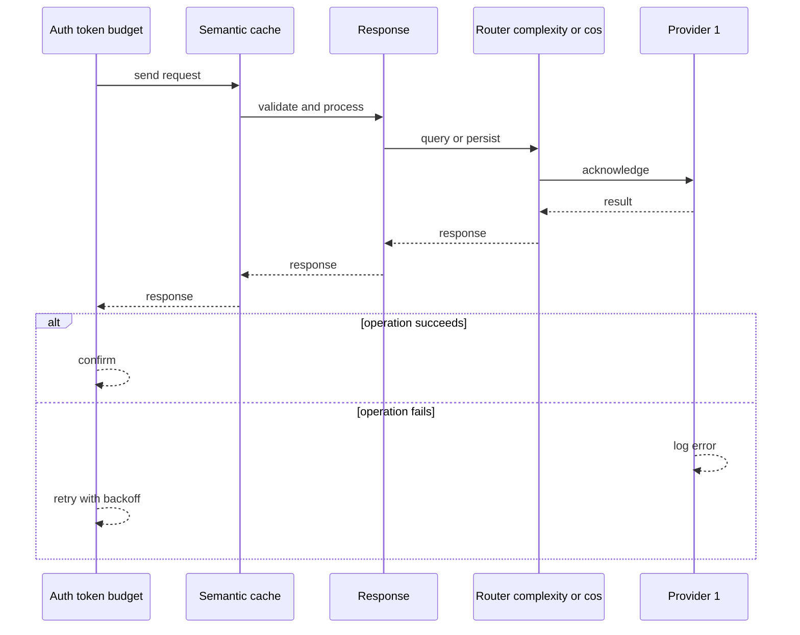
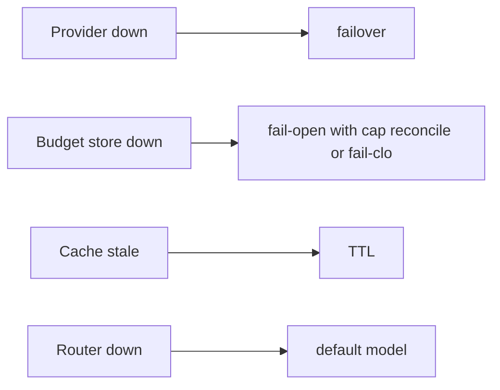
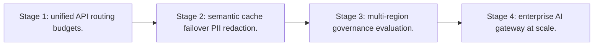

# Case Study: LLM API Gateway

> **Tier:** ai-systems · **Status:** complete · Original numbers and diagrams.

## 1. Problem statement
An enterprise LLM API gateway that provides a unified model API across providers (external and self-hosted), with complexity/cost/latency routing, per-tenant token budgets, failover, semantic caching, content filtering, PII redaction, and full audit. This is a ai-systems-tier system design challenge because it must handle GPU-bound inference at scale while ensuring grounded, cited, and permission-aware answers. The design must be production-grade: observable, debuggable, reversible, and able to survive component failures without data loss or cascading outages.

## 2. Scope
In (v1): unified API, provider abstraction, multi-model routing (complexity, cost, latency, capability), token-based rate limiting and budgets, provider failover, semantic caching, content filtering, PII redaction, logging, audit. Out: model hosting (uses providers).

For LLM API Gateway, these boundaries keep the first version focused on the core user value. Adding more features would dilute the design and delay shipping. Each excluded item is a scaling stage — a candidate for the next iteration once the baseline is proven.

## 3. Functional requirements

- Accept a unified API call.
- Authenticate and check token budget.
- Route to the best model for the task.
- Fail over on provider failure.
- Cache semantically equivalent safe queries.
- Filter content and redact PII.
- Log and audit all calls.
- Enforce per-tenant token budgets.

## 4. Non-functional requirements
- Gateway overhead p99 < 20 ms.
- Availability 99.95 percent.
- No PII in logs.
- No cost overrun (budgets enforced).

For LLM API Gateway, each non-functional target constrains a specific component: the latency SLO bounds the number of synchronous hops, the availability target forces redundancy across availability zones, and the cost ceiling limits the replication factor and storage tier.

## 5. Explicit assumptions
1. 100 tenants, 10k requests/s peak. [assumption] 2. Token distribution: 80 percent short, 20 percent long-context. [assumption] 3. 3 providers + 1 self-hosted. [constraint]

For LLM API Gateway, if these assumptions are off by an order of magnitude, the architecture must adapt: 10x traffic may require earlier sharding, a different read-write ratio changes the caching strategy, and a higher peak multiplier demands more headroom.

## 6. Traffic estimation
10k req/s peak; each request carries input tokens (budget by tokens, not RPS).

To derive the request rate: divide the daily volume by 86,400 seconds to get the average rate, then multiply by 5-10x for peak. The read-to-write ratio determines whether the system is cache-dominated (read-heavy) or write-path-dominated (write-heavy). For LLM API Gateway, this ratio shapes the entire storage and replication strategy.

## 7. Storage estimation
Usage logs + audit + cache; moderate, must be auditable.

For LLM API Gateway, storage growth is projected from the daily write volume and retention policy. Index overhead and compression factors are accounted for in the total.

## 8. Bandwidth estimation
Pass-through (input + output tokens); gateway adds minimal.

Bandwidth is request rate multiplied by average payload size for ingress, and response rate multiplied by response size for egress. CDN and edge caching reduce origin egress. Compression reduces bandwidth by 50-80 percent where applicable. For LLM API Gateway, bandwidth may or may not be the binding constraint — compare it against compute and storage to find out.

## 9. API design

POST /v1/completions (unified) -> streamed response; GET /v1/usage/:tenant.

## 10. Data model
usage(tenant, req_id, model, input_tokens, output_tokens, cost, ts); cache(query_hash, tenant, answer, ttl); providers(name, endpoint, key_ref, models, cost_per_1M).

For LLM API Gateway, the data model follows the access pattern. The primary lookup determines the partition key; secondary lookups determine indexes. Denormalization is used selectively on hot read paths.

## 11. High-level architecture

## 12. Request flow
Client calls unified API -> auth + token budget check -> semantic cache (safe + same tenant) -> hit returns; miss -> router picks best model (complexity/cost/latency/capability) -> provider call -> on fail, failover -> content filter + PII redaction -> log + audit + cost -> return.

## 13. Component responsibilities
Auth, token budget store, semantic cache, router, provider connectors, failover, content filter, PII redaction, logger/auditor, cost tracker.

For LLM API Gateway, each component has one job. The gateway authenticates and routes. Services are stateless and scale horizontally. The data tier is the stateful core that scales by sharding.

## 14. Database selection
Usage/audit (relational, append-only); semantic cache (embedding index + KV); provider registry (secret manager). Rejected: RPS-based rate limiting (insufficient for LLMs).

For LLM API Gateway, the database was chosen by access pattern, not familiarity. The rejected alternatives were wrong for this workload, not bad in general.

## 15. Caching strategy
Semantic cache namespaced by tenant + model + prompt version; unsafe for time-sensitive or user-specific; TTL.

For LLM API Gateway, the cache strategy matches the staleness tolerance. Cache-aside for most data, write-through where read-after-write matters, stampede protection on hot keys.

## 16. Partitioning strategy
Usage by tenant; cache by tenant; gateway stateless; router stateless.

For LLM API Gateway, the partition key balances query locality with even load distribution. Sharding strategy matters because a poor key creates hot spots under real traffic patterns.

## 17. Replication strategy
Gateway stateless RF=many; usage store RF=3; cache replicated; provider credentials in secret manager.

For LLM API Gateway, replication mode is split: synchronous where durability is critical, asynchronous elsewhere for throughput. RF=3 tolerates one failure. Failover is tested regularly.

## 18. Consistency model
Usage/cost strongly tracked; cache versioned; budget strongly enforced.

For LLM API Gateway, the consistency level is the weakest users accept. Read-your-writes is provided where needed. Eventual consistency is bounded and monitored, not unbounded and silent.

## 19. Failure scenarios
Provider down -> failover. Budget store down -> fail-open with cap + reconcile (or fail-closed). Cache stale -> TTL. Router down -> default model.

## 20. Reliability strategy
SLI overhead latency, availability; SLO 99.95 percent. Failover + budget enforcement. Chaos: kill a provider, assert failover.

For LLM API Gateway, the SLO makes reliability measurable. The error budget balances feature velocity with stability. Chaos testing validates that resilience claims hold under real failures.

## 21. Security considerations
API key management + rotation; PII redaction before logging; content filtering; no confidential data to unapproved external models; per-tenant isolation; full audit; mTLS to providers.

For LLM API Gateway, security layers TLS, encryption at rest, RBAC, PII redaction, and audit. The policy gateway is fail-closed for AI-augmented operations.

## 22. Observability strategy
Requests/s, tokens/s, routing distribution, cache hit ratio, cost per tenant, failover rate, content-filter blocks, PII redaction count, p99 overhead.

For LLM API Gateway, observability combines logs, metrics, and traces with correlation IDs. Golden signals drive the first dashboard. Alerts fire on burn rate, not raw thresholds.

## 23. Cost considerations
Gateway compute (stateless, cheap) + cache (saves LLM cost). Routing to cheaper models cuts cost; budgets cap spend.

For LLM API Gateway, cost is driven by the binding resource. Caching, tiering, batching, and right-sizing are the levers. Cost per request is tracked and alerted on.

## 24. Scaling stages
Stage 1: unified API + routing + budgets. -> Stage 2: semantic cache + failover + PII redaction. -> Stage 3: multi-region + governance + evaluation. -> Stage 4: enterprise AI gateway at scale.

## 25. Trade-offs
Centralized (policy consistency) vs SPOF. Routing (cost) vs latency overhead. Token budgets (fairness) vs flexibility. Cache (cost) vs freshness/safety.

For LLM API Gateway, each trade-off lists what was chosen, what was rejected, and why. This makes the design defensible in review — every decision has documented reasoning.

## 26. Alternative designs
Direct provider calls (no control, no budget, no audit). RPS limits (wrong unit). Single provider (SPOF). No cache (full cost).

For LLM API Gateway, the alternatives are real architectures that work under different constraints. They were rejected for this workload's specific requirements, not because they are bad designs.

## 27. Interview discussion points
Clarify provider count, token distribution, budget enforcement, cache safety. Surface routing, token-based budgets, failover, PII redaction, audit.

For LLM API Gateway in an interview: clarify scope first, surface the read-write ratio, design the hot path deeply, discuss failures, and offer an alternative. Weak candidates skip failure modes.

## 28. Original Mermaid diagrams
Standalone sources under `diagrams/case-studies/llm-api-gateway/`: `context.mmd`, `request-sequence.mmd`, `failure-flow.mmd`, `scaling-evolution.mmd`. The diagrams are embedded in their respective sections: architecture in section 11, request flow in section 12, failure scenarios in section 19, and scaling stages in section 24.

## 29. Further reading
LLM gateways: docs/ai-systems/13-llm-gateway; semantic caching: 14-semantic-caching; AI security: 09-ai-security; API gateway: Level 2. Sources: `S-VECTORDB` `S-RAG`.

## 30. Practical exercises

1. Routing policy for 4 models. 2. Token budget enforcement with concurrency. 3. Safe vs unsafe cache categories. 4. Failover with 3 providers. 5. PII redaction pipeline.

---
Previous: Autonomous support-agent team · Next: (end of AI case studies)

