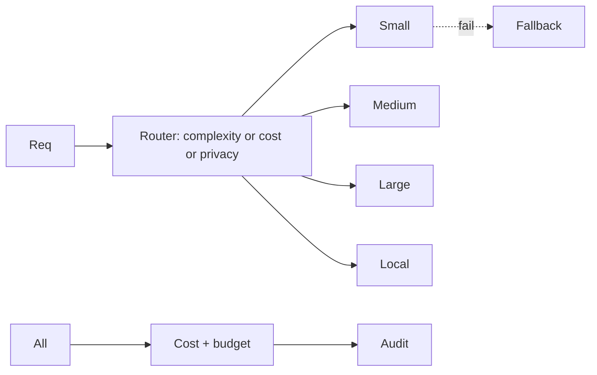
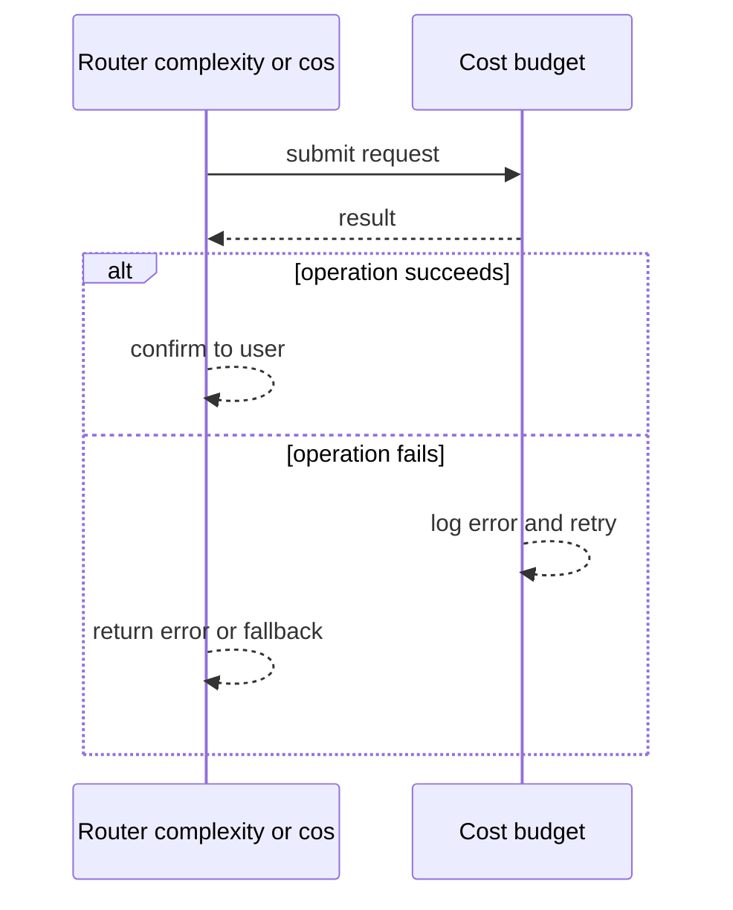
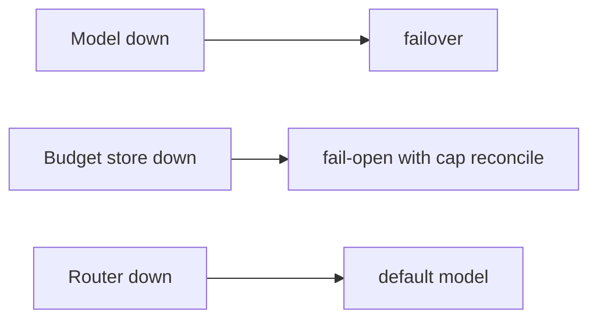
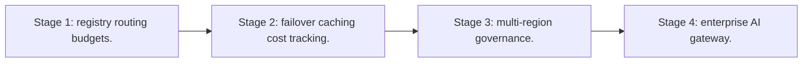

# Case Study: Multi-Model Routing Platform

> **Tier:** ai-systems · **Status:** complete · Original numbers and diagrams.

## 1. Problem statement
A platform that routes AI requests to the cheapest capable model based on task type, token count, latency, privacy, and cost budget, maximizing quality per dollar. This is a ai-systems-tier system design challenge because it must handle GPU-bound inference at scale while ensuring no single point of failure. The design must be production-grade: observable, debuggable, reversible, and able to survive component failures without data loss or cascading outages.

## 2. Scope
In: model registry, routing rules (complexity, cost, latency, capability, privacy), per-tenant budgets, failover, cost tracking. Out: model hosting.

For Multi-Model Routing Platform, these boundaries keep the first version focused on the core user value. Adding more features would dilute the design and delay shipping. Each excluded item is a scaling stage — a candidate for the next iteration once the baseline is proven.

## 3. Functional requirements
- Register models with capabilities, costs, latency, max tokens.
- Route each request to cheapest capable model.
- Fail over on model failure.
- Track cost per request and tenant.
- Enforce per-tenant budgets.
- Route confidential to local models.

For Multi-Model Routing Platform, these requirements drive specific architectural decisions: the read-write ratio determines the caching strategy, the durability target sets the replication mode, and the idempotency requirement shapes the API contract.

## 4. Non-functional requirements
- Routing decision < 5 ms.
- Availability 99.95 percent.
- No cost overrun.

For Multi-Model Routing Platform, each non-functional target constrains a specific component: the latency SLO bounds the number of synchronous hops, the availability target forces redundancy across availability zones, and the cost ceiling limits the replication factor and storage tier.

## 5. Explicit assumptions
1. 20 models (5 external + 15 self-hosted). 2. 10k req/s. 3. 80 percent simple tasks.

For Multi-Model Routing Platform, if these assumptions are off by an order of magnitude, the architecture must adapt: 10x traffic may require earlier sharding, a different read-write ratio changes the caching strategy, and a higher peak multiplier demands more headroom.

## 6. Traffic estimation
10k req/s; routing is fast (in-memory).

To derive the request rate: divide the daily volume by 86,400 seconds to get the average rate, then multiply by 5-10x for peak. The read-to-write ratio determines whether the system is cache-dominated (read-heavy) or write-path-dominated (write-heavy). For Multi-Model Routing Platform, this ratio shapes the entire storage and replication strategy.

## 7. Storage estimation
Model registry + usage logs + audit; small, durable.

For Multi-Model Routing Platform, storage growth is projected from the daily write volume and retention policy. Index overhead and compression factors are accounted for in the total.

## 8. Bandwidth estimation
Pass-through (input + output tokens); gateway adds minimal.

Bandwidth is request rate multiplied by average payload size for ingress, and response rate multiplied by response size for egress. CDN and edge caching reduce origin egress. Compression reduces bandwidth by 50-80 percent where applicable. For Multi-Model Routing Platform, bandwidth may or may not be the binding constraint — compare it against compute and storage to find out.

## 9. API design

POST /v1/completions (unified) -> streamed response; GET /v1/usage/:tenant.

## 10. Data model
models(id, provider, cost_per_1m, max_tokens, caps, latency); usage(tenant, model, tokens, cost, ts); budgets(tenant, limit).

For Multi-Model Routing Platform, the data model follows the access pattern. The primary lookup determines the partition key; secondary lookups determine indexes. Denormalization is used selectively on hot read paths.

## 11. High-level architecture

## 12. Request flow
Request -> router evaluates task, tokens, privacy -> cheapest capable model -> on fail, failover -> track cost per tenant -> audit. Confidential -> local only.

## 13. Component responsibilities
Model registry, router, cost tracker, budget enforcer, failover, audit.

For Multi-Model Routing Platform, each component has one job. The gateway authenticates and routes. Services are stateless and scale horizontally. The data tier is the stateful core that scales by sharding.

## 14. Database selection
Model registry (KV, hot-reloaded); usage (relational); budgets (strongly consistent); audit (append-only).

For Multi-Model Routing Platform, the database was chosen by access pattern, not familiarity. The rejected alternatives were wrong for this workload, not bad in general.

## 15. Caching strategy
Model registry cached in-memory; routing decisions cached for identical tuples.

For Multi-Model Routing Platform, the cache strategy matches the staleness tolerance. Cache-aside for most data, write-through where read-after-write matters, stampede protection on hot keys.

## 16. Partitioning strategy
Usage by tenant; audit by date; router stateless; budgets by tenant.

For Multi-Model Routing Platform, the partition key balances query locality with even load distribution. Sharding strategy matters because a poor key creates hot spots under real traffic patterns.

## 17. Replication strategy
Registry replicated; usage RF=3; router stateless; audit append-only.

For Multi-Model Routing Platform, replication mode is split: synchronous where durability is critical, asynchronous elsewhere for throughput. RF=3 tolerates one failure. Failover is tested regularly.

## 18. Consistency model
Budgets strongly consistent; usage eventually consistent; registry hot-reloaded.

For Multi-Model Routing Platform, the consistency level is the weakest users accept. Read-your-writes is provided where needed. Eventual consistency is bounded and monitored, not unbounded and silent.

## 19. Failure scenarios
Model down -> failover. Budget store down -> fail-open with cap + reconcile. Router down -> default model.

For Multi-Model Routing Platform, each failure has a specific response plan. The design principle is degrade-don't-cascade: bulkheads isolate dependencies, circuit breakers stop calls to failing services, and timeouts bound every outbound call.

## 20. Reliability strategy
SLI routing latency, availability; SLO 99.95 percent. Failover + budget.

For Multi-Model Routing Platform, the SLO makes reliability measurable. The error budget balances feature velocity with stability. Chaos testing validates that resilience claims hold under real failures.

## 21. Security considerations
Confidential never to external models; per-tenant isolation; API key rotation; PII redaction; audit.

For Multi-Model Routing Platform, security layers TLS, encryption at rest, RBAC, PII redaction, and audit. The policy gateway is fail-closed for AI-augmented operations.

## 22. Observability strategy
Routing distribution, cost per tenant, failover rate, budget burn, model latency, cache hit.

For Multi-Model Routing Platform, observability combines logs, metrics, and traces with correlation IDs. Golden signals drive the first dashboard. Alerts fire on burn rate, not raw thresholds.

## 23. Cost considerations
Gateway compute (cheap); VALUE is cost savings from routing to cheaper models. 80 percent simple on small saves ~90 percent.

For Multi-Model Routing Platform, cost is driven by the binding resource. Caching, tiering, batching, and right-sizing are the levers. Cost per request is tracked and alerted on.

## 24. Scaling stages
Stage 1: registry + routing + budgets. -> Stage 2: failover + caching + cost tracking. -> Stage 3: multi-region + governance. -> Stage 4: enterprise AI gateway.

## 25. Trade-offs
Routing (cost savings) vs latency overhead. Budgets (fairness) vs flexibility. Local (privacy) vs external (quality). Cache (cost) vs freshness.

For Multi-Model Routing Platform, each trade-off lists what was chosen, what was rejected, and why. This makes the design defensible in review — every decision has documented reasoning.

## 26. Alternative designs
Single model (expensive). No routing (no cost control). External-only (privacy risk). No budget (cost runaway).

For Multi-Model Routing Platform, the alternatives are real architectures that work under different constraints. They were rejected for this workload's specific requirements, not because they are bad designs.

## 27. Interview discussion points
Clarify model count, task types, privacy levels, budget enforcement. Surface routing, failover, budgets, local model, cost tracking.

For Multi-Model Routing Platform in an interview: clarify scope first, surface the read-write ratio, design the hot path deeply, discuss failures, and offer an alternative. Weak candidates skip failure modes.

## 28. Original Mermaid diagrams
Standalone sources under `diagrams/case-studies/multi-model-routing-platform/`: `context.mmd`, `request-sequence.mmd`, `failure-flow.mmd`, `scaling-evolution.mmd`. The diagrams are embedded in their respective sections: architecture in section 11, request flow in section 12, failure scenarios in section 19, and scaling stages in section 24.

## 29. Further reading
LLM gateways: docs/ai-systems/13-llm-gateway; model serving: 11-model-serving; model-routing-simulator.py. Sources: `S-VECTORDB` `S-RAG`.

## 30. Practical exercises

1. Routing policy for 5 models. 2. Budget enforcement with concurrency. 3. Confidential to local. 4. Failover chain. 5. Cost savings vs single-model baseline.

---
Previous: GPU workload scheduler · Next: AI evaluation platform

