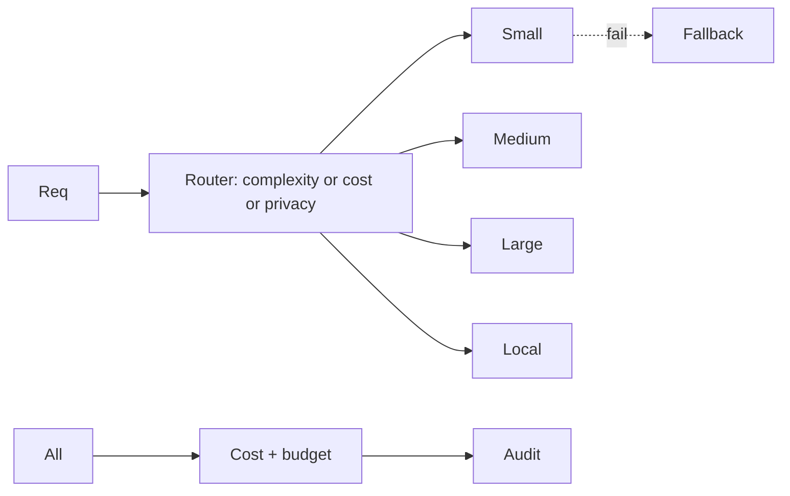
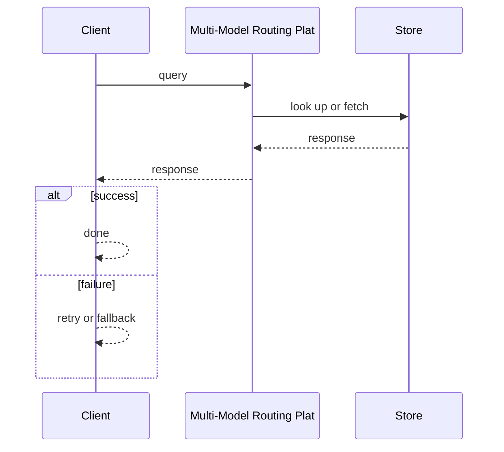
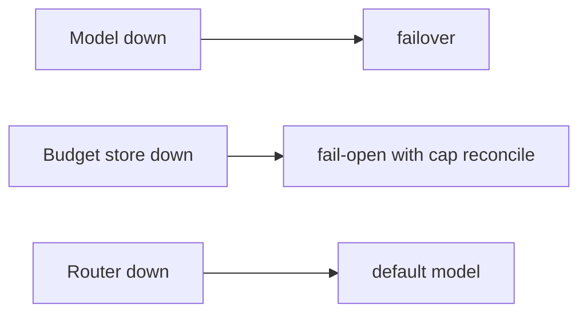

# Case Study: Multi-Model Routing Platform

> **Tier:** ai-systems · **Status:** complete · Original numbers and diagrams.

## 11. High-level architecture

## 28. Original Mermaid diagrams
Standalone sources under `diagrams/case-studies/multi-model-routing-platform/`: `context.mmd`, `request-sequence.mmd`, `failure-flow.mmd`, `scaling-evolution.mmd`. The diagrams are embedded in their respective sections: architecture in section 11, request flow in section 12, failure scenarios in section 19, and scaling stages in section 24.

## 1. Problem statement

A platform that routes AI requests to the cheapest capable model based on task type, token count, latency, privacy, and cost budget, maximizing quality per dollar.

## 2. Scope

In: model registry, routing rules (complexity, cost, latency, capability, privacy), per-tenant budgets, failover, cost tracking. Out: model hosting.

## 3. Functional requirements

- Register models with capabilities, costs, latency, max tokens.
- Route each request to cheapest capable model.
- Fail over on model failure.
- Track cost per request and tenant.
- Enforce per-tenant budgets.
- Route confidential to local models.

## 4. Non-functional requirements

- Routing decision < 5 ms.
- Availability 99.95 percent.
- No cost overrun.

## 5. Explicit assumptions

1. 20 models (5 external + 15 self-hosted). 2. 10k req/s. 3. 80 percent simple tasks.

## 6. Traffic estimation

10k req/s; routing is fast (in-memory).

## 7. Storage estimation

Model registry + usage logs + audit; small, durable.

## 8. Bandwidth estimation

Pass-through (input + output tokens); gateway adds minimal.

## 9. API design

POST /v1/completions (unified) -> streamed response; GET /v1/usage/:tenant.

## 10. Data model

models(id, provider, cost_per_1m, max_tokens, caps, latency); usage(tenant, model, tokens, cost, ts); budgets(tenant, limit).

## 12. Request flow
Request -> router evaluates task, tokens, privacy -> cheapest capable model -> on fail, failover -> track cost per tenant -> audit. Confidential -> local only.

## 13. Component responsibilities

Model registry, router, cost tracker, budget enforcer, failover, audit.

## 14. Database selection

Model registry (KV, hot-reloaded); usage (relational); budgets (strongly consistent); audit (append-only).

## 15. Caching strategy

Model registry cached in-memory; routing decisions cached for identical tuples.

## 16. Partitioning strategy

Usage by tenant; audit by date; router stateless; budgets by tenant.

## 17. Replication strategy

Registry replicated; usage RF=3; router stateless; audit append-only.

## 18. Consistency model

Budgets strongly consistent; usage eventually consistent; registry hot-reloaded.

## 19. Failure scenarios
Model down -> failover. Budget store down -> fail-open with cap + reconcile. Router down -> default model.

## 20. Reliability strategy

SLI routing latency, availability; SLO 99.95 percent. Failover + budget.

## 21. Security considerations

Confidential never to external models; per-tenant isolation; API key rotation; PII redaction; audit.

## 22. Observability strategy

Routing distribution, cost per tenant, failover rate, budget burn, model latency, cache hit.

## 23. Cost considerations

Gateway compute (cheap); VALUE is cost savings from routing to cheaper models. 80 percent simple on small saves ~90 percent.

## 24. Scaling stages

Stage 1: registry + routing + budgets. -> Stage 2: failover + caching + cost tracking. -> Stage 3: multi-region + governance. -> Stage 4: enterprise AI gateway.

## 25. Trade-offs

Routing (cost savings) vs latency overhead. Budgets (fairness) vs flexibility. Local (privacy) vs external (quality). Cache (cost) vs freshness.

## 26. Alternative designs

Single model (expensive). No routing (no cost control). External-only (privacy risk). No budget (cost runaway).

## 27. Interview discussion points

Clarify model count, task types, privacy levels, budget enforcement. Surface routing, failover, budgets, local model, cost tracking.

## 29. Further reading

LLM gateways: docs/ai-systems/13-llm-gateway; model serving: 11-model-serving; model-routing-simulator.py.

## 30. Practical exercises

1. Routing policy for 5 models. 2. Budget enforcement with concurrency. 3. Confidential to local. 4. Failover chain. 5. Cost savings vs single-model baseline.

---
Previous: GPU workload scheduler · Next: AI evaluation platform

