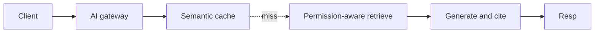
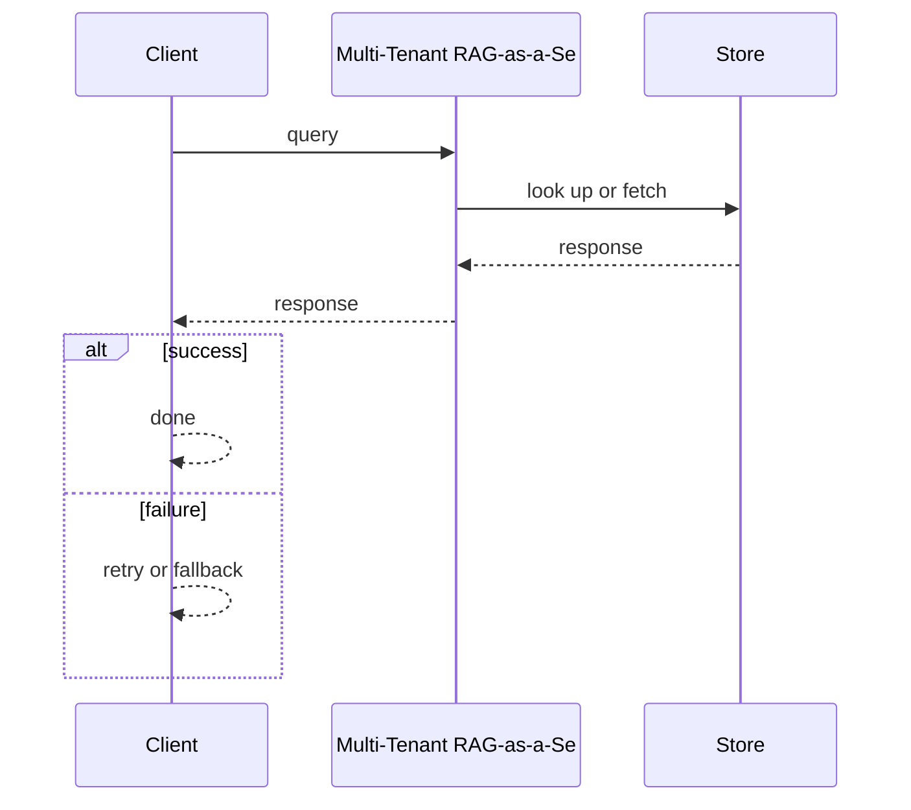
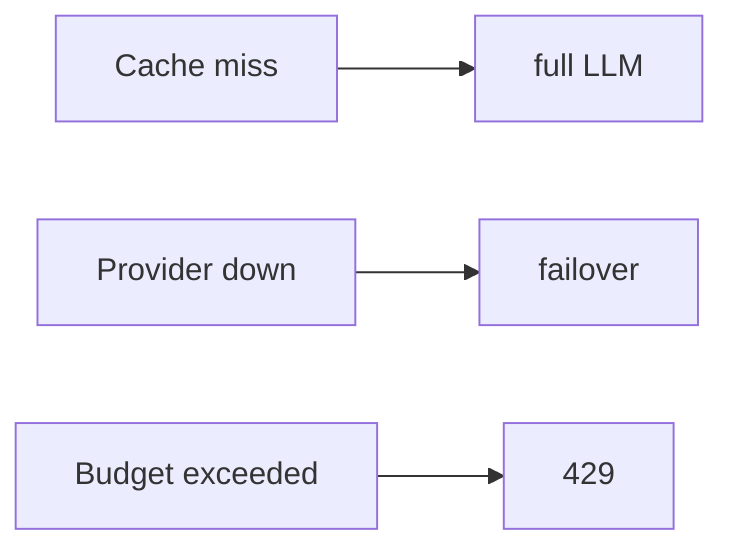

# Case Study: Multi-Tenant RAG-as-a-Service Platform

> **Tier:** ai-systems · **Status:** complete · Original numbers and diagrams.

## 11. High-level architecture

## 28. Original Mermaid diagrams

Standalone sources under `diagrams/case-studies/multi-tenant-rag-service/`: `context.mmd`, `request-sequence.mmd`, `failure-flow.mmd`, `scaling-evolution.mmd`. Request sequence and failure flow:

## 1. Problem statement

A platform where each tenant uploads private corpora and queries via RAG with per-tenant permission-aware retrieval, paying per token.

This system sits at the intersection of distributed systems and operational reliability. The design must balance latency versus durability while ensuring no single component failure cascades. The target audience includes engineers and operators, so the design must be observable, debuggable, and reversible.
## 2. Scope

In: per-tenant ingestion, hybrid retrieval with ACLs, grounded generation, token budgets, semantic caching, multi-model routing. Out: autonomous actions.

The scope boundary is deliberate: including too much in v1 risks a system that is broad but shallow. Each excluded feature is a candidate for a later iteration once the core loop is proven.
## 3. Functional requirements

- Ingest per-tenant docs with ACLs. - Permission-aware hybrid retrieval. - Generate grounded answers with citations. - Per-tenant token budgets. - Semantic cache (safe only). - Multi-model routing. - Full audit.

These requirements drive the architecture: the read-heavy pattern pushes toward caching; the durability requirement forces synchronous writes; the idempotency requirement means every write path handles redelivery without double-application.
## 4. Non-functional requirements

- Answer p99 < 3 s. - No cross-tenant leakage. - Availability 99.9 percent. - Cost capped per tenant.

The non-functional targets shape every component choice: the latency SLO forces edge caching and limits synchronous cross-region calls; the availability target drives redundancy (RF=3, multi-AZ); the cost target constrains the model size.
## 5. Explicit assumptions

1. 500 tenants, 5M chunks, 50 q/s. 2. 20 percent cache hit. 3. ACL filter before generation.

These assumptions are the load-bearing facts of the design. If any is wrong by an order of magnitude, the architecture must adapt: 10x more traffic may require sharding earlier; a different read-write ratio changes the caching strategy entirely.
## 6. Traffic estimation

50 q/s peak; cache hits skip LLM.

The traffic estimate reveals the binding constraint. Peak is modeled at 10x average. The read-write ratio determines whether the system is cache-dominated (read-heavy) or write-path-dominated (write-heavy), which changes the storage and replication strategy.
## 7. Storage estimation

5M chunks x embeddings + metadata = ~15 GB; per-tenant namespaces.

Storage growth is linear with time and must be planned with retention. The estimate includes metadata and index overhead (20-30 percent above raw). Without a retention policy, storage grows unboundedly.
## 8. Bandwidth estimation

Queries small; generation streamed.

Bandwidth is often not the binding constraint but becomes significant at the edge during viral spikes. CDN and edge caching cut origin egress; compression cuts bandwidth by 50-80 percent where applicable.
## 9. API design

POST /ask (tenant, q) -> streamed answer + citations; POST /ingest (tenant, docs).

The API follows REST for external clients and gRPC for internal calls. Every write endpoint accepts an idempotency key. Rate limiting is enforced at the gateway before the service tier.
## 10. Data model

chunks(tenant, id, text, embedding, acl, meta); cache(q_hash, tenant, answer, ttl); usage(tenant, tokens, cost, budget).

The data model is designed around the access pattern, not the entity shape. The primary access path determines the partition key; secondary paths determine indexes. Denormalization is applied selectively where the hot read path would otherwise require expensive joins.
## 12. Request flow

Client asks -> gateway auth + budget -> semantic cache -> hit returns; miss -> permission-aware retrieve -> generate with citations -> cache -> return; audit.

The request flow reveals the critical path: any component on the hot path that fails or slows degrades the user experience. The design applies timeouts, circuit breakers, and bulkheads to each hop. The write path includes an idempotency check before any state mutation.
## 13. Component responsibilities

AI gateway, semantic cache, permission-aware retrieval, LLM, ingestion, usage tracker, audit.

Each component has a single, well-defined responsibility. The gateway handles auth and routing; the service tier is stateless and horizontally scalable; the data tier is the stateful core, carefully partitioned and replicated. The separation allows each tier to scale independently.
## 14. Database selection

Vector DB (per-tenant namespaces); semantic cache; usage (relational); audit (append-only).

The database choice is driven by the access pattern. The rejected alternatives were rejected for specific reasons: a relational DB was rejected if the workload is a single key lookup at massive scale; a KV store was rejected if joins and transactions are needed.
## 15. Caching strategy

Semantic cache by tenant + model + prompt version; unsafe for time-sensitive; TTL.

The caching strategy is designed around the staleness tolerance of the workload. Cache-aside is the default; write-through is used where read-after-write consistency is required. Stampede protection is applied to any key that can go viral. Cache entries are namespaced by tenant.
## 16. Partitioning strategy

Vector index by tenant; cache by tenant; gateway stateless.

The partition key co-locates related data while distributing load evenly. Consistent hashing with virtual nodes minimizes data movement when nodes change. A hot key is mitigated by caching, extra replication, or key splitting.
## 17. Replication strategy

Vector DB RF=3; cache replicated; gateway stateless + failover.

Replication is synchronous on the write-confirmation path where durability is critical and asynchronous elsewhere. RF=3 tolerates one failure. Failover is tested, not just configured. Cross-region replication is asynchronous with a documented RPO.
## 18. Consistency model

Retrieval eventual; cache versioned; budget strongly tracked.

The consistency model is the weakest that users can tolerate. Read-your-writes is provided where the user expects to see their own write. Eventual consistency is bounded (seconds) and monitored. The system documents what eventual means to users.
## 19. Failure scenarios

Cache miss -> full LLM. Provider down -> failover. Budget exceeded -> 429.

Each failure scenario has a documented response: which component detects it, how failover happens, what the user experiences, and how recovery is verified. Bulkheads and circuit breakers prevent one slow dependency from cascading.
## 20. Reliability strategy

SLI answer latency, groundedness, zero leakage; SLO 99.9 percent.

The SLO defines what good means measurably; the error budget is the allowed unavailability spent on deploys and feature risk. The system is tested with chaos engineering to verify resilience. An untested failover is not a failover.
## 21. Security considerations

Permission-aware retrieval before generation; per-tenant isolation; PII redaction; audit.

Security is defense in depth: TLS, encryption at rest, RBAC with default-deny, PII redaction in logs, audit trails, and per-tenant isolation. For AI-augmented systems, the policy gateway is fail-closed: on any error, the system refuses to act.
## 22. Observability strategy

Answer p99, cache hit ratio, cost per tenant, leakage attempts (0), groundedness.

Observability uses logs, metrics, and traces with correlation IDs. The golden signals (latency, traffic, errors, saturation) are the first dashboard. Alerts fire on SLO burn rate, not raw thresholds. The on-call runbook for each alert is tested.
## 23. Cost considerations

LLM calls dominate; cache + routing cut cost; budgets cap spend.

Cost is dominated by the binding resource. Primary levers: caching (cuts read cost), tiering (cuts storage cost), batching (cuts per-request overhead), and right-sizing. Cost is tracked as a first-class metric and alerted on when unit cost spikes.
## 24. Scaling stages

Stage 1: basic RAG + isolation. -> Stage 2: cache + routing. -> Stage 3: governance + billion-chunk. -> Stage 4: multi-region.

The scaling stages are triggered by specific thresholds, not by calendar. Each stage is a deliberate architectural change: Stage 1 handles initial load; Stage 2 when a single node saturates; Stage 3 when latency exceeds the SLO; Stage 4 when hot keys threaten the origin.
## 25. Trade-offs

Cache (cost) vs freshness. Routing (cost) vs quality. Pre-filter (safe) vs post-filter (fast).

Every trade-off has a rejected alternative with a reason. The design does not present one option as universally correct; it presents the chosen option, the rejected alternative, and the workload-specific reason.
## 26. Alternative designs

Single model (cost). Shared cache (leakage). No filter (unauthorized).

The alternative designs are genuine architectures that would work under different constraints. They were rejected for this workload because of specific requirements that make them inferior here but not universally inferior.
## 27. Interview discussion points

Clarify tenant count, ACL model, cache safety, budget. Surface permission-aware retrieval, cache, routing.

In an interview, the strongest candidates clarify ambiguity before designing, surface the read-write ratio and the binding resource, design the hot path deeply, discuss failure modes explicitly, and offer an alternative with a reason.
## 29. Further reading

RAG: docs/ai-systems/06-basic-rag, 07-advanced-rag; caching: 14-semantic-caching; security: 09-ai-security.

The further reading cites primary sources (RFCs, papers, official documentation) via stable IDs in SOURCES.md, not secondary blog posts. Each citation is chosen because it is the authoritative source for a specific technical claim.
## 30. Practical exercises

1. Permission-aware retrieval. 2. Safe vs unsafe cache. 3. Multi-model routing. 4. Budget enforcement. 5. Cross-tenant leak test.

---
Previous: LLM API gateway · Next: GraphRAG research platform

The exercises push the reader beyond v1: re-estimating at 10x reveals capacity limits; adding a new requirement forces an architectural change; designing the failover test reveals whether resilience claims are real.
