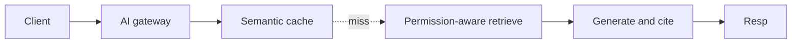
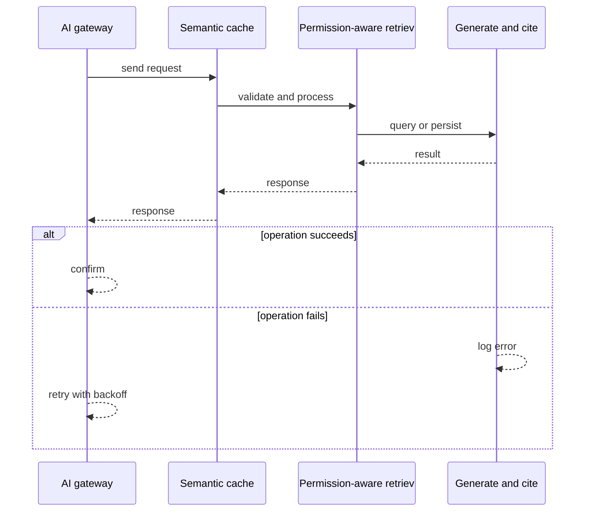
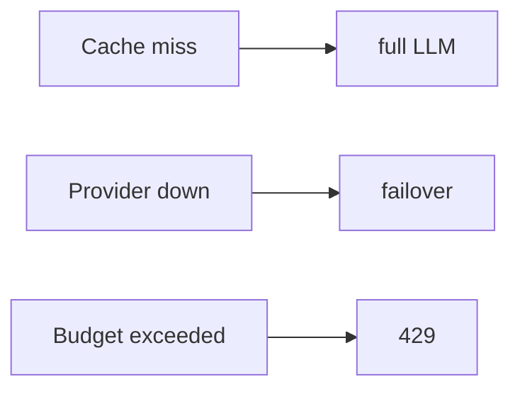
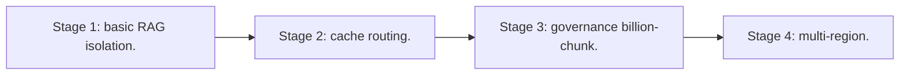

# Case Study: Multi-Tenant RAG-as-a-Service Platform

> **Tier:** ai-systems · **Status:** complete · Original numbers and diagrams.

## 1. Problem statement
A platform where each tenant uploads private corpora and queries via RAG with per-tenant permission-aware retrieval, paying per token. This is a ai-systems-tier system design challenge because it must handle GPU-bound inference at scale while ensuring grounded, cited, and permission-aware answers. The design must be production-grade: observable, debuggable, reversible, and able to survive component failures without data loss or cascading outages.

## 2. Scope
In: per-tenant ingestion, hybrid retrieval with ACLs, grounded generation, token budgets, semantic caching, multi-model routing. Out: autonomous actions.

For Multi-Tenant RAG-as-a-Service Platform, these boundaries keep the first version focused on the core user value. Adding more features would dilute the design and delay shipping. Each excluded item is a scaling stage — a candidate for the next iteration once the baseline is proven.

## 3. Functional requirements
- Ingest per-tenant docs with ACLs.
- Permission-aware hybrid retrieval.
- Generate grounded answers with citations.
- Per-tenant token budgets.
- Semantic cache (safe only).
- Multi-model routing.
- Full audit.

For Multi-Tenant RAG-as-a-Service Platform, these requirements drive specific architectural decisions: the read-write ratio determines the caching strategy, the durability target sets the replication mode, and the idempotency requirement shapes the API contract.

## 4. Non-functional requirements
- Answer p99 < 3 s.
- No cross-tenant leakage.
- Availability 99.9 percent.
- Cost capped per tenant.

For Multi-Tenant RAG-as-a-Service Platform, each non-functional target constrains a specific component: the latency SLO bounds the number of synchronous hops, the availability target forces redundancy across availability zones, and the cost ceiling limits the replication factor and storage tier.

## 5. Explicit assumptions
1. 500 tenants, 5M chunks, 50 q/s. 2. 20 percent cache hit. 3. ACL filter before generation.

For Multi-Tenant RAG-as-a-Service Platform, if these assumptions are off by an order of magnitude, the architecture must adapt: 10x traffic may require earlier sharding, a different read-write ratio changes the caching strategy, and a higher peak multiplier demands more headroom.

## 6. Traffic estimation
50 q/s peak; cache hits skip LLM.

To derive the request rate: divide the daily volume by 86,400 seconds to get the average rate, then multiply by 5-10x for peak. The read-to-write ratio determines whether the system is cache-dominated (read-heavy) or write-path-dominated (write-heavy). For Multi-Tenant RAG-as-a-Service Platform, this ratio shapes the entire storage and replication strategy.

## 7. Storage estimation
5M chunks x embeddings + metadata = ~15 GB; per-tenant namespaces.

For Multi-Tenant RAG-as-a-Service Platform, storage growth is projected from the daily write volume and retention policy. Index overhead and compression factors are accounted for in the total.

## 8. Bandwidth estimation
Queries small; generation streamed.

Bandwidth is request rate multiplied by average payload size for ingress, and response rate multiplied by response size for egress. CDN and edge caching reduce origin egress. Compression reduces bandwidth by 50-80 percent where applicable. For Multi-Tenant RAG-as-a-Service Platform, bandwidth may or may not be the binding constraint — compare it against compute and storage to find out.

## 9. API design

POST /ask (tenant, q) -> streamed answer + citations; POST /ingest (tenant, docs).

## 10. Data model
chunks(tenant, id, text, embedding, acl, meta); cache(q_hash, tenant, answer, ttl); usage(tenant, tokens, cost, budget).

For Multi-Tenant RAG-as-a-Service Platform, the data model follows the access pattern. The primary lookup determines the partition key; secondary lookups determine indexes. Denormalization is used selectively on hot read paths.

## 11. High-level architecture

## 12. Request flow
Client asks -> gateway auth + budget -> semantic cache -> hit returns; miss -> permission-aware retrieve -> generate with citations -> cache -> return; audit.

## 13. Component responsibilities
AI gateway, semantic cache, permission-aware retrieval, LLM, ingestion, usage tracker, audit.

For Multi-Tenant RAG-as-a-Service Platform, each component has one job. The gateway authenticates and routes. Services are stateless and scale horizontally. The data tier is the stateful core that scales by sharding.

## 14. Database selection
Vector DB (per-tenant namespaces); semantic cache; usage (relational); audit (append-only).

For Multi-Tenant RAG-as-a-Service Platform, the database was chosen by access pattern, not familiarity. The rejected alternatives were wrong for this workload, not bad in general.

## 15. Caching strategy
Semantic cache by tenant + model + prompt version; unsafe for time-sensitive; TTL.

For Multi-Tenant RAG-as-a-Service Platform, the cache strategy matches the staleness tolerance. Cache-aside for most data, write-through where read-after-write matters, stampede protection on hot keys.

## 16. Partitioning strategy
Vector index by tenant; cache by tenant; gateway stateless.

For Multi-Tenant RAG-as-a-Service Platform, the partition key balances query locality with even load distribution. Sharding strategy matters because a poor key creates hot spots under real traffic patterns.

## 17. Replication strategy
Vector DB RF=3; cache replicated; gateway stateless + failover.

For Multi-Tenant RAG-as-a-Service Platform, replication mode is split: synchronous where durability is critical, asynchronous elsewhere for throughput. RF=3 tolerates one failure. Failover is tested regularly.

## 18. Consistency model
Retrieval eventual; cache versioned; budget strongly tracked.

For Multi-Tenant RAG-as-a-Service Platform, the consistency level is the weakest users accept. Read-your-writes is provided where needed. Eventual consistency is bounded and monitored, not unbounded and silent.

## 19. Failure scenarios
Cache miss -> full LLM. Provider down -> failover. Budget exceeded -> 429.

For Multi-Tenant RAG-as-a-Service Platform, each failure has a specific response plan. The design principle is degrade-don't-cascade: bulkheads isolate dependencies, circuit breakers stop calls to failing services, and timeouts bound every outbound call.

## 20. Reliability strategy
SLI answer latency, groundedness, zero leakage; SLO 99.9 percent.

For Multi-Tenant RAG-as-a-Service Platform, the SLO makes reliability measurable. The error budget balances feature velocity with stability. Chaos testing validates that resilience claims hold under real failures.

## 21. Security considerations
Permission-aware retrieval before generation; per-tenant isolation; PII redaction; audit.

For Multi-Tenant RAG-as-a-Service Platform, security layers TLS, encryption at rest, RBAC, PII redaction, and audit. The policy gateway is fail-closed for AI-augmented operations.

## 22. Observability strategy
Answer p99, cache hit ratio, cost per tenant, leakage attempts (0), groundedness.

For Multi-Tenant RAG-as-a-Service Platform, observability combines logs, metrics, and traces with correlation IDs. Golden signals drive the first dashboard. Alerts fire on burn rate, not raw thresholds.

## 23. Cost considerations
LLM calls dominate; cache + routing cut cost; budgets cap spend.

For Multi-Tenant RAG-as-a-Service Platform, cost is driven by the binding resource. Caching, tiering, batching, and right-sizing are the levers. Cost per request is tracked and alerted on.

## 24. Scaling stages
Stage 1: basic RAG + isolation. -> Stage 2: cache + routing. -> Stage 3: governance + billion-chunk. -> Stage 4: multi-region.

## 25. Trade-offs
Cache (cost) vs freshness. Routing (cost) vs quality. Pre-filter (safe) vs post-filter (fast).

For Multi-Tenant RAG-as-a-Service Platform, each trade-off lists what was chosen, what was rejected, and why. This makes the design defensible in review — every decision has documented reasoning.

## 26. Alternative designs
Single model (cost). Shared cache (leakage). No filter (unauthorized).

For Multi-Tenant RAG-as-a-Service Platform, the alternatives are real architectures that work under different constraints. They were rejected for this workload's specific requirements, not because they are bad designs.

## 27. Interview discussion points
Clarify tenant count, ACL model, cache safety, budget. Surface permission-aware retrieval, cache, routing.

For Multi-Tenant RAG-as-a-Service Platform in an interview: clarify scope first, surface the read-write ratio, design the hot path deeply, discuss failures, and offer an alternative. Weak candidates skip failure modes.

## 28. Original Mermaid diagrams
Standalone sources under `diagrams/case-studies/multi-tenant-rag-service/`: `context.mmd`, `request-sequence.mmd`, `failure-flow.mmd`, `scaling-evolution.mmd`. The diagrams are embedded in their respective sections: architecture in section 11, request flow in section 12, failure scenarios in section 19, and scaling stages in section 24.

## 29. Further reading
RAG: docs/ai-systems/06-basic-rag, 07-advanced-rag; caching: 14-semantic-caching; security: 09-ai-security. Sources: `S-VECTORDB` `S-RAG`.

## 30. Practical exercises

1. Permission-aware retrieval. 2. Safe vs unsafe cache. 3. Multi-model routing. 4. Budget enforcement. 5. Cross-tenant leak test.

---
Previous: LLM API gateway · Next: GraphRAG research platform

