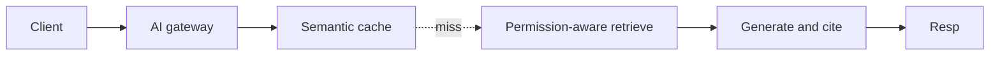
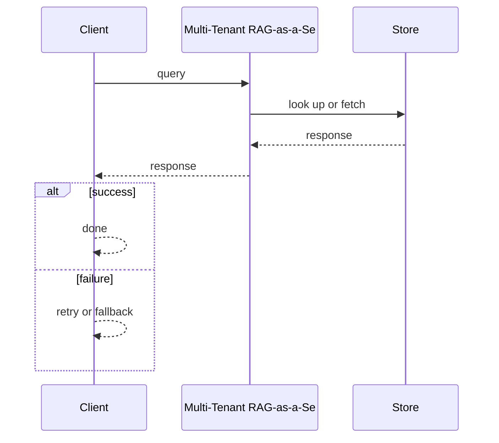
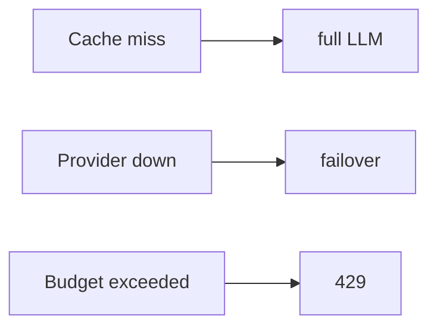

# Case Study: Multi-Tenant RAG-as-a-Service Platform

> **Tier:** ai-systems · **Status:** complete · Original numbers and diagrams.

## 1. Problem statement

A platform where each tenant uploads private corpora and queries via RAG with per-tenant permission-aware retrieval, paying per token.

## 2. Scope

In: per-tenant ingestion, hybrid retrieval with ACLs, grounded generation, token budgets, semantic caching, multi-model routing. Out: autonomous actions.

## 3. Functional requirements

- Ingest per-tenant docs with ACLs.
- Permission-aware hybrid retrieval.
- Generate grounded answers with citations.
- Per-tenant token budgets.
- Semantic cache (safe only).
- Multi-model routing.
- Full audit.

## 4. Non-functional requirements

- Answer p99 < 3 s.
- No cross-tenant leakage.
- Availability 99.9 percent.
- Cost capped per tenant.

## 5. Explicit assumptions

1. 500 tenants, 5M chunks, 50 q/s. 2. 20 percent cache hit. 3. ACL filter before generation.

## 6. Traffic estimation

50 q/s peak; cache hits skip LLM.

## 7. Storage estimation

5M chunks x embeddings + metadata = ~15 GB; per-tenant namespaces.

## 8. Bandwidth estimation

Queries small; generation streamed.

## 9. API design

POST /ask (tenant, q) -> streamed answer + citations; POST /ingest (tenant, docs).

## 10. Data model

chunks(tenant, id, text, embedding, acl, meta); cache(q_hash, tenant, answer, ttl); usage(tenant, tokens, cost, budget).

## 11. High-level architecture

## 12. Request flow
Client asks -> gateway auth + budget -> semantic cache -> hit returns; miss -> permission-aware retrieve -> generate with citations -> cache -> return; audit.

## 13. Component responsibilities

AI gateway, semantic cache, permission-aware retrieval, LLM, ingestion, usage tracker, audit.

## 14. Database selection

Vector DB (per-tenant namespaces); semantic cache; usage (relational); audit (append-only).

## 15. Caching strategy

Semantic cache by tenant + model + prompt version; unsafe for time-sensitive; TTL.

## 16. Partitioning strategy

Vector index by tenant; cache by tenant; gateway stateless.

## 17. Replication strategy

Vector DB RF=3; cache replicated; gateway stateless + failover.

## 18. Consistency model

Retrieval eventual; cache versioned; budget strongly tracked.

## 19. Failure scenarios
Cache miss -> full LLM. Provider down -> failover. Budget exceeded -> 429.

## 20. Reliability strategy

SLI answer latency, groundedness, zero leakage; SLO 99.9 percent.

## 21. Security considerations

Permission-aware retrieval before generation; per-tenant isolation; PII redaction; audit.

## 22. Observability strategy

Answer p99, cache hit ratio, cost per tenant, leakage attempts (0), groundedness.

## 23. Cost considerations

LLM calls dominate; cache + routing cut cost; budgets cap spend.

## 24. Scaling stages

Stage 1: basic RAG + isolation. -> Stage 2: cache + routing. -> Stage 3: governance + billion-chunk. -> Stage 4: multi-region.

## 25. Trade-offs

Cache (cost) vs freshness. Routing (cost) vs quality. Pre-filter (safe) vs post-filter (fast).

## 26. Alternative designs

Single model (cost). Shared cache (leakage). No filter (unauthorized).

## 27. Interview discussion points

Clarify tenant count, ACL model, cache safety, budget. Surface permission-aware retrieval, cache, routing.

## 28. Original Mermaid diagrams
Standalone sources under `diagrams/case-studies/multi-tenant-rag-service/`: `context.mmd`, `request-sequence.mmd`, `failure-flow.mmd`, `scaling-evolution.mmd`. The diagrams are embedded in their respective sections: architecture in section 11, request flow in section 12, failure scenarios in section 19, and scaling stages in section 24.

## 29. Further reading

RAG: docs/ai-systems/06-basic-rag, 07-advanced-rag; caching: 14-semantic-caching; security: 09-ai-security.

## 30. Practical exercises

1. Permission-aware retrieval. 2. Safe vs unsafe cache. 3. Multi-model routing. 4. Budget enforcement. 5. Cross-tenant leak test.

---
Previous: LLM API gateway · Next: GraphRAG research platform

