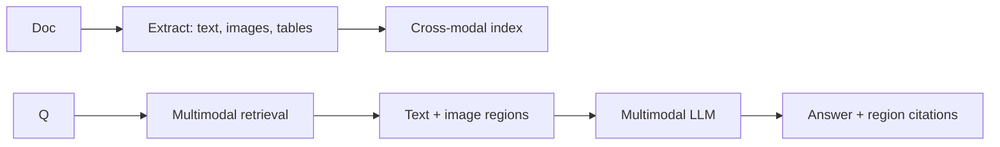
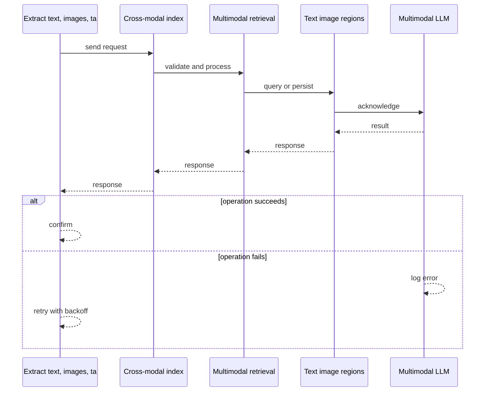
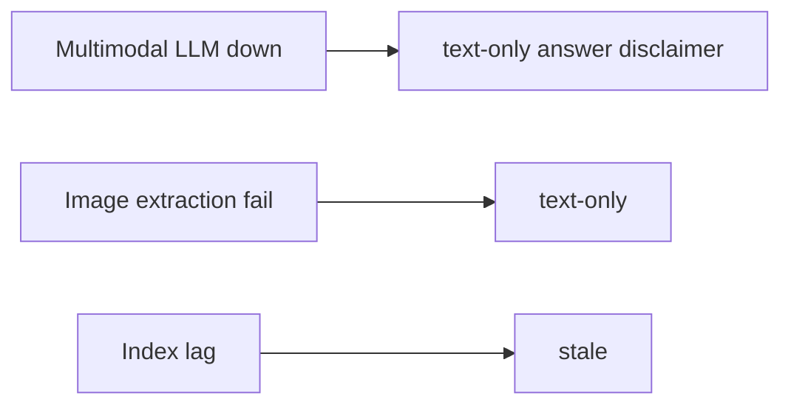
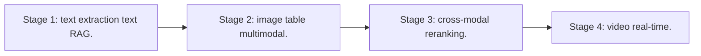

# Case Study: Multimodal Document Understanding System

> **Tier:** ai-systems · **Status:** complete · Original numbers and diagrams.

## 1. Problem statement
A system that ingests documents with text, images, tables, and charts, understands them across modalities, and answers questions about content including visual elements. This is a ai-systems-tier system design challenge because it must handle high availability under peak load while ensuring no single point of failure. The design must be production-grade: observable, debuggable, reversible, and able to survive component failures without data loss or cascading outages.

## 2. Scope
In: document ingestion (PDF, images, text), multimodal extraction, cross-modal retrieval, QA with visual grounding. Out: video understanding.

For Multimodal Document Understanding System, these boundaries keep the first version focused on the core user value. Adding more features would dilute the design and delay shipping. Each excluded item is a scaling stage — a candidate for the next iteration once the baseline is proven.

## 3. Functional requirements
- Ingest documents with text, images, tables, charts.
- Extract and index across modalities.
- Answer questions about visual content.
- Ground answers in document regions.
- Cite page and region.

For Multimodal Document Understanding System, these requirements drive specific architectural decisions: the read-write ratio determines the caching strategy, the durability target sets the replication mode, and the idempotency requirement shapes the API contract.

## 4. Non-functional requirements
- Answer p99 < 5 s.
- Ingest 1k docs/hour.
- Availability 99.9 percent.

For Multimodal Document Understanding System, each non-functional target constrains a specific component: the latency SLO bounds the number of synchronous hops, the availability target forces redundancy across availability zones, and the cost ceiling limits the replication factor and storage tier.

## 5. Explicit assumptions
1. 100k docs, avg 10 pages, 2 images/page. 2. 10 q/s. 3. Multimodal model for vision + text.

For Multimodal Document Understanding System, if these assumptions are off by an order of magnitude, the architecture must adapt: 10x traffic may require earlier sharding, a different read-write ratio changes the caching strategy, and a higher peak multiplier demands more headroom.

## 6. Traffic estimation
10 q/s; ingest 1k docs/hour batch.

To derive the request rate: divide the daily volume by 86,400 seconds to get the average rate, then multiply by 5-10x for peak. The read-to-write ratio determines whether the system is cache-dominated (read-heavy) or write-path-dominated (write-heavy). For Multimodal Document Understanding System, this ratio shapes the entire storage and replication strategy.

## 7. Storage estimation
100k docs x 10 pages x text + images = ~500 GB; embeddings for text + image regions.

For Multimodal Document Understanding System, storage growth is projected from the daily write volume and retention policy. Index overhead and compression factors are accounted for in the total.

## 8. Bandwidth estimation
Document ingest moderate; answers streamed.

Bandwidth is request rate multiplied by average payload size for ingress, and response rate multiplied by response size for egress. CDN and edge caching reduce origin egress. Compression reduces bandwidth by 50-80 percent where applicable. For Multimodal Document Understanding System, bandwidth may or may not be the binding constraint — compare it against compute and storage to find out.

## 9. API design

POST /ingest (doc) -> doc id; POST /ask (doc_id, question) -> answer + region citations.

## 10. Data model
documents(id, pages[]); pages(id, text, images[], tables[], embeddings[]); regions(page, bbox, type, content, embedding).

For Multimodal Document Understanding System, the data model follows the access pattern. The primary lookup determines the partition key; secondary lookups determine indexes. Denormalization is used selectively on hot read paths.

## 11. High-level architecture

## 12. Request flow
Document -> extract text/images/tables -> cross-modal index -> query -> multimodal retrieval (text + image regions) -> multimodal LLM -> answer with region citations.

## 13. Component responsibilities
Document parser, image/table extractor, cross-modal indexer, multimodal retriever, multimodal LLM, citation builder.

For Multimodal Document Understanding System, each component has one job. The gateway authenticates and routes. Services are stateless and scale horizontally. The data tier is the stateful core that scales by sharding.

## 14. Database selection
Document store (object storage); cross-modal index (vector + text); region store (KV).

For Multimodal Document Understanding System, the database was chosen by access pattern, not familiarity. The rejected alternatives were wrong for this workload, not bad in general.

## 15. Caching strategy
Hot doc queries cached; page renderings cached; common patterns cached.

For Multimodal Document Understanding System, the cache strategy matches the staleness tolerance. Cache-aside for most data, write-through where read-after-write matters, stampede protection on hot keys.

## 16. Partitioning strategy
Index by document; queries by doc id; ingest batched.

For Multimodal Document Understanding System, the partition key balances query locality with even load distribution. Sharding strategy matters because a poor key creates hot spots under real traffic patterns.

## 17. Replication strategy
Document store durable; index RF=3; cache replicated.

For Multimodal Document Understanding System, replication mode is split: synchronous where durability is critical, asynchronous elsewhere for throughput. RF=3 tolerates one failure. Failover is tested regularly.

## 18. Consistency model
Index eventual with ingest; answers deterministic on snapshot; citations reference page regions.

For Multimodal Document Understanding System, the consistency level is the weakest users accept. Read-your-writes is provided where needed. Eventual consistency is bounded and monitored, not unbounded and silent.

## 19. Failure scenarios
Multimodal LLM down -> text-only answer (disclaimer). Image extraction fail -> text-only. Index lag -> stale.

For Multimodal Document Understanding System, each failure has a specific response plan. The design principle is degrade-don't-cascade: bulkheads isolate dependencies, circuit breakers stop calls to failing services, and timeouts bound every outbound call.

## 20. Reliability strategy
SLI answer accuracy, citation correctness; SLO 99.9 percent. Text-only fallback.

For Multimodal Document Understanding System, the SLO makes reliability measurable. The error budget balances feature velocity with stability. Chaos testing validates that resilience claims hold under real failures.

## 21. Security considerations
Document PII redaction; per-document access control; no cross-document leakage; audit.

For Multimodal Document Understanding System, security layers TLS, encryption at rest, RBAC, PII redaction, and audit. The policy gateway is fail-closed for AI-augmented operations.

## 22. Observability strategy
Ingest rate, extraction accuracy, answer correctness, citation precision, model latency.

For Multimodal Document Understanding System, observability combines logs, metrics, and traces with correlation IDs. Golden signals drive the first dashboard. Alerts fire on burn rate, not raw thresholds.

## 23. Cost considerations
Multimodal LLM expensive; cache hot queries; route simple text to text-only model.

For Multimodal Document Understanding System, cost is driven by the binding resource. Caching, tiering, batching, and right-sizing are the levers. Cost per request is tracked and alerted on.

## 24. Scaling stages
Stage 1: text extraction + text RAG. -> Stage 2: image + table + multimodal. -> Stage 3: cross-modal reranking. -> Stage 4: video + real-time.

## 25. Trade-offs
Multimodal (visual) vs text-only (cheaper). Full-page (accuracy) vs region-level (latency). Cross-modal (comprehensive) vs single-modal (simple).

For Multimodal Document Understanding System, each trade-off lists what was chosen, what was rejected, and why. This makes the design defensible in review — every decision has documented reasoning.

## 26. Alternative designs
Text-only (misses visual). Human review (slow). OCR-only (misses layout and charts).

For Multimodal Document Understanding System, the alternatives are real architectures that work under different constraints. They were rejected for this workload's specific requirements, not because they are bad designs.

## 27. Interview discussion points
Clarify document types, visual content, latency, citation requirements. Surface cross-modal indexing, multimodal retrieval, region-level grounding.

For Multimodal Document Understanding System in an interview: clarify scope first, surface the read-write ratio, design the hot path deeply, discuss failures, and offer an alternative. Weak candidates skip failure modes.

## 28. Original Mermaid diagrams
Standalone sources under `diagrams/case-studies/multimodal-document-understanding/`: `context.mmd`, `request-sequence.mmd`, `failure-flow.mmd`, `scaling-evolution.mmd`. The diagrams are embedded in their respective sections: architecture in section 11, request flow in section 12, failure scenarios in section 19, and scaling stages in section 24.

## 29. Further reading
Multimodal LLM refs; docs/ai-systems/03-vector-databases; RAG: 06-basic-rag; hybrid: 05-hybrid-search-reranking. Sources: `S-CHASH` `S-DYNAMO`.

## 30. Practical exercises

1. Extract and index a table from PDF. 2. Answer about a chart. 3. Region-level citation accuracy. 4. Text-only fallback. 5. Cross-modal reranking.

---
Previous: AI search engine · Next: Real-time voice-agent platform

