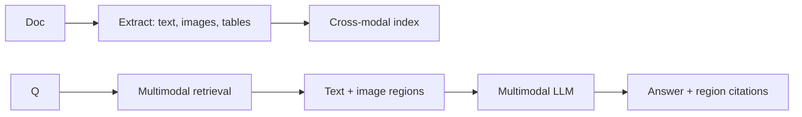
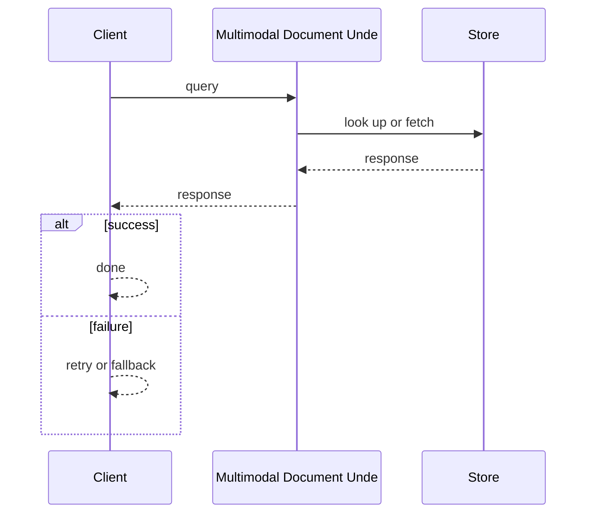
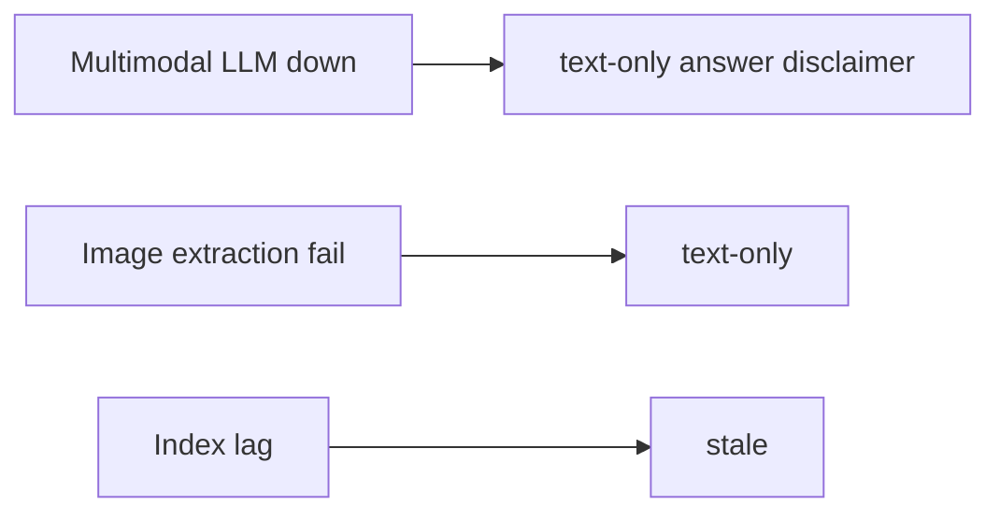

# Case Study: Multimodal Document Understanding System

> **Tier:** ai-systems · **Status:** complete · Original numbers and diagrams.

## 11. High-level architecture

## 28. Original Mermaid diagrams
Standalone sources under `diagrams/case-studies/multimodal-document-understanding/`: `context.mmd`, `request-sequence.mmd`, `failure-flow.mmd`, `scaling-evolution.mmd`. The diagrams are embedded in their respective sections: architecture in section 11, request flow in section 12, failure scenarios in section 19, and scaling stages in section 24.

## 1. Problem statement

A system that ingests documents with text, images, tables, and charts, understands them across modalities, and answers questions about content including visual elements.

## 2. Scope

In: document ingestion (PDF, images, text), multimodal extraction, cross-modal retrieval, QA with visual grounding. Out: video understanding.

## 3. Functional requirements

- Ingest documents with text, images, tables, charts.
- Extract and index across modalities.
- Answer questions about visual content.
- Ground answers in document regions.
- Cite page and region.

## 4. Non-functional requirements

- Answer p99 < 5 s.
- Ingest 1k docs/hour.
- Availability 99.9 percent.

## 5. Explicit assumptions

1. 100k docs, avg 10 pages, 2 images/page. 2. 10 q/s. 3. Multimodal model for vision + text.

## 6. Traffic estimation

10 q/s; ingest 1k docs/hour batch.

## 7. Storage estimation

100k docs x 10 pages x text + images = ~500 GB; embeddings for text + image regions.

## 8. Bandwidth estimation

Document ingest moderate; answers streamed.

## 9. API design

POST /ingest (doc) -> doc id; POST /ask (doc_id, question) -> answer + region citations.

## 10. Data model

documents(id, pages[]); pages(id, text, images[], tables[], embeddings[]); regions(page, bbox, type, content, embedding).

## 12. Request flow
Document -> extract text/images/tables -> cross-modal index -> query -> multimodal retrieval (text + image regions) -> multimodal LLM -> answer with region citations.

## 13. Component responsibilities

Document parser, image/table extractor, cross-modal indexer, multimodal retriever, multimodal LLM, citation builder.

## 14. Database selection

Document store (object storage); cross-modal index (vector + text); region store (KV).

## 15. Caching strategy

Hot doc queries cached; page renderings cached; common patterns cached.

## 16. Partitioning strategy

Index by document; queries by doc id; ingest batched.

## 17. Replication strategy

Document store durable; index RF=3; cache replicated.

## 18. Consistency model

Index eventual with ingest; answers deterministic on snapshot; citations reference page regions.

## 19. Failure scenarios
Multimodal LLM down -> text-only answer (disclaimer). Image extraction fail -> text-only. Index lag -> stale.

## 20. Reliability strategy

SLI answer accuracy, citation correctness; SLO 99.9 percent. Text-only fallback.

## 21. Security considerations

Document PII redaction; per-document access control; no cross-document leakage; audit.

## 22. Observability strategy

Ingest rate, extraction accuracy, answer correctness, citation precision, model latency.

## 23. Cost considerations

Multimodal LLM expensive; cache hot queries; route simple text to text-only model.

## 24. Scaling stages

Stage 1: text extraction + text RAG. -> Stage 2: image + table + multimodal. -> Stage 3: cross-modal reranking. -> Stage 4: video + real-time.

## 25. Trade-offs

Multimodal (visual) vs text-only (cheaper). Full-page (accuracy) vs region-level (latency). Cross-modal (comprehensive) vs single-modal (simple).

## 26. Alternative designs

Text-only (misses visual). Human review (slow). OCR-only (misses layout and charts).

## 27. Interview discussion points

Clarify document types, visual content, latency, citation requirements. Surface cross-modal indexing, multimodal retrieval, region-level grounding.

## 29. Further reading

Multimodal LLM refs; docs/ai-systems/03-vector-databases; RAG: 06-basic-rag; hybrid: 05-hybrid-search-reranking.

## 30. Practical exercises

1. Extract and index a table from PDF. 2. Answer about a chart. 3. Region-level citation accuracy. 4. Text-only fallback. 5. Cross-modal reranking.

---
Previous: AI search engine · Next: Real-time voice-agent platform

