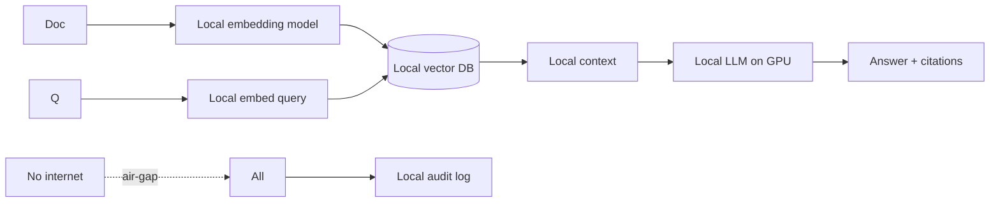
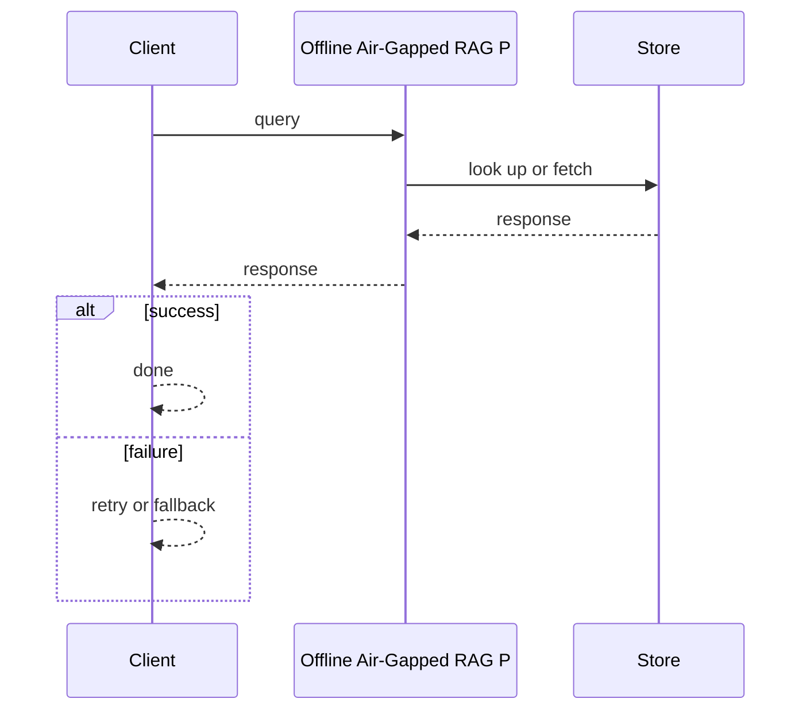
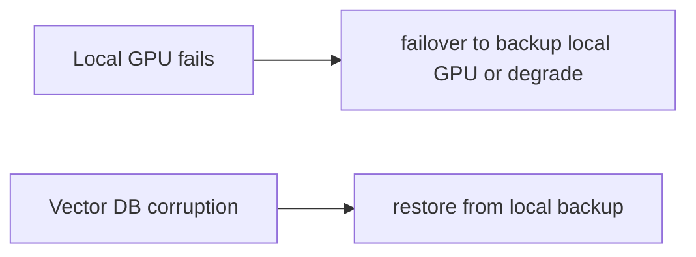

# Case Study: Offline Air-Gapped RAG Platform

> **Tier:** ai-systems · **Status:** complete · Original numbers and diagrams.

## 11. High-level architecture

## 28. Original Mermaid diagrams

Standalone sources under `diagrams/case-studies/offline-airgapped-rag-platform/`: `context.mmd`, `request-sequence.mmd`, `failure-flow.mmd`, `scaling-evolution.mmd`. Request sequence and failure flow:

## 1. Problem statement

A RAG platform that runs entirely offline (no internet, no external APIs) for classified, regulated, or disconnected environments, with local embeddings, local LLM, local vector DB, and local audit.

This system sits at the intersection of distributed systems and operational reliability. The design must balance latency versus durability while ensuring no single component failure cascades. The target audience includes engineers and operators, so the design must be observable, debuggable, and reversible.
## 2. Scope

In: local document ingestion, local embeddings, local vector DB, local LLM, local audit, no external dependencies. Out: cloud connectivity (by design).

The scope boundary is deliberate: including too much in v1 risks a system that is broad but shallow. Each excluded feature is a candidate for a later iteration once the core loop is proven.
## 3. Functional requirements

- Ingest documents locally (no external API). - Embed with a local embedding model. - Store in a local vector DB. - Generate answers with a local LLM. - Cite sources. - Full local audit. - No internet dependency.

These requirements drive the architecture: the read-heavy pattern pushes toward caching; the durability requirement forces synchronous writes; the idempotency requirement means every write path handles redelivery without double-application.
## 4. Non-functional requirements

- 100 percent offline. - Answer p99 < 10 s (limited by local GPU). - Availability 99.9 percent (local HA).

The non-functional targets shape every component choice: the latency SLO forces edge caching and limits synchronous cross-region calls; the availability target drives redundancy (RF=3, multi-AZ); the cost target constrains the model size.
## 5. Explicit assumptions

1. 100k docs, 1M chunks. 2. Local GPU (1-4 GPUs for LLM). 3. No internet, ever.

These assumptions are the load-bearing facts of the design. If any is wrong by an order of magnitude, the architecture must adapt: 10x more traffic may require sharding earlier; a different read-write ratio changes the caching strategy entirely.
## 6. Traffic estimation

10 q/s; all inference is local (GPU-bound).

The traffic estimate reveals the binding constraint. Peak is modeled at 10x average. The read-write ratio determines whether the system is cache-dominated (read-heavy) or write-path-dominated (write-heavy), which changes the storage and replication strategy.
## 7. Storage estimation

1M chunks + embeddings + index = ~3 GB; local disk or NAS.

Storage growth is linear with time and must be planned with retention. The estimate includes metadata and index overhead (20-30 percent above raw). Without a retention policy, storage grows unboundedly.
## 8. Bandwidth estimation

All local network; no external bandwidth.

Bandwidth is often not the binding constraint but becomes significant at the edge during viral spikes. CDN and edge caching cut origin egress; compression cuts bandwidth by 50-80 percent where applicable.
## 9. API design

POST /ask (question) -> answer + citations; POST /ingest (docs) -> index; all local.

The API follows REST for external clients and gRPC for internal calls. Every write endpoint accepts an idempotency key. Rate limiting is enforced at the gateway before the service tier.
## 10. Data model

chunks(id, text, embedding, metadata) in local vector DB; models (local embedding + local LLM); audit (local append-only).

The data model is designed around the access pattern, not the entity shape. The primary access path determines the partition key; secondary paths determine indexes. Denormalization is applied selectively where the hot read path would otherwise require expensive joins.
## 12. Request flow

Documents ingested locally -> local embedding model creates vectors -> local vector DB -> query embedded locally -> local vector search -> context to local LLM on GPU -> answer with citations -> all audited locally; no internet, no external API, no data leaves the air-gap.

The request flow reveals the critical path: any component on the hot path that fails or slows degrades the user experience. The design applies timeouts, circuit breakers, and bulkheads to each hop. The write path includes an idempotency check before any state mutation.
## 13. Component responsibilities

Local embedding model, local vector DB, local LLM (GPU), local audit, local document store.

Each component has a single, well-defined responsibility. The gateway handles auth and routing; the service tier is stateless and horizontally scalable; the data tier is the stateful core, carefully partitioned and replicated. The separation allows each tier to scale independently.
## 14. Database selection

Local vector DB (FAISS/Milvus/Chroma on local disk); local document store (file system or NAS); local audit (append-only file). Rejected: any external API (violates air-gap).

The database choice is driven by the access pattern. The rejected alternatives were rejected for specific reasons: a relational DB was rejected if the workload is a single key lookup at massive scale; a KV store was rejected if joins and transactions are needed.
## 15. Caching strategy

Hot query results cached locally; common lookups cached; model weights cached in GPU memory.

The caching strategy is designed around the staleness tolerance of the workload. Cache-aside is the default; write-through is used where read-after-write consistency is required. Stampede protection is applied to any key that can go viral. Cache entries are namespaced by tenant.
## 16. Partitioning strategy

All local; vector DB sharded by local disk; no network partitioning.

The partition key co-locates related data while distributing load evenly. Consistent hashing with virtual nodes minimizes data movement when nodes change. A hot key is mitigated by caching, extra replication, or key splitting.
## 17. Replication strategy

Local HA: 2-3 local nodes with local replication; no cloud DR (air-gapped).

Replication is synchronous on the write-confirmation path where durability is critical and asynchronous elsewhere. RF=3 tolerates one failure. Failover is tested, not just configured. Cross-region replication is asynchronous with a documented RPO.
## 18. Consistency model

Local vector DB consistent (single node or local RF); audit append-only; no eventual consistency (no async external).

The consistency model is the weakest that users can tolerate. Read-your-writes is provided where the user expects to see their own write. Eventual consistency is bounded (seconds) and monitored. The system documents what eventual means to users.
## 19. Failure scenarios

Local GPU fails -> failover to backup local GPU or degrade to smaller model. Vector DB corruption -> restore from local backup. No external failover possible.

Each failure scenario has a documented response: which component detects it, how failover happens, what the user experiences, and how recovery is verified. Bulkheads and circuit breakers prevent one slow dependency from cascading.
## 20. Reliability strategy

SLI answer latency, answer quality (limited by local model); SLO 99.9 percent. Local HA only.

The SLO defines what good means measurably; the error budget is the allowed unavailability spent on deploys and feature risk. The system is tested with chaos engineering to verify resilience. An untested failover is not a failover.
## 21. Security considerations

Air-gap IS the security: no data leaves the environment. Additional: local RBAC, local audit, PII stays local, no external model exposure. The air-gap is the primary control.

Security is defense in depth: TLS, encryption at rest, RBAC with default-deny, PII redaction in logs, audit trails, and per-tenant isolation. For AI-augmented systems, the policy gateway is fail-closed: on any error, the system refuses to act.
## 22. Observability strategy

Local metrics: answer latency, GPU utilization, vector DB size, ingest rate, cache hit, model quality (user feedback).

Observability uses logs, metrics, and traces with correlation IDs. The golden signals (latency, traffic, errors, saturation) are the first dashboard. Alerts fire on SLO burn rate, not raw thresholds. The on-call runbook for each alert is tested.
## 23. Cost considerations

Local hardware (GPU + storage) is the only cost; no per-token API fees. Initial capex, then zero marginal cost per query.

Cost is dominated by the binding resource. Primary levers: caching (cuts read cost), tiering (cuts storage cost), batching (cuts per-request overhead), and right-sizing. Cost is tracked as a first-class metric and alerted on when unit cost spikes.
## 24. Scaling stages

Stage 1: single local GPU + local vector DB + local LLM. -> Stage 2: local HA (2-3 nodes) + local cache. -> Stage 3: larger local model (multi-GPU). -> Stage 4: local fleet with local scheduling.

The scaling stages are triggered by specific thresholds, not by calendar. Each stage is a deliberate architectural change: Stage 1 handles initial load; Stage 2 when a single node saturates; Stage 3 when latency exceeds the SLO; Stage 4 when hot keys threaten the origin.
## 25. Trade-offs

Air-gap (security, no external cost) vs model quality (local models weaker than frontier). Local GPU (latency, cost) vs external API (quality, but violates air-gap). Small local (fast) vs large (quality, expensive).

Every trade-off has a rejected alternative with a reason. The design does not present one option as universally correct; it presents the chosen option, the rejected alternative, and the workload-specific reason.
## 26. Alternative designs

External API (violates air-gap). No RAG (manual search). Cloud RAG (data leaves). No AI (human-only, slow).

The alternative designs are genuine architectures that would work under different constraints. They were rejected for this workload because of specific requirements that make them inferior here but not universally inferior.
## 27. Interview discussion points

Clarify air-gap requirements, local GPU budget, document volume, model quality needs. Surface local embeddings, local vector DB, local LLM, local audit, no-internet constraint.

In an interview, the strongest candidates clarify ambiguity before designing, surface the read-write ratio and the binding resource, design the hot path deeply, discuss failure modes explicitly, and offer an alternative with a reason.
## 29. Further reading

RAG: docs/ai-systems/06-basic-rag; AI hardware: 01-ai-hardware; model serving: 11-model-serving; AI security: 09-ai-security; offline: network-AI case studies.

The further reading cites primary sources (RFCs, papers, official documentation) via stable IDs in SOURCES.md, not secondary blog posts. Each citation is chosen because it is the authoritative source for a specific technical claim.
## 30. Practical exercises

1. Size local GPU for a 7B model + 1M chunks. 2. Local HA without cloud. 3. Local model quality vs frontier. 4. Air-gap audit design. 5. Local vector DB backup.

---
Previous: Enterprise agent platform · Next: (end of AI case studies)

The exercises push the reader beyond v1: re-estimating at 10x reveals capacity limits; adding a new requirement forces an architectural change; designing the failover test reveals whether resilience claims are real.
