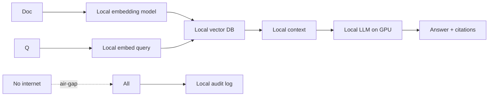
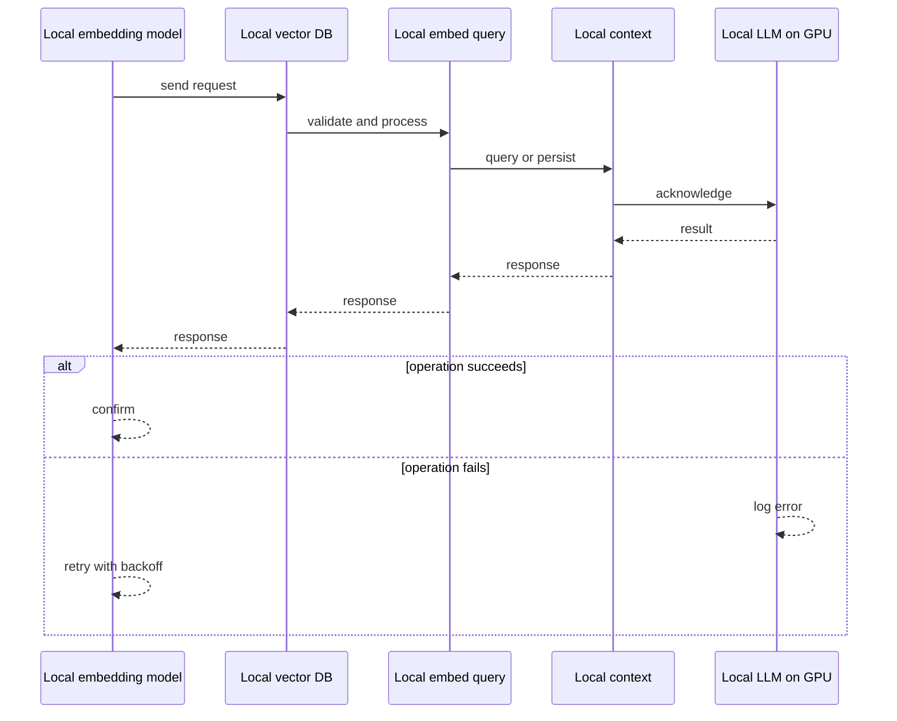
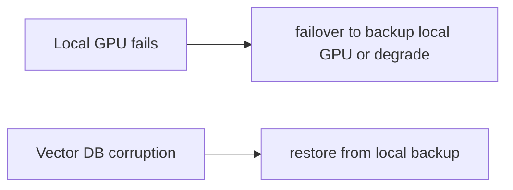
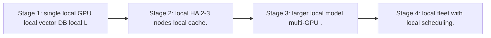

# Case Study: Offline Air-Gapped RAG Platform

> **Tier:** ai-systems · **Status:** complete · Original numbers and diagrams.

## 1. Problem statement

A RAG platform that runs entirely offline (no internet, no external APIs) for classified, regulated, or disconnected environments, with local embeddings, local LLM, local vector DB, and local audit.

## 2. Scope

In: local document ingestion, local embeddings, local vector DB, local LLM, local audit, no external dependencies. Out: cloud connectivity (by design).

## 3. Functional requirements

- Ingest documents locally (no external API).
- Embed with a local embedding model.
- Store in a local vector DB.
- Generate answers with a local LLM.
- Cite sources.
- Full local audit.
- No internet dependency.

## 4. Non-functional requirements

- 100 percent offline.
- Answer p99 < 10 s (limited by local GPU).
- Availability 99.9 percent (local HA).

## 5. Explicit assumptions

1. 100k docs, 1M chunks. 2. Local GPU (1-4 GPUs for LLM). 3. No internet, ever.

## 6. Traffic estimation
10 q/s; all inference is local (GPU-bound).

## 7. Storage estimation
1M chunks + embeddings + index = ~3 GB; local disk or NAS.

## 8. Bandwidth estimation
All local network; no external bandwidth.

## 9. API design

POST /ask (question) -> answer + citations; POST /ingest (docs) -> index; all local.

## 10. Data model

chunks(id, text, embedding, metadata) in local vector DB; models (local embedding + local LLM); audit (local append-only).

## 11. High-level architecture

## 12. Request flow
Documents ingested locally -> local embedding model creates vectors -> local vector DB -> query embedded locally -> local vector search -> context to local LLM on GPU -> answer with citations -> all audited locally; no internet, no external API, no data leaves the air-gap.

## 13. Component responsibilities

Local embedding model, local vector DB, local LLM (GPU), local audit, local document store.

## 14. Database selection

Local vector DB (FAISS/Milvus/Chroma on local disk); local document store (file system or NAS); local audit (append-only file). Rejected: any external API (violates air-gap).

## 15. Caching strategy

Hot query results cached locally; common lookups cached; model weights cached in GPU memory.

## 16. Partitioning strategy

All local; vector DB sharded by local disk; no network partitioning.

## 17. Replication strategy

Local HA: 2-3 local nodes with local replication; no cloud DR (air-gapped).

## 18. Consistency model

Local vector DB consistent (single node or local RF); audit append-only; no eventual consistency (no async external).

## 19. Failure scenarios
Local GPU fails -> failover to backup local GPU or degrade to smaller model. Vector DB corruption -> restore from local backup. No external failover possible.

## 20. Reliability strategy

SLI answer latency, answer quality (limited by local model); SLO 99.9 percent. Local HA only.

## 21. Security considerations

Air-gap IS the security: no data leaves the environment. Additional: local RBAC, local audit, PII stays local, no external model exposure. The air-gap is the primary control.

## 22. Observability strategy

Local metrics: answer latency, GPU utilization, vector DB size, ingest rate, cache hit, model quality (user feedback).

## 23. Cost considerations

Local hardware (GPU + storage) is the only cost; no per-token API fees. Initial capex, then zero marginal cost per query.

## 24. Scaling stages
Stage 1: single local GPU + local vector DB + local LLM. -> Stage 2: local HA (2-3 nodes) + local cache. -> Stage 3: larger local model (multi-GPU). -> Stage 4: local fleet with local scheduling.

## 25. Trade-offs

Air-gap (security, no external cost) vs model quality (local models weaker than frontier). Local GPU (latency, cost) vs external API (quality, but violates air-gap). Small local (fast) vs large (quality, expensive).

## 26. Alternative designs

External API (violates air-gap). No RAG (manual search). Cloud RAG (data leaves). No AI (human-only, slow).

## 27. Interview discussion points

Clarify air-gap requirements, local GPU budget, document volume, model quality needs. Surface local embeddings, local vector DB, local LLM, local audit, no-internet constraint.

## 28. Original Mermaid diagrams
Standalone sources under `diagrams/case-studies/offline-airgapped-rag-platform/`: `context.mmd`, `request-sequence.mmd`, `failure-flow.mmd`, `scaling-evolution.mmd`. The diagrams are embedded in their respective sections: architecture in section 11, request flow in section 12, failure scenarios in section 19, and scaling stages in section 24.

## 29. Further reading
RAG: docs/ai-systems/06-basic-rag; AI hardware: 01-ai-hardware; model serving: 11-model-serving; AI security: 09-ai-security; offline: network-AI case studies. Sources: `S-VECTORDB` `S-RAG`.

## 30. Practical exercises

1. Size local GPU for a 7B model + 1M chunks. 2. Local HA without cloud. 3. Local model quality vs frontier. 4. Air-gap audit design. 5. Local vector DB backup.

---
Previous: Enterprise agent platform · Next: (end of AI case studies)

