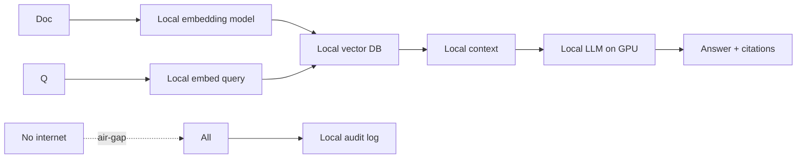
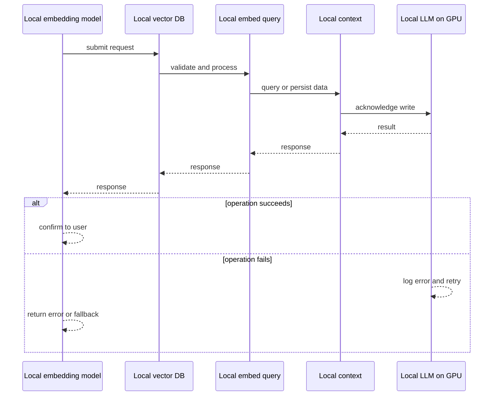
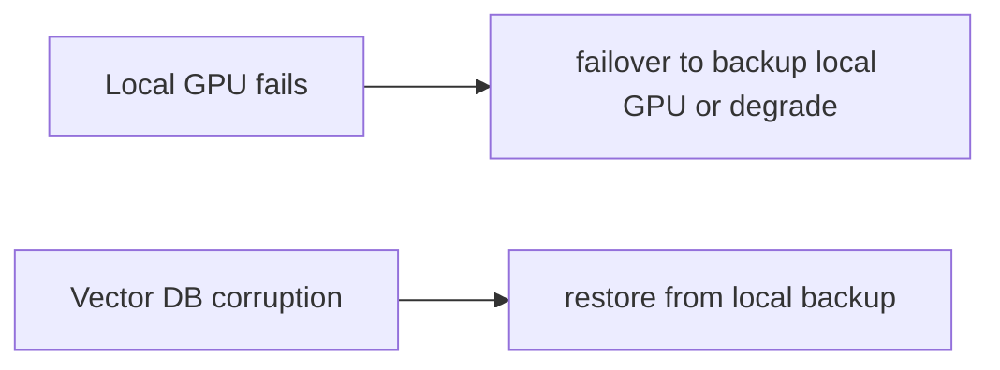
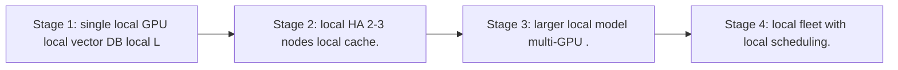

# Case Study: Offline Air-Gapped RAG Platform

> **Tier:** ai-systems · **Status:** complete · Original numbers and diagrams.

## 1. Problem statement
A RAG platform that runs entirely offline (no internet, no external APIs) for classified, regulated, or disconnected environments, with local embeddings, local LLM, local vector DB, and local audit. This is a ai-systems-tier system design challenge because it must handle GPU-bound inference at scale while ensuring grounded, cited, and permission-aware answers. The design must be production-grade: observable, debuggable, reversible, and able to survive component failures without data loss or cascading outages.

## 2. Scope
In: local document ingestion, local embeddings, local vector DB, local LLM, local audit, no external dependencies. Out: cloud connectivity (by design).

For Offline Air-Gapped RAG Platform, these boundaries keep the first version focused on the core user value. Adding more features would dilute the design and delay shipping. Each excluded item is a scaling stage — a candidate for the next iteration once the baseline is proven.

## 3. Functional requirements
- Ingest documents locally (no external API).
- Embed with a local embedding model.
- Store in a local vector DB.
- Generate answers with a local LLM.
- Cite sources.
- Full local audit.
- No internet dependency.

For Offline Air-Gapped RAG Platform, these requirements drive specific architectural decisions: the read-write ratio determines the caching strategy, the durability target sets the replication mode, and the idempotency requirement shapes the API contract.

## 4. Non-functional requirements
- 100 percent offline.
- Answer p99 < 10 s (limited by local GPU).
- Availability 99.9 percent (local HA).

For Offline Air-Gapped RAG Platform, each non-functional target constrains a specific component: the latency SLO bounds the number of synchronous hops, the availability target forces redundancy across availability zones, and the cost ceiling limits the replication factor and storage tier.

## 5. Explicit assumptions
1. 100k docs, 1M chunks. 2. Local GPU (1-4 GPUs for LLM). 3. No internet, ever.

For Offline Air-Gapped RAG Platform, if these assumptions are off by an order of magnitude, the architecture must adapt: 10x traffic may require earlier sharding, a different read-write ratio changes the caching strategy, and a higher peak multiplier demands more headroom.

## 6. Traffic estimation
10 q/s; all inference is local (GPU-bound).

To derive the request rate: divide the daily volume by 86,400 seconds to get the average rate, then multiply by 5-10x for peak. The read-to-write ratio determines whether the system is cache-dominated (read-heavy) or write-path-dominated (write-heavy). For Offline Air-Gapped RAG Platform, this ratio shapes the entire storage and replication strategy.

## 7. Storage estimation
1M chunks + embeddings + index = ~3 GB; local disk or NAS.

For Offline Air-Gapped RAG Platform, storage growth is projected from the daily write volume and retention policy. Index overhead and compression factors are accounted for in the total.

## 8. Bandwidth estimation
All local network; no external bandwidth.

Bandwidth is request rate multiplied by average payload size for ingress, and response rate multiplied by response size for egress. CDN and edge caching reduce origin egress. Compression reduces bandwidth by 50-80 percent where applicable. For Offline Air-Gapped RAG Platform, bandwidth may or may not be the binding constraint — compare it against compute and storage to find out.

## 9. API design

POST /ask (question) -> answer + citations; POST /ingest (docs) -> index; all local.

## 10. Data model
chunks(id, text, embedding, metadata) in local vector DB; models (local embedding + local LLM); audit (local append-only).

For Offline Air-Gapped RAG Platform, the data model follows the access pattern. The primary lookup determines the partition key; secondary lookups determine indexes. Denormalization is used selectively on hot read paths.

## 11. High-level architecture

## 12. Request flow
Documents ingested locally -> local embedding model creates vectors -> local vector DB -> query embedded locally -> local vector search -> context to local LLM on GPU -> answer with citations -> all audited locally; no internet, no external API, no data leaves the air-gap.

## 13. Component responsibilities
Local embedding model, local vector DB, local LLM (GPU), local audit, local document store.

For Offline Air-Gapped RAG Platform, each component has one job. The gateway authenticates and routes. Services are stateless and scale horizontally. The data tier is the stateful core that scales by sharding.

## 14. Database selection
Local vector DB (FAISS/Milvus/Chroma on local disk); local document store (file system or NAS); local audit (append-only file). Rejected: any external API (violates air-gap).

For Offline Air-Gapped RAG Platform, the database was chosen by access pattern, not familiarity. The rejected alternatives were wrong for this workload, not bad in general.

## 15. Caching strategy
Hot query results cached locally; common lookups cached; model weights cached in GPU memory.

For Offline Air-Gapped RAG Platform, the cache strategy matches the staleness tolerance. Cache-aside for most data, write-through where read-after-write matters, stampede protection on hot keys.

## 16. Partitioning strategy
All local; vector DB sharded by local disk; no network partitioning.

For Offline Air-Gapped RAG Platform, the partition key balances query locality with even load distribution. Sharding strategy matters because a poor key creates hot spots under real traffic patterns.

## 17. Replication strategy
Local HA: 2-3 local nodes with local replication; no cloud DR (air-gapped).

For Offline Air-Gapped RAG Platform, replication mode is split: synchronous where durability is critical, asynchronous elsewhere for throughput. RF=3 tolerates one failure. Failover is tested regularly.

## 18. Consistency model
Local vector DB consistent (single node or local RF); audit append-only; no eventual consistency (no async external).

For Offline Air-Gapped RAG Platform, the consistency level is the weakest users accept. Read-your-writes is provided where needed. Eventual consistency is bounded and monitored, not unbounded and silent.

## 19. Failure scenarios
Local GPU fails -> failover to backup local GPU or degrade to smaller model. Vector DB corruption -> restore from local backup. No external failover possible.

## 20. Reliability strategy
SLI answer latency, answer quality (limited by local model); SLO 99.9 percent. Local HA only.

For Offline Air-Gapped RAG Platform, the SLO makes reliability measurable. The error budget balances feature velocity with stability. Chaos testing validates that resilience claims hold under real failures.

## 21. Security considerations
Air-gap IS the security: no data leaves the environment. Additional: local RBAC, local audit, PII stays local, no external model exposure. The air-gap is the primary control.

For Offline Air-Gapped RAG Platform, security layers TLS, encryption at rest, RBAC, PII redaction, and audit. The policy gateway is fail-closed for AI-augmented operations.

## 22. Observability strategy
Local metrics: answer latency, GPU utilization, vector DB size, ingest rate, cache hit, model quality (user feedback).

For Offline Air-Gapped RAG Platform, observability combines logs, metrics, and traces with correlation IDs. Golden signals drive the first dashboard. Alerts fire on burn rate, not raw thresholds.

## 23. Cost considerations
Local hardware (GPU + storage) is the only cost; no per-token API fees. Initial capex, then zero marginal cost per query.

For Offline Air-Gapped RAG Platform, cost is driven by the binding resource. Caching, tiering, batching, and right-sizing are the levers. Cost per request is tracked and alerted on.

## 24. Scaling stages
Stage 1: single local GPU + local vector DB + local LLM. -> Stage 2: local HA (2-3 nodes) + local cache. -> Stage 3: larger local model (multi-GPU). -> Stage 4: local fleet with local scheduling.

## 25. Trade-offs
Air-gap (security, no external cost) vs model quality (local models weaker than frontier). Local GPU (latency, cost) vs external API (quality, but violates air-gap). Small local (fast) vs large (quality, expensive).

For Offline Air-Gapped RAG Platform, each trade-off lists what was chosen, what was rejected, and why. This makes the design defensible in review — every decision has documented reasoning.

## 26. Alternative designs
External API (violates air-gap). No RAG (manual search). Cloud RAG (data leaves). No AI (human-only, slow).

For Offline Air-Gapped RAG Platform, the alternatives are real architectures that work under different constraints. They were rejected for this workload's specific requirements, not because they are bad designs.

## 27. Interview discussion points
Clarify air-gap requirements, local GPU budget, document volume, model quality needs. Surface local embeddings, local vector DB, local LLM, local audit, no-internet constraint.

For Offline Air-Gapped RAG Platform in an interview: clarify scope first, surface the read-write ratio, design the hot path deeply, discuss failures, and offer an alternative. Weak candidates skip failure modes.

## 28. Original Mermaid diagrams
Standalone sources under `diagrams/case-studies/offline-airgapped-rag-platform/`: `context.mmd`, `request-sequence.mmd`, `failure-flow.mmd`, `scaling-evolution.mmd`. The diagrams are embedded in their respective sections: architecture in section 11, request flow in section 12, failure scenarios in section 19, and scaling stages in section 24.

## 29. Further reading
RAG: docs/ai-systems/06-basic-rag; AI hardware: 01-ai-hardware; model serving: 11-model-serving; AI security: 09-ai-security; offline: network-AI case studies. Sources: `S-VECTORDB` `S-RAG`.

## 30. Practical exercises

1. Size local GPU for a 7B model + 1M chunks. 2. Local HA without cloud. 3. Local model quality vs frontier. 4. Air-gap audit design. 5. Local vector DB backup.

---
Previous: Enterprise agent platform · Next: (end of AI case studies)

