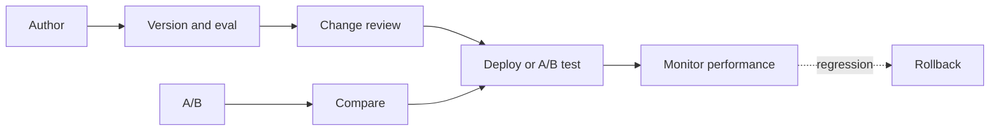
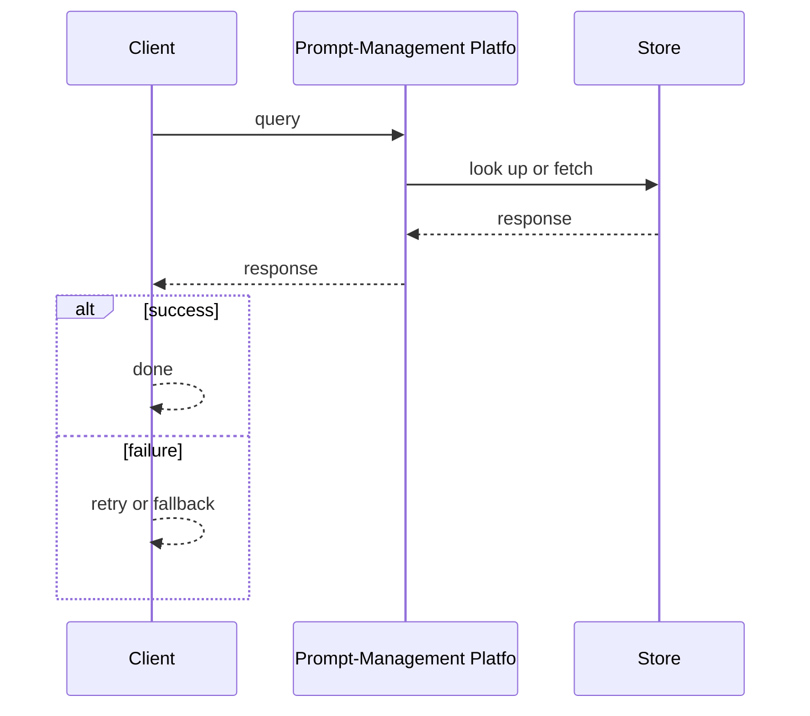
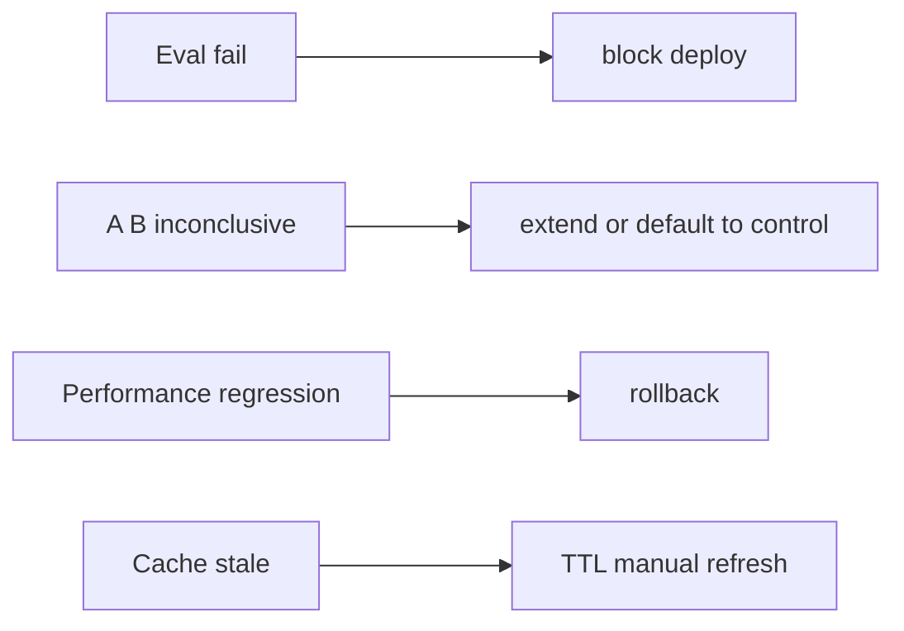

# Case Study: Prompt-Management Platform

> **Tier:** ai-systems · **Status:** complete · Original numbers and diagrams.

## 11. High-level architecture

## 28. Original Mermaid diagrams

Standalone sources under `diagrams/case-studies/prompt-management-platform/`: `context.mmd`, `request-sequence.mmd`, `failure-flow.mmd`, `scaling-evolution.mmd`. Request sequence and failure flow:

## 1. Problem statement

A platform that versions, tests, deploys, and monitors prompt templates across AI features, with A/B testing, rollback, and change review.

## 2. Scope

In: prompt template registry, versioning, A/B testing, deployment, change review, rollback, monitoring. Out: automated prompt optimization.

## 3. Functional requirements

- Store and version prompt templates. - Test prompts against eval sets before deploy. - A/B test prompt versions. - Deploy with rollback. - Review prompt changes (cost, safety, quality). - Monitor performance.

## 4. Non-functional requirements

- Prompt deploy < 1 min. - No production change without review. - Availability 99.9 percent.

## 5. Explicit assumptions

1. 100 templates across 10 features. 2. 1-2 changes/week per feature. 3. A/B 10 percent for 24h.

## 6. Traffic estimation

Prompt lookups at request rate (cached); changes infrequent; A/B continuous.

## 7. Storage estimation

Prompt versions + eval results + A/B data + monitoring; small, versioned.

## 8. Bandwidth estimation

Prompt text small; eval results small.

## 9. API design

POST /prompts (template) -> version; POST /prompts/:id/deploy -> deployed; POST /prompts/:id/ab-test -> results; GET /prompts/:id/performance.

## 10. Data model

prompts(id, feature, versions[]); versions(id, template, status, eval_results, deploy_ts); ab_tests(id, prompt, version_a, version_b, traffic_split, results); performance(prompt, version, metrics, ts).

## 12. Request flow

Author writes prompt -> version + eval -> change review (cost, safety, quality) -> deploy or A/B (10 percent for 24h) -> monitor -> if regression: rollback -> all versioned and audited.

## 13. Component responsibilities

Prompt registry, version manager, eval runner, change reviewer, A/B manager, deployer, performance monitor.

## 14. Database selection

Prompt registry (Git-backed); eval results (time-series); A/B data (relational); performance (time-series).

## 15. Caching strategy

Hot prompts cached in-memory; eval results cached per version; A/B assignment cached per user.

## 16. Partitioning strategy

Prompts by feature; A/B by user; performance by prompt + version + time.

## 17. Replication strategy

Prompt registry in Git; cache replicated; A/B data RF=3.

## 18. Consistency model

Prompt versions immutable once deployed; A/B assignment sticky per user; performance eventual.

## 19. Failure scenarios

Eval fail -> block deploy. A/B inconclusive -> extend or default to control. Performance regression -> rollback. Cache stale -> TTL + manual refresh.

## 20. Reliability strategy

SLI deploy latency, no-unreviewed-change; SLO 99.9 percent. Block deploy without eval.

## 21. Security considerations

Prompt review for PII/injection safety; per-feature access control; audit all changes; rollback always available; no prompt with secrets.

## 22. Observability strategy

Deploy frequency, eval pass rate, A/B win rate, regression count, prompt cost trend, latency per version.

## 23. Cost considerations

Eval inference per change; A/B inference (duplicate traffic); monitor negligible. Amortize across changes.

## 24. Scaling stages

Stage 1: version + deploy + rollback. -> Stage 2: eval + A/B + monitoring. -> Stage 3: automated optimization + multi-feature. -> Stage 4: enterprise prompt governance.

## 25. Trade-offs

Versioning (safety) vs speed. A/B (data-driven) vs direct deploy (fast). Strict review (safe) vs lightweight (agile). Cache (latency) vs freshness.

## 26. Alternative designs

No versioning (no rollback). Hardcoded prompts (no A/B). No review (unsafe). No A/B (guess).

## 27. Interview discussion points

Clarify change frequency, A/B policy, eval requirements. Surface versioning, eval, A/B, monitoring, rollback, change review.

## 29. Further reading

Prompt management refs; docs/ai-systems/10-ai-evaluation; templates/ai/prompt-change-review.md; LLM gateway: 13-llm-gateway.

## 30. Practical exercises

1. Version + eval + deploy a prompt. 2. A/B test design. 3. Regression + rollback. 4. Change review checklist. 5. Cost impact of prompt length.

---
Previous: AI evaluation · Next: AI safety and policy gateway

