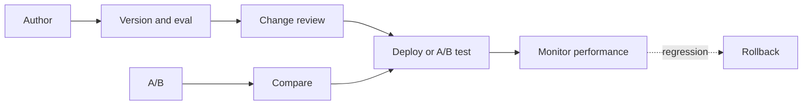
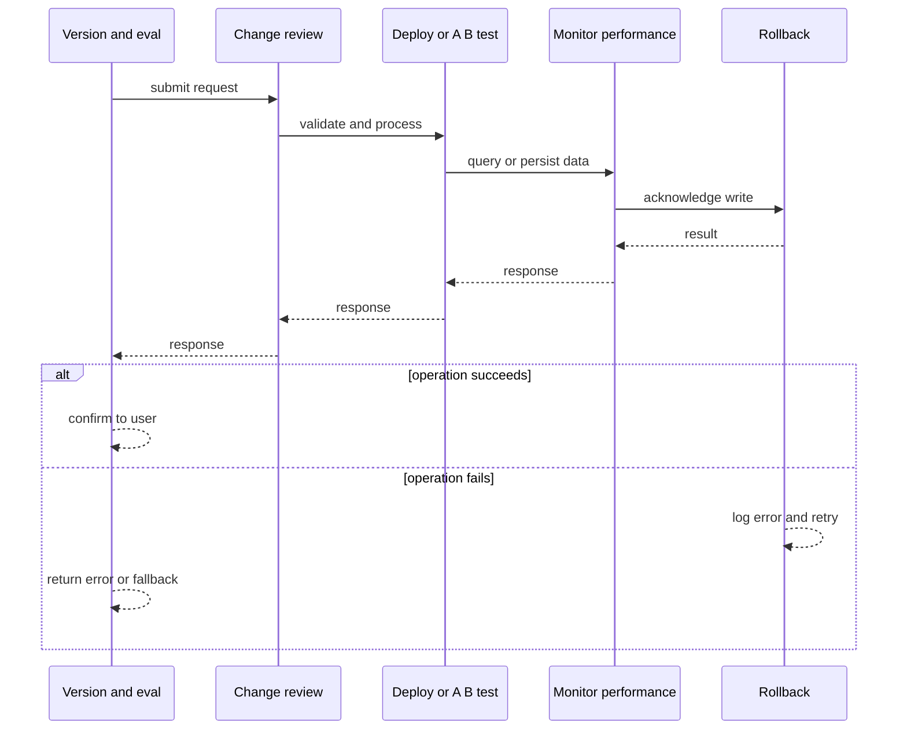
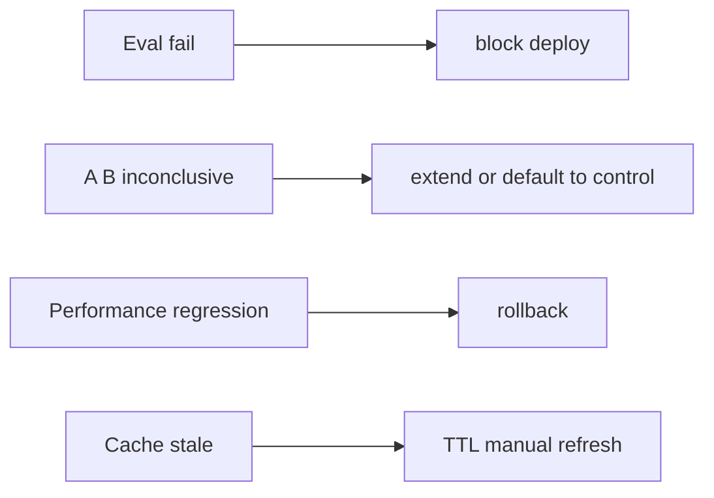
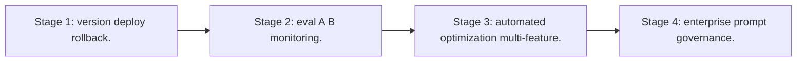

# Case Study: Prompt-Management Platform

> **Tier:** ai-systems · **Status:** complete · Original numbers and diagrams.

## 1. Problem statement
A platform that versions, tests, deploys, and monitors prompt templates across AI features, with A/B testing, rollback, and change review. This is a ai-systems-tier system design challenge because it must handle high availability under peak load while ensuring no single point of failure. The design must be production-grade: observable, debuggable, reversible, and able to survive component failures without data loss or cascading outages.

## 2. Scope
In: prompt template registry, versioning, A/B testing, deployment, change review, rollback, monitoring. Out: automated prompt optimization.

For Prompt-Management Platform, these boundaries keep the first version focused on the core user value. Adding more features would dilute the design and delay shipping. Each excluded item is a scaling stage — a candidate for the next iteration once the baseline is proven.

## 3. Functional requirements
- Store and version prompt templates.
- Test prompts against eval sets before deploy.
- A/B test prompt versions.
- Deploy with rollback.
- Review prompt changes (cost, safety, quality).
- Monitor performance.

For Prompt-Management Platform, these requirements drive specific architectural decisions: the read-write ratio determines the caching strategy, the durability target sets the replication mode, and the idempotency requirement shapes the API contract.

## 4. Non-functional requirements
- Prompt deploy < 1 min.
- No production change without review.
- Availability 99.9 percent.

For Prompt-Management Platform, each non-functional target constrains a specific component: the latency SLO bounds the number of synchronous hops, the availability target forces redundancy across availability zones, and the cost ceiling limits the replication factor and storage tier.

## 5. Explicit assumptions
1. 100 templates across 10 features. 2. 1-2 changes/week per feature. 3. A/B 10 percent for 24h.

For Prompt-Management Platform, if these assumptions are off by an order of magnitude, the architecture must adapt: 10x traffic may require earlier sharding, a different read-write ratio changes the caching strategy, and a higher peak multiplier demands more headroom.

## 6. Traffic estimation
Prompt lookups at request rate (cached); changes infrequent; A/B continuous.

To derive the request rate: divide the daily volume by 86,400 seconds to get the average rate, then multiply by 5-10x for peak. The read-to-write ratio determines whether the system is cache-dominated (read-heavy) or write-path-dominated (write-heavy). For Prompt-Management Platform, this ratio shapes the entire storage and replication strategy.

## 7. Storage estimation
Prompt versions + eval results + A/B data + monitoring; small, versioned.

For Prompt-Management Platform, storage growth is projected from the daily write volume and retention policy. Index overhead and compression factors are accounted for in the total.

## 8. Bandwidth estimation
Prompt text small; eval results small.

Bandwidth is request rate multiplied by average payload size for ingress, and response rate multiplied by response size for egress. CDN and edge caching reduce origin egress. Compression reduces bandwidth by 50-80 percent where applicable. For Prompt-Management Platform, bandwidth may or may not be the binding constraint — compare it against compute and storage to find out.

## 9. API design

POST /prompts (template) -> version; POST /prompts/:id/deploy -> deployed; POST /prompts/:id/ab-test -> results; GET /prompts/:id/performance.

## 10. Data model
prompts(id, feature, versions[]); versions(id, template, status, eval_results, deploy_ts); ab_tests(id, prompt, version_a, version_b, traffic_split, results); performance(prompt, version, metrics, ts).

For Prompt-Management Platform, the data model follows the access pattern. The primary lookup determines the partition key; secondary lookups determine indexes. Denormalization is used selectively on hot read paths.

## 11. High-level architecture

## 12. Request flow
Author writes prompt -> version + eval -> change review (cost, safety, quality) -> deploy or A/B (10 percent for 24h) -> monitor -> if regression: rollback -> all versioned and audited.

## 13. Component responsibilities
Prompt registry, version manager, eval runner, change reviewer, A/B manager, deployer, performance monitor.

For Prompt-Management Platform, each component has one job. The gateway authenticates and routes. Services are stateless and scale horizontally. The data tier is the stateful core that scales by sharding.

## 14. Database selection
Prompt registry (Git-backed); eval results (time-series); A/B data (relational); performance (time-series).

For Prompt-Management Platform, the database was chosen by access pattern, not familiarity. The rejected alternatives were wrong for this workload, not bad in general.

## 15. Caching strategy
Hot prompts cached in-memory; eval results cached per version; A/B assignment cached per user.

For Prompt-Management Platform, the cache strategy matches the staleness tolerance. Cache-aside for most data, write-through where read-after-write matters, stampede protection on hot keys.

## 16. Partitioning strategy
Prompts by feature; A/B by user; performance by prompt + version + time.

For Prompt-Management Platform, the partition key balances query locality with even load distribution. Sharding strategy matters because a poor key creates hot spots under real traffic patterns.

## 17. Replication strategy
Prompt registry in Git; cache replicated; A/B data RF=3.

For Prompt-Management Platform, replication mode is split: synchronous where durability is critical, asynchronous elsewhere for throughput. RF=3 tolerates one failure. Failover is tested regularly.

## 18. Consistency model
Prompt versions immutable once deployed; A/B assignment sticky per user; performance eventual.

For Prompt-Management Platform, the consistency level is the weakest users accept. Read-your-writes is provided where needed. Eventual consistency is bounded and monitored, not unbounded and silent.

## 19. Failure scenarios
Eval fail -> block deploy. A/B inconclusive -> extend or default to control. Performance regression -> rollback. Cache stale -> TTL + manual refresh.

## 20. Reliability strategy
SLI deploy latency, no-unreviewed-change; SLO 99.9 percent. Block deploy without eval.

For Prompt-Management Platform, the SLO makes reliability measurable. The error budget balances feature velocity with stability. Chaos testing validates that resilience claims hold under real failures.

## 21. Security considerations
Prompt review for PII/injection safety; per-feature access control; audit all changes; rollback always available; no prompt with secrets.

For Prompt-Management Platform, security layers TLS, encryption at rest, RBAC, PII redaction, and audit. The policy gateway is fail-closed for AI-augmented operations.

## 22. Observability strategy
Deploy frequency, eval pass rate, A/B win rate, regression count, prompt cost trend, latency per version.

For Prompt-Management Platform, observability combines logs, metrics, and traces with correlation IDs. Golden signals drive the first dashboard. Alerts fire on burn rate, not raw thresholds.

## 23. Cost considerations
Eval inference per change; A/B inference (duplicate traffic); monitor negligible. Amortize across changes.

For Prompt-Management Platform, cost is driven by the binding resource. Caching, tiering, batching, and right-sizing are the levers. Cost per request is tracked and alerted on.

## 24. Scaling stages
Stage 1: version + deploy + rollback. -> Stage 2: eval + A/B + monitoring. -> Stage 3: automated optimization + multi-feature. -> Stage 4: enterprise prompt governance.

## 25. Trade-offs
Versioning (safety) vs speed. A/B (data-driven) vs direct deploy (fast). Strict review (safe) vs lightweight (agile). Cache (latency) vs freshness.

For Prompt-Management Platform, each trade-off lists what was chosen, what was rejected, and why. This makes the design defensible in review — every decision has documented reasoning.

## 26. Alternative designs
No versioning (no rollback). Hardcoded prompts (no A/B). No review (unsafe). No A/B (guess).

For Prompt-Management Platform, the alternatives are real architectures that work under different constraints. They were rejected for this workload's specific requirements, not because they are bad designs.

## 27. Interview discussion points
Clarify change frequency, A/B policy, eval requirements. Surface versioning, eval, A/B, monitoring, rollback, change review.

For Prompt-Management Platform in an interview: clarify scope first, surface the read-write ratio, design the hot path deeply, discuss failures, and offer an alternative. Weak candidates skip failure modes.

## 28. Original Mermaid diagrams
Standalone sources under `diagrams/case-studies/prompt-management-platform/`: `context.mmd`, `request-sequence.mmd`, `failure-flow.mmd`, `scaling-evolution.mmd`. The diagrams are embedded in their respective sections: architecture in section 11, request flow in section 12, failure scenarios in section 19, and scaling stages in section 24.

## 29. Further reading
Prompt management refs; docs/ai-systems/10-ai-evaluation; templates/ai/prompt-change-review.md; LLM gateway: 13-llm-gateway. Sources: `S-CHASH` `S-DYNAMO`.

## 30. Practical exercises

1. Version + eval + deploy a prompt. 2. A/B test design. 3. Regression + rollback. 4. Change review checklist. 5. Cost impact of prompt length.

---
Previous: AI evaluation · Next: AI safety and policy gateway

