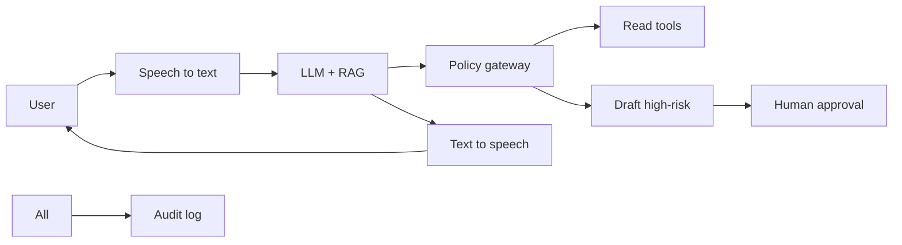
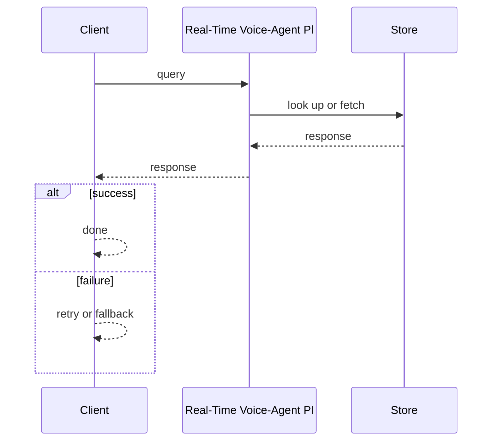
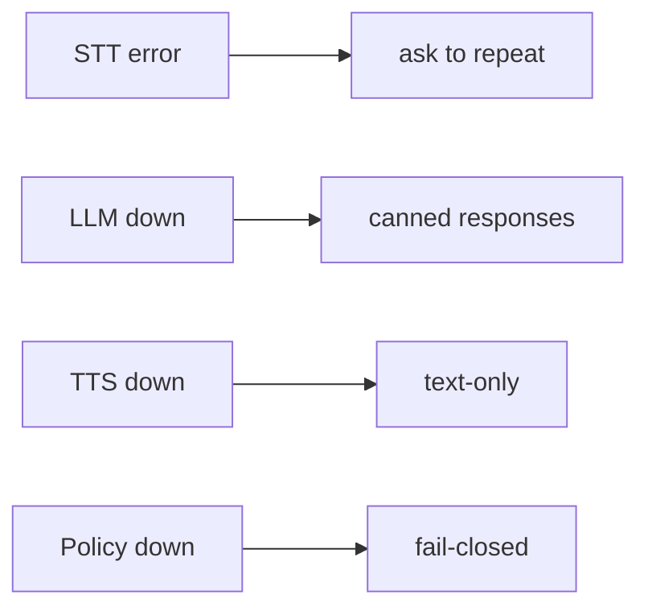

# Case Study: Real-Time Voice-Agent Platform

> **Tier:** ai-systems · **Status:** complete · Original numbers and diagrams.

## 11. High-level architecture

## 28. Original Mermaid diagrams
Standalone sources under `diagrams/case-studies/real-time-voice-agent-platform/`: `context.mmd`, `request-sequence.mmd`, `failure-flow.mmd`, `scaling-evolution.mmd`. The diagrams are embedded in their respective sections: architecture in section 11, request flow in section 12, failure scenarios in section 19, and scaling stages in section 24.

## 1. Problem statement

A voice-operated assistant that transcribes speech, reasons with an LLM, and responds with synthesized speech in real time, with high-risk action guardrails.

## 2. Scope

In: speech-to-text, LLM reasoning with RAG, text-to-speech, tool calling, policy gateway. Out: autonomous high-risk execution.

## 3. Functional requirements

- Transcribe user speech in real time.
- Reason with LLM + RAG.
- Respond with synthesized speech.
- Call read-only tools.
- Draft (not execute) high-risk actions.
- Enforce policy gateway.
- Full audit.

## 4. Non-functional requirements

- Turn latency < 1.5 s.
- Availability 99.9 percent.
- No autonomous high-risk execution.

## 5. Explicit assumptions

1. 100 concurrent sessions. 2. Avg 5 turns. 3. High-risk requires approval.

## 6. Traffic estimation

100 concurrent sessions; each turn = STT + LLM + TTS (3 inference calls).

## 7. Storage estimation

Session state + transcripts + RAG + audit; moderate, must be auditable.

## 8. Bandwidth estimation

Audio streams (real-time); text small; moderate aggregate.

## 9. API design

WS /voice (bidirectional audio) -> text + audio responses.

## 10. Data model

sessions(id, user, state, turns[]); transcripts(session, turn, text); audit(actor, action, ts).

## 12. Request flow
User speaks -> STT transcribes -> LLM reasons with RAG -> policy: read-only tools allowed, high-risk drafted for approval -> LLM generates response -> TTS synthesizes -> user hears; all audited.

## 13. Component responsibilities

STT engine, LLM + RAG, policy gateway, TTS engine, tool registry, approval workflow, audit.

## 14. Database selection

Session store (in-memory + persistent); RAG vector DB; transcripts (object storage); audit (append-only).

## 15. Caching strategy

RAG results cached (permission-aware); common voice patterns cached; TTS output cached.

## 16. Partitioning strategy

Sessions by user; RAG by namespace; gateway stateless; STT/TTS by concurrency.

## 17. Replication strategy

Session RF=3; RAG replicated; STT/TTS stateless; gateway stateless.

## 18. Consistency model

Session strongly tracked; RAG eventual; audit append-only; policy fail-closed.

## 19. Failure scenarios
STT error -> ask to repeat. LLM down -> canned responses. TTS down -> text-only. Policy down -> fail-closed.

## 20. Reliability strategy

SLI turn latency, zero-unauthorized-action; SLO 99.9 percent. Fail-closed policy.

## 21. Security considerations

Policy gateway (no auto-high-risk); PII redaction in transcripts; voice biometrics; RBAC; audit.

## 22. Observability strategy

Turn latency, STT accuracy, LLM latency, TTS latency, policy denials, unauthorized (0), cost per session.

## 23. Cost considerations

STT + LLM + TTS = 3 inference calls per turn; route to small model when possible; cache RAG.

## 24. Scaling stages

Stage 1: STT + LLM + TTS. -> Stage 2: policy + RAG + tools. -> Stage 3: multi-agent + biometrics. -> Stage 4: multi-region + edge.

## 25. Trade-offs

Voice (hands-free) vs text (precise). Autonomy (speed) vs approval (safety). Cloud (quality) vs local (privacy). Turn latency vs model size.

## 26. Alternative designs

Text-only (no hands-free). Full autonomy (unsafe). No policy (no guardrails). Batch STT (too slow).

## 27. Interview discussion points

Clarify latency, concurrency, risk tiers, approval. Surface STT-LLM-TTS pipeline, policy gateway, RAG, audit.

## 29. Further reading

Voice agent refs; docs/ai-systems/08-agentic-systems; security: 09-ai-security; RAG: 06-basic-rag; video-conferencing case.

## 30. Practical exercises

1. Turn-latency budget. 2. Policy gateway for voice. 3. PII in transcripts. 4. Fail-closed design. 5. Edge deployment.

---
Previous: Multimodal document · Next: GPU workload scheduler

