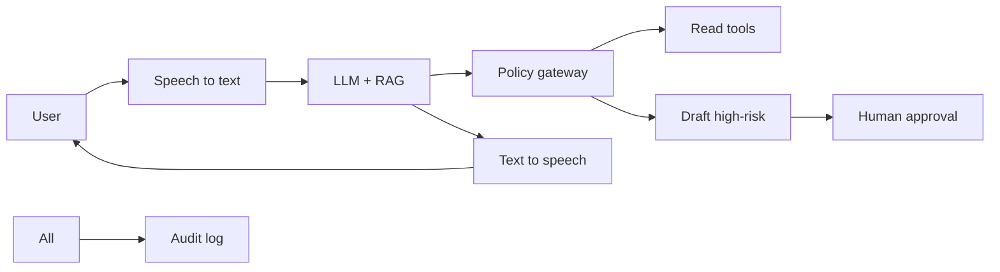
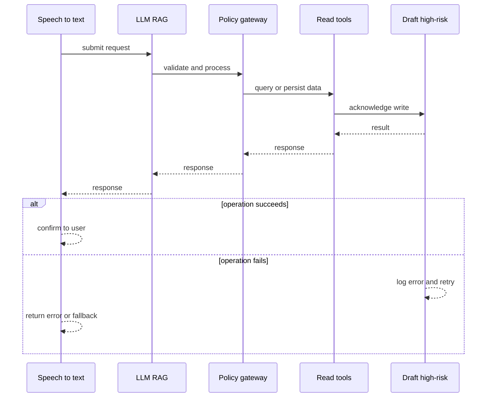
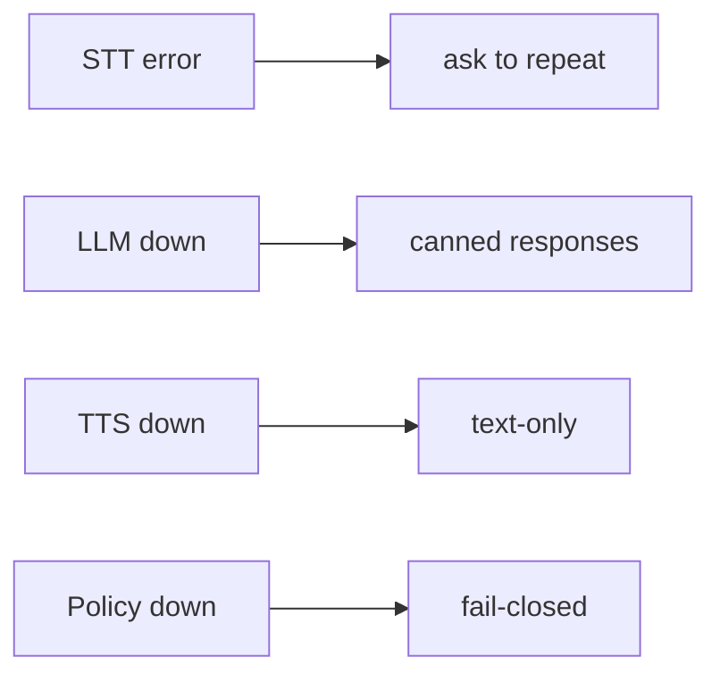
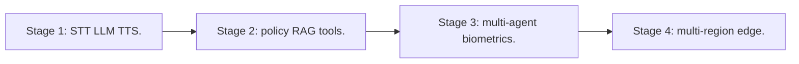

# Case Study: Real-Time Voice-Agent Platform

> **Tier:** ai-systems · **Status:** complete · Original numbers and diagrams.

## 1. Problem statement
A voice-operated assistant that transcribes speech, reasons with an LLM, and responds with synthesized speech in real time, with high-risk action guardrails. This is a ai-systems-tier system design challenge because it must handle real-time latency under load while ensuring low-latency bidirectional communication. The design must be production-grade: observable, debuggable, reversible, and able to survive component failures without data loss or cascading outages.

## 2. Scope
In: speech-to-text, LLM reasoning with RAG, text-to-speech, tool calling, policy gateway. Out: autonomous high-risk execution.

For Real-Time Voice-Agent Platform, these boundaries keep the first version focused on the core user value. Adding more features would dilute the design and delay shipping. Each excluded item is a scaling stage — a candidate for the next iteration once the baseline is proven.

## 3. Functional requirements
- Transcribe user speech in real time.
- Reason with LLM + RAG.
- Respond with synthesized speech.
- Call read-only tools.
- Draft (not execute) high-risk actions.
- Enforce policy gateway.
- Full audit.

For Real-Time Voice-Agent Platform, these requirements drive specific architectural decisions: the read-write ratio determines the caching strategy, the durability target sets the replication mode, and the idempotency requirement shapes the API contract.

## 4. Non-functional requirements
- Turn latency < 1.5 s.
- Availability 99.9 percent.
- No autonomous high-risk execution.

For Real-Time Voice-Agent Platform, each non-functional target constrains a specific component: the latency SLO bounds the number of synchronous hops, the availability target forces redundancy across availability zones, and the cost ceiling limits the replication factor and storage tier.

## 5. Explicit assumptions
1. 100 concurrent sessions. 2. Avg 5 turns. 3. High-risk requires approval.

For Real-Time Voice-Agent Platform, if these assumptions are off by an order of magnitude, the architecture must adapt: 10x traffic may require earlier sharding, a different read-write ratio changes the caching strategy, and a higher peak multiplier demands more headroom.

## 6. Traffic estimation
100 concurrent sessions; each turn = STT + LLM + TTS (3 inference calls).

To derive the request rate: divide the daily volume by 86,400 seconds to get the average rate, then multiply by 5-10x for peak. The read-to-write ratio determines whether the system is cache-dominated (read-heavy) or write-path-dominated (write-heavy). For Real-Time Voice-Agent Platform, this ratio shapes the entire storage and replication strategy.

## 7. Storage estimation
Session state + transcripts + RAG + audit; moderate, must be auditable.

For Real-Time Voice-Agent Platform, storage growth is projected from the daily write volume and retention policy. Index overhead and compression factors are accounted for in the total.

## 8. Bandwidth estimation
Audio streams (real-time); text small; moderate aggregate.

Bandwidth is request rate multiplied by average payload size for ingress, and response rate multiplied by response size for egress. CDN and edge caching reduce origin egress. Compression reduces bandwidth by 50-80 percent where applicable. For Real-Time Voice-Agent Platform, bandwidth may or may not be the binding constraint — compare it against compute and storage to find out.

## 9. API design

WS /voice (bidirectional audio) -> text + audio responses.

## 10. Data model
sessions(id, user, state, turns[]); transcripts(session, turn, text); audit(actor, action, ts).

For Real-Time Voice-Agent Platform, the data model follows the access pattern. The primary lookup determines the partition key; secondary lookups determine indexes. Denormalization is used selectively on hot read paths.

## 11. High-level architecture

## 12. Request flow
User speaks -> STT transcribes -> LLM reasons with RAG -> policy: read-only tools allowed, high-risk drafted for approval -> LLM generates response -> TTS synthesizes -> user hears; all audited.

## 13. Component responsibilities
STT engine, LLM + RAG, policy gateway, TTS engine, tool registry, approval workflow, audit.

For Real-Time Voice-Agent Platform, each component has one job. The gateway authenticates and routes. Services are stateless and scale horizontally. The data tier is the stateful core that scales by sharding.

## 14. Database selection
Session store (in-memory + persistent); RAG vector DB; transcripts (object storage); audit (append-only).

For Real-Time Voice-Agent Platform, the database was chosen by access pattern, not familiarity. The rejected alternatives were wrong for this workload, not bad in general.

## 15. Caching strategy
RAG results cached (permission-aware); common voice patterns cached; TTS output cached.

For Real-Time Voice-Agent Platform, the cache strategy matches the staleness tolerance. Cache-aside for most data, write-through where read-after-write matters, stampede protection on hot keys.

## 16. Partitioning strategy
Sessions by user; RAG by namespace; gateway stateless; STT/TTS by concurrency.

For Real-Time Voice-Agent Platform, the partition key balances query locality with even load distribution. Sharding strategy matters because a poor key creates hot spots under real traffic patterns.

## 17. Replication strategy
Session RF=3; RAG replicated; STT/TTS stateless; gateway stateless.

For Real-Time Voice-Agent Platform, replication mode is split: synchronous where durability is critical, asynchronous elsewhere for throughput. RF=3 tolerates one failure. Failover is tested regularly.

## 18. Consistency model
Session strongly tracked; RAG eventual; audit append-only; policy fail-closed.

For Real-Time Voice-Agent Platform, the consistency level is the weakest users accept. Read-your-writes is provided where needed. Eventual consistency is bounded and monitored, not unbounded and silent.

## 19. Failure scenarios
STT error -> ask to repeat. LLM down -> canned responses. TTS down -> text-only. Policy down -> fail-closed.

## 20. Reliability strategy
SLI turn latency, zero-unauthorized-action; SLO 99.9 percent. Fail-closed policy.

For Real-Time Voice-Agent Platform, the SLO makes reliability measurable. The error budget balances feature velocity with stability. Chaos testing validates that resilience claims hold under real failures.

## 21. Security considerations
Policy gateway (no auto-high-risk); PII redaction in transcripts; voice biometrics; RBAC; audit.

For Real-Time Voice-Agent Platform, security layers TLS, encryption at rest, RBAC, PII redaction, and audit. The policy gateway is fail-closed for AI-augmented operations.

## 22. Observability strategy
Turn latency, STT accuracy, LLM latency, TTS latency, policy denials, unauthorized (0), cost per session.

For Real-Time Voice-Agent Platform, observability combines logs, metrics, and traces with correlation IDs. Golden signals drive the first dashboard. Alerts fire on burn rate, not raw thresholds.

## 23. Cost considerations
STT + LLM + TTS = 3 inference calls per turn; route to small model when possible; cache RAG.

For Real-Time Voice-Agent Platform, cost is driven by the binding resource. Caching, tiering, batching, and right-sizing are the levers. Cost per request is tracked and alerted on.

## 24. Scaling stages
Stage 1: STT + LLM + TTS. -> Stage 2: policy + RAG + tools. -> Stage 3: multi-agent + biometrics. -> Stage 4: multi-region + edge.

## 25. Trade-offs
Voice (hands-free) vs text (precise). Autonomy (speed) vs approval (safety). Cloud (quality) vs local (privacy). Turn latency vs model size.

For Real-Time Voice-Agent Platform, each trade-off lists what was chosen, what was rejected, and why. This makes the design defensible in review — every decision has documented reasoning.

## 26. Alternative designs
Text-only (no hands-free). Full autonomy (unsafe). No policy (no guardrails). Batch STT (too slow).

For Real-Time Voice-Agent Platform, the alternatives are real architectures that work under different constraints. They were rejected for this workload's specific requirements, not because they are bad designs.

## 27. Interview discussion points
Clarify latency, concurrency, risk tiers, approval. Surface STT-LLM-TTS pipeline, policy gateway, RAG, audit.

For Real-Time Voice-Agent Platform in an interview: clarify scope first, surface the read-write ratio, design the hot path deeply, discuss failures, and offer an alternative. Weak candidates skip failure modes.

## 28. Original Mermaid diagrams
Standalone sources under `diagrams/case-studies/real-time-voice-agent-platform/`: `context.mmd`, `request-sequence.mmd`, `failure-flow.mmd`, `scaling-evolution.mmd`. The diagrams are embedded in their respective sections: architecture in section 11, request flow in section 12, failure scenarios in section 19, and scaling stages in section 24.

## 29. Further reading
Voice agent refs; docs/ai-systems/08-agentic-systems; security: 09-ai-security; RAG: 06-basic-rag; video-conferencing case. Sources: `S-RAG` `S-VECTORDB`.

## 30. Practical exercises

1. Turn-latency budget. 2. Policy gateway for voice. 3. PII in transcripts. 4. Fail-closed design. 5. Edge deployment.

---
Previous: Multimodal document · Next: GPU workload scheduler

