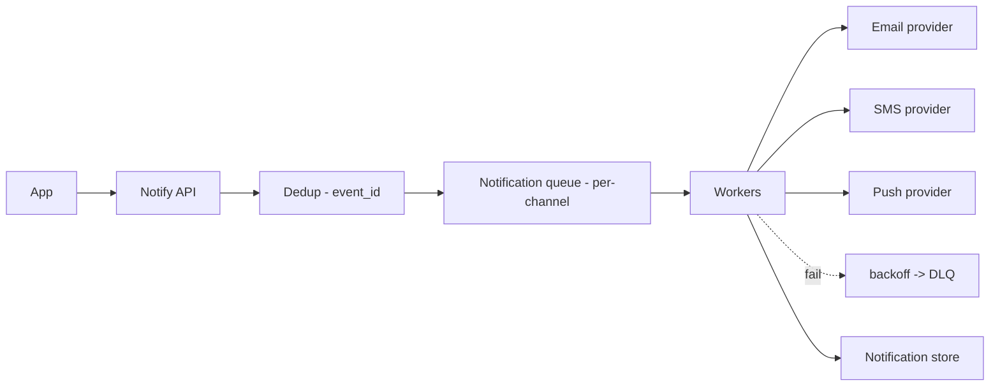
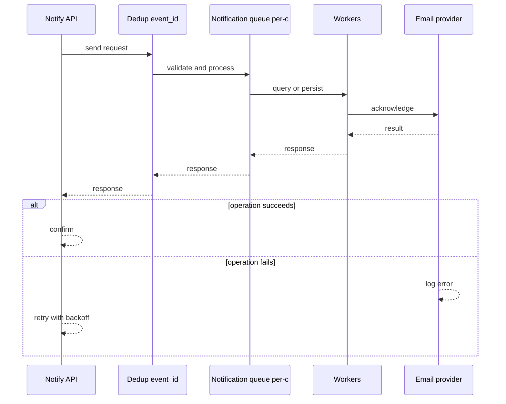
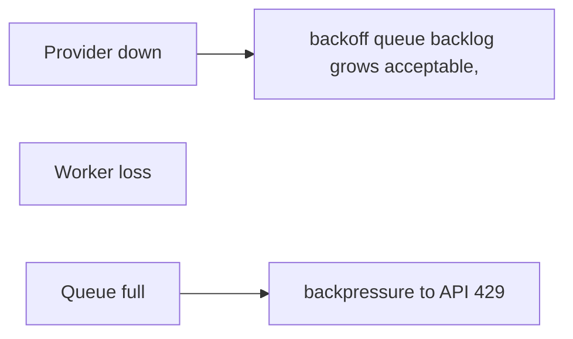
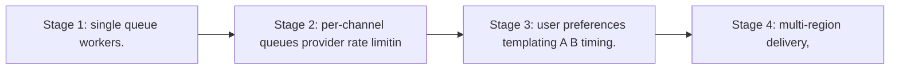

# Case Study: Notification Platform

> **Tier:** beginner · **Status:** complete · Original numbers and diagrams.

## 1. Problem statement
Fan out notifications (email, SMS, push, in-app) to many recipients reliably, with retries,
per-channel limits, and dedup — a decoupled worker pipeline. This is a beginner-tier system design challenge because it must handle high availability under peak load while ensuring no single point of failure. The design must be production-grade: observable, debuggable, reversible, and able to survive component failures without data loss or cascading outages.

## 2. Scope
**In (v1):** enqueue a notification, fan out to a channel, retry with backoff, dedup. **Out:**
templates UI, A/B delivery timing, user preference centers (noted as stage).

These boundaries are deliberate. Including more in the first version would spread effort thin and delay shipping a working core. Each excluded feature — noted as a scaling stage — is a candidate for the next iteration once the core loop is proven in production and the team has operational confidence in the baseline architecture.

## 3. Functional requirements
- Accept a notification request (channel, recipient, payload). - Deliver via the channel's
provider. - Retry transient failures; dead-letter persistent ones. - Dedup by event ID.

Each requirement has a direct architectural consequence. The read-heavy or write-heavy pattern determines the caching strategy. The durability requirement determines whether replication is synchronous or asynchronous. The idempotency requirement means every write path must handle redelivery without double-application — a design constraint that shapes the entire API and data model.

## 4. Non-functional requirements
- At-least-once delivery (idempotent sends). - Availability 99.9% (notifications can lag but
shouldn't be lost). - No spam: per-recipient/per-channel rate limits.

These targets are not aspirational — they are design constraints that shape every component choice. The latency SLO forces edge caching and limits synchronous cross-region calls on the hot path. The availability target drives a replication factor of 3 and multi-AZ deployment. The cost target constrains the model size, storage tier, and over-provisioning margin. Every architectural decision in this case study traces back to one of these targets.

## 5. Explicit assumptions
1. 10M notifications/day, ~120/s avg, 1,200/s peak. [assumption] 2. Channels: email 70%,
push 20%, SMS 10%. [assumption] 3. Providers have rate limits (e.g., SMS/s). [constraint]

These assumptions are load-bearing: if any is wrong by an order of magnitude, the architecture must adapt. Ten times more traffic may require sharding earlier. A different read-write ratio changes the caching strategy entirely. The peak multiplier affects headroom sizing. State them explicitly, revisit them after launch, and parameterize the design by these numbers rather than locking to them.

## 6. Traffic estimation
- 120/s enqueue; delivery same rate across channels. Peak 1,200/s.

To derive the request rate: divide the daily volume by 86,400 seconds to get the average rate, then multiply by 5-10x for peak. The read-to-write ratio determines whether the system is cache-dominated (read-heavy) or write-path-dominated (write-heavy). For Notification Platform, this ratio shapes the entire storage and replication strategy.

## 7. Storage estimation
- Notification record ~1 KB; 10M/day ≈ 10 GB/day; retain 90 days ≈ 900 GB (object storage).

Storage grows linearly with time. Daily growth multiplied by the retention period gives total storage. Add 20-30 percent for index overhead. Compression can reduce effective storage by 50-80 percent. The replication factor multiplies the total. Without a retention policy, storage grows without bound and cost becomes unsustainable.

## 8. Bandwidth estimation
- Outbound to providers; payloads small (KBs). Bandwidth modest; provider rate limits are
the binding constraint, not bandwidth.

Bandwidth is request rate multiplied by average payload size for ingress, and response rate multiplied by response size for egress. CDN and edge caching reduce origin egress. Compression reduces bandwidth by 50-80 percent where applicable. For Notification Platform, bandwidth may or may not be the binding constraint — compare it against compute and storage to find out.

## 9. API design
| Method | Path | Request | Response |
|--------|------|---------|----------|
| POST | /v1/notify | channel, recipient, payload, event_id | accepted / dedup |

## 10. Data model
`notifications(id PK, event_id, channel, recipient, status, attempts, ts)`. Event_id
unique index for dedup.

The data model is designed around the access pattern, not the entity shape. The primary lookup path determines the partition key. Secondary access paths determine which indexes to build. Denormalization is applied selectively where the hot read path would otherwise require expensive joins — with CDC or the outbox pattern keeping the denormalized view consistent with the source of truth.

## 11. High-level architecture

## 12. Request flow
API receives request → dedup by event_id → enqueue per-channel → worker picks, sends to
provider → on success mark delivered; on transient failure retry with backoff; after
max attempts, DLQ.

## 13. Component responsibilities
API: ingest + dedup. Queue: level load across channels. Workers: send + retry. Providers:
delivery. DLQ: poison messages.

Each component has a single, well-defined responsibility. The gateway handles authentication and routing. The service tier is stateless and horizontally scalable. The data tier is the stateful core, carefully partitioned and replicated. This separation allows each tier to scale independently: stateless tiers add replicas with demand; the stateful tier scales by sharding or read replicas.

## 14. Database selection
Queue (per-channel) for dispatch; a record store (relational/KV) for status/audit. Object
storage for long-term retention. Rejected: synchronous send in the API path (slows users,
loses resilience).

The database choice is driven by the access pattern, not by familiarity. A relational database was chosen or rejected based on whether the workload needs joins and transactions. A key-value store was chosen or rejected based on whether the workload is a single-key lookup at massive scale. The rejected alternatives were rejected for specific, workload-dependent reasons — not because they are bad databases, but because they are the wrong fit for this system.

## 15. Caching strategy
Dedup set (recent event_ids) in a fast cache; provider rate-limit windows cached per
provider to throttle sends.

The caching strategy is designed around the staleness tolerance of the workload. Cache-aside is the default — simple and lazy. Write-through is used where read-after-write consistency matters. Stampede protection (request coalescing or stale-while-revalidate) is applied to any key that can go viral. Cache entries are namespaced by tenant where multi-tenancy applies, preventing cross-tenant leakage.

## 16. Partitioning strategy
Queue partitioned by channel (each provider has separate capacity); within channel,
sharded by recipient for ordering/dedup locality.

The partition key co-locates related data so queries do not fan out across shards, while distributing load evenly so no single shard is hot. Consistent hashing with virtual nodes minimizes data movement when nodes are added or removed. A hot key — a viral entity or a giant tenant — is mitigated by caching, extra replication, or key splitting, not by adding more shards.

## 17. Replication strategy
Queue replicated (durability); a worker loss re-delivers unacked messages. Record store
replicated for audit durability.

Replication is synchronous on the write-confirmation path where durability is critical — the commit waits for at least one follower before acknowledging. Elsewhere it is asynchronous for throughput. A replication factor of 3 tolerates one failure while maintaining quorum. Failover is tested, not just configured: a follower that was never promoted will fail when you need it most.

## 18. Consistency model
At-least-once + idempotent providers (event_id passed where supported) → effectively-once
application effect. Status eventually consistent.

The consistency model is chosen as the weakest that users can tolerate, because stronger consistency costs latency and availability. Read-your-writes is provided where the user expects to see their own write immediately. Eventual consistency is bounded — seconds, not unbounded — and monitored. The system documents what 'eventual' means to users rather than hiding it.

## 19. Failure scenarios
Provider down → backoff + queue backlog grows (acceptable, drains later). Worker loss →
re-deliver (idempotent). Queue full → backpressure to API (429).

## 20. Reliability strategy
SLI delivery success, DLQ depth; SLO 99.9% eventual delivery. Backpressure; DLQ alerts;
chaos: kill workers, assert no loss (redelivery).

The SLO defines what 'good' means measurably. The error budget — the difference between 100 percent and the SLO — is the allowed unavailability that can be spent on deploys and feature risk. When the budget is nearly exhausted, risky changes are frozen. The system is tested with chaos engineering to verify that resilience assumptions hold. An untested failover is not a failover.

## 21. Security considerations
Per-tenant quotas; recipient opt-out honoring; PII in payloads redacted in logs; provider
credentials in secret manager; rate limits to prevent spam storms.

Security is defense in depth: TLS in transit, encryption at rest, RBAC with default-deny, PII redaction in logs, audit trails for every state-changing operation, and per-tenant isolation. For AI-augmented systems, the policy gateway is fail-closed — on any error, the system refuses to act rather than allowing an unguarded action.

## 22. Observability strategy
Delivery rate per channel, retry rate, DLQ depth, provider error rates, latency to
deliver. Alert on DLQ growth and provider error spikes.

Observability uses the three signals — logs, metrics, and traces — with correlation IDs to stitch a single request across services. The golden signals (latency, traffic, errors, saturation) are the first dashboard. Alerts fire on SLO burn rate, not on raw thresholds, to avoid noise. The on-call runbook for each alert is tested, not theoretical.

## 23. Cost considerations
Provider costs (SMS especially) dominate; dedup prevents duplicate sends (direct cost save).
Right-size workers to queue depth; don't over-send.

Cost is dominated by the binding resource identified in the traffic estimate. The primary levers are caching (cuts read cost), tiering (cuts storage cost), batching (cuts per-request overhead), and right-sizing (no over-provisioned idle capacity). Cost is tracked as a first-class metric — cost per request, cost per tenant, cost per outcome — and alerted on when unit cost spikes.

## 24. Scaling stages
Stage 1: single queue + workers. → Stage 2: per-channel queues + provider rate limiting. →
Stage 3: user preferences + templating + A/B timing. → Stage 4: multi-region delivery,
per-recipient dedup at scale.

## 25. Trade-offs
Sync vs async: async (chosen) keeps user path fast + resilient. At-least-once + idempotent
vs exactly-once: effectively-once is the achievable target. Provider rate limits vs
throughput: throttle to limits.

Every trade-off has a rejected alternative with a reason. The design does not present one option as universally correct — it presents the chosen option, the rejected alternative, and the workload-specific reason for the choice. This is what makes the design defensible in a review: the reviewer can challenge any decision and find the reasoning documented.

## 26. Alternative designs
Synchronous send (rejected: slow, fragile). A single queue (loses per-channel capacity
isolation). Exactly-once via consensus (rejected: provider APIs are at-least-once; use
idempotency).

The alternative designs are genuine architectures that would work under different constraints. They were rejected for this workload because of specific requirements — latency SLO, cost budget, consistency need — that make them inferior here but not universally inferior. Understanding why an alternative was rejected is as important as understanding why the chosen design was selected.

## 27. Interview discussion points
Clarify channels, volume, latency (real-time vs eventual), dedup. Surface async fan-out,
at-least-once + idempotency, and provider rate limits.

In an interview, the strongest candidates clarify ambiguity before designing, surface the read-write ratio and the binding resource, design the hot path deeply rather than just drawing boxes, discuss failure modes explicitly, and offer an alternative with a reason. The weakest candidates draw boxes before clarifying scope, name a vendor product as the architecture, and skip failure modes entirely.

## 28. Original Mermaid diagrams
Standalone sources under `diagrams/case-studies/notification-platform/`: `context.mmd`, `request-sequence.mmd`, `failure-flow.mmd`, `scaling-evolution.mmd`. The diagrams are embedded in their respective sections: architecture in section 11, request flow in section 12, failure scenarios in section 19, and scaling stages in section 24.

## 29. Further reading
Queues/retries/DLQ: Level 2 & 4; queue_retry.py; backpressure: Level 6. Sources: `S-CHASH` `S-DYNAMO`.

## 30. Practical exercises
1. Add user preference/opt-out — where does it live in the flow? 2. Design per-recipient
dedup at 10M recipients. 3. A provider rate-limits you; design the throttle. 4. Add
delivery analytics (open/click). 5. Re-estimate at 1B notifications/day.

---
Previous: [Web crawler](web-crawler.md) · Next: [Chat application](../intermediate/chat-application.md)

