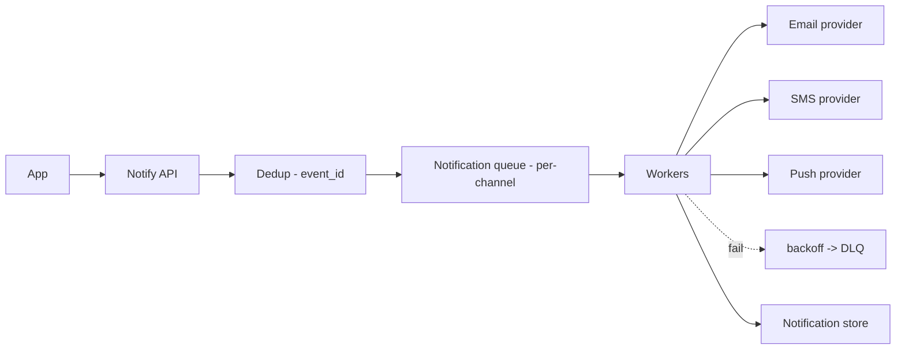
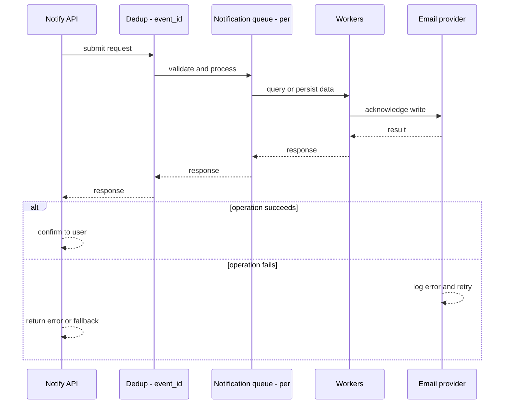
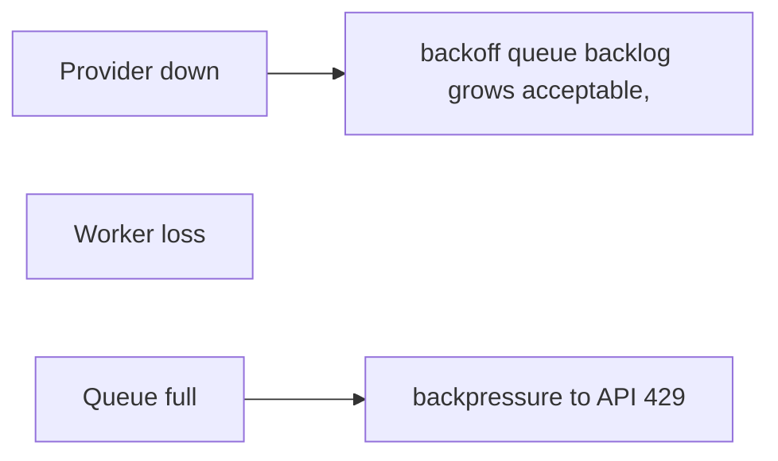
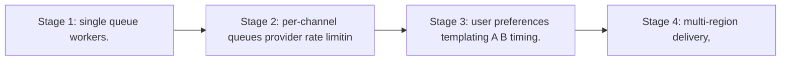

# Case Study: Notification Platform

> **Tier:** beginner · **Status:** complete · Original numbers and diagrams.

## 1. Problem statement
Fan out notifications (email, SMS, push, in-app) to many recipients reliably, with retries,
per-channel limits, and dedup — a decoupled worker pipeline. This is a beginner-tier system design challenge because it must handle high availability under peak load while ensuring no single point of failure. The design must be production-grade: observable, debuggable, reversible, and able to survive component failures without data loss or cascading outages.

## 2. Scope
**In (v1):** enqueue a notification, fan out to a channel, retry with backoff, dedup. **Out:**
templates UI, A/B delivery timing, user preference centers (noted as stage).

For Notification Platform, these boundaries keep the first version focused on the core user value. Adding more features would dilute the design and delay shipping. Each excluded item is a scaling stage — a candidate for the next iteration once the baseline is proven.

## 3. Functional requirements
- Accept a notification request (channel, recipient, payload). - Deliver via the channel's
provider. - Retry transient failures; dead-letter persistent ones. - Dedup by event ID.

For Notification Platform, these requirements drive specific architectural decisions: the read-write ratio determines the caching strategy, the durability target sets the replication mode, and the idempotency requirement shapes the API contract.

## 4. Non-functional requirements
- At-least-once delivery (idempotent sends). - Availability 99.9% (notifications can lag but
shouldn't be lost). - No spam: per-recipient/per-channel rate limits.

For Notification Platform, each non-functional target constrains a specific component: the latency SLO bounds the number of synchronous hops, the availability target forces redundancy across availability zones, and the cost ceiling limits the replication factor and storage tier.

## 5. Explicit assumptions
1. 10M notifications/day, ~120/s avg, 1,200/s peak. [assumption] 2. Channels: email 70%,
push 20%, SMS 10%. [assumption] 3. Providers have rate limits (e.g., SMS/s). [constraint]

For Notification Platform, if these assumptions are off by an order of magnitude, the architecture must adapt: 10x traffic may require earlier sharding, a different read-write ratio changes the caching strategy, and a higher peak multiplier demands more headroom.

## 6. Traffic estimation
- 120/s enqueue; delivery same rate across channels. Peak 1,200/s.

To derive the request rate: divide the daily volume by 86,400 seconds to get the average rate, then multiply by 5-10x for peak. The read-to-write ratio determines whether the system is cache-dominated (read-heavy) or write-path-dominated (write-heavy). For Notification Platform, this ratio shapes the entire storage and replication strategy.

## 7. Storage estimation
- Notification record ~1 KB; 10M/day ≈ 10 GB/day; retain 90 days ≈ 900 GB (object storage).

For Notification Platform, storage growth is projected from the daily write volume and retention policy. Index overhead and compression factors are accounted for in the total.

## 8. Bandwidth estimation
- Outbound to providers; payloads small (KBs). Bandwidth modest; provider rate limits are
the binding constraint, not bandwidth.

Bandwidth is request rate multiplied by average payload size for ingress, and response rate multiplied by response size for egress. CDN and edge caching reduce origin egress. Compression reduces bandwidth by 50-80 percent where applicable. For Notification Platform, bandwidth may or may not be the binding constraint — compare it against compute and storage to find out.

## 9. API design
| Method | Path | Request | Response |
|--------|------|---------|----------|
| POST | /v1/notify | channel, recipient, payload, event_id | accepted / dedup |

## 10. Data model
`notifications(id PK, event_id, channel, recipient, status, attempts, ts)`. Event_id
unique index for dedup.

For Notification Platform, the data model follows the access pattern. The primary lookup determines the partition key; secondary lookups determine indexes. Denormalization is used selectively on hot read paths.

## 11. High-level architecture

## 12. Request flow
API receives request → dedup by event_id → enqueue per-channel → worker picks, sends to
provider → on success mark delivered; on transient failure retry with backoff; after
max attempts, DLQ.

## 13. Component responsibilities
API: ingest + dedup. Queue: level load across channels. Workers: send + retry. Providers:
delivery. DLQ: poison messages.

For Notification Platform, each component has one job. The gateway authenticates and routes. Services are stateless and scale horizontally. The data tier is the stateful core that scales by sharding.

## 14. Database selection
Queue (per-channel) for dispatch; a record store (relational/KV) for status/audit. Object
storage for long-term retention. Rejected: synchronous send in the API path (slows users,
loses resilience).

For Notification Platform, the database was chosen by access pattern, not familiarity. The rejected alternatives were wrong for this workload, not bad in general.

## 15. Caching strategy
Dedup set (recent event_ids) in a fast cache; provider rate-limit windows cached per
provider to throttle sends.

For Notification Platform, the cache strategy matches the staleness tolerance. Cache-aside for most data, write-through where read-after-write matters, stampede protection on hot keys.

## 16. Partitioning strategy
Queue partitioned by channel (each provider has separate capacity); within channel,
sharded by recipient for ordering/dedup locality.

For Notification Platform, the partition key balances query locality with even load distribution. Sharding strategy matters because a poor key creates hot spots under real traffic patterns.

## 17. Replication strategy
Queue replicated (durability); a worker loss re-delivers unacked messages. Record store
replicated for audit durability.

For Notification Platform, replication mode is split: synchronous where durability is critical, asynchronous elsewhere for throughput. RF=3 tolerates one failure. Failover is tested regularly.

## 18. Consistency model
At-least-once + idempotent providers (event_id passed where supported) → effectively-once
application effect. Status eventually consistent.

For Notification Platform, the consistency level is the weakest users accept. Read-your-writes is provided where needed. Eventual consistency is bounded and monitored, not unbounded and silent.

## 19. Failure scenarios
Provider down → backoff + queue backlog grows (acceptable, drains later). Worker loss →
re-deliver (idempotent). Queue full → backpressure to API (429).

## 20. Reliability strategy
SLI delivery success, DLQ depth; SLO 99.9% eventual delivery. Backpressure; DLQ alerts;
chaos: kill workers, assert no loss (redelivery).

For Notification Platform, the SLO makes reliability measurable. The error budget balances feature velocity with stability. Chaos testing validates that resilience claims hold under real failures.

## 21. Security considerations
Per-tenant quotas; recipient opt-out honoring; PII in payloads redacted in logs; provider
credentials in secret manager; rate limits to prevent spam storms.

For Notification Platform, security layers TLS, encryption at rest, RBAC, PII redaction, and audit. The policy gateway is fail-closed for AI-augmented operations.

## 22. Observability strategy
Delivery rate per channel, retry rate, DLQ depth, provider error rates, latency to
deliver. Alert on DLQ growth and provider error spikes.

For Notification Platform, observability combines logs, metrics, and traces with correlation IDs. Golden signals drive the first dashboard. Alerts fire on burn rate, not raw thresholds.

## 23. Cost considerations
Provider costs (SMS especially) dominate; dedup prevents duplicate sends (direct cost save).
Right-size workers to queue depth; don't over-send.

For Notification Platform, cost is driven by the binding resource. Caching, tiering, batching, and right-sizing are the levers. Cost per request is tracked and alerted on.

## 24. Scaling stages
Stage 1: single queue + workers. → Stage 2: per-channel queues + provider rate limiting. →
Stage 3: user preferences + templating + A/B timing. → Stage 4: multi-region delivery,
per-recipient dedup at scale.

## 25. Trade-offs
Sync vs async: async (chosen) keeps user path fast + resilient. At-least-once + idempotent
vs exactly-once: effectively-once is the achievable target. Provider rate limits vs
throughput: throttle to limits.

For Notification Platform, each trade-off lists what was chosen, what was rejected, and why. This makes the design defensible in review — every decision has documented reasoning.

## 26. Alternative designs
Synchronous send (rejected: slow, fragile). A single queue (loses per-channel capacity
isolation). Exactly-once via consensus (rejected: provider APIs are at-least-once; use
idempotency).

For Notification Platform, the alternatives are real architectures that work under different constraints. They were rejected for this workload's specific requirements, not because they are bad designs.

## 27. Interview discussion points
Clarify channels, volume, latency (real-time vs eventual), dedup. Surface async fan-out,
at-least-once + idempotency, and provider rate limits.

For Notification Platform in an interview: clarify scope first, surface the read-write ratio, design the hot path deeply, discuss failures, and offer an alternative. Weak candidates skip failure modes.

## 28. Original Mermaid diagrams
Standalone sources under `diagrams/case-studies/notification-platform/`: `context.mmd`, `request-sequence.mmd`, `failure-flow.mmd`, `scaling-evolution.mmd`. The diagrams are embedded in their respective sections: architecture in section 11, request flow in section 12, failure scenarios in section 19, and scaling stages in section 24.

## 29. Further reading
Queues/retries/DLQ: Level 2 & 4; queue_retry.py; backpressure: Level 6. Sources: `S-CHASH` `S-DYNAMO`.

## 30. Practical exercises
1. Add user preference/opt-out — where does it live in the flow? 2. Design per-recipient
dedup at 10M recipients. 3. A provider rate-limits you; design the throttle. 4. Add
delivery analytics (open/click). 5. Re-estimate at 1B notifications/day.

---
Previous: [Web crawler](web-crawler.md) · Next: [Chat application](../intermediate/chat-application.md)

