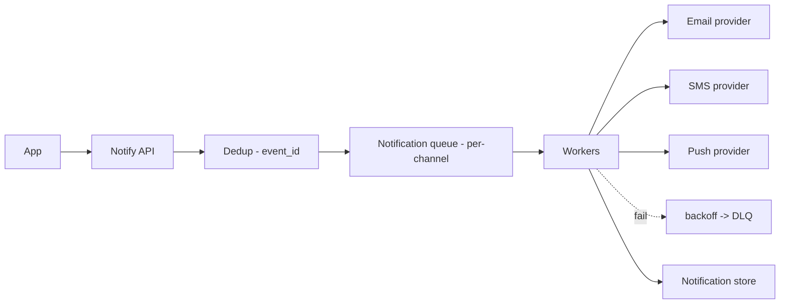
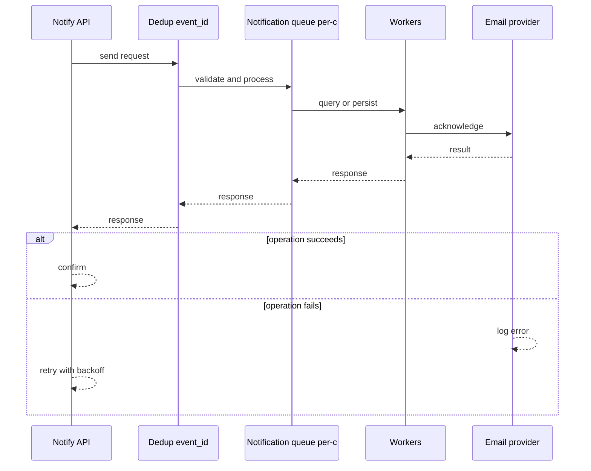
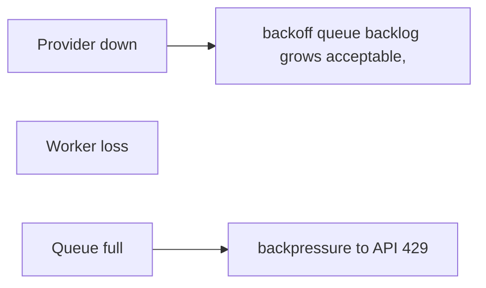
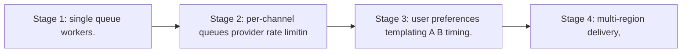

# Case Study: Notification Platform

> **Tier:** beginner · **Status:** complete · Original numbers and diagrams.

## 1. Problem statement
Fan out notifications (email, SMS, push, in-app) to many recipients reliably, with retries,
per-channel limits, and dedup — a decoupled worker pipeline.

## 2. Scope
**In (v1):** enqueue a notification, fan out to a channel, retry with backoff, dedup. **Out:**
templates UI, A/B delivery timing, user preference centers (noted as stage).

## 3. Functional requirements
- Accept a notification request (channel, recipient, payload). - Deliver via the channel's
provider. - Retry transient failures; dead-letter persistent ones. - Dedup by event ID.

## 4. Non-functional requirements
- At-least-once delivery (idempotent sends). - Availability 99.9% (notifications can lag but
shouldn't be lost). - No spam: per-recipient/per-channel rate limits.

## 5. Explicit assumptions
1. 10M notifications/day, ~120/s avg, 1,200/s peak. [assumption] 2. Channels: email 70%,
push 20%, SMS 10%. [assumption] 3. Providers have rate limits (e.g., SMS/s). [constraint]

## 6. Traffic estimation
- 120/s enqueue; delivery same rate across channels. Peak 1,200/s.

## 7. Storage estimation
- Notification record ~1 KB; 10M/day ≈ 10 GB/day; retain 90 days ≈ 900 GB (object storage).

## 8. Bandwidth estimation
- Outbound to providers; payloads small (KBs). Bandwidth modest; provider rate limits are
the binding constraint, not bandwidth.

## 9. API design
| Method | Path | Request | Response |
|--------|------|---------|----------|
| POST | /v1/notify | channel, recipient, payload, event_id | accepted / dedup |

## 10. Data model
`notifications(id PK, event_id, channel, recipient, status, attempts, ts)`. Event_id
unique index for dedup.

## 11. High-level architecture

## 12. Request flow
API receives request → dedup by event_id → enqueue per-channel → worker picks, sends to
provider → on success mark delivered; on transient failure retry with backoff; after
max attempts, DLQ.

## 13. Component responsibilities
API: ingest + dedup. Queue: level load across channels. Workers: send + retry. Providers:
delivery. DLQ: poison messages.

## 14. Database selection
Queue (per-channel) for dispatch; a record store (relational/KV) for status/audit. Object
storage for long-term retention. Rejected: synchronous send in the API path (slows users,
loses resilience).

## 15. Caching strategy
Dedup set (recent event_ids) in a fast cache; provider rate-limit windows cached per
provider to throttle sends.

## 16. Partitioning strategy
Queue partitioned by channel (each provider has separate capacity); within channel,
sharded by recipient for ordering/dedup locality.

## 17. Replication strategy
Queue replicated (durability); a worker loss re-delivers unacked messages. Record store
replicated for audit durability.

## 18. Consistency model
At-least-once + idempotent providers (event_id passed where supported) → effectively-once
application effect. Status eventually consistent.

## 19. Failure scenarios
Provider down → backoff + queue backlog grows (acceptable, drains later). Worker loss →
re-deliver (idempotent). Queue full → backpressure to API (429).

## 20. Reliability strategy
SLI delivery success, DLQ depth; SLO 99.9% eventual delivery. Backpressure; DLQ alerts;
chaos: kill workers, assert no loss (redelivery).

## 21. Security considerations
Per-tenant quotas; recipient opt-out honoring; PII in payloads redacted in logs; provider
credentials in secret manager; rate limits to prevent spam storms.

## 22. Observability strategy
Delivery rate per channel, retry rate, DLQ depth, provider error rates, latency to
deliver. Alert on DLQ growth and provider error spikes.

## 23. Cost considerations
Provider costs (SMS especially) dominate; dedup prevents duplicate sends (direct cost save).
Right-size workers to queue depth; don't over-send.

## 24. Scaling stages
Stage 1: single queue + workers. → Stage 2: per-channel queues + provider rate limiting. →
Stage 3: user preferences + templating + A/B timing. → Stage 4: multi-region delivery,
per-recipient dedup at scale.

## 25. Trade-offs
Sync vs async: async (chosen) keeps user path fast + resilient. At-least-once + idempotent
vs exactly-once: effectively-once is the achievable target. Provider rate limits vs
throughput: throttle to limits.

## 26. Alternative designs
Synchronous send (rejected: slow, fragile). A single queue (loses per-channel capacity
isolation). Exactly-once via consensus (rejected: provider APIs are at-least-once; use
idempotency).

## 27. Interview discussion points
Clarify channels, volume, latency (real-time vs eventual), dedup. Surface async fan-out,
at-least-once + idempotency, and provider rate limits.

## 28. Original Mermaid diagrams
Standalone sources under `diagrams/case-studies/notification-platform/`: `context.mmd`, `request-sequence.mmd`, `failure-flow.mmd`, `scaling-evolution.mmd`. The diagrams are embedded in their respective sections: architecture in section 11, request flow in section 12, failure scenarios in section 19, and scaling stages in section 24.

## 29. Further reading
Queues/retries/DLQ: Level 2 & 4; queue_retry.py; backpressure: Level 6. Sources: `S-CHASH` `S-DYNAMO`.

## 30. Practical exercises
1. Add user preference/opt-out — where does it live in the flow? 2. Design per-recipient
dedup at 10M recipients. 3. A provider rate-limits you; design the throttle. 4. Add
delivery analytics (open/click). 5. Re-estimate at 1B notifications/day.

---
Previous: [Web crawler](web-crawler.md) · Next: [Chat application](../intermediate/chat-application.md)

