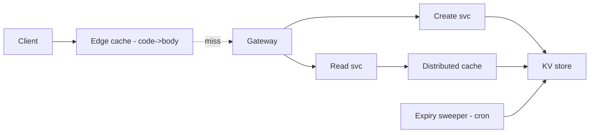
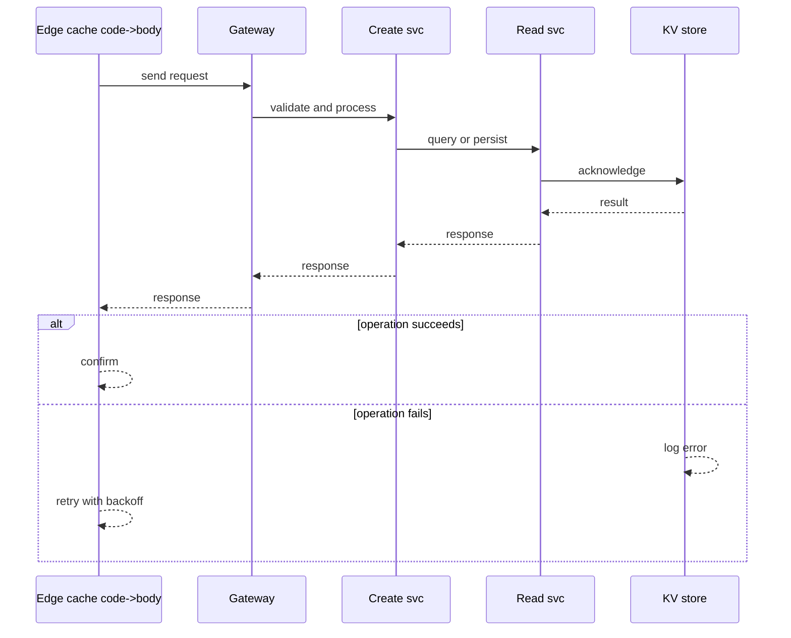
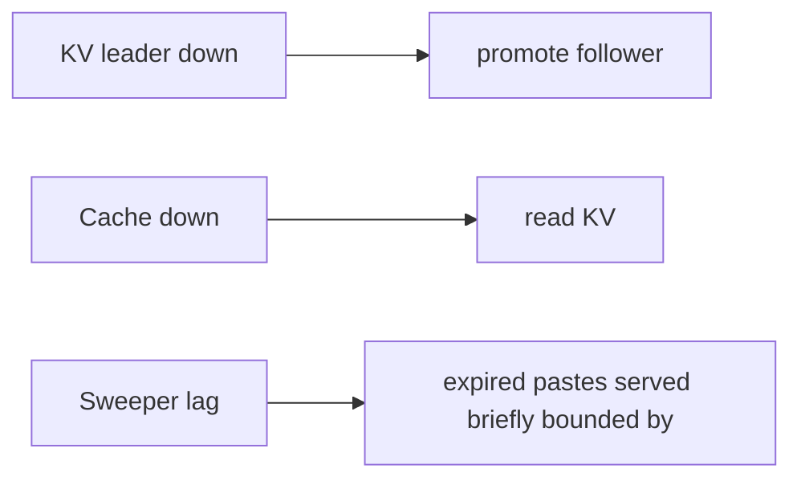

# Case Study: Paste Service

> **Tier:** beginner · **Status:** complete · Original numbers and diagrams.

## 1. Problem statement
Users paste text (code, notes) and get a short URL to share; anyone with the URL reads the
paste. Read-heavy, long-tail, cache-dominated — a clean beginner system. This is a beginner-tier system design challenge because it must handle high availability under peak load while ensuring no single point of failure. The design must be production-grade: observable, debuggable, reversible, and able to survive component failures without data loss or cascading outages.

## 2. Scope
**In (v1):** create paste, read paste, optional expiry, plain UTF-8 ≤1 MB. **Out:** syntax
highlighting, accounts, versioning, comments.

For Paste Service, these boundaries keep the first version focused on the core user value. Adding more features would dilute the design and delay shipping. Each excluded item is a scaling stage — a candidate for the next iteration once the baseline is proven.

## 3. Functional requirements
- Create a paste from text, return a short URL.
- Read a paste by code.
- Expire pastes on
an optional TTL. - Return 404 for unknown/expired.

For Paste Service, these requirements drive specific architectural decisions: the read-write ratio determines the caching strategy, the durability target sets the replication mode, and the idempotency requirement shapes the API contract.

## 4. Non-functional requirements
- Read p99 < 100 ms (cache/edge-served); availability 99.9%. - Durability: pastes must not
  be lost before expiry. - Read-heavy (est. ~50:1).

For Paste Service, each non-functional target constrains a specific component: the latency SLO bounds the number of synchronous hops, the availability target forces redundancy across availability zones, and the cost ceiling limits the replication factor and storage tier.

## 5. Explicit assumptions
1. 1M pastes/day, avg 5 KB. [assumption] 2. ~50 reads/paste, viral skew. [assumption]
3. Retention 30 days default. [constraint] 4. Short code 6 base62 chars (62^6 ≈ 56B). [assumption]

For Paste Service, if these assumptions are off by an order of magnitude, the architecture must adapt: 10x traffic may require earlier sharding, a different read-write ratio changes the caching strategy, and a higher peak multiplier demands more headroom.

## 6. Traffic estimation
- Writes: 1M/day ≈ 12/s avg, ~120/s peak. - Reads: 50M/day ≈ 580/s avg, ~5,800/s peak.

To derive the request rate: divide the daily volume by 86,400 seconds to get the average rate, then multiply by 5-10x for peak. The read-to-write ratio determines whether the system is cache-dominated (read-heavy) or write-path-dominated (write-heavy). For Paste Service, this ratio shapes the entire storage and replication strategy.

## 7. Storage estimation
- 1M × 5 KB = 5 GB/day; 30-day retention ≈ 150 GB hot + indexes (~+20%). Modest.

For Paste Service, storage growth is projected from the daily write volume and retention policy. Index overhead and compression factors are accounted for in the total.

## 8. Bandwidth estimation
- Reads 580/s × 5 KB ≈ 2.9 MB/s avg, ~29 MB/s peak. Writes trivial. Bandwidth not binding.

Bandwidth is request rate multiplied by average payload size for ingress, and response rate multiplied by response size for egress. CDN and edge caching reduce origin egress. Compression reduces bandwidth by 50-80 percent where applicable. For Paste Service, bandwidth may or may not be the binding constraint — compare it against compute and storage to find out.

## 9. API design
| Method | Path | Request | Response |
|--------|------|---------|----------|
| POST | /v1/pastes | text, ttl? | code, url |
| GET | /:code | — | 200 body / 404 |

## 10. Data model
`pastes(code PK, body, created_at, expires_at, author?)`. KV store keyed by code; body inline
(small). Index `expires_at` for cleanup.

For Paste Service, the data model follows the access pattern. The primary lookup determines the partition key; secondary lookups determine indexes. Denormalization is used selectively on hot read paths.

## 11. High-level architecture

## 12. Request flow
Create: gateway → create svc generates code → write KV + cache → return URL. Read: edge
hit → return; else read svc → cache → KV → populate; 404 if unknown/expired.

## 13. Component responsibilities
Edge: serve hot reads. Create/Read: stateless services. KV: source of truth. Cache: second
tier. Sweeper: deletes expired pastes.

For Paste Service, each component has one job. The gateway authenticates and routes. Services are stateless and scale horizontally. The data tier is the stateful core that scales by sharding.

## 14. Database selection
KV store keyed by code (single key→blob). Rejected: relational (joins not needed); search
engine (no text search in v1).

For Paste Service, the database was chosen by access pattern, not familiarity. The rejected alternatives were wrong for this workload, not bad in general.

## 15. Caching strategy
Edge cache code→body (TTL ≤ expires_at); distributed cache for misses. Stampede
protection: coalescing on a viral paste.

For Paste Service, the cache strategy matches the staleness tolerance. Cache-aside for most data, write-through where read-after-write matters, stampede protection on hot keys.

## 16. Partitioning strategy
Hash by code; consistent hashing; reads sharded to replicas. A viral code handled by edge,
not more shards.

For Paste Service, the partition key balances query locality with even load distribution. Sharding strategy matters because a poor key creates hot spots under real traffic patterns.

## 17. Replication strategy
Leader-follower, async, RF=3; reads from followers. Writes low-rate.

For Paste Service, replication mode is split: synchronous where durability is critical, asynchronous elsewhere for throughput. RF=3 tolerates one failure. Failover is tested regularly.

## 18. Consistency model
Eventual across replicas; read-your-writes by routing the creator's next read to the
leader/leader-region. Body immutable after create.

For Paste Service, the consistency level is the weakest users accept. Read-your-writes is provided where needed. Eventual consistency is bounded and monitored, not unbounded and silent.

## 19. Failure scenarios
KV leader down → promote follower; reads continue from edge/cache. Cache down → read KV
( slower). Sweeper lag → expired pastes served briefly (bounded by TTL).

## 20. Reliability strategy
SLI read success/latency; SLO 99.9%; RF=3; chaos: kill a cache node, assert reads continue.

For Paste Service, the SLO makes reliability measurable. The error budget balances feature velocity with stability. Chaos testing validates that resilience claims hold under real failures.

## 21. Security considerations
Auth optional on create (rate limit); input validation (size, UTF-8); abuse: block known
malicious content; no script in body (render as text).

For Paste Service, security layers TLS, encryption at rest, RBAC, PII redaction, and audit. The policy gateway is fail-closed for AI-augmented operations.

## 22. Observability strategy
Golden signals; edge hit ratio, KV read/s, cache hit ratio; alert on hit-ratio drop, p99,
expiry backlog.

For Paste Service, observability combines logs, metrics, and traces with correlation IDs. Golden signals drive the first dashboard. Alerts fire on burn rate, not raw thresholds.

## 23. Cost considerations
Storage small; reads dominated → edge hit ratio is the lever. Tier nothing (short
retention).

For Paste Service, cost is driven by the binding resource. Caching, tiering, batching, and right-sizing are the levers. Cost per request is tracked and alerted on.

## 24. Scaling stages
Stage 1: single region KV+cache+edge. → Stage 2: shard KV by code, read replicas. → Stage
3: multi-region reads, cross-region replication. → Stage 4: edge coalescing for viral
pastes.

## 25. Trade-offs
KV vs relational: access pattern is key→blob → KV. Eventual vs strong: reads tolerate
staleness → eventual. Edge 302 caching vs origin: edge dominates reads.

For Paste Service, each trade-off lists what was chosen, what was rejected, and why. This makes the design defensible in review — every decision has documented reasoning.

## 26. Alternative designs
Relational DB (fine for v1, rejected at scale as sharding KV simpler). Pure edge (no KV):
rejected — can't durably store/update/delete.

For Paste Service, the alternatives are real architectures that work under different constraints. They were rejected for this workload's specific requirements, not because they are bad designs.

## 27. Interview discussion points
Clarify expiry, read/write ratio, viral behavior. Surface hot-key handling and the
read-heavy, cache-dominated shape first.

For Paste Service in an interview: clarify scope first, surface the read-write ratio, design the hot path deeply, discuss failures, and offer an alternative. Weak candidates skip failure modes.

## 28. Original Mermaid diagrams
Standalone sources under `diagrams/case-studies/paste-service/`: `context.mmd`, `request-sequence.mmd`, `failure-flow.mmd`, `scaling-evolution.mmd`. The diagrams are embedded in their respective sections: architecture in section 11, request flow in section 12, failure scenarios in section 19, and scaling stages in section 24.

## 29. Further reading
KV/sharding: Level 3; caching: Level 2; capacity worksheet in `calculations/`. Sources: `S-CHASH` `S-DYNAMO`.

## 30. Practical exercises
1. Add 5-year retention; recompute storage and tiering. 2. Add full-text search of paste
content — what changes? 3. Design the viral-paste stampede test. 4. Add a view counter;
how to avoid hot-key writes. 5. Re-estimate at 100M pastes/day.

---
Previous: [URL shortener](url-shortener.md) · Next: [Rate limiter](rate-limiter.md)

