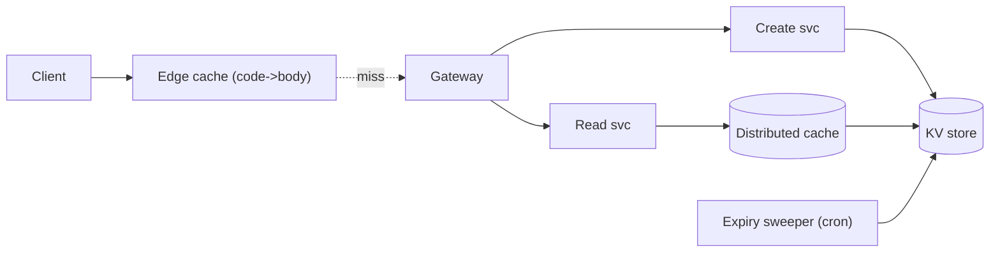
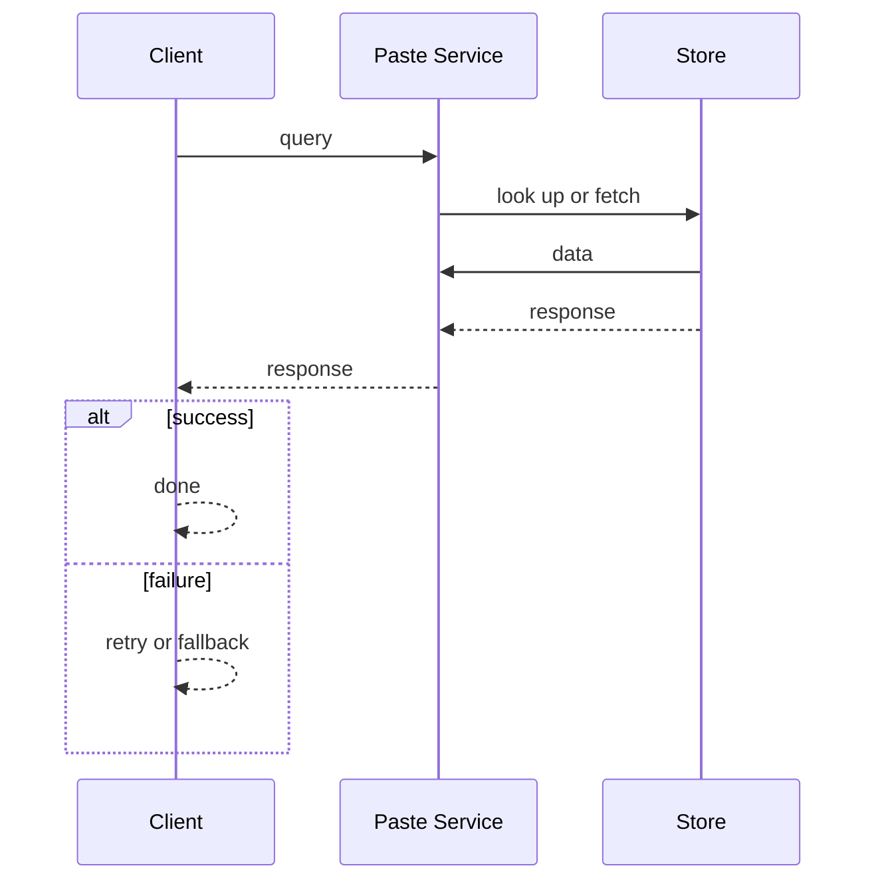
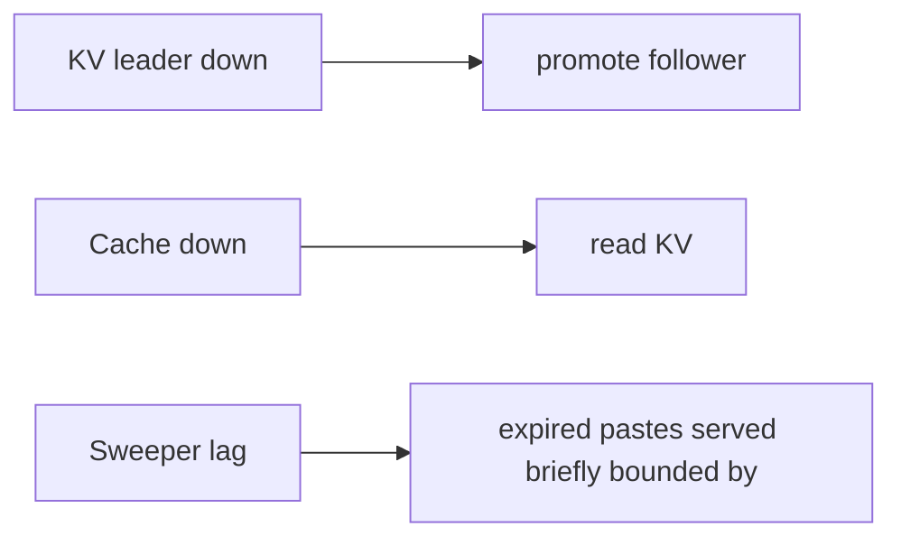

# Case Study: Paste Service

> **Tier:** beginner · **Status:** complete · Original numbers and diagrams.

## 1. Problem statement
Users paste text (code, notes) and get a short URL to share; anyone with the URL reads the
paste. Read-heavy, long-tail, cache-dominated — a clean beginner system.

## 2. Scope
**In (v1):** create paste, read paste, optional expiry, plain UTF-8 ≤1 MB. **Out:** syntax
highlighting, accounts, versioning, comments.

## 3. Functional requirements
- Create a paste from text, return a short URL.
- Read a paste by code.
- Expire pastes on
an optional TTL. - Return 404 for unknown/expired.

## 4. Non-functional requirements
- Read p99 < 100 ms (cache/edge-served); availability 99.9%. - Durability: pastes must not
  be lost before expiry. - Read-heavy (est. ~50:1).

## 5. Explicit assumptions
1. 1M pastes/day, avg 5 KB. [assumption] 2. ~50 reads/paste, viral skew. [assumption]
3. Retention 30 days default. [constraint] 4. Short code 6 base62 chars (62^6 ≈ 56B). [assumption]

## 6. Traffic estimation
- Writes: 1M/day ≈ 12/s avg, ~120/s peak. - Reads: 50M/day ≈ 580/s avg, ~5,800/s peak.

## 7. Storage estimation
- 1M × 5 KB = 5 GB/day; 30-day retention ≈ 150 GB hot + indexes (~+20%). Modest.

## 8. Bandwidth estimation
- Reads 580/s × 5 KB ≈ 2.9 MB/s avg, ~29 MB/s peak. Writes trivial. Bandwidth not binding.

## 9. API design
| POST | /v1/pastes | text, ttl? | code, url | GET | /:code | — | 200 body / 404 |

## 10. Data model
`pastes(code PK, body, created_at, expires_at, author?)`. KV store keyed by code; body inline
(small). Index `expires_at` for cleanup.

## 11. High-level architecture

## 12. Request flow
Create: gateway → create svc generates code → write KV + cache → return URL. Read: edge
hit → return; else read svc → cache → KV → populate; 404 if unknown/expired.

## 13. Component responsibilities
Edge: serve hot reads. Create/Read: stateless services. KV: source of truth. Cache: second
tier. Sweeper: deletes expired pastes.

## 14. Database selection
KV store keyed by code (single key→blob). Rejected: relational (joins not needed); search
engine (no text search in v1).

## 15. Caching strategy
Edge cache code→body (TTL ≤ expires_at); distributed cache for misses. Stampede
protection: coalescing on a viral paste.

## 16. Partitioning strategy
Hash by code; consistent hashing; reads sharded to replicas. A viral code handled by edge,
not more shards.

## 17. Replication strategy
Leader-follower, async, RF=3; reads from followers. Writes low-rate.

## 18. Consistency model
Eventual across replicas; read-your-writes by routing the creator's next read to the
leader/leader-region. Body immutable after create.

## 19. Failure scenarios
KV leader down → promote follower; reads continue from edge/cache. Cache down → read KV
( slower). Sweeper lag → expired pastes served briefly (bounded by TTL).

## 20. Reliability strategy
SLI read success/latency; SLO 99.9%; RF=3; chaos: kill a cache node, assert reads continue.

## 21. Security considerations
Auth optional on create (rate limit); input validation (size, UTF-8); abuse: block known
malicious content; no script in body (render as text).

## 22. Observability strategy
Golden signals; edge hit ratio, KV read/s, cache hit ratio; alert on hit-ratio drop, p99,
expiry backlog.

## 23. Cost considerations
Storage small; reads dominated → edge hit ratio is the lever. Tier nothing (short
retention).

## 24. Scaling stages
Stage 1: single region KV+cache+edge. → Stage 2: shard KV by code, read replicas. → Stage
3: multi-region reads, cross-region replication. → Stage 4: edge coalescing for viral
pastes.

## 25. Trade-offs
KV vs relational: access pattern is key→blob → KV. Eventual vs strong: reads tolerate
staleness → eventual. Edge 302 caching vs origin: edge dominates reads.

## 26. Alternative designs
Relational DB (fine for v1, rejected at scale as sharding KV simpler). Pure edge (no KV):
rejected — can't durably store/update/delete.

## 27. Interview discussion points
Clarify expiry, read/write ratio, viral behavior. Surface hot-key handling and the
read-heavy, cache-dominated shape first.

## 28. Original Mermaid diagrams
Standalone sources under `diagrams/case-studies/paste-service/`: `context.mmd`, `request-sequence.mmd`, `failure-flow.mmd`, `scaling-evolution.mmd`. The diagrams are embedded in their respective sections: architecture in section 11, request flow in section 12, failure scenarios in section 19, and scaling stages in section 24.

## 29. Further reading
KV/sharding: Level 3; caching: Level 2; capacity worksheet in `calculations/`.

## 30. Practical exercises
1. Add 5-year retention; recompute storage and tiering. 2. Add full-text search of paste
content — what changes? 3. Design the viral-paste stampede test. 4. Add a view counter;
how to avoid hot-key writes. 5. Re-estimate at 100M pastes/day.

---
Previous: [URL shortener](url-shortener.md) · Next: [Rate limiter](rate-limiter.md)

