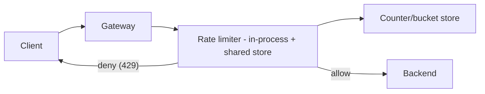
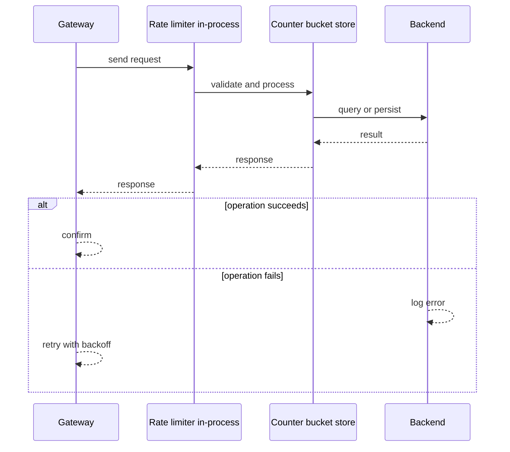
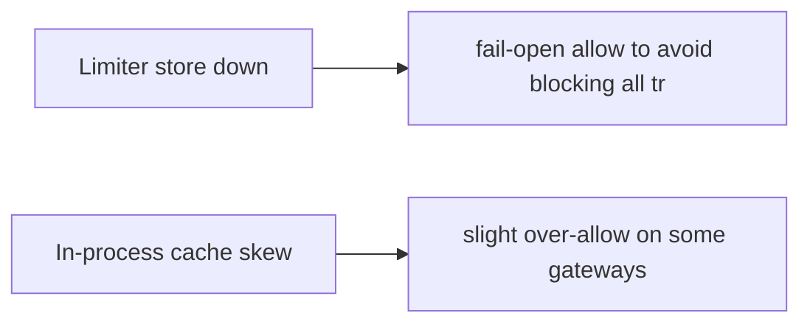
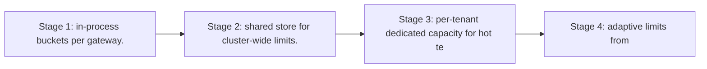

# Case Study: Rate Limiter

> **Tier:** beginner · **Status:** complete · Original numbers and diagrams.

## 1. Problem statement
Protect a service from abuse/overload by limiting request rate per client/tenant. A
foundational component reused across gateways. (See `examples/rate_limiter.py`.) This is a beginner-tier system design challenge because it must handle high availability under peak load while ensuring sub-millisecond response times. The design must be production-grade: observable, debuggable, reversible, and able to survive component failures without data loss or cascading outages.

## 2. Scope
**In (v1):** per-client fixed-window and token-bucket limiting at the edge. **Out:**
distributed global counters, adaptive/AI-based limiting, per-endpoint dynamic limits.

For Rate Limiter, these boundaries keep the first version focused on the core user value. Adding more features would dilute the design and delay shipping. Each excluded item is a scaling stage — a candidate for the next iteration once the baseline is proven.

## 3. Functional requirements
- Limit requests per client key to R per second. - Return 429 with Retry-After when
exceeded. - Allow a burst up to bucket capacity. - Report current usage.

For Rate Limiter, these requirements drive specific architectural decisions: the read-write ratio determines the caching strategy, the durability target sets the replication mode, and the idempotency requirement shapes the API contract.

## 4. Non-functional requirements
- Decision p99 < 1 ms (in the hot path). - Availability 99.95% (fail-open if limiter down
to avoid blocking all traffic). - Highly read/write symmetric (every request is a check
+ update).

For Rate Limiter, each non-functional target constrains a specific component: the latency SLO bounds the number of synchronous hops, the availability target forces redundancy across availability zones, and the cost ceiling limits the replication factor and storage tier.

## 5. Explicit assumptions
1. 100k clients; default 100 req/s, burst 200. [assumption] 2. 50k RPS through the gateway.
[assumption] 3. Limits per (client, endpoint). [constraint]

For Rate Limiter, if these assumptions are off by an order of magnitude, the architecture must adapt: 10x traffic may require earlier sharding, a different read-write ratio changes the caching strategy, and a higher peak multiplier demands more headroom.

## 6. Traffic estimation
- 50k RPS, each = 1 limiter check+update = 100k ops/s to the limiter store. Hot keys: the
busiest tenants dominate.

To derive the request rate: divide the daily volume by 86,400 seconds to get the average rate, then multiply by 5-10x for peak. The read-to-write ratio determines whether the system is cache-dominated (read-heavy) or write-path-dominated (write-heavy). For Rate Limiter, this ratio shapes the entire storage and replication strategy.

## 7. Storage estimation
- Per-key state tiny (counters/timestamps). Millions of keys × ~50 B = MBs; in-memory.

For Rate Limiter, storage growth is projected from the daily write volume and retention policy. Index overhead and compression factors are accounted for in the total.

## 8. Bandwidth estimation
- Negligible; limiter calls are local/in-cluster, sub-KB.

Bandwidth is request rate multiplied by average payload size for ingress, and response rate multiplied by response size for egress. CDN and edge caching reduce origin egress. Compression reduces bandwidth by 50-80 percent where applicable. For Rate Limiter, bandwidth may or may not be the binding constraint — compare it against compute and storage to find out.

## 9. API design
| Method | Path | Request | Response |
|--------|------|---------|----------|
| CHECK | (client, endpoint) | — | ALLOW/DENY, retry-after | The gateway calls the limiter
inline before forwarding.

## 10. Data model
Token bucket per key: `(tokens, last_refill_ts)`. In-memory store (Redis-like) keyed by
(client,endpoint).

For Rate Limiter, the data model follows the access pattern. The primary lookup determines the partition key; secondary lookups determine indexes. Denormalization is used selectively on hot read paths.

## 11. High-level architecture

## 12. Request flow
Gateway extracts (client, endpoint) → limiter checks/refills the bucket → if tokens ≥ 1,
consume and allow; else return 429 with Retry-After.

## 13. Component responsibilities
Gateway: enforce the limit decision. Limiter: bucket logic. Store: shared counters across
gateway replicas.

For Rate Limiter, each component has one job. The gateway authenticates and routes. Services are stateless and scale horizontally. The data tier is the stateful core that scales by sharding.

## 14. Database selection
In-memory KV (Redis) for shared counters across replicas; in-process cache for the hottest
keys to cut latency. Rejected: SQL (too slow per request).

For Rate Limiter, the database was chosen by access pattern, not familiarity. The rejected alternatives were wrong for this workload, not bad in general.

## 15. Caching strategy
In-process token-bucket approximation for hot keys; sync to shared store periodically. A
client's bucket pinned to a gateway instance reduces shared-store load (sticky-ish).

For Rate Limiter, the cache strategy matches the staleness tolerance. Cache-aside for most data, write-through where read-after-write matters, stampede protection on hot keys.

## 16. Partitioning strategy
Shard the counter store by key hash; hot tenants get dedicated/partitioned capacity. A
single hot key is a counter, not data — mitigate by partitioning counters per client.

For Rate Limiter, the partition key balances query locality with even load distribution. Sharding strategy matters because a poor key creates hot spots under real traffic patterns.

## 17. Replication strategy
Counters are ephemeral state; replicate for availability, accept that a failover resets a
bucket (a brief over-allow) — preferable to blocking traffic.

For Rate Limiter, replication mode is split: synchronous where durability is critical, asynchronous elsewhere for throughput. RF=3 tolerates one failure. Failover is tested regularly.

## 18. Consistency model
Approximate: a per-second limit may be slightly exceeded under replica failover or
in-process caching. Exactness traded for latency and availability; documented.

For Rate Limiter, the consistency level is the weakest users accept. Read-your-writes is provided where needed. Eventual consistency is bounded and monitored, not unbounded and silent.

## 19. Failure scenarios
Limiter store down → fail-open (allow) to avoid blocking all traffic; degrade protection,
not availability. In-process cache skew → slight over-allow on some gateways.

## 20. Reliability strategy
SLI: 429 correctness, p99 latency; SLO 99.95%. Fail-open policy. Chaos: kill the store,
assert traffic flows (over-allowing, not blocking).

For Rate Limiter, the SLO makes reliability measurable. The error budget balances feature velocity with stability. Chaos testing validates that resilience claims hold under real failures.

## 21. Security considerations
Fail-open vs fail-closed: for a *protection* limiter, fail-open is safer for availability
but risks overload — combine with downstream load shedding (Level 6). Don't trust a
client-supplied key.

For Rate Limiter, security layers TLS, encryption at rest, RBAC, PII redaction, and audit. The policy gateway is fail-closed for AI-augmented operations.

## 22. Observability strategy
Track allow/deny ratio, 429 rate per client, limiter latency; alert on deny spikes
(possible abuse or attack) and on limiter-store latency.

For Rate Limiter, observability combines logs, metrics, and traces with correlation IDs. Golden signals drive the first dashboard. Alerts fire on burn rate, not raw thresholds.

## 23. Cost considerations
In-memory store; cost ~ RAM. Cost is small; the value is protecting everything downstream.

For Rate Limiter, cost is driven by the binding resource. Caching, tiering, batching, and right-sizing are the levers. Cost per request is tracked and alerted on.

## 24. Scaling stages
Stage 1: in-process buckets per gateway. → Stage 2: shared store for cluster-wide limits.
→ Stage 3: per-tenant dedicated capacity for hot tenants. → Stage 4: adaptive limits from
observed load.

## 25. Trade-offs
Exact vs approximate: approximate is far cheaper and fits a protection limiter. Fail-open
vs fail-closed: fail-open preserves availability. Shared store vs in-process: shared for
cluster-wide, in-process for latency.

For Rate Limiter, each trade-off lists what was chosen, what was rejected, and why. This makes the design defensible in review — every decision has documented reasoning.

## 26. Alternative designs
Fixed-window (simple, boundary bursts); token bucket (chosen: burst-friendly). Global
exact counter via consensus (rejected: too slow for the hot path).

For Rate Limiter, the alternatives are real architectures that work under different constraints. They were rejected for this workload's specific requirements, not because they are bad designs.

## 27. Interview discussion points
Clarify limits, burst, distributed vs per-instance, fail-open policy. Surface the
latency/availability-vs-exactness trade.

For Rate Limiter in an interview: clarify scope first, surface the read-write ratio, design the hot path deeply, discuss failures, and offer an alternative. Weak candidates skip failure modes.

## 28. Original Mermaid diagrams
Standalone sources under `diagrams/case-studies/rate-limiter/`: `context.mmd`, `request-sequence.mmd`, `failure-flow.mmd`, `scaling-evolution.mmd`. The diagrams are embedded in their respective sections: architecture in section 11, request flow in section 12, failure scenarios in section 19, and scaling stages in section 24.

## 29. Further reading
Resilience patterns: Level 5; load shedding: Level 6; rate_limiter.py. Sources: `S-CHASH` `S-DYNAMO`.

## 30. Practical exercises
1. Add a sliding-window limiter; what changes in storage? 2. Design a global cluster-wide
limit. 3. Add adaptive limits based on backend latency. 4. What if fail-open caused an
overload? Combine with what? 5. Handle a single client doing 80% of traffic.

---
Previous: [Paste service](paste-service.md) · Next: [Web crawler](web-crawler.md)

