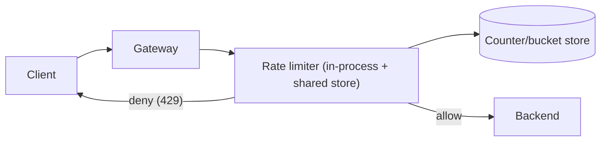
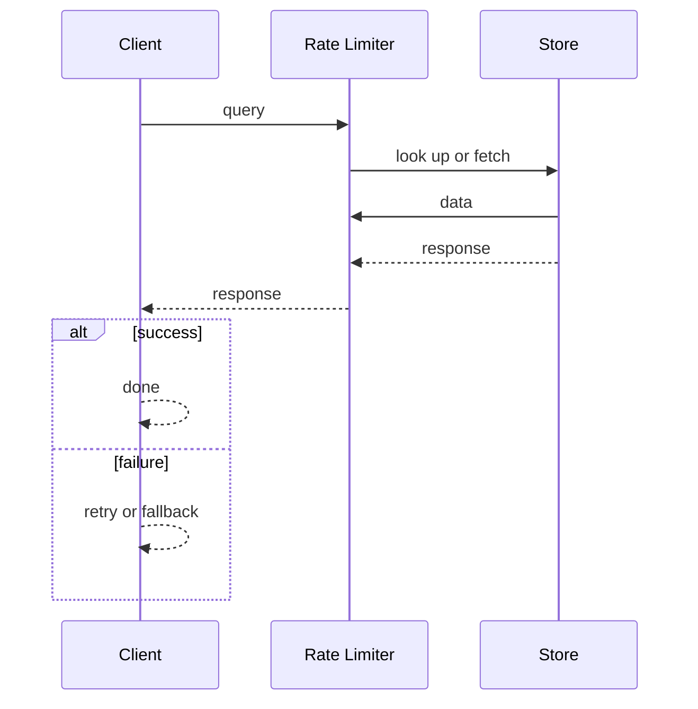
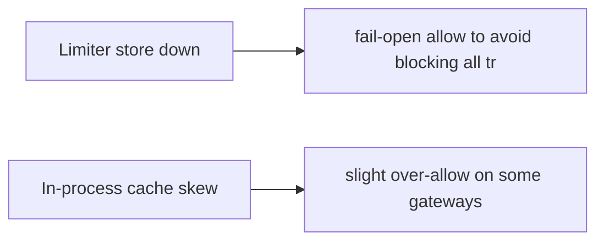

# Case Study: Rate Limiter

> **Tier:** beginner · **Status:** complete · Original numbers and diagrams.

## 1. Problem statement
Protect a service from abuse/overload by limiting request rate per client/tenant. A
foundational component reused across gateways. (See `examples/rate_limiter.py`.)

## 2. Scope
**In (v1):** per-client fixed-window and token-bucket limiting at the edge. **Out:**
distributed global counters, adaptive/AI-based limiting, per-endpoint dynamic limits.

## 3. Functional requirements
- Limit requests per client key to R per second. - Return 429 with Retry-After when
exceeded. - Allow a burst up to bucket capacity. - Report current usage.

## 4. Non-functional requirements
- Decision p99 < 1 ms (in the hot path). - Availability 99.95% (fail-open if limiter down
to avoid blocking all traffic). - Highly read/write symmetric (every request is a check
+ update).

## 5. Explicit assumptions
1. 100k clients; default 100 req/s, burst 200. [assumption] 2. 50k RPS through the gateway.
[assumption] 3. Limits per (client, endpoint). [constraint]

## 6. Traffic estimation
- 50k RPS, each = 1 limiter check+update = 100k ops/s to the limiter store. Hot keys: the
busiest tenants dominate.

## 7. Storage estimation
- Per-key state tiny (counters/timestamps). Millions of keys × ~50 B = MBs; in-memory.

## 8. Bandwidth estimation
- Negligible; limiter calls are local/in-cluster, sub-KB.

## 9. API design
| CHECK | (client, endpoint) | — | ALLOW/DENY, retry-after | The gateway calls the limiter
inline before forwarding.

## 10. Data model
Token bucket per key: `(tokens, last_refill_ts)`. In-memory store (Redis-like) keyed by
(client,endpoint).

## 11. High-level architecture

## 12. Request flow
Gateway extracts (client, endpoint) → limiter checks/refills the bucket → if tokens ≥ 1,
consume and allow; else return 429 with Retry-After.

## 13. Component responsibilities
Gateway: enforce the limit decision. Limiter: bucket logic. Store: shared counters across
gateway replicas.

## 14. Database selection
In-memory KV (Redis) for shared counters across replicas; in-process cache for the hottest
keys to cut latency. Rejected: SQL (too slow per request).

## 15. Caching strategy
In-process token-bucket approximation for hot keys; sync to shared store periodically. A
client's bucket pinned to a gateway instance reduces shared-store load (sticky-ish).

## 16. Partitioning strategy
Shard the counter store by key hash; hot tenants get dedicated/partitioned capacity. A
single hot key is a counter, not data — mitigate by partitioning counters per client.

## 17. Replication strategy
Counters are ephemeral state; replicate for availability, accept that a failover resets a
bucket (a brief over-allow) — preferable to blocking traffic.

## 18. Consistency model
Approximate: a per-second limit may be slightly exceeded under replica failover or
in-process caching. Exactness traded for latency and availability; documented.

## 19. Failure scenarios
Limiter store down → fail-open (allow) to avoid blocking all traffic; degrade protection,
not availability. In-process cache skew → slight over-allow on some gateways.

## 20. Reliability strategy
SLI: 429 correctness, p99 latency; SLO 99.95%. Fail-open policy. Chaos: kill the store,
assert traffic flows (over-allowing, not blocking).

## 21. Security considerations
Fail-open vs fail-closed: for a *protection* limiter, fail-open is safer for availability
but risks overload — combine with downstream load shedding (Level 6). Don't trust a
client-supplied key.

## 22. Observability strategy
Track allow/deny ratio, 429 rate per client, limiter latency; alert on deny spikes
(possible abuse or attack) and on limiter-store latency.

## 23. Cost considerations
In-memory store; cost ~ RAM. Cost is small; the value is protecting everything downstream.

## 24. Scaling stages
Stage 1: in-process buckets per gateway. → Stage 2: shared store for cluster-wide limits.
→ Stage 3: per-tenant dedicated capacity for hot tenants. → Stage 4: adaptive limits from
observed load.

## 25. Trade-offs
Exact vs approximate: approximate is far cheaper and fits a protection limiter. Fail-open
vs fail-closed: fail-open preserves availability. Shared store vs in-process: shared for
cluster-wide, in-process for latency.

## 26. Alternative designs
Fixed-window (simple, boundary bursts); token bucket (chosen: burst-friendly). Global
exact counter via consensus (rejected: too slow for the hot path).

## 27. Interview discussion points
Clarify limits, burst, distributed vs per-instance, fail-open policy. Surface the
latency/availability-vs-exactness trade.

## 28. Original Mermaid diagrams

Standalone sources under `diagrams/case-studies/rate-limiter/`: `context.mmd`, `request-sequence.mmd`, `failure-flow.mmd`, `scaling-evolution.mmd`. Request sequence and failure flow:

## 29. Further reading
Resilience patterns: Level 5; load shedding: Level 6; rate_limiter.py.

## 30. Practical exercises
1. Add a sliding-window limiter; what changes in storage? 2. Design a global cluster-wide
limit. 3. Add adaptive limits based on backend latency. 4. What if fail-open caused an
overload? Combine with what? 5. Handle a single client doing 80% of traffic.

---
Previous: [Paste service](paste-service.md) · Next: [Web crawler](web-crawler.md)

