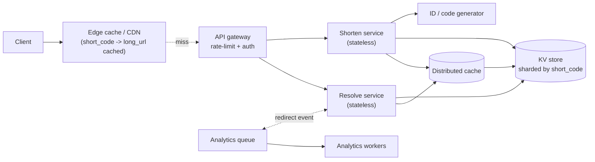
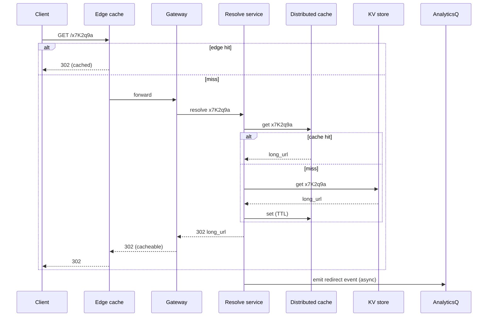
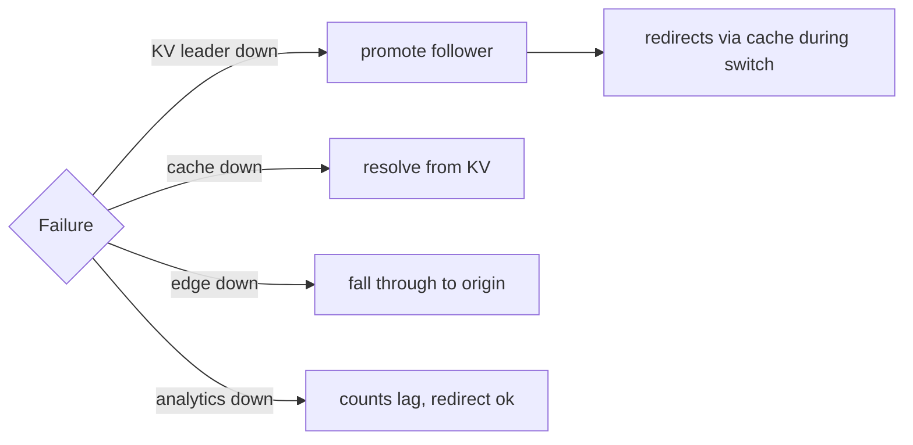
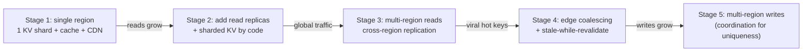

# Case Study: URL Shortener

> **Tier:** beginner · **Status:** draft
> This is the canonical beginner case study demonstrating the [30-section template](../../templates/CASE-STUDY-TEMPLATE.md). All numbers and diagrams are original.

## 1. Problem statement
Users want to share long, ugly URLs in places with character limits (SMS, printed material,
social posts). We need a service that takes a long URL and returns a short one, then
redirects anyone who visits the short one to the original — fast, reliably, and at internet
scale.

## 2. Scope
**In scope (v1):**
- Create a short code from a long URL.
- Redirect a short code to the long URL.
- Custom alias (optional), basic analytics (count of redirects).

**Out of scope (v1):**
- User accounts, link dashboards, expiry/scheduling, A/B redirect logic, spam/abuse
  detection beyond a basic rate limit. These are noted as scaling stages.

## 3. Functional requirements
- The system **shall** accept a long URL and return a unique short URL.
- The system **shall** redirect a request to a short URL to its original long URL.
- The system **shall** return HTTP 404 for an unknown short code.
- The system **shall** support an optional user-chosen alias if available.
- The system **shall** record a redirect-count per short code.

## 4. Non-functional requirements
- Availability 99.9% (redirects are the user-visible, revenue-adjacent path).
- Redirect latency p99 < 100 ms (ideally served from edge cache, < 50 ms).
- Durability: a shortened link must keep resolving for its lifetime (default: forever).
- Throughput: read-heavy by a huge margin; reads dominate writes ~100:1.
- Hot links can spike millions of redirects in minutes (viral).

## 5. Explicit assumptions
1. 50 million new short URLs created/month → ~20/s average writes, ~200/s peak. [assumption]
2. 10x redirects per URL on average; viral links skew the distribution. [assumption]
3. Short code length = 7 base62 characters → 62^7 ≈ 3.5 trillion codes (plenty). [assumption]
4. Retention: links never expire unless explicitly deleted. [constraint]
5. Each stored record ~500 bytes (long URL + metadata). [assumption]

## 6. Traffic estimation
- Writes: 50M/month / 2.59M s ≈ **19 writes/s avg**, ~**190/s peak** (10×).
- Reads: assume 100 redirects per link → 5B/month ≈ **1,900 reads/s avg**, ~**19,000/s peak**.
- Read:write ratio ≈ **100:1** — overwhelmingly read-heavy; design around the read path.

## 7. Storage estimation
- New rows/month = 50M × 500 B ≈ 25 GB/month.
- Lifetime (assume 5 years) ≈ 25 × 60 ≈ **1.5 TB** of mapping data + indexes.
- With a B-tree index on the short code (~+30% overhead): ~2 TB. Modest; a single
  well-tuned DB shard can hold it, but we shard for headroom and writes.

## 8. Bandwidth estimation
- Write bandwidth = 19/s × 500 B ≈ 10 KB/s (trivial).
- Read bandwidth = 1,900/s × ~500 B response ≈ ~1 MB/s avg, ~10 MB/s peak.
- Redirect responses are tiny (302 + Location header); bandwidth is not the binding
  resource — read QPS and hot-key handling are.

## 9. API design
| Method | Path | Request | Response | Auth | Idempotent |
|--------|------|---------|----------|------|:----------:|
| POST | /v1/shorten | `{ "long_url": "https://...", "alias"? }` | `{ "short_url": "https://s.co/x7K2q9a" }` | API key | yes (idempotency-key) |
| GET | /:code | — | 302 redirect to long URL (404 if unknown) | none | n/a |
| GET | /v1/stats/:code | — | `{ "redirects": 12345 }` | API key | yes |

`POST /shorten` is idempotent via a client `Idempotency-Key` so a retry doesn't create a
duplicate code for the same long URL.

## 10. Data model
Two logical entities:

```
url_mappings
  short_code  : CHAR(7)   PRIMARY KEY
  long_url    : TEXT
  created_at  : TIMESTAMP
  alias       : BOOL
  redirects   : BIGINT     (denormalized counter; see caching)

redirect_events   (async, for analytics; optional in v1)
  short_code  : CHAR(7)
  ts         : TIMESTAMP
  ...
```
Storage: a key-value-friendly store keyed by `short_code` (the hot access is a single
key→value lookup). A relational DB with an index on `short_code` works; a KV/document store
scales further. We pick a sharded key-value store with the short code as the partition key.

## 11. High-level architecture



## 12. Request flow
**Shorten (write):**
1. Client `POST /shorten` with long URL + idempotency key.
2. Gateway authenticates (API key) and rate-limits.
3. Shorten service checks idempotency; if seen, returns the existing code.
4. Generates a unique 7-char base62 code (see §13).
5. Writes `{code -> long_url}` to the KV store and the cache.
6. Returns the short URL.

**Resolve (read):**
1. Client `GET /:code`; CDN checks edge cache for `code`.
2. On hit, returns 302 immediately (no origin traffic).
3. On miss, gateway → resolve service → distributed cache → KV store.
4. On KV hit, populate cache (and CDN), return 302.
5. Asynchronously emit a redirect event to the analytics queue.



## 13. Component responsibilities
- **Edge cache/CDN**: serve the common redirect from near the user; the highest-leverage
  component for latency and origin load.
- **API gateway**: auth, rate limiting, routing.
- **Shorten service (stateless)**: create codes, enforce idempotency, write mappings.
- **Resolve service (stateless)**: read mappings, populate caches, emit analytics events.
- **Code generator**: produce unique 7-char base62 codes.
- **KV store (sharded)**: durable source of truth, partitioned by short code.
- **Distributed cache**: second-tier cache behind the edge for misses.
- **Analytics queue + workers**: decouple counting from the redirect path.

## 14. Database selection
**Chosen: sharded key-value/document store** (e.g., a managed KV like DynamoDB-style, or
sharded PostgreSQL with an index on `short_code`).
- The access pattern is a single `code -> long_url` lookup and a single-key write. This is
  the textbook KV workload.
- A relational DB is a fine alternative for v1 (small data, ~2 TB) and gives SQL tooling;
  rejected at extreme scale only because sharding a KV pattern is simpler than sharding SQL.
- A pure in-memory store is rejected as the source of truth (durability).

## 15. Caching strategy
- **Edge (CDN)**: cache `code -> 302` for a TTL (e.g., 10 min). Handles the vast majority of
  reads and survives origin outages (stale redirects are acceptable for unchanged links).
- **Distributed cache (Redis)**: cache `code -> long_url` for a longer TTL (e.g., 1 h) with
  event invalidation on delete/alias change.
- **Stampede protection**: for a viral link, the edge + request coalescing prevent a
  thundering herd on the KV store. Cold, popular keys use `stale-while-revalidate`.

## 16. Partitioning strategy
Partition (shard) the KV store by `short_code` (hash). With ~19,000 reads/s peak and a
conservative 5,000 reads/s per shard, 2–3 read shards suffice at v1; we provision more for
headroom and growth (see sharding calculator). Vnodes + consistent hashing let us add shards
without rehashing the whole keyspace. Hot viral links are handled by the edge cache, not by
adding shards (sharding doesn't fix a single hot key).

## 17. Replication strategy
- **Leader-follower, async**: each shard has 1 leader (writes) + 2 followers (reads). Reads
  are read-heavy, so followers absorb read traffic; async replication trades a small lag for
  throughput. Writes are low-rate (~190/s peak), so leader capacity is not the bottleneck.
- **Failover**: a follower is promoted on leader failure; redirects keep working from cache
  during promotion (graceful degradation).

## 18. Consistency model
- **Writes**: strongly consistent on the leader (a created code is immediately resolvable via
  the leader); cross-replica reads are eventually consistent (sub-second lag).
- **Reads (resolve)**: eventual consistency is fine — a freshly created link may take a
  moment to be visible from a follower, but the create path can read-your-writes by going to
  the leader or by returning the code directly to the creator (no redirect needed then).
- **Deletes**: invalidate caches on delete; stale 302s served from the edge for the TTL
  duration are acceptable for v1 (note this as a product decision).

## 19. Failure scenarios
| Failure | System response |
|---------|------------------|
| A KV shard leader down | Promote a follower; redirects continue from edge/cache. |
| Edge cache unavailable | Traffic falls through to gateway→cache→KV; higher latency, no outage. |
| Distributed cache down | Resolve goes to KV directly; latency rises, still functional. |
| Analytics queue down | Redirects unaffected; counts lag and recover on replay. |
| Network partition between regions | Each region serves its own cached codes; writes route to the primary region. |



## 20. Reliability strategy
- SLI: redirect success rate; SLO 99.9% availability, p99 < 100 ms.
- Error budget: ~43 min/month of allowed unavailability; spend it on deploys, not incidents.
- Redundancy: stateless services RF≥3 across zones; KV shards RF=3.
- Backpressure: resolve service caps concurrency and sheds load above target; queue-based
  load leveling for analytics.
- Chaos test: kill a KV leader and a cache node; assert redirects continue via cache.

## 21. Security considerations
- Auth on `POST /shorten` (API key) to prevent abuse; anonymous reads.
- Rate limiting per IP/API key on shorten (abuse/spam vectors).
- Input validation: long URL must be a valid, resolvable URL; reject non-http(s) schemes to
  block `javascript:` and `file:` redirect abuse.
- Abuse: blacklist known-malicious long URLs; allow listing/blocking of codes (out of v1).
- Audit: log shorten requests with API key for incident forensics.

## 22. Observability strategy
- Golden signals on resolve: request rate, latency (p50/p95/p99), errors (404 vs 5xx),
  saturation (cache hit rate, shard load).
- Tracing with correlation IDs across gateway → service → cache → DB.
- Alerts: cache hit rate drop, p99 latency, 5xx rate, shard CPU, replication lag.
- Dashboard: redirects/s, edge hit ratio, KV read/s, top redirect codes (for hot-key watch).

## 23. Cost considerations
- Dominant cost: egress + KV reads at high QPS; the edge cache cuts both drastically.
- Storage (~2 TB) is minor relative to request cost.
- Archive nothing — links must keep resolving; instead keep all data on standard storage.
- Optimize by maximizing edge hit ratio (the single biggest cost lever).

## 24. Scaling stages



- Stage 1: single region, 1 KV shard, cache, CDN. Handles v1 easily.
- Stage 2: shard KV when reads exceed one shard; add read replicas.
- Stage 3: multi-region read replicas + cross-region replication for global latency.
- Stage 4: edge coalescing and stale-while-revalidate for viral keys.
- Stage 5: multi-region writes require unique-code coordination (see §25 trade-offs).

## 25. Trade-offs
| Decision | Chosen | Rejected | Reason |
|----------|--------|----------|--------|
| Code generation | generated 7-char base62 | hash(long_url) | hash collisions and non-unique; base62 with a counter is unique and short |
| Source of truth | durable KV store | pure cache | durability requirement (links must resolve forever) |
| Reads | async-replica, eventually consistent | strong consistency | read-heavy; strong reads cost throughput and aren't needed for redirects |
| Caching | edge 302 caching | no edge | edge absorbs the dominant read load; without it the KV store melts |
| Analytics | async via queue | synchronous counting | keep the redirect path minimal and resilient |

## 26. Alternative designs
- **Hash-based codes (MD5 of URL, truncated)**: shorter path but risks collisions and
  reveals nothing meaningful; collisions force a retry loop. Rejected for uniqueness risk.
- **Reserved counter service (Snowflake-style)** as the code generator: gives monotonic,
  unique IDs encoded to base62. Viable and our choice at scale; for v1 a single in-process
  counter with a node-id prefix is simpler until writes grow.
- **Pure CDN-only (no KV)**: every code's long URL embedded at the edge. Rejected: edge
  cannot durably store billions of mappings or handle updates/deletes as the source of truth.

## 27. Interview discussion points
- Clarify: do links expire? custom aliases? analytics? abuse handling? These change scope.
- The key ambiguity is read:write ratio and viral behavior; surface it and design the read
  path and hot-key handling first.
- Depth cue: a strong candidate discusses idempotency on shorten, code-uniqueness under
  concurrency, and the stale-302 trade-off on delete.
- Watch for: jumping to a database before noting the read-heavy, cache-dominated nature.

## 28. Original Mermaid diagrams
Source files under `diagrams/case-studies/url-shortener/`:
- `context.mmd` (§11 high-level)
- `resolve-sequence.mmd` (§12)
- `failure-flow.mmd` (§19)
- `scaling-evolution.mmd` (§24)
Key diagrams are embedded inline above.

## 29. Further reading
- Consistent hashing: S-CHASH · ID generation/Snowflake: S-SNOWFLAKE · UUID: S-UUID
- CDN/caching: see `docs/02-core-components/03-cdn-caching.md`
- Sharding calculator: `calculations/sharding-calculator.md`

## 30. Practical exercises
1. Re-estimate at 10× scale (500M links/month). What changes — shards, cache, egress?
2. Add a requirement that links expire after 30 days. How does caching/storage change?
3. Design the failover test that proves redirects survive a KV leader loss.
4. A single link goes viral (1M redirects/min). Walk through every layer protecting the
   origin and identify where it could still break.
5. Add custom aliases: how do you guarantee uniqueness and prevent alias squatting?

---
Previous: (start of case studies) · Next: (next beginner case study)
