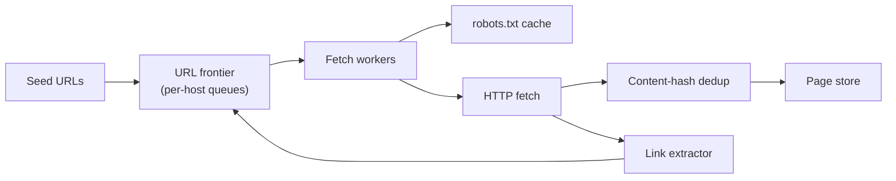
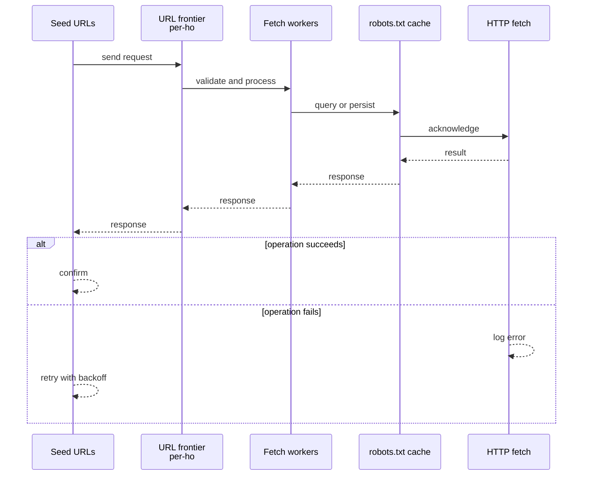
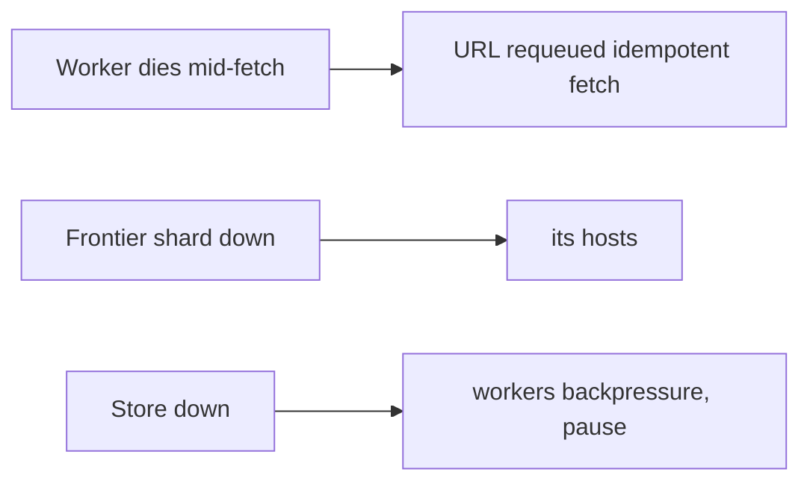
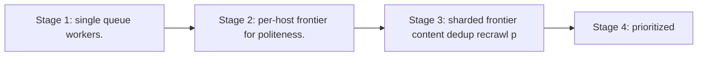

# Case Study: Web Crawler

> **Tier:** beginner · **Status:** complete · Original numbers and diagrams.

## 1. Problem statement
Continuously fetch web pages at scale, extract links, and store content for indexing — a
distributed worker system with politeness and dedup constraints.

## 2. Scope
**In (v1):** URL frontier (queue), fetch workers, dedup, robots.txt respect, content
storage. **Out:** ranking/indexing, JavaScript rendering, sitemaps.

## 3. Functional requirements
- Crawl new and updated URLs.
- Respect robots.txt and per-host rate limits.
- Dedup URLs
and content. - Store raw + extracted links.

## 4. Non-functional requirements
- Politeness: ≤ N req/s per host.
- Throughput: millions of pages/hour.
- Availability
99.9% (background; not user-facing).

## 5. Explicit assumptions
1. 5B URLs in scope, recrawl weekly. [assumption] 2. Avg page 500 KB; ~50 links/page.
[assumption] 3. Politeness: 1 req/s per host. [constraint]

## 6. Traffic estimation
- 5B URLs / week ≈ 8,300 URLs/s. With politeness (1/s/host), need breadth across hosts.

## 7. Storage estimation
- 5B × 500 KB raw is huge (PB); store compressed/raw selectively, dedup by content hash. URL
set ~5B × ~80 B ≈ 400 GB.

## 8. Bandwidth estimation
- 8,300 pages/s × 500 KB ≈ 4 GB/s egress from the web. Significant; throttle.

## 9. API design
Internal: enqueue URL; fetch worker pulls host-queue; store page; emit extracted links.

## 10. Data model
`url_set(url PK, status, last_crawled, content_hash)`; `pages(url, html, ts)`;
`host_queues(host, queue of urls)`. A URL→content-hash for dedup.

## 11. High-level architecture

## 12. Request flow
Frontier dequeues a URL from a host queue (respecting per-host rate) → fetcher checks
robots → fetches → dedup by hash → stores page → extracts links → adds new URLs to frontier.

## 13. Component responsibilities
Frontier: per-host queues + politeness scheduling. Fetchers: HTTP + robots. Dedup:
content-hash. Extractor: links. Store: raw pages + URL set.

## 14. Database selection
Page store: object storage (large blobs) + a KV for the URL set. Per-host queues: a
sharded queue system. Rejected: a single queue (loses per-host politeness).

## 15. Caching strategy
robots.txt cached per host (rarely changes). Recently-fetched content cached to avoid
refetch during a recrawl window.

## 16. Partitioning strategy
Frontier partitioned by **host** (so politeness is per-host and co-located). A popular host
doesn't stall others. URL set sharded by URL hash.

## 17. Replication strategy
URL set and page store replicated for durability; frontier queues replicated so a worker
loss requeues in-flight URLs.

## 18. Consistency model
URL set: dedup needs "seen?" check (eventual acceptable — a rare double-crawl is fine).
Frontier: per-host ordering for politeness.

## 19. Failure scenarios
Worker dies mid-fetch → URL requeued (idempotent fetch). Frontier shard down → its hosts
pause (others continue). Store down → workers backpressure, pause.

## 20. Reliability strategy
At-least-once fetch with idempotent store (content-hash dedup). Backpressure when store
slow. Chaos: kill workers, assert URLs requeue, no loss.

## 21. Security considerations
Respect robots and ToS; throttle to avoid harming sites; sanitize fetched content; isolate
fetch workers (untrusted remote content).

## 22. Observability strategy
Pages/s, politeness violations, dedup ratio, fetch errors (4xx/5xx), per-host queue depth,
recrawl freshness.

## 23. Cost considerations
Egress from the web + storage dominate. Store selectively; compress; dedup aggressively;
recrawl by priority/freshness, not uniformly.

## 24. Scaling stages
Stage 1: single queue + workers. → Stage 2: per-host frontier for politeness. → Stage 3:
sharded frontier + content dedup + recrawl prioritization. → Stage 4: prioritized
freshness, JS rendering.

## 25. Trade-offs
Politeness vs throughput: per-host rate caps throughput for popular hosts. Store-all vs
selective: PB cost vs completeness. Recrawl-all vs prioritized: cost vs freshness.

## 26. Alternative designs
Single global queue (loses per-host politeness → can hammer hosts). Store every page raw
(PB; rejected for selective + dedup).

## 27. Interview discussion points
Clarify scale, politeness, recrawl policy, dedup. Surface per-host frontier and the
politeness-vs-throughput trade.

## 28. Original Mermaid diagrams
Standalone sources under `diagrams/case-studies/web-crawler/`: `context.mmd`, `request-sequence.mmd`, `failure-flow.mmd`, `scaling-evolution.mmd`. The diagrams are embedded in their respective sections: architecture in section 11, request flow in section 12, failure scenarios in section 19, and scaling stages in section 24.

## 29. Further reading
Queues: Level 2; dedup/hashing: Level 4; object storage: Level 2. Sources: `S-CHASH` `S-DYNAMO`.

## 30. Practical exercises
1. Add recrawl prioritization by page-change rate. 2. How to avoid crawling spam/traps
(infinite link farms)? 3. Add content-change detection (diff). 4. Scale to 1B pages/hour;
what's the politeness implication? 5. Add JS rendering for SPAs.

---
Previous: [Rate limiter](rate-limiter.md) · Next: [Notification platform](notification-platform.md)

