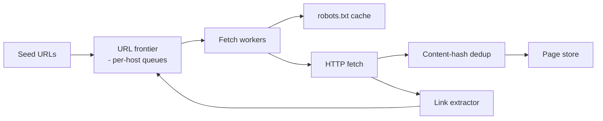
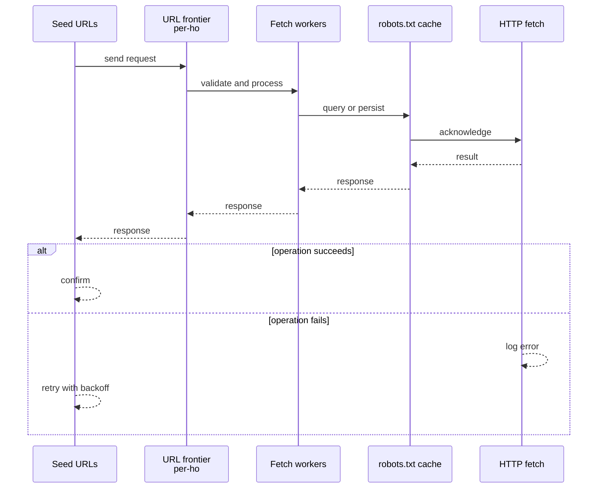
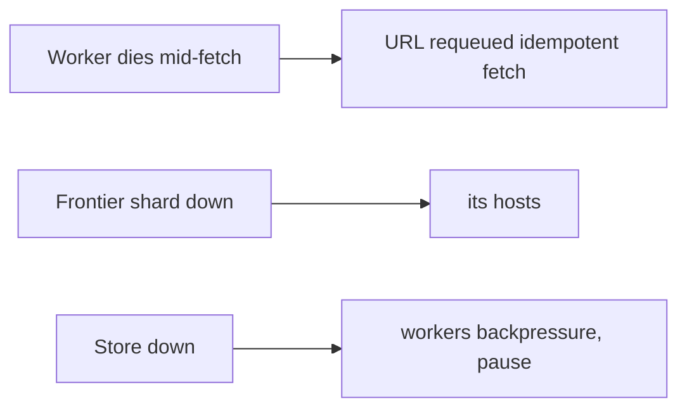
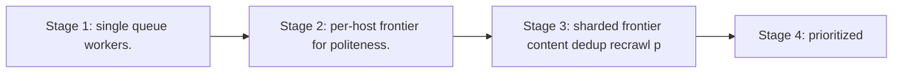

# Case Study: Web Crawler

> **Tier:** beginner · **Status:** complete · Original numbers and diagrams.

## 1. Problem statement
Continuously fetch web pages at scale, extract links, and store content for indexing — a
distributed worker system with politeness and dedup constraints. This is a beginner-tier system design challenge because it must handle high-throughput data ingestion while ensuring no single point of failure. The design must be production-grade: observable, debuggable, reversible, and able to survive component failures without data loss or cascading outages.

## 2. Scope
**In (v1):** URL frontier (queue), fetch workers, dedup, robots.txt respect, content
storage. **Out:** ranking/indexing, JavaScript rendering, sitemaps.

For Web Crawler, these boundaries keep the first version focused on the core user value. Adding more features would dilute the design and delay shipping. Each excluded item is a scaling stage — a candidate for the next iteration once the baseline is proven.

## 3. Functional requirements
- Crawl new and updated URLs.
- Respect robots.txt and per-host rate limits.
- Dedup URLs
and content. - Store raw + extracted links.

For Web Crawler, these requirements drive specific architectural decisions: the read-write ratio determines the caching strategy, the durability target sets the replication mode, and the idempotency requirement shapes the API contract.

## 4. Non-functional requirements
- Politeness: ≤ N req/s per host.
- Throughput: millions of pages/hour.
- Availability
99.9% (background; not user-facing).

For Web Crawler, each non-functional target constrains a specific component: the latency SLO bounds the number of synchronous hops, the availability target forces redundancy across availability zones, and the cost ceiling limits the replication factor and storage tier.

## 5. Explicit assumptions
1. 5B URLs in scope, recrawl weekly. [assumption] 2. Avg page 500 KB; ~50 links/page.
[assumption] 3. Politeness: 1 req/s per host. [constraint]

For Web Crawler, if these assumptions are off by an order of magnitude, the architecture must adapt: 10x traffic may require earlier sharding, a different read-write ratio changes the caching strategy, and a higher peak multiplier demands more headroom.

## 6. Traffic estimation
- 5B URLs / week ≈ 8,300 URLs/s. With politeness (1/s/host), need breadth across hosts.

To derive the request rate: divide the daily volume by 86,400 seconds to get the average rate, then multiply by 5-10x for peak. The read-to-write ratio determines whether the system is cache-dominated (read-heavy) or write-path-dominated (write-heavy). For Web Crawler, this ratio shapes the entire storage and replication strategy.

## 7. Storage estimation
- 5B × 500 KB raw is huge (PB); store compressed/raw selectively, dedup by content hash. URL
set ~5B × ~80 B ≈ 400 GB.

For Web Crawler, storage growth is projected from the daily write volume and retention policy. Index overhead and compression factors are accounted for in the total.

## 8. Bandwidth estimation
- 8,300 pages/s × 500 KB ≈ 4 GB/s egress from the web. Significant; throttle.

Bandwidth is request rate multiplied by average payload size for ingress, and response rate multiplied by response size for egress. CDN and edge caching reduce origin egress. Compression reduces bandwidth by 50-80 percent where applicable. For Web Crawler, bandwidth may or may not be the binding constraint — compare it against compute and storage to find out.

## 9. API design
Internal: enqueue URL; fetch worker pulls host-queue; store page; emit extracted links.

## 10. Data model
`url_set(url PK, status, last_crawled, content_hash)`; `pages(url, html, ts)`;
`host_queues(host, queue of urls)`. A URL→content-hash for dedup.

For Web Crawler, the data model follows the access pattern. The primary lookup determines the partition key; secondary lookups determine indexes. Denormalization is used selectively on hot read paths.

## 11. High-level architecture

## 12. Request flow
Frontier dequeues a URL from a host queue (respecting per-host rate) → fetcher checks
robots → fetches → dedup by hash → stores page → extracts links → adds new URLs to frontier.

## 13. Component responsibilities
Frontier: per-host queues + politeness scheduling. Fetchers: HTTP + robots. Dedup:
content-hash. Extractor: links. Store: raw pages + URL set.

For Web Crawler, each component has one job. The gateway authenticates and routes. Services are stateless and scale horizontally. The data tier is the stateful core that scales by sharding.

## 14. Database selection
Page store: object storage (large blobs) + a KV for the URL set. Per-host queues: a
sharded queue system. Rejected: a single queue (loses per-host politeness).

For Web Crawler, the database was chosen by access pattern, not familiarity. The rejected alternatives were wrong for this workload, not bad in general.

## 15. Caching strategy
robots.txt cached per host (rarely changes). Recently-fetched content cached to avoid
refetch during a recrawl window.

For Web Crawler, the cache strategy matches the staleness tolerance. Cache-aside for most data, write-through where read-after-write matters, stampede protection on hot keys.

## 16. Partitioning strategy
Frontier partitioned by **host** (so politeness is per-host and co-located). A popular host
doesn't stall others. URL set sharded by URL hash.

For Web Crawler, the partition key balances query locality with even load distribution. Sharding strategy matters because a poor key creates hot spots under real traffic patterns.

## 17. Replication strategy
URL set and page store replicated for durability; frontier queues replicated so a worker
loss requeues in-flight URLs.

For Web Crawler, replication mode is split: synchronous where durability is critical, asynchronous elsewhere for throughput. RF=3 tolerates one failure. Failover is tested regularly.

## 18. Consistency model
URL set: dedup needs "seen?" check (eventual acceptable — a rare double-crawl is fine).
Frontier: per-host ordering for politeness.

For Web Crawler, the consistency level is the weakest users accept. Read-your-writes is provided where needed. Eventual consistency is bounded and monitored, not unbounded and silent.

## 19. Failure scenarios
Worker dies mid-fetch → URL requeued (idempotent fetch). Frontier shard down → its hosts
pause (others continue). Store down → workers backpressure, pause.

## 20. Reliability strategy
At-least-once fetch with idempotent store (content-hash dedup). Backpressure when store
slow. Chaos: kill workers, assert URLs requeue, no loss.

For Web Crawler, the SLO makes reliability measurable. The error budget balances feature velocity with stability. Chaos testing validates that resilience claims hold under real failures.

## 21. Security considerations
Respect robots and ToS; throttle to avoid harming sites; sanitize fetched content; isolate
fetch workers (untrusted remote content).

For Web Crawler, security layers TLS, encryption at rest, RBAC, PII redaction, and audit. The policy gateway is fail-closed for AI-augmented operations.

## 22. Observability strategy
Pages/s, politeness violations, dedup ratio, fetch errors (4xx/5xx), per-host queue depth,
recrawl freshness.

For Web Crawler, observability combines logs, metrics, and traces with correlation IDs. Golden signals drive the first dashboard. Alerts fire on burn rate, not raw thresholds.

## 23. Cost considerations
Egress from the web + storage dominate. Store selectively; compress; dedup aggressively;
recrawl by priority/freshness, not uniformly.

For Web Crawler, cost is driven by the binding resource. Caching, tiering, batching, and right-sizing are the levers. Cost per request is tracked and alerted on.

## 24. Scaling stages
Stage 1: single queue + workers. → Stage 2: per-host frontier for politeness. → Stage 3:
sharded frontier + content dedup + recrawl prioritization. → Stage 4: prioritized
freshness, JS rendering.

## 25. Trade-offs
Politeness vs throughput: per-host rate caps throughput for popular hosts. Store-all vs
selective: PB cost vs completeness. Recrawl-all vs prioritized: cost vs freshness.

For Web Crawler, each trade-off lists what was chosen, what was rejected, and why. This makes the design defensible in review — every decision has documented reasoning.

## 26. Alternative designs
Single global queue (loses per-host politeness → can hammer hosts). Store every page raw
(PB; rejected for selective + dedup).

For Web Crawler, the alternatives are real architectures that work under different constraints. They were rejected for this workload's specific requirements, not because they are bad designs.

## 27. Interview discussion points
Clarify scale, politeness, recrawl policy, dedup. Surface per-host frontier and the
politeness-vs-throughput trade.

For Web Crawler in an interview: clarify scope first, surface the read-write ratio, design the hot path deeply, discuss failures, and offer an alternative. Weak candidates skip failure modes.

## 28. Original Mermaid diagrams
Standalone sources under `diagrams/case-studies/web-crawler/`: `context.mmd`, `request-sequence.mmd`, `failure-flow.mmd`, `scaling-evolution.mmd`. The diagrams are embedded in their respective sections: architecture in section 11, request flow in section 12, failure scenarios in section 19, and scaling stages in section 24.

## 29. Further reading
Queues: Level 2; dedup/hashing: Level 4; object storage: Level 2. Sources: `S-CHASH` `S-DYNAMO`.

## 30. Practical exercises
1. Add recrawl prioritization by page-change rate. 2. How to avoid crawling spam/traps
(infinite link farms)? 3. Add content-change detection (diff). 4. Scale to 1B pages/hour;
what's the politeness implication? 5. Add JS rendering for SPAs.

---
Previous: [Rate limiter](rate-limiter.md) · Next: [Notification platform](notification-platform.md)

