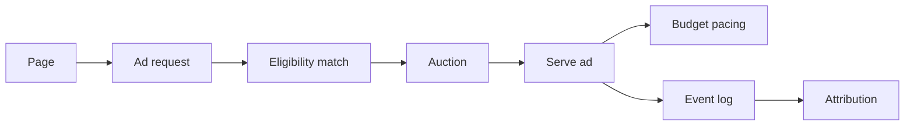
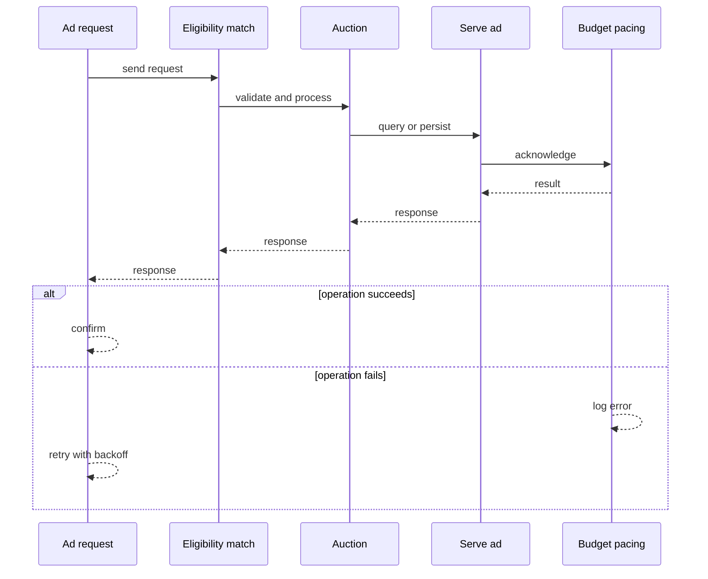
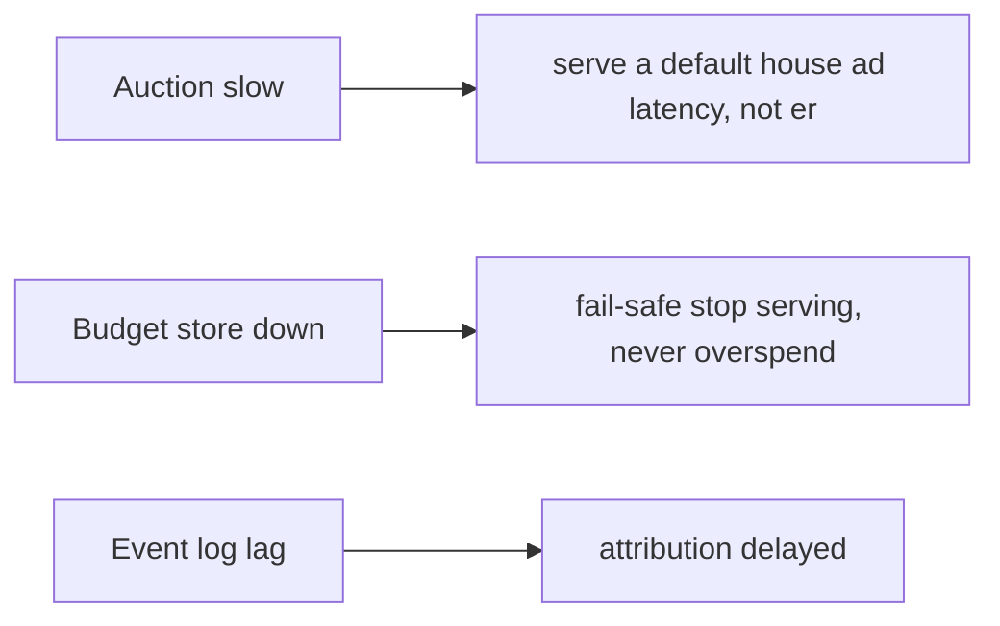
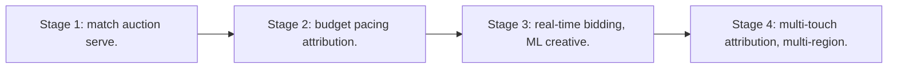

# Case Study: Advertisement Platform

> **Tier:** extreme · **Status:** complete · Original numbers and diagrams.

## 1. Problem statement
Match advertisers' campaigns to eligible users and serve an ad in milliseconds, with budget pacing and attribution — a latency-critical auction + serving system. This is a extreme-tier system design challenge because it must handle high availability under peak load while ensuring no single point of failure. The design must be production-grade: observable, debuggable, reversible, and able to survive component failures without data loss or cascading outages.

## 2. Scope
In (v1): campaign targeting, real-time auction/serving, budget pacing, click attribution. Out: ML creative, multi-touch attribution (stage).

For Advertisement Platform, these boundaries keep the first version focused on the core user value. Adding more features would dilute the design and delay shipping. Each excluded item is a scaling stage — a candidate for the next iteration once the baseline is proven.

## 3. Functional requirements
- Match a request to eligible campaigns.
- Run an auction; serve the winning ad.
- Pace budgets.
- Attribute clicks/conversions.

For Advertisement Platform, these requirements drive specific architectural decisions: the read-write ratio determines the caching strategy, the durability target sets the replication mode, and the idempotency requirement shapes the API contract.

## 4. Non-functional requirements
- Serve p99 < 100 ms (in the page-load path).
- Budget never overspent.
- Availability 99.9%.

For Advertisement Platform, each non-functional target constrains a specific component: the latency SLO bounds the number of synchronous hops, the availability target forces redundancy across availability zones, and the cost ceiling limits the replication factor and storage tier.

## 5. Explicit assumptions
1. 1M ad requests/s. [assumption] 2. Targeting by user attributes + context. [assumption] 3. Budgets paced daily. [constraint]

For Advertisement Platform, if these assumptions are off by an order of magnitude, the architecture must adapt: 10x traffic may require earlier sharding, a different read-write ratio changes the caching strategy, and a higher peak multiplier demands more headroom.

## 6. Traffic estimation
1M ad requests/s; each must be matched + auctioned + served in the page-load path.

To derive the request rate: divide the daily volume by 86,400 seconds to get the average rate, then multiply by 5-10x for peak. The read-to-write ratio determines whether the system is cache-dominated (read-heavy) or write-path-dominated (write-heavy). For Advertisement Platform, this ratio shapes the entire storage and replication strategy.

## 7. Storage estimation
Campaigns (targeting, creative, budget); user attributes; events (impressions/clicks). Petabytes of event logs.

For Advertisement Platform, storage growth is projected from the daily write volume and retention policy. Index overhead and compression factors are accounted for in the total.

## 8. Bandwidth estimation
Ad creatives served (images/video) — egress significant; CDN for creatives.

Bandwidth is request rate multiplied by average payload size for ingress, and response rate multiplied by response size for egress. CDN and edge caching reduce origin egress. Compression reduces bandwidth by 50-80 percent where applicable. For Advertisement Platform, bandwidth may or may not be the binding constraint — compare it against compute and storage to find out.

## 9. API design
| Method | Path | Request | Response |
|--------|------|---------|----------|
| GET /ad | user, context | ad creative |
| POST |/event | impression/click | ack

## 10. Data model
campaigns(id, targeting, creative, budget, pace); users(id, attributes); events(id, type, campaign, user, ts).

For Advertisement Platform, the data model follows the access pattern. The primary lookup determines the partition key; secondary lookups determine indexes. Denormalization is used selectively on hot read paths.

## 11. High-level architecture

## 12. Request flow
Ad request -> match eligible campaigns by targeting -> auction (bid x relevance) -> serve winner -> deduct/pace budget -> log impression; clicks/conversions attribute later.

## 13. Component responsibilities
Eligibility match, auction, serving, budget pacing, event log, attribution.

For Advertisement Platform, each component has one job. The gateway authenticates and routes. Services are stateless and scale horizontally. The data tier is the stateful core that scales by sharding.

## 14. Database selection
Campaign store + user-attribute store (fast lookup); event log (stream); creative CDN. Rejected: scanning all campaigns per request (too slow).

For Advertisement Platform, the database was chosen by access pattern, not familiarity. The rejected alternatives were wrong for this workload, not bad in general.

## 15. Caching strategy
Eligibility index cached; hot campaigns cached; user attributes cached; creatives on CDN.

For Advertisement Platform, the cache strategy matches the staleness tolerance. Cache-aside for most data, write-through where read-after-write matters, stampede protection on hot keys.

## 16. Partitioning strategy
Campaigns/targeting indexed for fast eligibility; events partitioned by time; user attributes by id.

For Advertisement Platform, the partition key balances query locality with even load distribution. Sharding strategy matters because a poor key creates hot spots under real traffic patterns.

## 17. Replication strategy
Campaigns + budget replicated (budget must not overspend); events retained for attribution; creatives on CDN.

For Advertisement Platform, replication mode is split: synchronous where durability is critical, asynchronous elsewhere for throughput. RF=3 tolerates one failure. Failover is tested regularly.

## 18. Consistency model
Budget: strongly consistent spend (no overspend) via atomic deduction. Events eventually consistent; attribution batched.

For Advertisement Platform, the consistency level is the weakest users accept. Read-your-writes is provided where needed. Eventual consistency is bounded and monitored, not unbounded and silent.

## 19. Failure scenarios
Auction slow -> serve a default/house ad (latency, not error). Budget store down -> fail-safe (stop serving, never overspend). Event log lag -> attribution delayed.

## 20. Reliability strategy
SLI serve latency, overspend (0); SLO 99.9%. Default-ad fallback. Chaos: kill auction, assert default ad served (no broken page).

For Advertisement Platform, the SLO makes reliability measurable. The error budget balances feature velocity with stability. Chaos testing validates that resilience claims hold under real failures.

## 21. Security considerations
User-attribute privacy; anti-fraud (bot clicks); budget integrity; creative safety checks.

For Advertisement Platform, security layers TLS, encryption at rest, RBAC, PII redaction, and audit. The policy gateway is fail-closed for AI-augmented operations.

## 22. Observability strategy
Serve p99, fill rate, auction latency, budget spend vs pace, click/conversion attribution, bot rate.

For Advertisement Platform, observability combines logs, metrics, and traces with correlation IDs. Golden signals drive the first dashboard. Alerts fire on burn rate, not raw thresholds.

## 23. Cost considerations
Serving infra (latency) + event storage (PB) + creative egress (CDN). Eligibility index cuts per-request cost.

For Advertisement Platform, cost is driven by the binding resource. Caching, tiering, batching, and right-sizing are the levers. Cost per request is tracked and alerted on.

## 24. Scaling stages
Stage 1: match + auction + serve. -> Stage 2: budget pacing + attribution. -> Stage 3: real-time bidding, ML creative. -> Stage 4: multi-touch attribution, multi-region.

## 25. Trade-offs
Latency (page-load) vs auction complexity. Budget strictness (no overspend) vs throughput. Attribution accuracy vs latency.

For Advertisement Platform, each trade-off lists what was chosen, what was rejected, and why. This makes the design defensible in review — every decision has documented reasoning.

## 26. Alternative designs
Scan all campaigns (too slow). Loose budget (overspend). Synchronous attribution (latency).

For Advertisement Platform, the alternatives are real architectures that work under different constraints. They were rejected for this workload's specific requirements, not because they are bad designs.

## 27. Interview discussion points
Clarify latency, targeting, budget strictness. Surface eligibility index, auction, budget pacing, CDN creatives.

For Advertisement Platform in an interview: clarify scope first, surface the read-write ratio, design the hot path deeply, discuss failures, and offer an alternative. Weak candidates skip failure modes.

## 28. Original Mermaid diagrams
Standalone sources under `diagrams/case-studies/advertisement-platform/`: `context.mmd`, `request-sequence.mmd`, `failure-flow.mmd`, `scaling-evolution.mmd`. The diagrams are embedded in their respective sections: architecture in section 11, request flow in section 12, failure scenarios in section 19, and scaling stages in section 24.

## 29. Further reading
Real-time/streams: Level 10; CDN: Level 2; consistency: Level 4. Sources: `S-CHASH` `S-DYNAMO`.

## 30. Practical exercises

1. Budget pacing without overspend. 2. Bot-click detection. 3. Serve at 1M req/s < 100 ms. 4. Multi-touch attribution. 5. ML creative selection.

---
Previous: Fraud-detection system · Next: Data lake

