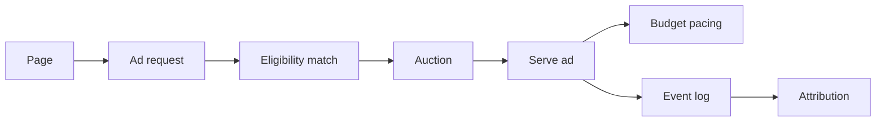
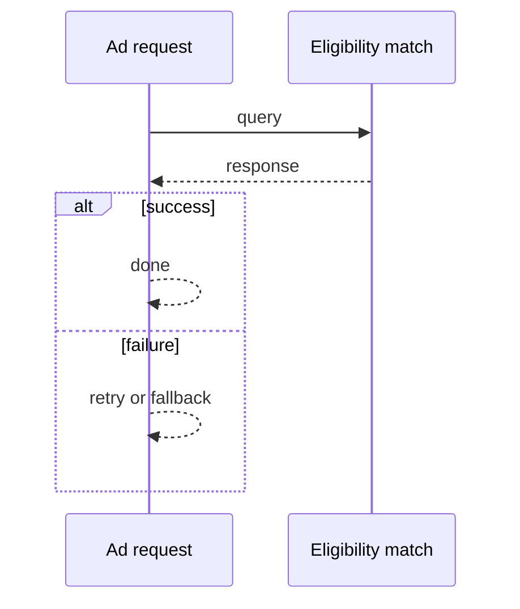
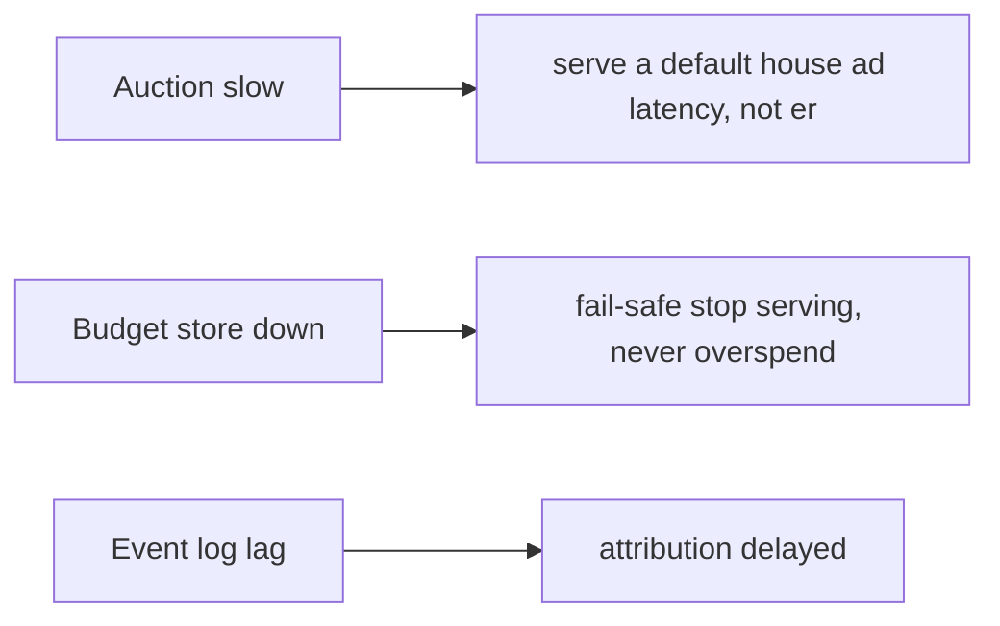

# Case Study: Advertisement Platform

> **Tier:** extreme · **Status:** complete · Original numbers and diagrams.

## 1. Problem statement

Match advertisers' campaigns to eligible users and serve an ad in milliseconds, with budget pacing and attribution — a latency-critical auction + serving system.

## 2. Scope

In (v1): campaign targeting, real-time auction/serving, budget pacing, click attribution. Out: ML creative, multi-touch attribution (stage).

## 3. Functional requirements

- Match a request to eligible campaigns.
- Run an auction; serve the winning ad.
- Pace budgets.
- Attribute clicks/conversions.

## 4. Non-functional requirements

- Serve p99 < 100 ms (in the page-load path).
- Budget never overspent.
- Availability 99.9%.

## 5. Explicit assumptions

1. 1M ad requests/s. [assumption] 2. Targeting by user attributes + context. [assumption] 3. Budgets paced daily. [constraint]

## 6. Traffic estimation

1M ad requests/s; each must be matched + auctioned + served in the page-load path.

## 7. Storage estimation

Campaigns (targeting, creative, budget); user attributes; events (impressions/clicks). Petabytes of event logs.

## 8. Bandwidth estimation

Ad creatives served (images/video) — egress significant; CDN for creatives.

## 9. API design

| GET /ad | user, context | ad creative |
| POST |/event | impression/click | ack

## 10. Data model

campaigns(id, targeting, creative, budget, pace); users(id, attributes); events(id, type, campaign, user, ts).

## 11. High-level architecture

## 12. Request flow
Ad request -> match eligible campaigns by targeting -> auction (bid x relevance) -> serve winner -> deduct/pace budget -> log impression; clicks/conversions attribute later.

## 13. Component responsibilities

Eligibility match, auction, serving, budget pacing, event log, attribution.

## 14. Database selection

Campaign store + user-attribute store (fast lookup); event log (stream); creative CDN. Rejected: scanning all campaigns per request (too slow).

## 15. Caching strategy

Eligibility index cached; hot campaigns cached; user attributes cached; creatives on CDN.

## 16. Partitioning strategy

Campaigns/targeting indexed for fast eligibility; events partitioned by time; user attributes by id.

## 17. Replication strategy

Campaigns + budget replicated (budget must not overspend); events retained for attribution; creatives on CDN.

## 18. Consistency model

Budget: strongly consistent spend (no overspend) via atomic deduction. Events eventually consistent; attribution batched.

## 19. Failure scenarios
Auction slow -> serve a default/house ad (latency, not error). Budget store down -> fail-safe (stop serving, never overspend). Event log lag -> attribution delayed.

## 20. Reliability strategy

SLI serve latency, overspend (0); SLO 99.9%. Default-ad fallback. Chaos: kill auction, assert default ad served (no broken page).

## 21. Security considerations

User-attribute privacy; anti-fraud (bot clicks); budget integrity; creative safety checks.

## 22. Observability strategy

Serve p99, fill rate, auction latency, budget spend vs pace, click/conversion attribution, bot rate.

## 23. Cost considerations

Serving infra (latency) + event storage (PB) + creative egress (CDN). Eligibility index cuts per-request cost.

## 24. Scaling stages

Stage 1: match + auction + serve. -> Stage 2: budget pacing + attribution. -> Stage 3: real-time bidding, ML creative. -> Stage 4: multi-touch attribution, multi-region.

## 25. Trade-offs

Latency (page-load) vs auction complexity. Budget strictness (no overspend) vs throughput. Attribution accuracy vs latency.

## 26. Alternative designs

Scan all campaigns (too slow). Loose budget (overspend). Synchronous attribution (latency).

## 27. Interview discussion points

Clarify latency, targeting, budget strictness. Surface eligibility index, auction, budget pacing, CDN creatives.

## 28. Original Mermaid diagrams
Standalone sources under `diagrams/case-studies/advertisement-platform/`: `context.mmd`, `request-sequence.mmd`, `failure-flow.mmd`, `scaling-evolution.mmd`. The diagrams are embedded in their respective sections: architecture in section 11, request flow in section 12, failure scenarios in section 19, and scaling stages in section 24.

## 29. Further reading

Real-time/streams: Level 10; CDN: Level 2; consistency: Level 4.

## 30. Practical exercises

1. Budget pacing without overspend. 2. Bot-click detection. 3. Serve at 1M req/s < 100 ms. 4. Multi-touch attribution. 5. ML creative selection.

---
Previous: Fraud-detection system · Next: Data lake

