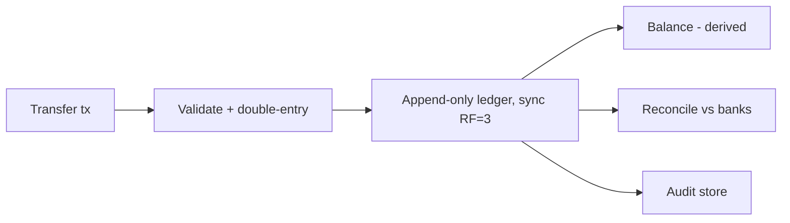
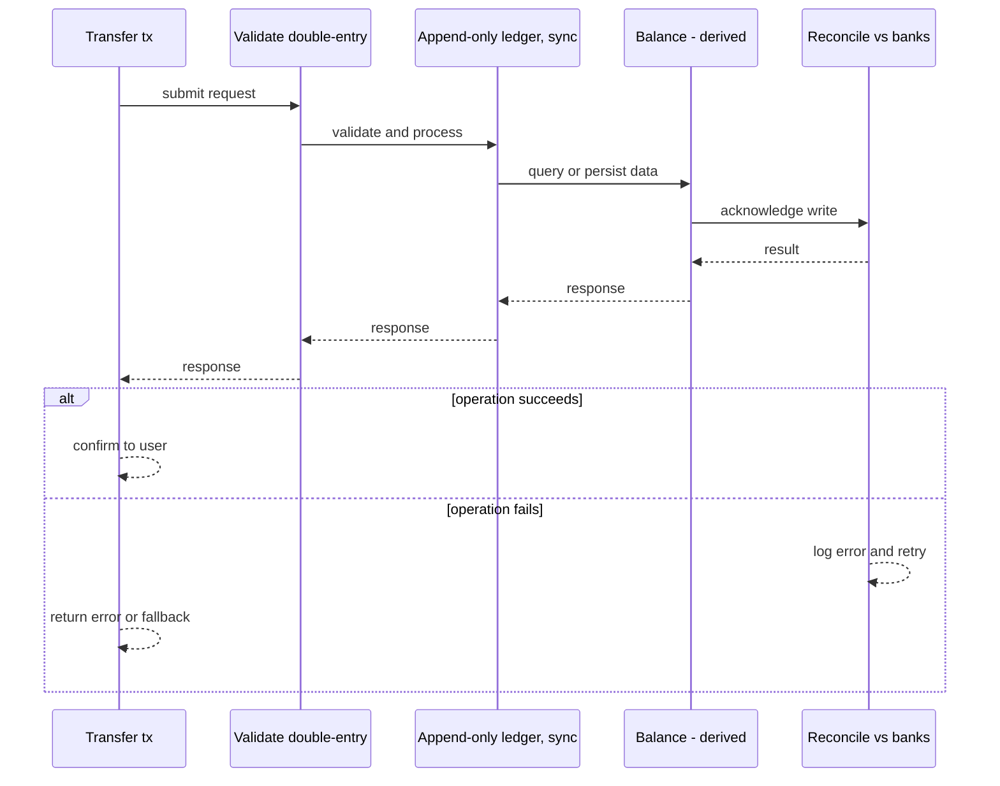
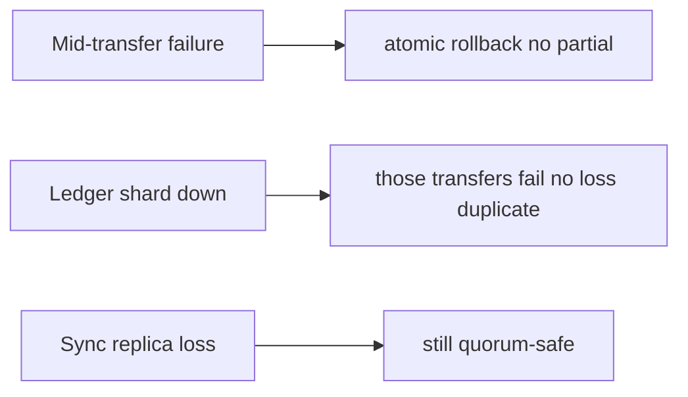
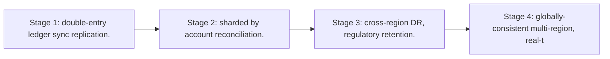

# Case Study: Banking Ledger

> **Tier:** extreme · **Status:** complete · Original numbers and diagrams.

## 1. Problem statement
The core ledger of a bank: immutable, double-entry, strongly-durable, auditable, reconcilable — money never lost or duplicated. This is a extreme-tier system design challenge because it must handle strict consistency and zero data loss while ensuring every transaction is durable, atomic, and auditable. The design must be production-grade: observable, debuggable, reversible, and able to survive component failures without data loss or cascading outages.

## 2. Scope
In (v1): accounts, transfers, double-entry, balances, reconciliation, immutable history. Out: lending, interest (stage).

For Banking Ledger, these boundaries keep the first version focused on the core user value. Adding more features would dilute the design and delay shipping. Each excluded item is a scaling stage — a candidate for the next iteration once the baseline is proven.

## 3. Functional requirements
- Move money double-entry (balanced debit/credit).
- Never lose/duplicate a committed entry.
- Derive balances from entries.
- Reconcile vs banks.
- Full audit trail.

For Banking Ledger, these requirements drive specific architectural decisions: the read-write ratio determines the caching strategy, the durability target sets the replication mode, and the idempotency requirement shapes the API contract.

## 4. Non-functional requirements
- Zero data loss; committed entries survive any failure.
- Strong consistency (no double-spend).
- Auditability for years.

For Banking Ledger, each non-functional target constrains a specific component: the latency SLO bounds the number of synchronous hops, the availability target forces redundancy across availability zones, and the cost ceiling limits the replication factor and storage tier.

## 5. Explicit assumptions
1. 10M accounts, 50M tx/day. [assumption] 2. Tx ~200 B; retain 7+ years (regulatory). [constraint] 3. Synchronous replication. [constraint]

For Banking Ledger, if these assumptions are off by an order of magnitude, the architecture must adapt: 10x traffic may require earlier sharding, a different read-write ratio changes the caching strategy, and a higher peak multiplier demands more headroom.

## 6. Traffic estimation
50M tx/day ~580/s avg, ~3k/s peak (batch/payroll).

To derive the request rate: divide the daily volume by 86,400 seconds to get the average rate, then multiply by 5-10x for peak. The read-to-write ratio determines whether the system is cache-dominated (read-heavy) or write-path-dominated (write-heavy). For Banking Ledger, this ratio shapes the entire storage and replication strategy.

## 7. Storage estimation
50M x 200 B = 10 GB/day; 7 years ~25 TB compressed; immutable.

For Banking Ledger, storage growth is projected from the daily write volume and retention policy. Index overhead and compression factors are accounted for in the total.

## 8. Bandwidth estimation
Small payloads; correctness/durability dominate, not bandwidth.

Bandwidth is request rate multiplied by average payload size for ingress, and response rate multiplied by response size for egress. CDN and edge caching reduce origin egress. Compression reduces bandwidth by 50-80 percent where applicable. For Banking Ledger, bandwidth may or may not be the binding constraint — compare it against compute and storage to find out.

## 9. API design
| Method | Path | Request | Response |
|--------|------|---------|----------|
| POST /transfer | from,to,amount | tx id |
| GET |/accounts/:id/balance | | amount |

## 10. Data model
accounts(id); entries(id, account, delta, tx_id, ts) append-only; tx(id, debits[], credits[], status). Balance = fold of entries.

For Banking Ledger, the data model follows the access pattern. The primary lookup determines the partition key; secondary lookups determine indexes. Denormalization is used selectively on hot read paths.

## 11. High-level architecture

## 12. Request flow
Transfer validates (no negative), writes a balanced debit+credit transaction atomically to the append-only ledger (synchronous RF=3), derives balance, emits for reconciliation and audit.

## 13. Component responsibilities
Transaction service, ledger store, balance derivation, reconciliation, audit.

For Banking Ledger, each component has one job. The gateway authenticates and routes. Services are stateless and scale horizontally. The data tier is the stateful core that scales by sharding.

## 14. Database selection
Append-only, strongly-durable ledger (synchronous RF=3, Raft-replicated or globally-consistent DB). Rejected: mutable balances (no audit), async replication (loss risk).

For Banking Ledger, the database was chosen by access pattern, not familiarity. The rejected alternatives were wrong for this workload, not bad in general.

## 15. Caching strategy
Balance cache (read); writes always on the ledger. Audit immutable.

For Banking Ledger, the cache strategy matches the staleness tolerance. Cache-aside for most data, write-through where read-after-write matters, stampede protection on hot keys.

## 16. Partitioning strategy
Ledger partitioned by account id (co-locate an account's entries); cross-partition transfers as distributed transactions.

For Banking Ledger, the partition key balances query locality with even load distribution. Sharding strategy matters because a poor key creates hot spots under real traffic patterns.

## 17. Replication strategy
Synchronous RF=3 (a committed entry survives one failure). Cross-region async for DR with RPO target.

For Banking Ledger, replication mode is split: synchronous where durability is critical, asynchronous elsewhere for throughput. RF=3 tolerates one failure. Failover is tested regularly.

## 18. Consistency model
Strong: a transfer commits atomically (both entries or neither). Linearizable per account. No double-spend.

For Banking Ledger, the consistency level is the weakest users accept. Read-your-writes is provided where needed. Eventual consistency is bounded and monitored, not unbounded and silent.

## 19. Failure scenarios
Mid-transfer failure -> atomic rollback (no partial). Ledger shard down -> those transfers fail (no loss/duplicate). Sync replica loss -> still quorum-safe. Reconciliation finds drift.

## 20. Reliability strategy
SLI: data loss (0), double-spend (0); SLO 99.99%. Idempotent transfers. Chaos: kill a ledger replica mid-write, assert no loss/duplicate.

For Banking Ledger, the SLO makes reliability measurable. The error budget balances feature velocity with stability. Chaos testing validates that resilience claims hold under real failures.

## 21. Security considerations
Strong auth; per-tx authorization; encryption at rest; full audit; regulatory access controls; tamper-evident.

For Banking Ledger, security layers TLS, encryption at rest, RBAC, PII redaction, and audit. The policy gateway is fail-closed for AI-augmented operations.

## 22. Observability strategy
Tx latency, commit success, reconciliation drift (0), data-loss guards, audit completeness.

For Banking Ledger, observability combines logs, metrics, and traces with correlation IDs. Golden signals drive the first dashboard. Alerts fire on burn rate, not raw thresholds.

## 23. Cost considerations
Synchronous replication + retention (7y) + audit storage. Correctness non-negotiable; cost follows.

For Banking Ledger, cost is driven by the binding resource. Caching, tiering, batching, and right-sizing are the levers. Cost per request is tracked and alerted on.

## 24. Scaling stages
Stage 1: double-entry ledger + sync replication. -> Stage 2: sharded by account + reconciliation. -> Stage 3: cross-region DR, regulatory retention. -> Stage 4: globally-consistent multi-region, real-time reconciliation.

## 25. Trade-offs
Synchronous durability (no loss) vs latency. Append-only (audit) vs in-place edits. Sharding (scale) vs cross-shard tx. Retention (compliance) vs cost.

For Banking Ledger, each trade-off lists what was chosen, what was rejected, and why. This makes the design defensible in review — every decision has documented reasoning.

## 26. Alternative designs
Mutable balances (no audit). Async replication (loss risk). Eventual consistency (double-spend). Single region (DR risk).

For Banking Ledger, the alternatives are real architectures that work under different constraints. They were rejected for this workload's specific requirements, not because they are bad designs.

## 27. Interview discussion points
Clarify loss tolerance (zero), audit, retention, regulation. Surface double-entry, append-only, sync replication, reconciliation.

For Banking Ledger in an interview: clarify scope first, surface the read-write ratio, design the hot path deeply, discuss failures, and offer an alternative. Weak candidates skip failure modes.

## 28. Original Mermaid diagrams
Standalone sources under `diagrams/case-studies/banking-ledger/`: `context.mmd`, `request-sequence.mmd`, `failure-flow.mmd`, `scaling-evolution.mmd`. The diagrams are embedded in their respective sections: architecture in section 11, request flow in section 12, failure scenarios in section 19, and scaling stages in section 24.

## 29. Further reading
Ledger/payment: Level 10; transactions: Level 4; consensus: Level 4. Sources: `S-DYNAMO` `S-RAFT` `S-SPANNER`.

## 30. Practical exercises

1. Cross-shard transfer atomicity. 2. Reconcile after partial failure. 3. 7-year retention cost/tiering. 4. Zero-RPO multi-region. 5. Audit a disputed transaction.

---
Previous: Recommendation engine · Next: Stock-trading platform

