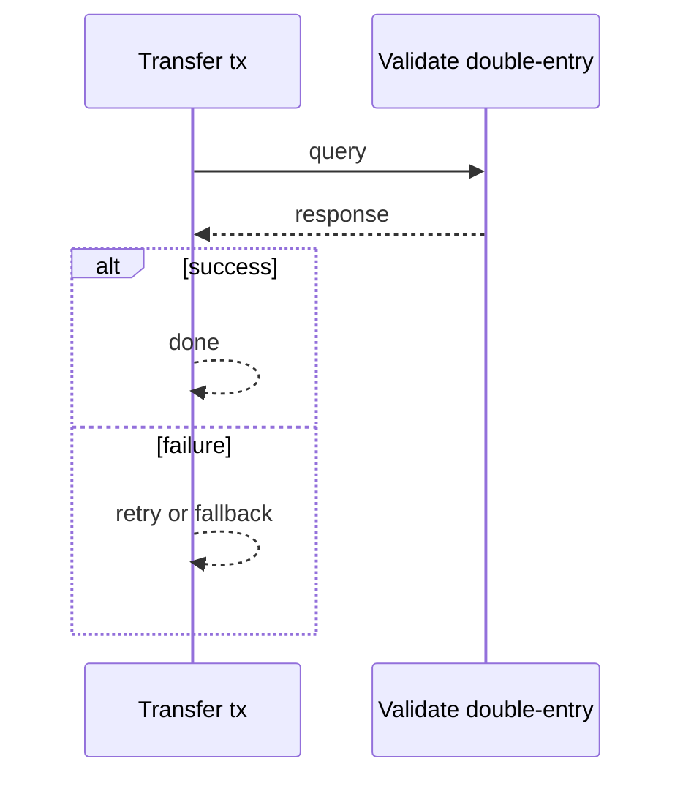
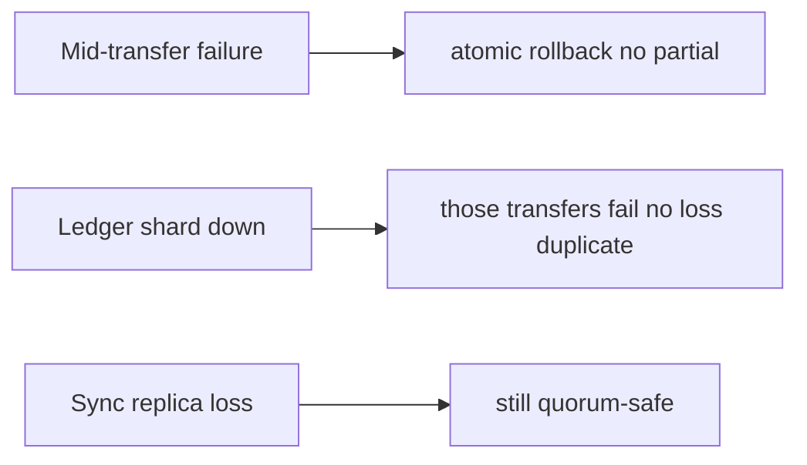

# Case Study: Banking Ledger

> **Tier:** extreme · **Status:** complete · Original numbers and diagrams.

## 11. High-level architecture

```mermaid
%% created-for: system-design-mastery
flowchart LR
  Tx[Transfer tx] --> Valid[Validate + double-entry]
  Valid --> Ledger[(Append-only ledger, sync RF=3)]
  Ledger --> Bal[Balance (derived)]
  Ledger --> Recon[Reconcile vs banks]
  Ledger --> Audit[Audit store]
```


## 28. Original Mermaid diagrams

Standalone sources under `diagrams/case-studies/banking-ledger/`: `context.mmd`, `request-sequence.mmd`, `failure-flow.mmd`, `scaling-evolution.mmd`. Request sequence and failure flow:





## 1. Problem statement

The core ledger of a bank: immutable, double-entry, strongly-durable, auditable, reconcilable — money never lost or duplicated.


## 2. Scope

In (v1): accounts, transfers, double-entry, balances, reconciliation, immutable history. Out: lending, interest (stage).


## 3. Functional requirements

- Move money double-entry (balanced debit/credit).
- Never lose/duplicate a committed entry.
- Derive balances from entries.
- Reconcile vs banks.
- Full audit trail.


## 4. Non-functional requirements

- Zero data loss; committed entries survive any failure.
- Strong consistency (no double-spend).
- Auditability for years.


## 5. Explicit assumptions

1. 10M accounts, 50M tx/day. [assumption] 2. Tx ~200 B; retain 7+ years (regulatory). [constraint] 3. Synchronous replication. [constraint]


## 6. Traffic estimation

50M tx/day ~580/s avg, ~3k/s peak (batch/payroll).


## 7. Storage estimation

50M x 200 B = 10 GB/day; 7 years ~25 TB compressed; immutable.


## 8. Bandwidth estimation

Small payloads; correctness/durability dominate, not bandwidth.


## 9. API design

| POST /transfer | from,to,amount | tx id |
| GET |/accounts/:id/balance | | amount |


## 10. Data model

accounts(id); entries(id, account, delta, tx_id, ts) append-only; tx(id, debits[], credits[], status). Balance = fold of entries.


## 12. Request flow

Transfer validates (no negative), writes a balanced debit+credit transaction atomically to the append-only ledger (synchronous RF=3), derives balance, emits for reconciliation and audit.


## 13. Component responsibilities

Transaction service, ledger store, balance derivation, reconciliation, audit.


## 14. Database selection

Append-only, strongly-durable ledger (synchronous RF=3, Raft-replicated or globally-consistent DB). Rejected: mutable balances (no audit), async replication (loss risk).


## 15. Caching strategy

Balance cache (read); writes always on the ledger. Audit immutable.


## 16. Partitioning strategy

Ledger partitioned by account id (co-locate an account's entries); cross-partition transfers as distributed transactions.


## 17. Replication strategy

Synchronous RF=3 (a committed entry survives one failure). Cross-region async for DR with RPO target.


## 18. Consistency model

Strong: a transfer commits atomically (both entries or neither). Linearizable per account. No double-spend.


## 19. Failure scenarios

Mid-transfer failure -> atomic rollback (no partial). Ledger shard down -> those transfers fail (no loss/duplicate). Sync replica loss -> still quorum-safe. Reconciliation finds drift.


## 20. Reliability strategy

SLI: data loss (0), double-spend (0); SLO 99.99%. Idempotent transfers. Chaos: kill a ledger replica mid-write, assert no loss/duplicate.


## 21. Security considerations

Strong auth; per-tx authorization; encryption at rest; full audit; regulatory access controls; tamper-evident.


## 22. Observability strategy

Tx latency, commit success, reconciliation drift (0), data-loss guards, audit completeness.


## 23. Cost considerations

Synchronous replication + retention (7y) + audit storage. Correctness non-negotiable; cost follows.


## 24. Scaling stages

Stage 1: double-entry ledger + sync replication. -> Stage 2: sharded by account + reconciliation. -> Stage 3: cross-region DR, regulatory retention. -> Stage 4: globally-consistent multi-region, real-time reconciliation.


## 25. Trade-offs

Synchronous durability (no loss) vs latency. Append-only (audit) vs in-place edits. Sharding (scale) vs cross-shard tx. Retention (compliance) vs cost.


## 26. Alternative designs

Mutable balances (no audit). Async replication (loss risk). Eventual consistency (double-spend). Single region (DR risk).


## 27. Interview discussion points

Clarify loss tolerance (zero), audit, retention, regulation. Surface double-entry, append-only, sync replication, reconciliation.


## 29. Further reading

Ledger/payment: Level 10; transactions: Level 4; consensus: Level 4.


## 30. Practical exercises

1. Cross-shard transfer atomicity. 2. Reconcile after partial failure. 3. 7-year retention cost/tiering. 4. Zero-RPO multi-region. 5. Audit a disputed transaction.


---
Previous: Recommendation engine · Next: Stock-trading platform

