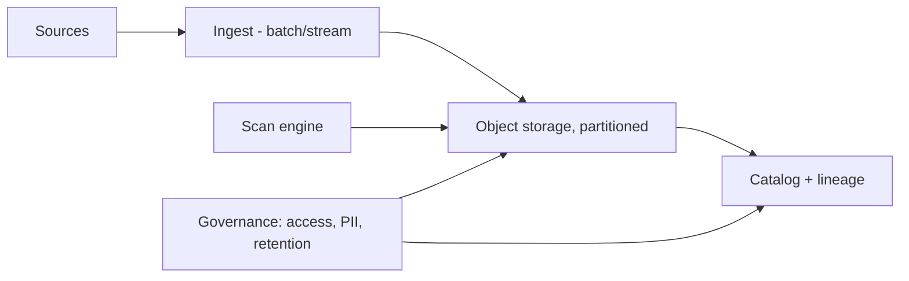
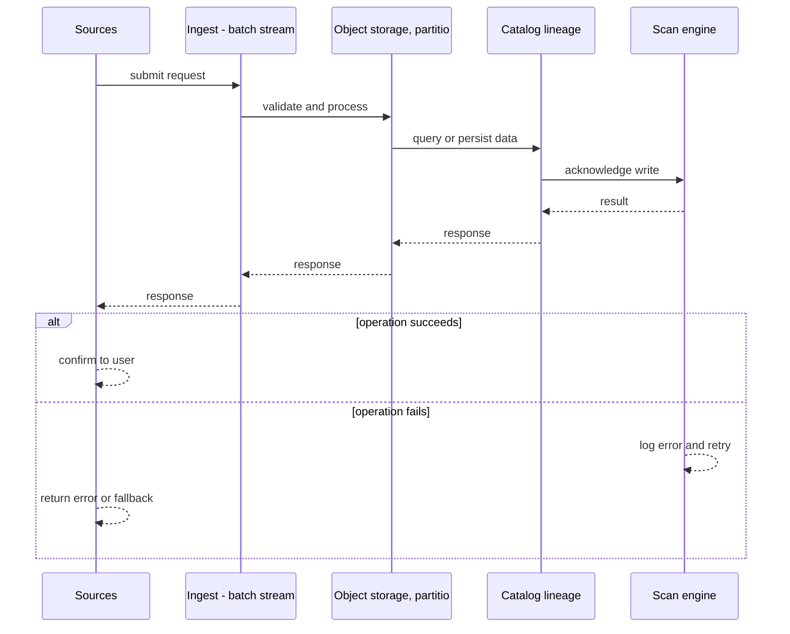
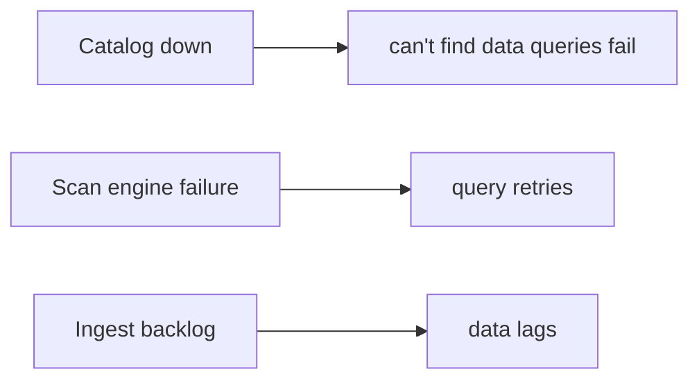
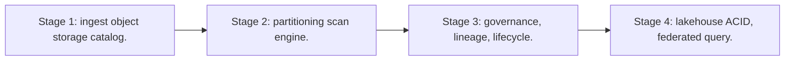

# Case Study: Data Lake

> **Tier:** extreme · **Status:** complete · Original numbers and diagrams.

## 1. Problem statement
Store petabytes of raw data in any format cheaply, with a catalog and governance so it is discoverable and queryable — a foundational analytics store. This is a extreme-tier system design challenge because it must handle high-throughput data ingestion while ensuring no single point of failure. The design must be production-grade: observable, debuggable, reversible, and able to survive component failures without data loss or cascading outages.

## 2. Scope
In (v1): ingest raw, catalog, partition by date, query via scan engine, lifecycle. Out: ACID/warehouse quality (lakehouse, separate case).

For Data Lake, these boundaries keep the first version focused on the core user value. Adding more features would dilute the design and delay shipping. Each excluded item is a scaling stage — a candidate for the next iteration once the baseline is proven.

## 3. Functional requirements
- Ingest raw data in any format.
- Catalog with schema/lineage/ownership.
- Partition for scan efficiency.
- Lifecycle (tier/delete).

For Data Lake, these requirements drive specific architectural decisions: the read-write ratio determines the caching strategy, the durability target sets the replication mode, and the idempotency requirement shapes the API contract.

## 4. Non-functional requirements
- Cheap durable storage (11 nines).
- Query via scan over partitions.
- Governed (access, PII, retention).

For Data Lake, each non-functional target constrains a specific component: the latency SLO bounds the number of synchronous hops, the availability target forces redundancy across availability zones, and the cost ceiling limits the replication factor and storage tier.

## 5. Explicit assumptions
1. 1 PB/month ingest. [assumption] 2. Partitioned by date/source. [assumption] 3. Retain years; tier cold. [constraint]

For Data Lake, if these assumptions are off by an order of magnitude, the architecture must adapt: 10x traffic may require earlier sharding, a different read-write ratio changes the caching strategy, and a higher peak multiplier demands more headroom.

## 6. Traffic estimation
Ingest is bulk/batch + stream; queries are large scans.

To derive the request rate: divide the daily volume by 86,400 seconds to get the average rate, then multiply by 5-10x for peak. The read-to-write ratio determines whether the system is cache-dominated (read-heavy) or write-path-dominated (write-heavy). For Data Lake, this ratio shapes the entire storage and replication strategy.

## 7. Storage estimation
PB-scale object storage, partitioned; compressed; tiered cold.

For Data Lake, storage growth is projected from the daily write volume and retention policy. Index overhead and compression factors are accounted for in the total.

## 8. Bandwidth estimation
Ingest egress into the lake; query scans read TBs.

Bandwidth is request rate multiplied by average payload size for ingress, and response rate multiplied by response size for egress. CDN and edge caching reduce origin egress. Compression reduces bandwidth by 50-80 percent where applicable. For Data Lake, bandwidth may or may not be the binding constraint — compare it against compute and storage to find out.

## 9. API design

batch/stream ingest; SQL/scan query engine over partitions.

## 10. Data model
Objects partitioned by (source, date); catalog metadata (schema, lineage, owner, partitions).

For Data Lake, the data model follows the access pattern. The primary lookup determines the partition key; secondary lookups determine indexes. Denormalization is used selectively on hot read paths.

## 11. High-level architecture

## 12. Request flow
Ingest writes partitioned objects; catalog records schema/lineage; queries scan partitions via the engine; governance enforces access/retention; lifecycle tiers/deletes.

## 13. Component responsibilities
Ingest, object storage, catalog, scan engine, governance, lifecycle.

For Data Lake, each component has one job. The gateway authenticates and routes. Services are stateless and scale horizontally. The data tier is the stateful core that scales by sharding.

## 14. Database selection
Object storage (cheap, durable) + a catalog (metadata, schema, lineage). Rejected: a warehouse for raw (cost).

For Data Lake, the database was chosen by access pattern, not familiarity. The rejected alternatives were wrong for this workload, not bad in general.

## 15. Caching strategy
Hot partitions cached for the scan engine; query results cached.

For Data Lake, the cache strategy matches the staleness tolerance. Cache-aside for most data, write-through where read-after-write matters, stampede protection on hot keys.

## 16. Partitioning strategy
By (source, date) so queries prune partitions; date partitioning also drives lifecycle.

For Data Lake, the partition key balances query locality with even load distribution. Sharding strategy matters because a poor key creates hot spots under real traffic patterns.

## 17. Replication strategy
Object storage durability (erasure/RF); catalog replicated; metadata consistent.

For Data Lake, replication mode is split: synchronous where durability is critical, asynchronous elsewhere for throughput. RF=3 tolerates one failure. Failover is tested regularly.

## 18. Consistency model
Objects immutable once written; catalog eventually consistent with ingest; partition pruning for queries.

For Data Lake, the consistency level is the weakest users accept. Read-your-writes is provided where needed. Eventual consistency is bounded and monitored, not unbounded and silent.

## 19. Failure scenarios
Catalog down -> can't find data (queries fail); keep HA. Scan engine failure -> query retries. Ingest backlog -> data lags.

## 20. Reliability strategy
SLI ingest success, query success; SPO 99.9% ingest. Reversible queries (idempotent transforms). Chaos: kill a scan node, assert query completes.

For Data Lake, the SLO makes reliability measurable. The error budget balances feature velocity with stability. Chaos testing validates that resilience claims hold under real failures.

## 21. Security considerations
Per-dataset access; PII classification/masking; retention/deletion; audit; lineage for compliance.

For Data Lake, security layers TLS, encryption at rest, RBAC, PII redaction, and audit. The policy gateway is fail-closed for AI-augmented operations.

## 22. Observability strategy
Ingest rate, storage growth, query latency, scan bytes, partition pruning effectiveness, catalog health.

For Data Lake, observability combines logs, metrics, and traces with correlation IDs. Golden signals drive the first dashboard. Alerts fire on burn rate, not raw thresholds.

## 23. Cost considerations
Storage (PB) is the cost; compression + tiering + partition pruning (scan less) are the levers.

For Data Lake, cost is driven by the binding resource. Caching, tiering, batching, and right-sizing are the levers. Cost per request is tracked and alerted on.

## 24. Scaling stages
Stage 1: ingest + object storage + catalog. -> Stage 2: partitioning + scan engine. -> Stage 3: governance, lineage, lifecycle. -> Stage 4: lakehouse ACID, federated query.

## 25. Trade-offs
Raw cheap storage (flexibility) vs no ACID (lakehouse adds it). Partition by date (lifecycle/scan) vs by hash (balance). Catalog (discoverability) vs governance burden.

For Data Lake, each trade-off lists what was chosen, what was rejected, and why. This makes the design defensible in review — every decision has documented reasoning.

## 26. Alternative designs
Warehouse for raw (cost explosion). No catalog (a swamp). No partitioning (full scans).

For Data Lake, the alternatives are real architectures that work under different constraints. They were rejected for this workload's specific requirements, not because they are bad designs.

## 27. Interview discussion points
Clarify volume, formats, query patterns, governance. Surface partitioning, catalog, lifecycle, and the swamp risk.

For Data Lake in an interview: clarify scope first, surface the read-write ratio, design the hot path deeply, discuss failures, and offer an alternative. Weak candidates skip failure modes.

## 28. Original Mermaid diagrams
Standalone sources under `diagrams/case-studies/data-lake/`: `context.mmd`, `request-sequence.mmd`, `failure-flow.mmd`, `scaling-evolution.mmd`. The diagrams are embedded in their respective sections: architecture in section 11, request flow in section 12, failure scenarios in section 19, and scaling stages in section 24.

## 29. Further reading
Object storage: Level 2; lakehouse: Level 10; catalog/governance: Level 10. Sources: `S-CHASH` `S-DYNAMO`.

## 30. Practical exercises

1. Partition strategy for time-series vs events. 2. Lineage for compliance. 3. Tier cold — recall latency. 4. Avoid the data swamp. 5. Federated query across hot+cold.

---
Previous: Advertisement platform · Next: Vector database

