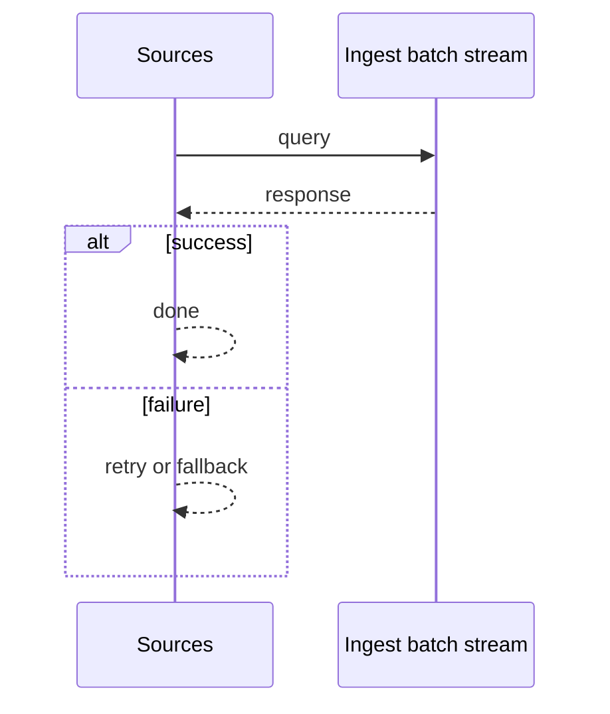
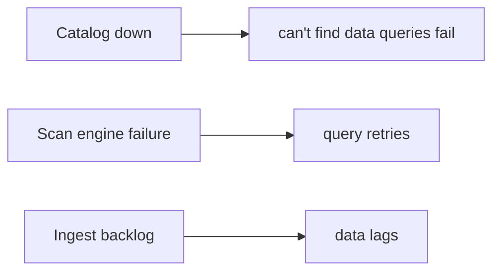

# Case Study: Data Lake

> **Tier:** extreme · **Status:** complete · Original numbers and diagrams.

## 11. High-level architecture

```mermaid
%% created-for: system-design-mastery
flowchart LR
  Src[Sources] --> Ingest[Ingest (batch/stream)] --> Lake[(Object storage, partitioned)]
  Lake --> Catalog[Catalog + lineage]
  Query[Scan engine] --> Lake
  Gov[Governance: access, PII, retention] --> Lake & Catalog
```


## 28. Original Mermaid diagrams
Standalone sources under `diagrams/case-studies/data-lake/`: `context.mmd`, `request-sequence.mmd`, `failure-flow.mmd`, `scaling-evolution.mmd`. The diagrams are embedded in their respective sections: architecture in section 11, request flow in section 12, failure scenarios in section 19, and scaling stages in section 24.

## 1. Problem statement

Store petabytes of raw data in any format cheaply, with a catalog and governance so it is discoverable and queryable — a foundational analytics store.


## 2. Scope

In (v1): ingest raw, catalog, partition by date, query via scan engine, lifecycle. Out: ACID/warehouse quality (lakehouse, separate case).


## 3. Functional requirements

- Ingest raw data in any format.
- Catalog with schema/lineage/ownership.
- Partition for scan efficiency.
- Lifecycle (tier/delete).


## 4. Non-functional requirements

- Cheap durable storage (11 nines).
- Query via scan over partitions.
- Governed (access, PII, retention).


## 5. Explicit assumptions

1. 1 PB/month ingest. [assumption] 2. Partitioned by date/source. [assumption] 3. Retain years; tier cold. [constraint]


## 6. Traffic estimation

Ingest is bulk/batch + stream; queries are large scans.


## 7. Storage estimation

PB-scale object storage, partitioned; compressed; tiered cold.


## 8. Bandwidth estimation

Ingest egress into the lake; query scans read TBs.


## 9. API design

batch/stream ingest; SQL/scan query engine over partitions.


## 10. Data model

Objects partitioned by (source, date); catalog metadata (schema, lineage, owner, partitions).


## 12. Request flow
Ingest writes partitioned objects; catalog records schema/lineage; queries scan partitions via the engine; governance enforces access/retention; lifecycle tiers/deletes.




## 13. Component responsibilities

Ingest, object storage, catalog, scan engine, governance, lifecycle.


## 14. Database selection

Object storage (cheap, durable) + a catalog (metadata, schema, lineage). Rejected: a warehouse for raw (cost).


## 15. Caching strategy

Hot partitions cached for the scan engine; query results cached.


## 16. Partitioning strategy

By (source, date) so queries prune partitions; date partitioning also drives lifecycle.


## 17. Replication strategy

Object storage durability (erasure/RF); catalog replicated; metadata consistent.


## 18. Consistency model

Objects immutable once written; catalog eventually consistent with ingest; partition pruning for queries.


## 19. Failure scenarios
Catalog down -> can't find data (queries fail); keep HA. Scan engine failure -> query retries. Ingest backlog -> data lags.




## 20. Reliability strategy

SLI ingest success, query success; SPO 99.9% ingest. Reversible queries (idempotent transforms). Chaos: kill a scan node, assert query completes.


## 21. Security considerations

Per-dataset access; PII classification/masking; retention/deletion; audit; lineage for compliance.


## 22. Observability strategy

Ingest rate, storage growth, query latency, scan bytes, partition pruning effectiveness, catalog health.


## 23. Cost considerations

Storage (PB) is the cost; compression + tiering + partition pruning (scan less) are the levers.


## 24. Scaling stages

Stage 1: ingest + object storage + catalog. -> Stage 2: partitioning + scan engine. -> Stage 3: governance, lineage, lifecycle. -> Stage 4: lakehouse ACID, federated query.


## 25. Trade-offs

Raw cheap storage (flexibility) vs no ACID (lakehouse adds it). Partition by date (lifecycle/scan) vs by hash (balance). Catalog (discoverability) vs governance burden.


## 26. Alternative designs

Warehouse for raw (cost explosion). No catalog (a swamp). No partitioning (full scans).


## 27. Interview discussion points

Clarify volume, formats, query patterns, governance. Surface partitioning, catalog, lifecycle, and the swamp risk.


## 29. Further reading

Object storage: Level 2; lakehouse: Level 10; catalog/governance: Level 10.


## 30. Practical exercises

1. Partition strategy for time-series vs events. 2. Lineage for compliance. 3. Tier cold — recall latency. 4. Avoid the data swamp. 5. Federated query across hot+cold.


---
Previous: Advertisement platform · Next: Vector database

